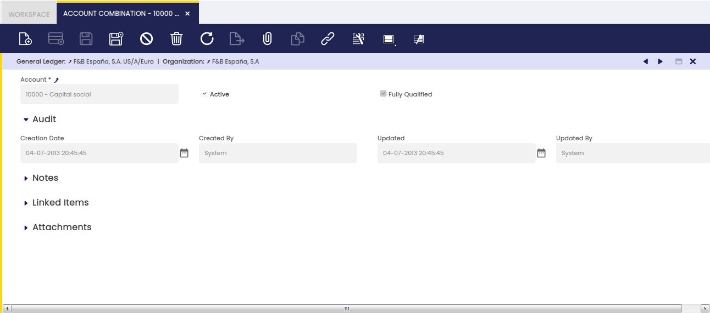

# Account Combination

:material-menu: `Application` > `Financial Management` > `Accounting` > `Setup` > `Account Combination`

## Overview

An account combination represents a General Ledger account as used by a specific organization. This window lets you review which GL accounts are available to an organization and see basic details about each account combination.

The main purpose of this window is to **view and manage** these valid combinations of accounting dimensions so Etendo knows exactly where and how to post financial transactions.

!!!info
    The user cannot create account combinations directly from this window. They are generated automatically when you create accounts (or subaccounts) in an Account Tree for a General Ledger. To add or edit the underlying accounts, use the [Account Tree](account-tree.md) window.

## Using the Account Combination Window

In this window, the user is able to view all account combinations for the selected General Ledger and Organization, Filter and search combinations to find specific accounts quickly.

Fields to note:

- **General Ledger**: the ledger the account belongs to.
- **Organization**: the organization that will use the account.
- **Account**: the account (from the Account Tree) associated with this combination.
- **Active**: whether this account combination is enabled for posting.
- **Fully Qualified**: This checkbox indicates that all required elements for an account combination are present.

!!!note
    - One account in the Account Tree can produce multiple account combinations if the account is used across multiple organizations or ledgers.
    - Account combinations are required for posting: if a needed combination is missing, create or adjust the account in the Account Tree and the combination will be created automatically.
    - Use this window to verify that an organization has the correct GL accounts before posting transactions.

As a conclusion, this window defines the accounting identity of a transaction. It tells Etendo which account and which analytical dimensions should be used together when posting to the general ledger, ensuring accuracy, consistency, and meaningful financial reporting.

---

This work is a derivative of [Account Combination](https://wiki.openbravo.com/wiki/Account_Combination){target="\_blank"} by [Openbravo Wiki](http://wiki.openbravo.com/wiki/Welcome_to_Openbravo){target="\_blank"}, used under [CC BY-SA 2.5 ES](https://creativecommons.org/licenses/by-sa/2.5/es/){target="\_blank"}. This work is licensed under [CC BY-SA 2.5](https://creativecommons.org/licenses/by-sa/2.5/){target="\_blank"} by [Etendo](https://etendo.software){target="\_blank"}.