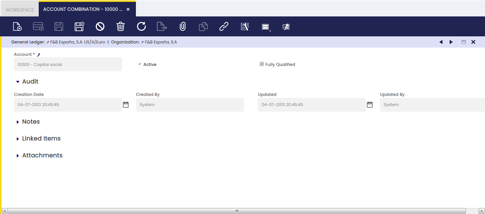

# Account Combination

:material-menu: `Application` > `Financial Management` > `Accounting` > `Setup` > `Account Combination`

## Overview

An account combination is an Organization's General Ledger account.

### Combination

The Account Combination window allows the user to review the Organization's General Ledger accounts.

The accounts can not be created manually in this window, but in the Account Tree window.

Every time that an account (or subaccount in Etendo terms) is created in an account tree of a General Ledger, the corresponding account combination is also created in this window.

The account combination window shows the data below:

-   the *General Ledger*
-   the *Organization*
-   and the *Account*

VERSION 2

## Overview

An account combination represents a General Ledger account as used by a specific organization. This window lets you review which GL accounts are available to an organization and see basic details about each account combination.

## Where it comes from

You cannot create account combinations directly from this window. They are generated automatically when you create accounts (or subaccounts) in an Account Tree for a General Ledger. To add or edit the underlying accounts, use the Account Tree window:
- See: Account Tree

## What you can do in this window

- View all account combinations for the selected General Ledger and Organization.
- Filter and search combinations to find specific accounts quickly.
- Inspect key fields to confirm how accounts are configured for posting.

## Main fields shown

- General Ledger — the ledger the account belongs to.
- Organization — the organization that will use the account.
- Account — the account (from the Account Tree) associated with this combination.
- Account number / Code — (if available) the account identifier.
- Description — short description of the account.
- Active — whether this account combination is enabled for posting.

(See the screenshot for the window layout.)

## Practical notes

- One account in the Account Tree can produce multiple account combinations if the account is used across multiple organizations or ledgers.
- Account combinations are required for posting: if a needed combination is missing, create or adjust the account in the Account Tree and the combination will be created automatically.
- Use this window to verify that an organization has the correct GL accounts before posting transactions.

---

This work is a derivative of [Account Combination](https://wiki.openbravo.com/wiki/Account_Combination){target="\_blank"} by [Openbravo Wiki](http://wiki.openbravo.com/wiki/Welcome_to_Openbravo){target="\_blank"}, used under [CC BY-SA 2.5 ES](https://creativecommons.org/licenses/by-sa/2.5/es/){target="\_blank"}. This work is licensed under [CC BY-SA 2.5](https://creativecommons.org/licenses/by-sa/2.5/){target="\_blank"} by [Etendo](https://etendo.software){target="\_blank"}.