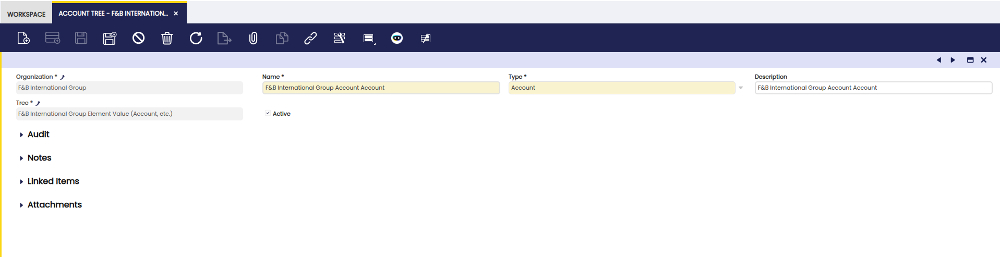
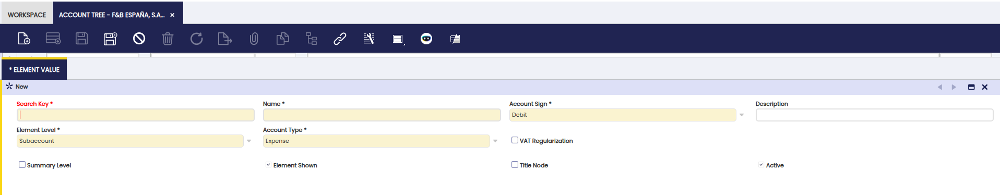
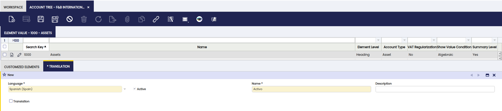

# Account Tree

:material-menu: `Application` > `Financial Management` > `Accounting` > `Setup` > `Account Tree`

## Overview  

An **account tree** represents the **Chart of Accounts (CoA)** of an organization. The CoA is the list of accounts used in the general ledger, including assets, liabilities, income, and expenses.  

Etendo provides several ways to configure a CoA based on the organization’s accounting needs. CoAs can follow country-specific requirements, be translated into different languages, and adapted to fit the company’s practices.  

The **Account Tree window** lets users:  

- **Review and manage** a chart of accounts imported from a CoA module.  
- **Create and customize** a new chart of accounts from scratch if needed.  

## Account Tree Configuration

Etendo offers different options for CoAs configuration: 

- **Install a location module or a generic plan**: Some countries such as Spain or France require that a specific chart of accounts is used in the statutory books, therefore the authorities can see the same list of accounts and the same level of detail in the P&L and Balance Sheet. In other hand, some countries such as the USA do not require that specific level of detail.

    !!!info 
        In the case of Spain, Etendo provides a [Localization Bundle](../../../../optional-features/bundles/spain-localization/overview.md) which includes the Statutory Chart of Accounts.

        For instance, the Spanish Localization Bundle includes:

        -   the [General Spanish CoA](../../../../optional-features/bundles/spain-localization/overview.md#chart-of-accounts-pgc-2007-general).
        -   the [PYMES Spanish CoA](../../../../optional-features/bundles/spain-localization/overview.md#chart-of-accounts-pgc-2007-pymes).

    Each organization can **define the chart of accounts that best suits their practices**. In that case, Etendo provides a **Generic Chart of Accounts module** which delivers a standard list of accounts which can be evolved for the organization's needs. After installation, the generic Chart of Accounts is available for selection during the [Initial Client Setup](../../../../../../developer-guide/etendo-classic/how-to-guides/how-to-run-an-initial-client-setup-process.md) and the [Initial Organization Setup](../../../../basic-features/general-setup/enterprise-model/initial-organization-setup.md).

- **Import a CSV file with the account tree structure**: You can import a CSV file that defines the account tree structure during the [Initial Client Setup](../../../../../../developer-guide/etendo-classic/how-to-guides/how-to-run-an-initial-client-setup-process.md) or [Initial Organization Setup](../../../../basic-features/general-setup/enterprise-model/initial-organization-setup.md) if the **Include Accounting** checkbox is selected. In that case, you will be prompted to choose the CSV file (accounting file).   

    This process creates:

    - The organization’s **Account Tree** (Chart of Accounts).
    -  Default [General Ledger configuration](#general-ledger-configuration).  

    !!! info
        As explained in the [How to Create a Chart of Accounts Module](../../../../../../developer-guide/etendo-classic/how-to-guides/how-to-create-a-chart-of-accounts-module.md) guide, a **Chart of Accounts module** basically contains the **CSV file** with the account tree structure.

- **Create the CoA manually**: a chart of accounts can also be [created manually](../../../../how-to-guides/how-to-create-an-account-tree.md), if this is the case, it is recommended to start from a sample CoAs like the generic one and evolve it for the company’s needs rather than starting from scratch.

    !!! tip
        
        - If a Chart of Accounts module or an accounting CSV file is installed and selected at **Client Level** through the [Initial Client Setup](../../../../../../developer-guide/etendo-classic/how-to-guides/how-to-run-an-initial-client-setup-process.md) process, it can be shared by any organization available in the client.
        
        - If a Chart of Accounts module is installed and then selected at **organization level** through the [Initial Organization Setup](../../../../basic-features/general-setup/enterprise-model/initial-organization-setup.md) process, the chart of accounts automatically created is linked to the organization being created.

## Account Tree Window

The Account Tree main header allows creating the organization's account type and then define the Chart of Accounts. 

### Element Value Tab

The **Element value** tab lists every chart of account elements from the chart of accounts headings to the subaccounts.

Every **Chart of Accounts** in Etendo contains different types of elements organized into the following hierarchy:

-   **Heading**, **Breakdown** and **Account** elements help to structure the CoAs in a way that the financial reports can be produced based upon that structure.

    - Heading: Main heading (e.g., Balance Sheet, Assets).

    - Breakdown: Groups within a heading (e.g., Current Assets).

    - Account: General account (e.g., Cash, Customers).

-   **Subaccount** element allows the user to post the transactions to the ledger.

    - Subaccount: Lowest level, where transactions are recorded (e.g., Petty Cash, Bank X).

Besides, it is well-known that every account, subaccount in Etendo terms, needs to be included in a financial statement:

-   **Asset**, **Liability** and **Owner's Equity** account types need to be included in the Balance Sheet
-   **Expense** and **Revenue** account types need to be included in the Profit & Loss.

!!! tip
    The best way to understand how a chart of accounts is captured in Etendo is by pressing the **Tree** icon   which can be found in the toolbar once the user is in the Element Value tab.

The Tree icon opens a new window which shows one **tree branch** per financial statement:

-   Balance Sheet
-   Profit & Loss
-   Temporary default accounts: This branch of the account tree gathers temporary defaults accounts which are not ledger accounts.

Besides, each tree branch contains several elements inside structured in a hierarchical way, for instance:

-   Balance Sheet branch is split into:
    -   Assets
    -   Liabilities and Owner's Equity

As shown in the image above **Assets** is also split into:

-   Current Assets
-   Long term Assets
-   Accumulated Depreciation

Same way **Equity** is also split into several accounts, in Etendo terms **subaccounts**, such as **Capital Stock** or **Retained Earnings**.

Back to the **Element Value** tab, there are several **basic fields** which help to define each chart of account element:

-   The **Search Key** and the **Name** identifies the chart of account element.
    -   The search key can either be a single letter, a word or a number, however it is important to be aware that the Search key field is the field that Etendo uses while helping the user to create an [account tree element](#balance-sheet-elements).
-   The **Account Sign** field is only shown and therefore editable if the general ledger configuration linked to the account tree is [NOT set as Centrally Maintained](#general-ledger-configuration).  
    In that case, the account sign of each account tree element defines how the balance of that account is going to be shown in the financial statements:
    -   If the account sign of an account tree element is **Debit**, the balance of that account will then be shown as **(Debit - Credit)**.
        -   **Asset** accounts type are normally set as **Debit**, therefore its debit balance is shown as **positive** in the Balance Sheet.  
            In the same way, its credit balance is then shown as negative in the Balance Sheet.
    -   If the account sign of an account tree element is **Credit**, the balance of that account will then be shown as **(Credit - Debit)**.
        -   **Liability** account types are normally set as **Credit**, therefore its credit balance is shown as **positive** in the Balance Sheet. Same applies to the **Owner's Equity** account type.
        -   **Revenue** account types are set as **Credit**, therefore its Credit balance is shown as **positive** in the P&L report.
        -   **Expense** account types are set as **Credit**, therefore its Debit balance is shown as **negative** in the P&L report.
-   **Element Level**. As already mentioned, there are four types of elements which help to structure a chart of accounts in a way that the financial reports can be produced right away based upon the chart of accounts structure.  
    It is important to remark that it is not mandatory to use the four elements but just the ones which help us to properly structure the Chart of Accounts,  
    having into account that the lowest one Subaccount is the only mandatory one because ledger entries are posted to the ledger through the subaccounts.  
    The four element types are:
    -   **Heading** - the elements B - Balance Sheet and 1000-Assets are heading type elements because those are at the top ones having other elements underneath.
    -   **Breakdown** - the element 1100 - Current Assets and 1500 - Long-term Assets are a breakdown of the heading 1000-Assets.  
        Often, the assets and liabilities on a balance sheet are broken down into current assets and long-term assets. Breakdown element type helps us to define this kind of situations.
    -   **Account** - this level would help to split the element 1100 - Current Assets into 1110 - Cash, 1200 - Accounts Receivable, etc, as a way to distinguish between the different types of current assets.
    -   **Subaccount** - this level is the lowest level of detail. For instance, the account element 1110 - Cash can be split into the subaccounts 1120 - Checking Account and 1140 - Petty Cash subaccount to distinguish while posting to the ledger the transactions paid by check from the ones paid by petty cash.
-   **Account Type**. The options available are **Asset**, **Liability**, **Owner's equity**, **Revenue** and **Expense**.  
    **Asset**, **Liability** and **Owner's equity** account types are included in the Balance Sheet as well as in the balance sheet closing entry as described in the [Close Year](#openclose-period-control) article.  
    **Revenue** and **Expense** account types are included in the Income Statement as well as in the P&L closing entry as described in the [Close Year](#openclose-period-control) article.
-   **Summary Level** defines if an account tree element groups other levels underneath or not, therefore heading, account and breakdown levels can be marked as summary levels while subaccount should not. There can be heading elements which group other elements underneath, for instance the element 1000-Assets while there can be heading elements which do not need to group other elements underneath but [Customize Elements](#customized-elements), for instance the element 1900-Total Assets. The first type needs to be configured as **Summary Level**, the second type does not need to. Moreover:
    -   The amounts displayed in financial reports such as the Balance Sheet and the Income statement for a non-summary element is the sum of the debit and credit amounts posted to that account (subaccount).  
        The balance of that particular subaccount will then be shown as either positive or negative depending on its account sign or depending on what is centrally configured in the [General Ledger configuration](#general-ledger-configuration)
    -   The amounts displayed in financial reports such as the Balance Sheet and the Income statement for a summary element is the sum of the amounts of the elements underneath.  
        The balance of that summary element will then be shown as either positive or negative depending on its account sign or depending on what is centrally configured in the [General Ledger configuration](#general-ledger-configuration).

Additionally, there are other advanced fields which also help to configure more unusual scenarios. Those fields are:

-   The **Show Value Condition** field defines if a chart of account element balance is going to be shown and taken into account in financial reports or not. The options available are:
    -   **Algebraic**, the chart of account element will be shown anyway regardless of the sign of its balance. This is the most commonly used.
    -   **Negative Only**, it will be shown only in case its balance is negative
    -   **Positive Only**, same as the previous one but just in case its balance is positive.
-   **Element Shown** defines if an account tree element is going to be shown in the financial reports or not. This one can be used for elements used to execute calculations which do not need to be shown in a report.
-   **Title Node** defines if an account tree element is going to be shown in the financial reports just as a **Title** without including its balance. This option works for heading account tree elements which balance is not 100% accurate for whatever kind of reason as there is another element which gets the correct balance value by using operations or [Customize Elements](#customized-elements) between a set of given elements.

!!! info
    The **Account Structure Validation** module, provides functionality to validate the structure and configuration of subaccounts when they are created or modified, helping to prevent mismatches in financial reports. For more information, visit [Account Structure Validation](link-to-documentation).
    This functionality is available starting from version **3.11.0** of the Financial Extensions Bundle, compatible with **Etendo 25.1**. To install it, follow the instructions from the marketplace: [Financial Extensions Bundle](https://marketplace.etendo.cloud/#/product-details?module=9876ABEF90CC4ABABFC399544AC14558){target="_blank"}. For more information about the available versions, core compatibility and new features, visit [Financial Extensions - Release notes](../../../../../../whats-new/release-notes/etendo-classic/bundles/financial-extensions/release-notes.md).

### Customized Elements Tab

The **Customized Elements** tab allows the user to get an account tree element as a combination of a given list of existing elements.

Once the account tree elements have been selected in a new record and in the correct sequence order, it is not required to specify a sign but just the elements which are going to be included. The customized elements need to be elements located at the same level within the account tree, otherwise a **recursive** calculation may happen.

For instance, the element 1900-Total Assets is the sum up of three customized elements:

-   current assets
-   long-term assets
-   and accumulated depreciation

as shown in the image below.

### Translation Tab

In the **Translation** tab, account elements can be translated to any language required.

---

This work is a derivative of [Account Tree](https://wiki.openbravo.com/wiki/Account_Tree){target="\_blank"} by [Openbravo Wiki](http://wiki.openbravo.com/wiki/Welcome_to_Openbravo){target="\_blank"}, used under [CC BY-SA 2.5 ES](https://creativecommons.org/licenses/by-sa/2.5/es/){target="\_blank"}. This work is licensed under [CC BY-SA 2.5](https://creativecommons.org/licenses/by-sa/2.5/){target="\_blank"} by [Etendo](https://etendo.software){target="\_blank"}.