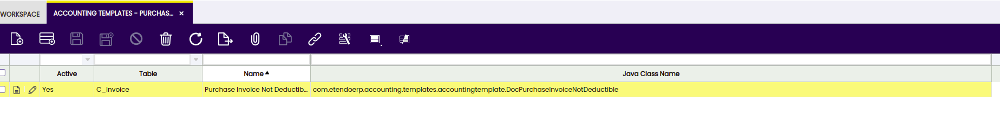
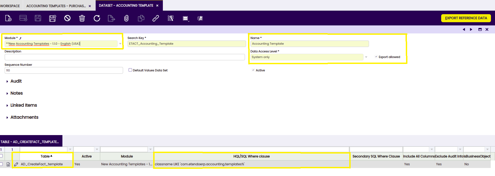
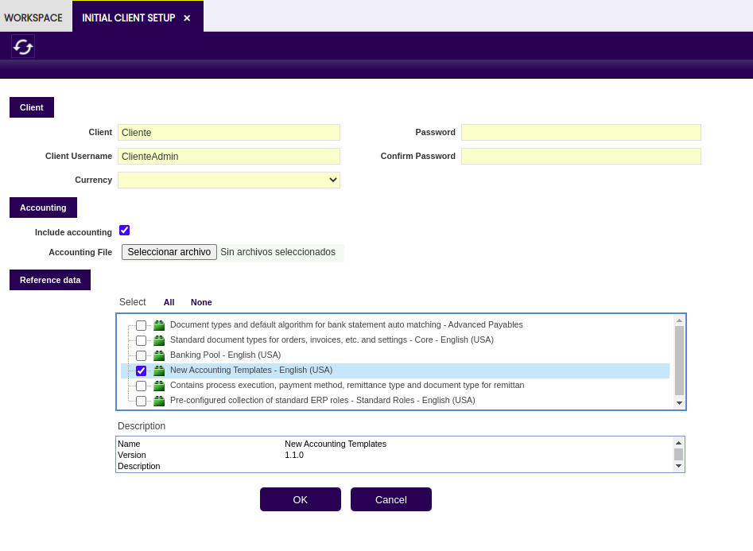

# Accounting Templates 

## Overview

Accounting Templates allow organizations to customize how Etendo generates journal entries for specific document types, without modifying the core application. This is typically required when local legal or business rules demand posting logic that differs from the default behavior — for example, a country-specific tax treatment for invoices or a custom accrual method for goods receipts.

A system administrator registers the template in this window. A Java developer implements and deploys the corresponding class as part of a module beforehand. Once configured, the template applies automatically every time a matching document is posted — end users are not affected by the change.

!!! warning
    This is a powerful feature that must be used with caution. The custom posting class must be thoroughly tested before deploying it in a production environment.

## Creating the Accounting Template Configuration
:material-menu: `Application` > `Financial Management` > `Accounting` > `Setup` > `Accounting Templates`

!!! warning
    Although this is a functional configuration window managed at the administrator level, accounting templates must be developed by a Java developer. The Java class referenced in the **Java Class Name** field must be implemented and deployed as part of a module before it can be registered here.

The **Accounting Templates** window is used to register the Java class that implements the custom posting logic. Each template requires a name, the fully qualified Java class name (within the module's Java package), and the database table that corresponds to the document type to customize — for example, `C_Invoice` for invoices or `M_InOut` for goods shipments and receipts.

Each template is later associated with specific active tables or document types. You can define a single template that covers all documents of a given type (for example, all invoices), or create separate templates that target only specific [document categories](document-type.md) (for example, only purchase invoices), while leaving the default behavior for the rest.

### Fields

- **Name**: A descriptive identifier for the accounting template. Use a clear name that reflects the posting rule or the document type it affects.
- **Java Class Name**: The technical identifier for the custom posting logic. The developer provides this value — enter it exactly as given.
- **Table**: The document type this template overrides. Select the table corresponding to the transactions to customize. In the dropdown, look for names like `C_Invoice` (invoices) or `M_InOut` (goods shipments) — these are the internal table names Etendo uses to identify each document type.
- **Description**: Optional additional information about the purpose or behavior of this template (not shown in the grid view above).
- **Active**: Indicates whether this template is currently in use. Deactivating a template restores the default posting behavior for the associated document type.

Once the template is configured, it is associated with the corresponding active tables or documents. The entries it generates appear in the [General Ledger Configuration](general-ledger-configuration.md) reports alongside standard postings, following the rules defined in the [Account Tree](account-tree.md).

## Dataset Definition

!!!warning
    This section is for development teams that need to package and distribute a custom accounting template as an installable module. If you are an administrator registering an existing template in the Accounting Templates window, skip this section and the Dataset Testing section entirely — they do not apply to your workflow.

The dataset definition determines which records are exported with the accounting template module so that the template can be installed in other environments. A correct dataset definition is essential — an incorrect one can render the entire template unusable after installation. For background on how organizations and datasets interact during setup, see [Initial Organization Setup](../../../general-setup/enterprise-model/initial-organization-setup.md).

Follow these guidelines when defining the dataset:

- The dataset **must belong to the accounting template module**.
- **Avoid special characters** in the dataset name. This string is used to generate the XML filename that stores the dataset.
- **Data Access Level** must be set to `System/Client`, which means the configuration can only be applied at Client level (Organization `*`). Note: the screenshot below may show a different value depending on the Etendo version.
- The **Export Allowed** flag must be checked.
- In the **Table** tab, include the `AD_CreateFact_template` table (the database table that stores Accounting Template records — each row in the Accounting Templates window corresponds to a row in this table).
- The **HQL/SQL Where Clause** filters which rows from the table are included in the exported dataset (HQL and SQL are query languages used to select specific records from the database). Typically, this clause selects all records whose Java class name falls within the module's Java package, so that only the templates belonging to this module are exported.

Once the dataset definition is complete, export it by pressing the **Export Reference Data** button. This process queries the configured tables, retrieves all records matching the HQL/SQL Where Clause, and generates an XML file in the `referencedata/standard` directory of the module.

!!!info
    As a quick check, open the generated XML file with a text editor and verify it contains data. If the file is empty, review the dataset definition — especially the HQL/SQL Where Clause for each table.

## Dataset Testing

The recommended way to verify that the dataset is correct is to create a new client within the development instance using the [Initial Client Setup](../../../general-setup/getting-started.md#initial-client-setup) process, selecting the new accounting template dataset during setup.

!!!info
    If the data within the dataset is consistent, the Initial Client Setup process completes successfully. Otherwise, it fails with an error description indicating what went wrong.

After a successful setup, log in to the new client, navigate to the **Accounting Templates** window, and confirm that the template record is present. Proceed to test posting by creating sample documents and verifying that the custom accounting entries are generated correctly. This validation step applies to any environment where the template has been installed — not only during module development.

## Technical Reference

!!!info
    This section describes the internal design of Accounting Templates. It is intended for developers and is not required for day-to-day configuration.

### Background

By default, Etendo generates journal entries for documents using built-in posting logic. Accounting Templates introduce a mechanism that allows **modules to override this default behavior** without modifying the core application code. This means organizations can adapt how accounting entries are generated to meet specific legal or business requirements through independent, installable modules.

### How It Works

Accounting Templates work by inserting a **new layer between the document and the posting logic**. In the Accounting Templates window, each document type is mapped to the class that implements its posting behavior. To change how a document is posted:

1. A developer creates a new class that implements the desired posting logic.
2. The template is configured in this window to map the relevant document type to the new class.
3. From that point on, all documents of that type use the custom logic.

This approach is transparent to end users — the posting process looks and works the same from the application interface. The only difference is in the accounting entries generated, which follow the rules defined by the custom template rather than the built-in defaults.

!!!info
    The application interface is not affected by these changes. All modifications to posting behavior happen behind the scenes. The Accounting Templates window is the only additional configuration needed, and it is set up automatically when the template module is installed.

---

This work is a derivative of [Accounting Templates](https://wiki.openbravo.com/wiki/Projects:Accounting_Templates){target="\_blank"} by [Openbravo Wiki](http://wiki.openbravo.com/wiki/Welcome_to_Openbravo){target="\_blank"}, used under [CC BY-SA 2.5 ES](https://creativecommons.org/licenses/by-sa/2.5/es/){target="\_blank"}. This work is licensed under [CC BY-SA 2.5](https://creativecommons.org/licenses/by-sa/2.5/){target="\_blank"} by [Etendo](https://etendo.software){target="\_blank"}.