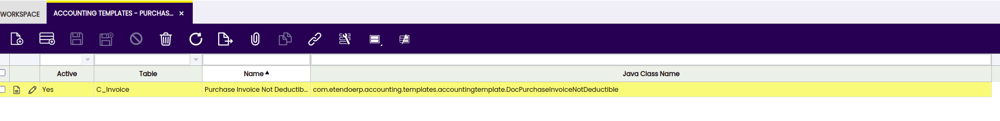
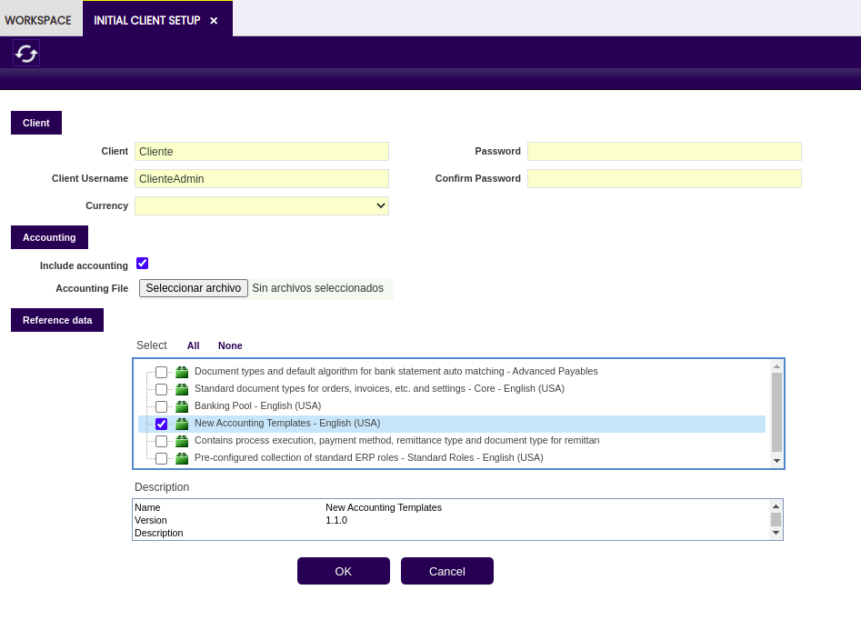

# Accounting Templates 

:material-menu: `Application` > `Financial Management` > `Accounting` > `Setup` > `Accounting Templates`

## Overview 
 
Accounting templates in Etendo overwrite default accounting behavior. Each template is related to a specific table.

The accounting entries generated by Etendo usually need to be generated in a different way to fulfill the legal requirements for a concrete country. To support this kind of requirements, Etendo allows overriding the code that generates the accounting entries through what is called Accounting Templates. Each time a document is posted, the accounting engine checks whether any Accounting Template is defined for the associated table or for the concrete document and executes it instead of the default Core's code.
 
!!! warning
    This is a powerful feature that must be used with caution. The code that generates the accounting entries must be deeply tested before deploying it in a real instance.

## Creating the Accounting Template Configuration

The Java class that implements the generation of the new accounting entries is defined into the Accounting Templates window. The definition is quite simple and only requires a name, the Java class name, which must be inside the java package of the module, and the table for which the user wants to override its accounting entries (for example, C_Invoice for Invoices, M_InOut for goods shipments/receipts, etc.).

This Accounting Template will be later on associated with the Active Tables or a Document. So in this step it is important to define as many Java classes as Active Tables or Document to override their accounting behavior.
For example, we can define an unique java class for overriding the accounting behavior of all the invoices (sales invoices, purchase invoices, purchase/sales credit memo, etc.), or alternatively define a class for overriding only the accounting entries for Purchase Invoices (AP Invoice) and keep the default behavior to the rest of the invoices.

### Dataset Definition

Dataset definition is a key step in this process. A wrong dataset definition can waste all previous work, so it is important to follow all these considerations:

- The dataset must belong to the accounting template module
- Try avoiding strange characters in the dataset's name. This string is used for generating the XML file name that stores the dataset.
- The Data Access Level must be set to System/Client, which means we allow users to apply the configuration only at Client level (Organization *).
- The Export allowed flag must be set.
- Inside the Table tab, include the AD_CreateFact_template table, which is the one that stores the Accounting Template configuration.
- The HQL/SQL Where clause is an important field, because it allows filtering the records the user wants to include into the dataset. In the example all the records that are inside the module java package name have been filtered. 

The dataset definition is ready, so the user just needs to export it to a file pressing the Export Reference Data button. This process queries the previous tables and gets all the records that fulfill the HQL/SQL Where clause, generating a XML file inside the module's referencedata/standard directory. As a fast check, this file can be opened using any plain text editor and the user can verify that it contains several lines.
In case the file is empty, the user should double check the dataset definition, specially the HQL/SQL Where clause used for each table.

#### Testing the Dataset

The real test to ensure the taxes dataset is OK can be done inside the development instance. The test consists on creating a new client running the Initial Client Setup and selecting the new dummy accounting template dataset.

!!! info
    If the data inside the dataset are consistent, the Initial Client Setup Process should be completed successfully, otherwise it will fail giving a description about the error.

 
After a successful Initial Client Setup, login into the new client, go to the Accounting Templates window and check the record is there.

## Functional Specification

### Overview

Nowadays, Etendo  builds entries associated with documents following a hard-coded behavior. In order to modify the generated entry, code must be modified. The current code has become a module called core. If a module wants to modify accounting entries generated by documents, core must be modified, and this is not desired at all.
With this new development in core, modules will be able to easily modify the entries generated by each document.

### Scope
The aim of this project is to allow modules to modify the way entries are generated when posting documents.

### Design Considerations
A new layer will be included between the document, and the logic that posts that document. In a new window each document is mapped to the servlet that implements the logic to post it. This way, just modifying the values on this window, accounting behavior is changed. If a new module wants to change the entry generated when posting an invoice, a new servlet is developed following the desired behavior. At the same time, the mapping of the invoices to the servlet that posts will be changed to the servlet developed in the module. This way, the whole application behavior is changed.

### Functional Requirements

!!! info
    Application is not affected by these developments, because all changes to the way the documents are posted are transparent to the user. Only a new window is necessary, that is configured automatically for the user when updating.

---

This work is a derivative of [Accounting Templates](https://wiki.openbravo.com/wiki/Projects:Accounting_Templates){target="\_blank"} by [Openbravo Wiki](http://wiki.openbravo.com/wiki/Welcome_to_Openbravo){target="\_blank"}, used under [CC BY-SA 2.5 ES](https://creativecommons.org/licenses/by-sa/2.5/es/){target="\_blank"}. This work is licensed under [CC BY-SA 2.5](https://creativecommons.org/licenses/by-sa/2.5/){target="\_blank"} by [Etendo](https://etendo.software){target="\_blank"}.