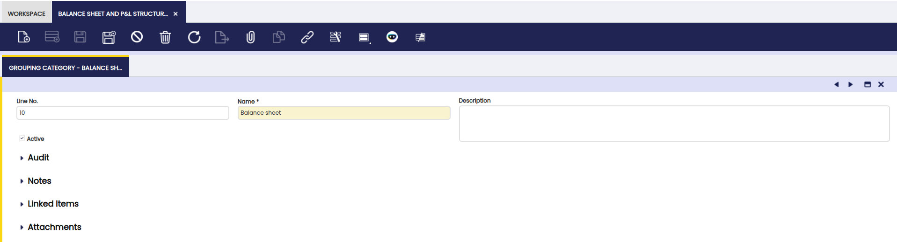
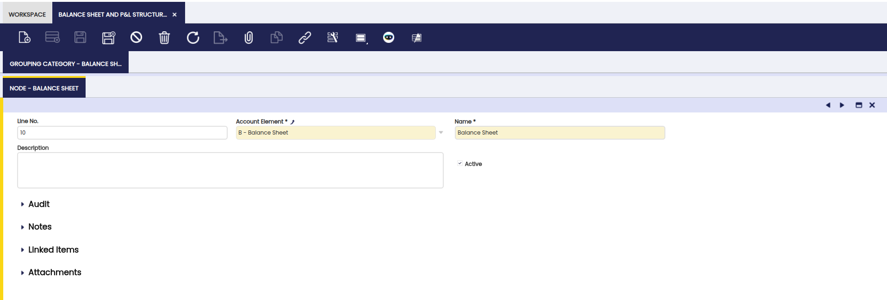

# Balance Sheet and P/L Structure Setup

:material-menu: `Application` > `Financial Management` > `Accounting` > `Setup` > `Balance Sheet and P/L Structure Setup`

## Overview

The Balance Sheet and P&L Structure Setup allows users to define how Etendo generates its two main **financial reports**:

- Balance Sheet
- Profit and Loss (P&L)

This setup determines which accounts appear in each report and how they are grouped and calculated. Once configured, these reports can be generated from the [Balance Sheet and P&L Structure Advanced](../analysis-tools.md#balance-sheet-and-pl-structure-advanced) window.

A key point is that both reports are built based on the **[Organization Account Tree](./account-tree.md)** (Chart of Accounts). Therefore, the account tree must be properly structured to obtain meaningful and accurate financial reports.

The structure of the Balance Sheet and P&L depends entirely on the Account Tree:

- **Imported account trees** (CSV files or reference data):

    Etendo provides localized charts of accounts, such as the Spanish Chart of Accounts, already structured to produce compliant Balance Sheet and P&L reports.

- **Manually created** account trees:
    The user must carefully design the hierarchy, as the report structure directly reflects the way accounts are organized in the tree.

## Header

Each record created in this window represents one **financial report**. When defining a report, the selected [organization type](../../../general-setup/enterprise-model/organization-type.md) is crucial because it determines the scope of the financial data:

- If the organization selected is a **Legal with Accounting** which has other organizations underneath, the financial information provided by the reports will be a **roll-up** of the financial information of the organizations which belong to it. Roll-up means it produces an **aggregated** Balance Sheet. To get a **consolidated** Balance Sheet, transactions between organizations (intercompany transactions) need to be removed from the resulting report.
- The same applies in the case of organizations which are **Organization type** which have other organizations underneath sharing the same general ledger configuration and, therefore, account tree.
- If the organization selected is a **Generic organization** which belongs to a Legal with Accounting one, the financial information provided by the reports will be just the financial information of that organization.

Fields to note in this window:

- **General Ledger**: from which accounting information is required.
- **Report Name**: e.g. Balance Sheet.
- **Report Type**: the options available are:
    - **Point in Time**: this type is used for reports such the Balance Sheet as account's balance needs to be referred to a specific date.
    - **Periodic**: this type is used for reports such the P&L as used account's balance needs to be referred to a specific period of time, for instance a month, a quarter, a year, etc.
- **Balanced**: this flag must be activated whenever the report needs to be launched just for **Legal with Accounting** organization types as that is the enterprise level where accounting balance is ensured.
- **Active**: this flag needs to be checked as active for the Balance Sheet report.

### Grouping Category

The **Grouping Category** tab allows users to define sections within the report. Each grouping category creates a page break, helping organize the report into clear sections.

#### Node

From the **Node** sub-tab it is possible to define the information shown in the report.

A report node is defined by:

- The **Name** of the node.
- The **Account Element** which is going to be shown in the report.
    
    !!! info
        The account elements selected here are usually **Heading element level types**, therefore the calculated balance of the node will take into account and will show the balance of all the account elements of other types which are underneath it.

## Balance Sheet Structure Setup - Example

This setup defines how Etendo generates a **Balance Sheet** showing the company’s financial position at a specific date.

- **Report Name**: Balance Sheet
- **Report Type**: Point in Time, as balances are calculated for a specific date.
- **Balanced**: Yes, since the Balance Sheet must be balanced at Legal with Accounting level.

    - **Grouping Category**: Balance Sheet

        - **Node**: Assets, linked to the account tree heading that groups all asset accounts.
        - **Node**: Liabilities and Owner’s Equity, linked to the heading that groups liabilities and equity accounts.

!!! note
    Etendo calculates each node by **summing all accounts** located under the corresponding account tree heading. A correctly structured [Account Tree](./account-tree.md#element-value-tab) is essential for accurate results.

## Profit and Loss (P&L) Structure Setup - Example

This setup defines how Etendo generates a **Profit and Loss report** for a selected period.

- **Report Type**: Periodic, as revenues and expenses are calculated over a time range.
- **Balanced**: No, since this report does not represent a balance at a specific date.
    - **Grouping Category**: Profit and Loss
        - **Node**: Profit and Loss, linked to the account tree heading that groups all revenue and expense accounts.

!!! note
    Etendo calculates the result by comparing total revenues and expenses for the selected period.
    Above node must be an Account Tree element properly configured. For more information, visit [Account Tree](./account-tree.md).

!!! info
    For more information about Balance Sheet and P/L Structure reports visit: [Balance Sheet and P/L Structure Advanced](../../accounting/analysis-tools.md#balance-sheet-and-pl-structure-advanced). 

---

This work is a derivative of [Balance Sheet and P/L Structure Setup](https://wiki.openbravo.com/wiki/Balance_sheet_and_P%26L_structure_Setup){target="\_blank"} by [Openbravo Wiki](http://wiki.openbravo.com/wiki/Welcome_to_Openbravo){target="\_blank"}, used under [CC BY-SA 2.5 ES](https://creativecommons.org/licenses/by-sa/2.5/es/){target="\_blank"}. This work is licensed under [CC BY-SA 2.5](https://creativecommons.org/licenses/by-sa/2.5/){target="\_blank"} by [Etendo](https://etendo.software){target="\_blank"}.