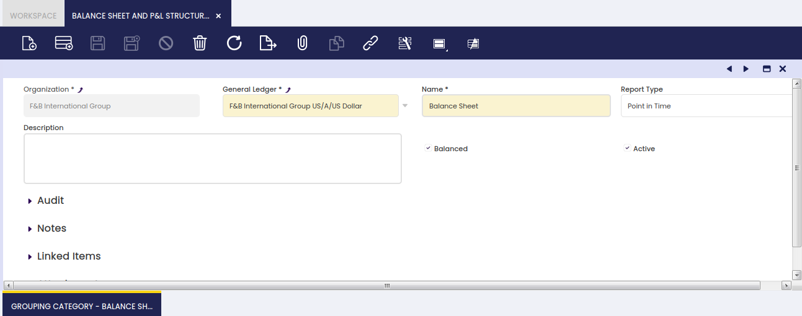
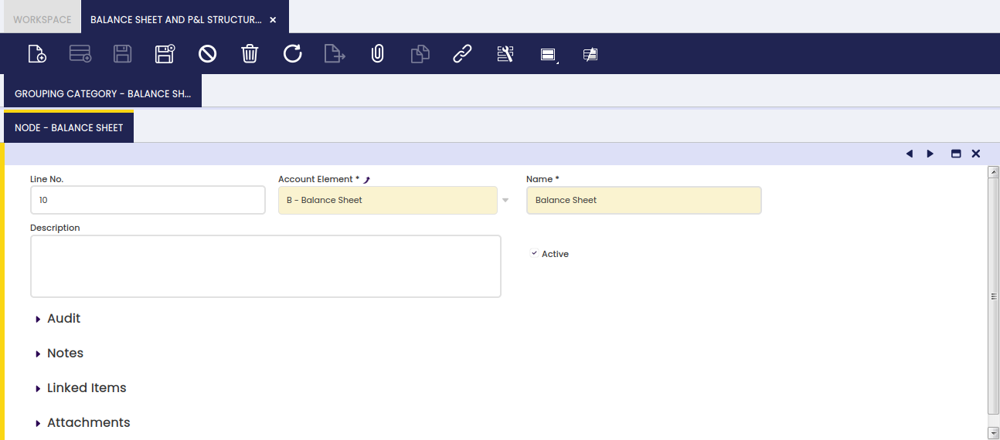

# Balance Sheet and P/L Structure Setup

:material-menu: `Application` > `Financial Management` > `Accounting` > `Setup` > `Balance Sheet and P/L Structure Setup`

## Overview

Balance Sheet and P&L structure setup allows the user to configure the two main financial reports which are the Balance Sheet and the P&L.

Once configured, these two reports can be launched from the Balance Sheet and P&L window.

It is important to remark that the *source of both reports structure* is the organization Account Tree which therefore needs to be structured in a way to obtain a meaningful Balance Sheet and P&L reports.

Moreover, and as already described, an Account Tree or chart of accounts can be imported or can be manually created:

-   in the case of imported account trees as a CSV file or as a reference data set:
    -   Etendo provides the localized account tree structure required to get localized balance sheet and P&L reports for a given country, for instance, the Spanish Chart of Accounts
-   in the case of manually created account trees:
    -   it is key to take into account that financial reports structure relies on the account tree structure.

### Setup

Each new record in the Balance Sheet and P&L structure setup window is a report.

It is really important the level up to which either a Balance Sheet or P&L report is defined. That level relies on the organization type selected because:

-   If the organization selected is a *Legal with Accounting* which has other organizations underneath, the financial information provided by the reports will be a **roll-up** of the financial information of the organizations which belong to it. Roll-up means it produces an **aggregated** Balance Sheet. To get a **consolidated** Balance Sheet, transactions between organizations (intercompany transactions) need to be removed from the resulting report.
-   The same applies in the case of organizations which are *Organization* type which have other organizations underneath sharing the same general ledger configuration and, therefore, account tree.
-   If the organization selected is a *Generic* organization which belongs to a *Legal with Accounting* one, the financial information provided by the reports will be just the financial information of that organization.

The fields to fill in this window are:

-   the **Report Name**
-   the **General Ledger** from which accounting information is required
-   the **Report Type**. The options available are:
    -   **Point in Time**, this type is used for reports such the Balance Sheet as account's balance needs to be referred to a specific date.
    -   and **Periodic**, this type is used for reports such the P&L as used account's balance needs to be referred to a specific period of time, for instance a month, a quarter, a year, etc.
-   finally the **Balanced** flag which must be activated whenever the report need to be launched just for "Legal with Accounting" organization types as that is the enterprise level where accounting balance is ensured.  
    This flag needs to be checked as active for the Balance Sheet report.

### Grouping Category

Grouping category tab allows the user to define categories which groups report node/s. Each grouping category implies a page break in the report showing the defined report node/s.

### Node

A node defines the information shown in the report.

A report node is defined by:

-   the **Name** of the node
-   and the Account Element which is going to be shown in the report.
    -   The account elements selected here are usually "*Heading*" element level types,  
        therefore the calculated balance of the node will take into account and will show the balance of all the account elements of other types which are underneath it.

### Balance Sheet Structure Setup Example

One example of a Balance Sheet structure can be:

-   *Report Name: Balance Sheet*  
    *Report Type: Point in Time*  
    *Balanced: Yes*
    -   Grouping Category: Balance Sheet
        -   Node: Assets linked to the Account Element of the Account Tree which collects all the "Asset" accounts.
        -   Node: Liabilities and Owner's Equity linked to the Account Tree element which collects all the "Liabilities and Owner's Equity" account tree elements.

Above nodes must be an Account Tree element properly configured.

### P&L Setup Example

An example for a Profit and Loss report would be:

-   *Report Name: Profit and Loss*  
    *Report Type: Periodic*  
    *Balanced: No*
    -   Grouping Category: Profit and Loss
        -   Node: Profit and Loss linked to the "Heading" Account Tree element which collects all the "Expenses" and "Revenue" account tree elements.

Above node must be an Account Tree element properly configured.

---

This work is a derivative of [Balance Sheet and P/L Structure Setup](https://wiki.openbravo.com/wiki/Balance_sheet_and_P%26L_structure_Setup){target="\_blank"} by [Openbravo Wiki](http://wiki.openbravo.com/wiki/Welcome_to_Openbravo){target="\_blank"}, used under [CC BY-SA 2.5 ES](https://creativecommons.org/licenses/by-sa/2.5/es/){target="\_blank"}. This work is licensed under [CC BY-SA 2.5](https://creativecommons.org/licenses/by-sa/2.5/){target="\_blank"} by [Etendo](https://etendo.software){target="\_blank"}.