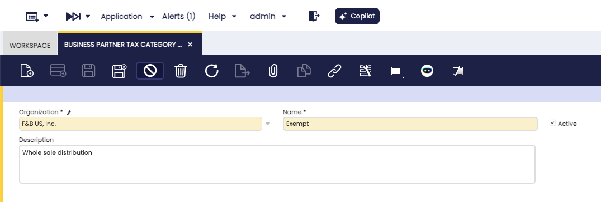

---
tags:
    - Business Partner
    - Tax Category
    - Financial Management
    - Setup
    - Accounting
---

# Business Partner Tax Category

:material-menu: `Application` > `Financial Management` > `Accounting` > `Setup` > `Business Partner Tax Category`

## Overview

Not all business partners are subject to the same taxes. A domestic supplier subject to VAT and income-tax withholding must be treated differently from an export customer who is zero-rated, or from a business partner whose activity makes them tax-exempt. The **Business Partner Tax Category** is the configuration element that captures these differences: it is a named group that the system administrator or accountant assigns to customers and vendors so that Etendo knows which tax rates apply to them.

This setup is performed once, during the initial configuration of the fiscal schema. Once each business partner has a category assigned, the category works silently in the background: every time a user creates an order or invoice, Etendo reads the partner's tax category and uses it as one of the filters to determine which tax rate populates the document line automatically. The user does not need to think about it — the correct tax appears on its own.

If a business partner has no tax category assigned, Etendo does not filter by this criterion and considers all available tax rates when selecting the default tax for that partner's transactions.

## Business Partner Tax Category Window

The window lists all existing business partner tax categories and allows new ones to be created. It is possible to define as many categories as the fiscal structure of the company requires.

### Fields

- **Name**: The identifier for the category. Use a clear, descriptive label that reflects the tax treatment it represents, such as *Standard VAT*, *VAT + Income Tax Withholding*, or *VAT Exempt*. This name appears in the Business Partner window when assigning the category to a customer or vendor.
- **Description**: An optional free-text field for internal notes explaining the purpose or scope of the category. It is visible only in this window and helps other administrators understand when to use each category.
- **Active**: When checked, the category is available for assignment to business partners. Deactivating a category does not remove it from partners already assigned to it, but it hides it from selection lists for new assignments.

## Assigning the Category to a Business Partner

Once the categories are created, each business partner that requires a specific tax treatment must be linked to the appropriate category. This is done in the [**Business Partner**](../../../master-data-management/master-data.md) window:

- For customers: open the [**Customer**](../../../master-data-management/master-data.md#customer) tab of the business partner record and set the **Business Partner Tax Category** field.
- For vendors and creditors: open the [**Vendor/Creditor**](../../../master-data-management/master-data.md#vendorcreditor) tab and set the same field.

A single business partner can act as both a customer and a vendor. In that case, both tabs can have a tax category assigned, and each may be different if the tax treatment differs between purchases and sales.

!!!note
    If a business partner does not have a tax category assigned, Etendo does not filter tax rates by this criterion for that partner. All tax rates that match the remaining conditions (tax category of the product, geographic zone, document type) are considered when selecting the default tax.

## How It Works with Tax Rates

The Business Partner Tax Category is one of several conditions that Etendo evaluates when it determines the default tax for a document line. The full selection logic is described in the [Tax Rate](tax-rate.md) page. In summary, the relevant steps are:

1. Etendo reads the **Tax Category** linked to the product on the document line. This narrows down which tax rates are candidates.
2. Among those candidates, Etendo filters further by **Business Partner Tax Category**: a tax rate that has a specific business partner tax category assigned applies only to partners in that category. A tax rate with no business partner tax category assigned applies to any partner.
3. When both types exist (specific and unrestricted), the tax rate that matches the partner's category takes priority.
4. Additional filters (geographic zone, document type, Cash VAT flag) are then applied to arrive at the final tax rate.

This means that configuring the Business Partner Tax Category on a tax rate (in the [Tax Rate](tax-rate.md) window, under the **More Information** section of the Header tab) and assigning a matching category to a business partner are complementary steps. One without the other produces no filtering effect.

The [Tax Category](tax-category.md) page describes how products are grouped for tax purposes, which is the starting point of the same determination chain.

!!!info
    Regardless of the tax rate that Etendo selects automatically, the user can always choose a different tax rate manually on any document line if the specific business scenario requires it.

---

This work is a derivative of [Business Partner Tax Category](https://wiki.openbravo.com/wiki/Business_Partner_Tax_Category){target="\_blank"} by [Openbravo Wiki](http://wiki.openbravo.com/wiki/Welcome_to_Openbravo){target="\_blank"}, used under [CC BY-SA 2.5 ES](https://creativecommons.org/licenses/by-sa/2.5/es/){target="\_blank"}. This work is licensed under [CC BY-SA 2.5](https://creativecommons.org/licenses/by-sa/2.5/){target="\_blank"} by [Etendo](https://etendo.software){target="\_blank"}.
