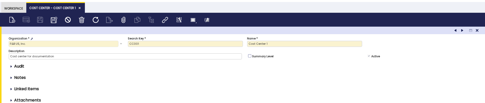

# Cost Center

:material-menu: `Application` > `Financial Management` > `Accounting` > `Setup` > `Cost Center`

## Overview

A **Cost Center** is an accounting dimension used to classify and track expenses or revenues by organizational unit. When posting documents to the general ledger, cost centers allow you to assign transactions to specific areas of the business — such as departments, teams, or projects — enabling more granular financial reporting and analysis.

The Cost Center window serves as the master record for all cost centers within an organization. From here, users can create, view, and manage the cost centers available for use during accounting transactions.

### Creating a Cost Center

To create a new cost center:

1. Navigate to `Financial Management` > `Accounting` > `Setup` > `Cost Center`.
2. Click **New** to open a blank record.
3. Enter the following fields:

    - **Name** *(required)*: A unique, descriptive name for the cost center (e.g., *IT Department*, *Sales Team*, *Project Alpha*).
    - **Description** *(optional)*: A brief explanation of what the cost center represents.
    - **Organization**: Select the organization this cost center belongs to. If assigned to the `(*)` organization, the cost center will be available across **all organizations** within the client.
    - **Summary**: Check this option to mark the cost center as a summary node, which allows you to build a **hierarchical tree structure** of cost centers for reporting purposes.

4. Save the record.

### Cost Center Hierarchy

Cost centers can be organized in a parent-child tree structure using the **Summary** flag. A summary cost center acts as a grouping node and does not hold transactions directly — it is used to aggregate the results of its child cost centers in reports.

This is useful when you want to, for example, group individual team cost centers under a broader departmental cost center.

## Related Setup

- [General Ledger Configuration](general-ledger-configuration.md) – Configure how accounting dimensions like cost centers are used in your ledger.
- [Account Combination](account-combination.md) – Define how cost centers combine with accounts and other dimensions.
- [ABC Activity](abc-activity.md) – Another accounting dimension that can be used alongside cost centers.

---

This work is a derivative of [Cost Center](https://wiki.openbravo.com/wiki/Cost_Center){target="\_blank"} by [Openbravo Wiki](http://wiki.openbravo.com/wiki/Welcome_to_Openbravo){target="\_blank"}, used under [CC BY-SA 2.5 ES](https://creativecommons.org/licenses/by-sa/2.5/es/){target="\_blank"}. This work is licensed under [CC BY-SA 2.5](https://creativecommons.org/licenses/by-sa/2.5/){target="\_blank"} by [Etendo](https://etendo.software){target="\_blank"}.