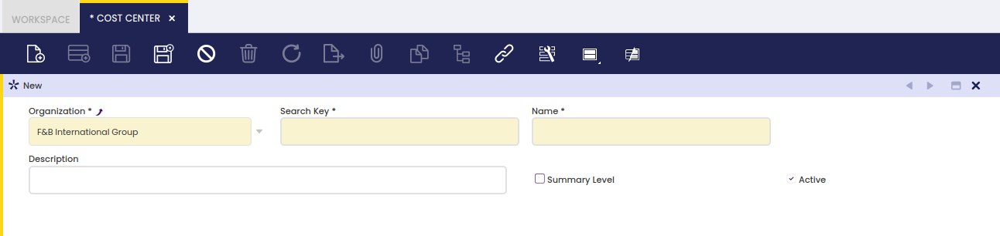

# Cost Center

:material-menu: `Application` > `Financial Management` > `Accounting` > `Setup` > `Cost Center`

## Overview

Cost Center is an accounting dimension which can be used while posting documents to the ledger.

### Cost Center

The Cost Center window allows the user to create organization's cost centers. It is used as a master of the cost centers of an organization.

A cost center can be created by just entering the name and the description of the organization's cost center. If a cost center is created for the (\*) organization that cost center will then be available to all the organizations of the client. A cost center can be created as summary which helps to get a tree structure of cost centers.

---

This work is a derivative of [Cost Center](https://wiki.openbravo.com/wiki/Cost_Center){target="\_blank"} by [Openbravo Wiki](http://wiki.openbravo.com/wiki/Welcome_to_Openbravo){target="\_blank"}, used under [CC BY-SA 2.5 ES](https://creativecommons.org/licenses/by-sa/2.5/es/){target="\_blank"}. This work is licensed under [CC BY-SA 2.5](https://creativecommons.org/licenses/by-sa/2.5/){target="\_blank"} by [Etendo](https://etendo.software){target="\_blank"}.