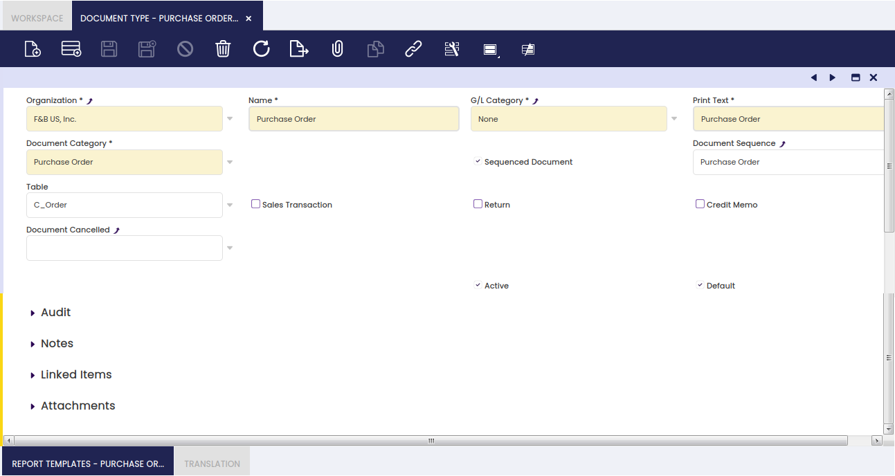
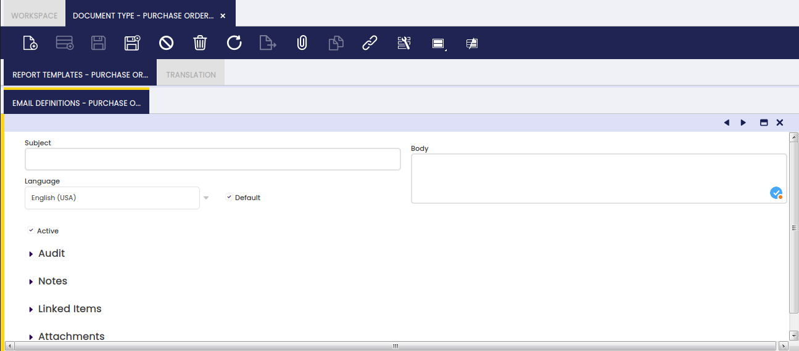

# Document Type

:material-menu: `Application` > `Financial Management` > `Accounting` > `Setup` > `Document Type`

## Overview

**Each document type in Etendo refers to a business transaction** such as purchase orders, shipments or sales invoices, among others. Etendo includes a complete set of standard Document Types needed for the application to work properly.

This set is bundled into two reference datasets:

-   Standard document types for orders, invoices, etc. and settings - Core - English (USA)
-   Document types and default algorithm for bank statement auto matching - Advanced Payables

!!!info
    These datasets can be imported into the application during its initial setup using [Initial Client Setup](../../../general-setup/getting-started.md#initial-client-setup) or [Initial Organization Setup](../../../general-setup/enterprise-model/initial-organization-setup.md) processes. Or if the application is already up and running, these datasets or their updates can be installed using [Enterprise Module Management](../../../general-setup/enterprise-model/enterprise-module-management.md) window.

The complete list of standard document types is the following:

|     |     |     |
|-----|-----|-----|
| **Document Type Name**  | **Document Category**  | **Business Transaction** |
| AP CreditMemo | AP Credit Memo | [Purchase Credit Memo](../../../procurement-management/transactions.md#reactivate) |
| AP Invoice | AP Invoice | [Purchase Invoice](../../../procurement-management/transactions.md#purchase-invoice) |
| AR CreditMemo | AR Credit Memo | [Sales Credit Memo](../../../sales-management/transactions.md#header-6) |
| AR Invoice | AR Invoice | [Sales Invoice](../../../sales-management/transactions.md#sales-invoice) |
| Return Material Sales Invoice | AR Return Material Invoice | [Return Material Sales Invoice](../../../sales-management/transactions.md#a) |
| Reversed Sales Invoice | AR Invoice | [Reversed Sales Invoice](../../../sales-management/transactions.md#header-6) |
| MM Receipt | Material Receipt | [Goods Receipt](../../../procurement-management/transactions.md#goods-receipts) |
| RTV Shipment | Material Receipt | [Return to Vendor Shipment](../../../procurement-management/transactions.md#return-to-vendor-shipment) |
| MM Shipment | Material Delivery | [Goods Shipment](../../../sales-management/transactions.md#goods-shipment) |
| RFC Receipt | Material Delivery | [Return from Customer receipt](../../../sales-management/transactions.md#return-material-receipt) |
| Purchase Order | Purchase Order | [Purchase Order](../../../procurement-management/transactions.md#purchase-order) |
| RTV Order | Purchase Order | [Return to Vendor](../../../procurement-management/transactions.md#return-to-vendor-rtv) |
| Quotation | Sales Order | [Sales Quotation](../../../sales-management/transactions.md#sales-quotation) |
| RFC Order | Sales Order | [Return from Customer Sales Order](../../../sales-management/transactions.md#return-from-customer) |
| POS Order | Sales Order | [Point of Sales Order](../../../sales-management/transactions.md#sales-invoice) |
| Warehouse Order | Sales Order | [Warehouse Order](../../../sales-management/transactions.md#sales-invoice) |
| Standard Order | Sales Order | [Sales Order](../../../sales-management/transactions.md#sales-invoice) |
| AP Payment | AP Payment | [Payment Out](../../../financial-management/receivables-and-payables/transactions.md#payment-out) |
| AR Receipt | AR Receipt | [Payment In](../../../financial-management/receivables-and-payables/transactions.md#payment-in) |
| Financial Account Transaction | Financial Account Transaction | [Financial Account Transaction](../../../financial-management/receivables-and-payables/transactions.md#transaction) |
| Bank Statement File | Bank Statement File | [Bank Statement](../../../financial-management/receivables-and-payables/transactions.md#imported-bank-statements) |
| Payment Proposal | AP Payment Proposal | [Payment Proposal](../../../financial-management/receivables-and-payables/transactions.md#payment-proposal) |
| Reconciliation | Reconciliation | [Reconciliation](../../../financial-management/receivables-and-payables/transactions.md#reconciliations) |
| Doubtful Debts | Doubtful Debt | [Doubtful Debt](../../../financial-management/receivables-and-payables/transactions.md#doubtful-debt) |
| Cost Adjustment | Cost Adjustment | [Cost Adjustment](../../../warehouse-management/transactions.md#cost-adjustment) |
| Landed Cost | Landed Cost | [Landed Cost](../../../procurement-management/transactions.md#landed-cost-1) |
| Landed Cost Cost | Landed Cost Cost | [Landed Cost Cost](../../../procurement-management/transactions.md#header-7) |
| Inventory Amount Update | Inventory Amount Update | [Inventory Amount Update](../../../warehouse-management/transactions.md#inventory-amount-update) |

!!! note "Important"
    **New document types could be added to the list above**. If that is the case, an updated version of the Reference Data containing the new document types will be provided by Etendo in new versions. That newly created Reference Data will have to be applied to the corresponding Organization in the [Enterprise Module Management](../../../general-setup/enterprise-model/enterprise-module-management.md). It is also possible to **manually create new document types**, but this process should be done by an advanced user, as explained below.

## Advanced User Guide

### Header

The Document Type window allows advanced users to configure how each document type is going to behave in terms of accounting and sequencing among others.

Fields to note:

-   An **Organization** is a unit of your client or legal entity.
-   The **Name** of the document.
-   The **G/L Category** is an optional, user defined method of grouping journal lines.
-   The **Print Text** which is the name of the document to be printed.
-   A **Document Category** is the document base type that identifies a document. Multiple document types may share a single document category.
-   The **SSO Sub Type** indicates the type of sales order this document refers to.

    !!! info
        This field only appears when the Document Category is Sales Order. 

    The selection made here will determine which documents will be generated when an order is processed and which documents must be generated manually or in batches. The following outlines this process.

    - The **Standard Order** option generates just the Order document when the order is processed. The Delivery Note, Invoice and Receipt must be generated via other processes. 
    - The **Warehouse Order** option generates the Order and Delivery Note. The Invoice and Receipt must be generated via other processes.
    - The **On Credit Order** option generates the Order, Delivery Note and Invoice. The Receipt must be generated via other processes.

-   The **Sequenced Document** flag could be disabled or enabled if it is required to either
    -   manually number a document type
    -   or automatically number a document type according to a given [document sequence](../../../financial-management/accounting/setup/document-sequence.md).
-   The **Document Sequence** indicates the sequencing rule to use for this document type.

    !!!info
        This field is only displayed when the **Sequenced Document** checkbox is selected. 

-   The **Table** indicates the table to which the document type corresponds. 
-   The **Sales Transaction** checkbox indicates if this item is a Sales Transaction. If not checked, by default the item refers to a Purchase transaction.
-   The **Return** checkbox indicates if the document is of reversal type. Documents with this flag enable using negative quantities.
-   the **Credit Memo** checkbox is enabled by default for **Credit Memo** document types such as **AR Credit Memo** and **AP Credit Memo**:
    -   **Credit Memo** document types are also **reverse** or **cancelled** documents type however, those behave differently than **return** document types, for instance:
    -   they generate invoices with **positive** invoiced quantity/ies
    -   therefore, the posting is always opposite to the invoices one, regardless the [**Allow Negative**](../../../financial-management/accounting/setup/general-ledger-configuration.md#general-ledger-configuration) checkbox setup:

        |     |     |     |     |
        | --- | --- | --- | --- |
        | **Account** | **Debit** | **Credit** | **Comments** |
        | [Customer Receivables](../../../master-data-management/master-data.md#customer) |     | Line Net Amount | One per invoice line |
        | [Tax Debit](../../../financial-management/accounting/setup/tax-rate.md#accounting) | Tax Amount |     | One per tax line |
        | [Product Revenue](../../../master-data-management/product-setup.md#accounting) | Total Gross Amount |     | One per invoice |

-   **Document Cancelled**, if any, is the document to use for voiding a given document type. For instance, a **Reversed Sales Invoice** document type can be set as the document canceled of an **AR Invoice**, therefore that one will be the one to use while voiding an **AR Invoice** (or sales invoice).
    -   A **Reversed Sales Invoice** document type is also an **AR Invoice** document type, but it can have a different sequencing by just linking it to a difference document sequence.
    -   besides, it is set as a **Return** document type, which means that:
        -   it generates a **negative** sales invoice with a negative invoiced quantity/ies
        -   therefore, the posting will be opposite to the sales invoice one, as described below, in case [**Allow Negative**](../../../financial-management/accounting/setup/general-ledger-configuration.md#general-ledger-configuration) checkbox is enabled and in case it is not:

        |     |     |     |     |
        | --- | --- | --- | --- |
        | **Account** | **Debit** | **Credit** | **Comments** |
        | [Customer Receivables](../../../master-data-management/master-data.md#customer) | (-) Line Net Amount |     | One per invoice line |
        | [Tax Debit](../../../financial-management/accounting/setup/tax-rate.md#accounting) |     | (-) Tax Amount | One per tax line |
        | [Product Revenue](../../../master-data-management/product-setup.md#accounting) |     | (-) Total Gross Amount | One per invoice |

        |     |     |     |     |
        | --- | --- | --- | --- |
        | **Account** | **Debit** | **Credit** | **Comments** |
        | [Customer Receivables](../../../master-data-management/master-data.md#customer) |     | Line Net Amount | One per invoice line |
        | [Tax Debit](../../../financial-management/accounting/setup/tax-rate.md#accounting) | Tax Amount |     | One per tax line |
        | [Product Revenue](../../../master-data-management/product-setup.md#accounting) | Total Gross Amount |     | One per invoice |

-   The **Active** checkbox can be used to activate or deactivate this document type.
-   The **Default** checkbox indicates if this record is to be used as a default value.

!!!info
    The following fields are **only displayed when the selected document category is Sales Order**.

- The **Document Type for Invoice** field indicates the document type that will be used when an invoice is generated from this sales document. It allows to define the document (i.e. Return Material Sales Invoice) to use while creating a Sales Order from a Return Material Document Type, like Return From Customer.

-   The  **Document Type for Order** field allows the user to define for the Quotation **Document Type** the document (i.e Standard Order) to use while creating a sales order from a sales quotation.

-	The **Document Type for Shipments** field indicates the document type that will be used when a shipment is generated from this sales document. 

-   The **Document Type for Simplified Invoice** field indicates the document type that will be used when a simplified invoice is generated from this sales document. 
    
-   The **Document Type for Aggregated Invoice** indicates the document type that will be used when an aggregated invoice is generated from this sales document.

### Report Templates

The Report Templates tab allows the user to configure a different aspect for the document types by setting up Jasper `.jrxml` templates for each document type.

!!!info
    By default, these templates are included in the datasets mentioned in the [overview](#overview).

It is possible to print document types such as [Goods Shipments](../../../sales-management/transactions.md#goods-shipment) or [Sales Invoices](../../../sales-management/transactions.md#sales-invoice) by using the **Print** action button, which can be found in the corresponding toolbar.

In Etendo, every document suitable to be printed is linked to a **standard** report template.

If necessary, **report templates can be customized** and even new ones can be created and therefore linked to a given document type.

!!!note
    Even though this option is available in this functional tab, this configuration must be done by a developer.

#### Email Definitions

The Email Definitions tab supports the creation of as many email templates as required, depending on the language to be used for sending the documents by email. Documents can be sent by email by using the action button **Email** which can be found in the corresponding toolbar.

As shown in the image above, it is possible to define:

-   a **Subject template** to be populated with real data every time a given document is sent by email.
    -   For instance `New Invoice (@our\_ref@)` will turn into `New Invoice (SI/2589)` where `SI/2589` is the number of the invoice sent by email.
-   a **Body template** to be populated with real data every time a given document is sent by email.
    -   For instance:
        -   `Dear @cus\_nam@, Find attached the invoice @our\_ref@ corresponding to the products you received from F&B International Group.`  
            will turn into
        -   `Dear Healthly Food Supermarkets Co., Find attached the invoice SI/2589 corresponding to the products you received from F&B International Group.`

Here is the list of possible tags:

-   **@cus\_ref@**: The document reference of the customer
-   **@our\_ref@**: The reference of the document
-   **@cus\_nam@**: The name of the customer
-   **@sal\_nam@**: The name of the sales representative
-   **@bp\_nam@**: The Business Partner name
-   **@doc\_date@**: The document date 
-   **@doc\_desc@**: The document description 
-   **@doc\_nextduedate@**: The next due date (if document has associated any payment plan)
-   **@doc\_lastduedate@**: The last due date (if document has associated any payment plan)

### Translation

In this tab, document types can be translated to any language required. To do this, create a new record and fill the corresponding fields, as shown below.

---

This work is a derivative of [Document Type](https://wiki.openbravo.com/wiki/Document_Type){target="\_blank"} by [Openbravo Wiki](http://wiki.openbravo.com/wiki/Welcome_to_Openbravo){target="\_blank"}, used under [CC BY-SA 2.5 ES](https://creativecommons.org/licenses/by-sa/2.5/es/){target="\_blank"}. This work is licensed under [CC BY-SA 2.5](https://creativecommons.org/licenses/by-sa/2.5/){target="\_blank"} by [Etendo](https://etendo.software){target="\_blank"}.