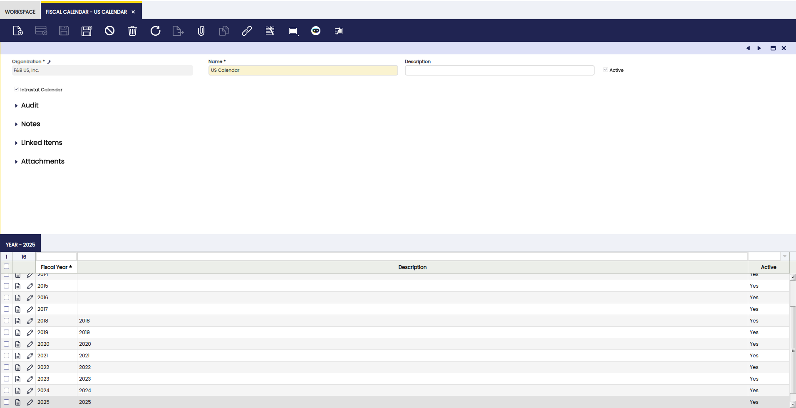
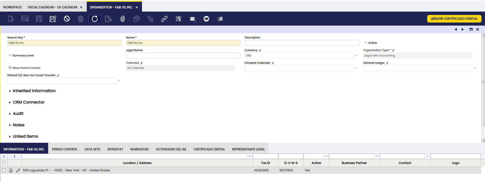
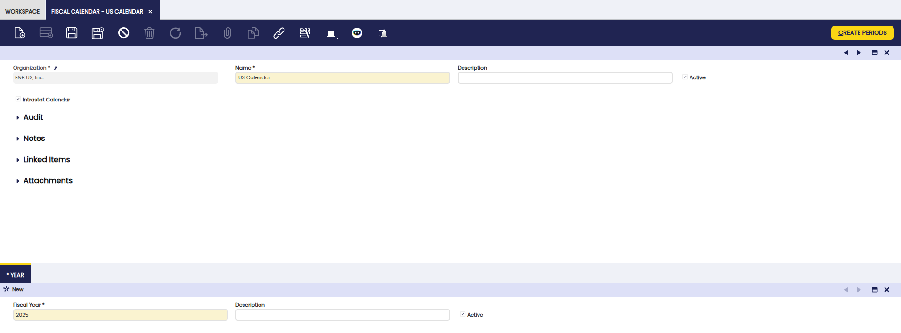

# Fiscal Calendar

:material-menu: `Application` > `Financial Management` > `Accounting` > `Setup` > `Fiscal Calendar`

## Overview

Organizations of type **Legal Entity with Accounting** must have a fiscal calendar assigned. Other organization types can inherit the fiscal calendar from their parent organization.

A fiscal calendar defines the **years** and their **periods** to ensure accurate accounting and proper control of the financial cycle. Each organization can only have **one fiscal calendar** assigned, which is used for posting transactions and managing the opening and closing of periods.

### Fiscal Calendar Window

The **fiscal calendar window** allows the user to create and maintain the organization's fiscal calendar. Each organization requiring a calendar needs to have one calendar assigned to it and **only one** therefore it is clearly known which calendar is going to be used while posting transactions and while opening and closing the accounting cycle.

- When creating a calendar, Etendo proposes `*` as the default organization:

    - Keeping `*` means the calendar is defined at the **client level** and can be used by all organizations under that client.

    - Changing it to a specific organization means the calendar will be available **only for that organization**.

Once the calendar is created, it must be linked to the corresponding organization in the [Organization](../../../general-setup/enterprise-model/organization.md) window, by:

- Enabling the **Allow Period Control** checkbox.

- Selecting **legal with accounting organizations** type.

### Year

The **Year** tab is used to define as many **fiscal years** as required within a calendar.

- A Fiscal Year usually covers **12 consecutive months**.

- Use the **Create Periods** button to automatically generate:

    - **12 Standard Calendar Periods** (January 1st – December 31st).

    - An optional **13th Adjustment Period**, dated the last day of the last standard period (e.g., 31-12-2025), used for accounting adjustments via G/L Journals.

Once created, all the periods need to be **opened** in the [Open/Close Period Control](#openclose-period-control) window.

!!!info
    The periods of an organization's fiscal calendar can be reviewed in the **Period Control** tab of the [Organization](../../../general-setup/enterprise-model/organization.md) window. 

!!!note
    -   **Standard Calendar Periods** are opened for **every Document Category**, which means that Etendo  allows the user to post any document type to the ledger within a standard calendar period open.
    -   The **Adjustment Period** is only open for **G/L Journal** document category, which means that Etendo allows to post only G/L journals within the adjustment period.

### **Period**

The **Period** tab lists all the periods of a year. Also, it is possible to **manually** create the accounting periods of a year. That action requires to enter some information:

The fields to note are:

-   A consecutive **period number**: this number will be later on used to open/close consequent accounting periods at a time.
-   A **period name**.
-   The **starting date** of the period.
-   The **ending date** of the period.
-   The **period type** as Standard Calendar Period Type or Adjustment Period as required.

!!!note
    The values of a Period can be manually modified also, but only while this Period is in a **Never Opened** Status, once it has been open it will no longer be possible.

Etendo checks if another period with the same starting and ending date is already registered in the system, and it also checks if the date of a period overlaps the date of another period.

Finally, a year can be:

-   **closed**
-   and **re-opened**

Both actions are performed in the [End Year Close](../../accounting/transactions.md#end-year-close) window.

---

This work is a derivative of [Fiscal Calendar](https://wiki.openbravo.com/wiki/Fiscal_Calendar){target="\_blank"} by [Openbravo Wiki](http://wiki.openbravo.com/wiki/Welcome_to_Openbravo){target="\_blank"}, used under [CC BY-SA 2.5 ES](https://creativecommons.org/licenses/by-sa/2.5/es/){target="\_blank"}. This work is licensed under [CC BY-SA 2.5](https://creativecommons.org/licenses/by-sa/2.5/){target="\_blank"} by [Etendo](https://etendo.software){target="\_blank"}.