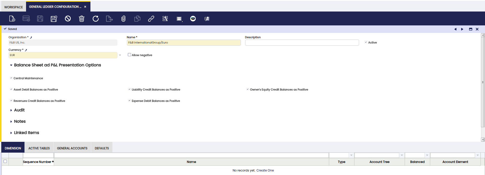
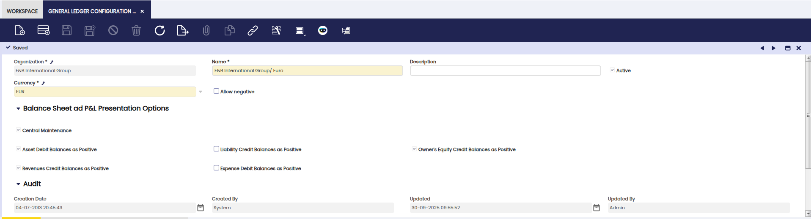
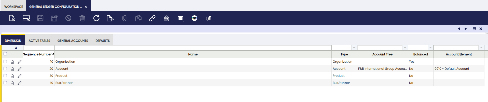
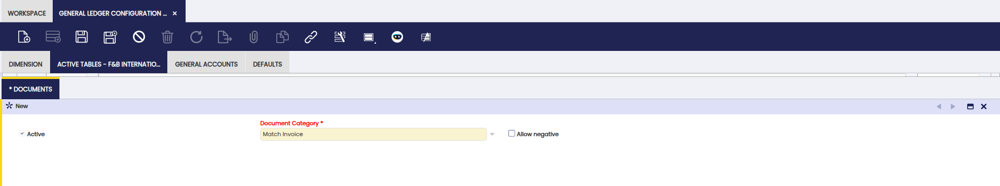
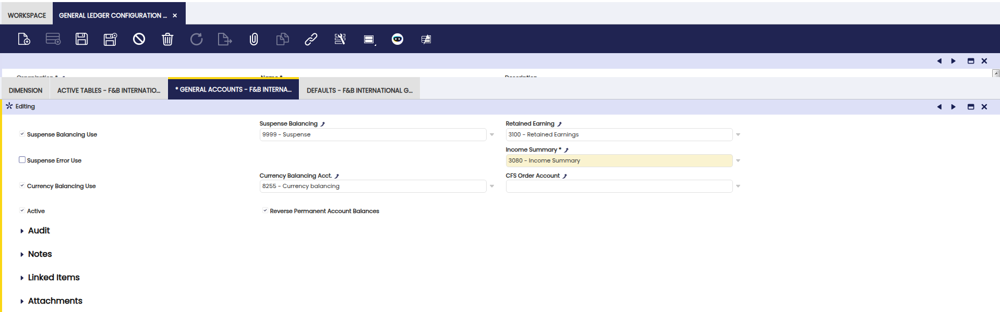
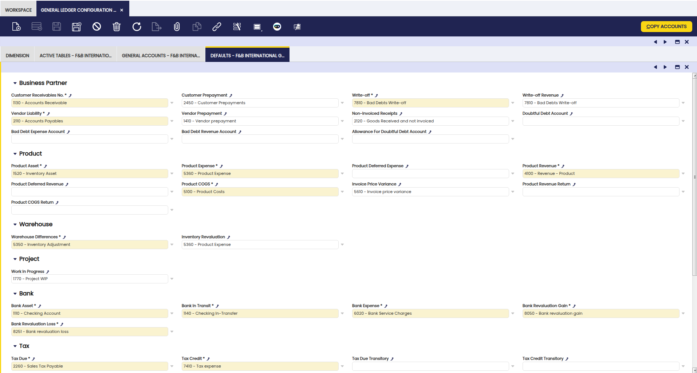

# General Ledger Configuration

:material-menu: `Application` > `Financial Management` > `Accounting` > `Setup` > `General Ledger Configuration`

## Overview

The **General Ledger (GL) Configuration** defines how an organization's financial transactions are posted to the ledger.

A GL configuration is created whenever an accounting **CSV file or a Chart of Accounts (CoA)** reference module is selected during the [Initial Client Setup](../../../general-setup/getting-started.md#initial-client-setup) process or the [Initial Organization Setup](../../../general-setup/enterprise-model/initial-organization-setup.md) processes.

The general ledger configuration created by default can afterwards be customized to meet the organization's needs.

- If configured at **Client level**, the GL is assigned to the organization (\*) and available to all organizations within that client.

- If configured at **Organization level**, the GL is available only to that organization and its descendants.

!!!info
    Besides a general ledger configuration, those accounting files also create the organization's Account Tree or Chart of Accounts and the general ledger default accounts. 

!!!info
    Etendo delivers accounting files through the Chart of Accounts modules contained in a [Localization Bundle](../../../../optional-features/bundles/spain-localization/overview.md) if available for your country.

Additionally, a general ledger configuration can also be created **manually**, but once the corresponding [Account Tree](#account-tree) has been created.

!!!info
    For more information visit, [How to Create a General Ledger Configuration](../../../../how-to-guides/how-to-create-a-general-ledger-configuration.md). 

Lastly, it is important to remark that the GL configuration and the CoA are linked, since **Account** is a mandatory dimension of the GL.

### General Ledger Configuration Window

The General Ledger Configuration window allows the user to review and maintain defaulted general ledger configurations and to create new ones if needed.

 

Fields to note:

A general ledger configuration created by **default** can be changed to meet the organization's needs by changing the features below:

1. The **Currency** field: 

    - The Default currency comes from Client/Organization Setup.
    - Can be changed before posting starts.
    - An organization can have **multiple GLs in different currencies**.

        - Example: F&B España posts in both USD (inherited) and EUR (own GL).
        - Result: Two Journal Entry Reports, one per ledger.

2. The **Allow Negative** checkbox: Defines whether negative postings are allowed.

    - Enabled: reversals post with negative amounts.
    - Disabled: reversals are re-posted with opposite debit/credit signs.

        For instance, a purchase invoice generates the posting below:

        |     |     |     |     |
        | --- | --- | --- | --- |
        | Account | Debit | Credit | Comments |
        | Product Expense | Line Net Amount |     | One per invoice line |
        | Tax Credit | Tax Amount |     | One per tax line |
        | Vendor Liability |     | Total Gross Amount | One per invoice |

        When voided:

        - Allow Negative = YES (postings appear as negative values).
        - Allow Negative = NO (postings are reclassified: debit ↔ credit).

3. The **Centrally Maintenance** checkbox: 

    - **Centrally Maintained**: When YES, the **Account Sign** field is hidden in the Element Value tab of the [Account Tree](#account-tree) window. 

        - It is possible to define at general ledger level whether the balances of any account type are going to be shown as **Positive** or **Negative** in the financial statements if the checkbox Central Maintenance is selected:

            - **Assets Debit** balances are shown as Positive in the Balance Sheet.
            - **Liabilities Credit** balances are shown as Positive in the Balance Sheet. 
            - **Owner's Equity Credit** balances are shown as Positive in the Balance Sheet.
            - **Expenses Debit** balances are shown as Positive in the Income Statement.
            - **Revenues Credit** balances are shown as Positive in the Income Statement.

        !!!info
            It is possible to uncheck any of the checkboxes listed above showing any of the balances as negative. 

        

    - **Centrally Maintained**: When NO, the **Account Sign** field is not hidden in the Element Value tab of the [Account Tree](#account-tree) window. Therefore, the account sign of each account tree element defines how the balance of that account is going to be shown in the financial statements.

    !!!info
        It is important to remark that the **Central Maintenance** checkbox is **not selected by default** for the general ledgers created by default, as the corresponding accounting CSV files or reference data imported have their own configuration through the Account Sign.

### Dimension Tab

The **Dimension** tab allows the user to configure the organization's general ledger dimensions or to add additional accounting dimensions **not centrally maintained** in the client.

Etendo allows the user to manage mandatory and not mandatory accounting dimensions to be entered in the Dimensions section of the documents, which can be posted to the ledger.

Mandatory dimensions can be filled in or not depending on the document category being created. For instance, **Business Partner** and **Product** are mandatory dimensions that need to be filled in a purchase invoice but can be filled or not in a G/L Journal.

There are **two mandatory dimensions** at the organization's general ledger configuration level, those are:

-   The **Account** as any document/transaction posted to the ledger needs to be posted in a ledger account (or subaccount in Etendo terms) of a given account tree or chart of accounts.
-   The **Organization**, as any document/transaction posted to the ledger, needs to be posted in an organization's general ledger.

Besides, if an organization belongs to a Client which centrally maintains the accounting dimensions, it is possible to add in this tab other dimensions such as the ones listed below which can be even set as **mandatory** for the organization:

-   Activity
-   Asset
-   Campaign
-   Location From
-   Location To
-   Sales Region

The following is an example of an organization's general ledger for which the dimensions below have been selected in this tab because the organization belongs to a client which does not centrally maintain the accounting dimensions:

-   Mandatory dimensions:
    -   Organization
    -   and Account
-   Non mandatory dimensions which are set as **mandatory** in here:
    -   Business Partner, Product and Project
-   Non mandatory dimension:
    -   Sales Region

The configuration above means that every time that a transaction of any kind (purchase invoice, sales invoice, G/L Journal) is posted to the ledger, all the mandatory dimensions above must be entered while there is an option to enter sales region information if any.

!!!note
    Some dimensions appear on some transactions and some do not. That depends on the document being created. For instance, the **Account** dimension always appears in the Lines tab of a G/L Journal, however it does not appear in the Lines tab of a purchase invoice as that data is automatically taken from the accounts (subaccounts) setup for the product, for the business partner and for the taxes, if any.

### Active Tables Tab

The **Active Tables** tab allows the user to define which tables and therefore transactions are going to be posted to the ledger and which ones are not.

The tables listed below are the tables **suitable to be posted**:

|     |     |
| --- | --- |
| Table name | Window |
| FinancialMgmtAmortization | Amortization |
| Invoice | Purchase Invoice       Sales Invoice |
| Order | Purchase Order       Sales Order |
| FIN\_BankStatement | Financial Account - Bank Statement |
| FIN\_Finacc\_Transaction | Financial Account - Transactions |
| FIN\_Payment | Payment In       Payment Out |
| FIN\_Reconciliation | Financial Account - Reconciliation |
| FinancialMgmtGLJournal | General Ledger Journal |
| MaterialMgmtShipmentInOut | Goods Receipt       Goods Shipment |
| MaterialMgmtInternalConsumption | Internal Consumption |
| MaterialMgmtInventoryCount | Physical Inventory |
| ProcurementReceiptInvoiceMatch | Matched Invoices |
| ProcurementPOInvoiceMatch | Matched Purchase Orders |
| MaterialMgmtInternalMovement | Goods Movement |
| MaterialMgmtProductionTransaction | Work Effort       Bill of Materials Production |
| FinancialMgmtBankStatement | Old payment flow - Bank Statement       Set to Active = No |
| FinancialMgmtCashJournal | Old payment flow - Cash Journal       Set to Active = No |
| FinancialMgmtDPManagement | Old payment flow - Debt-payment management       Set to Active = No |
| FinancialMgmtSettlement | Old payment flow - Settlements       Set to Active = No |

For instance, the records of the table **FinancialMgmtAmortization** are the amortization transactions which can be posted.

!!! note
    The records of the tables above can be posted when the **Active** checkbox of these tables is set as **Yes**.

!!! info
    There is a flag named **Disable for Background** next to each table above, which allows that a given table is not taken by the Accounting Background Process. In other words, it is possible to configure that the transactions related to a given **Table**, for instance the Invoice table, are not taken by that process, therefore, they will not be automatically posted.

#### Documents Subtab

The **Documents** tab allows the user to define which document types of a table allow negative posting and if they use a different accounting process than the default one based on a given accounting template.

### General Accounts

The **General Accounts** tab allows the user to define the accounts to be used in balancing entries and in the end-year closing process.

Fields to note:

- The mandatory **Income Summary** account is populated by default as part of the general ledger configuration. That account is part of the organization's chart of accounts.

    !!!info
        If an accounting CSV or reference data is not selected while running the Initial Client Setup process or the Initial Organization Setup process, this mandatory account needs to be manually entered here once the account tree and therefore the corresponding income summary (or net income) subaccount has been created.

    - The Income Summary account is used by the **Close Year process** as the P&L closing entry resets all revenue and expense account type and posts the difference in this account.

    - It contains a set of **Suspense** accounts which needs to be created under a specific account tree branch as explained in the [Account Tree](#account-tree) window.

    - Those accounts can also be provided by the accounting files, in fact the Generic CoA provides these accounts.

- The **Suspense Balancing** account is shown if the checkbox **Suspense Balancing Use** is selected. This account is used in those cases where an accounting entry can not be balanced while being posted. If there is no account in this field, Etendo shows an error.

- The **Suspense Error** account is shown if the checkbox **Suspense Error Use** is selected. This account is used in those cases where an exception or error happens, preventing an accounting entry to be posted. If there is not an account in this field, Etendo will show an error.

- The **Retained Earning** account if any automatically gets the P&L closing balance of a given year. If there is no account in this field, nothing will be automatically moved from the **Income Summary** account to the **Retained Earning** account.

- The **Currency Balance** account is shown if the checkbox **Currency Balance Use** is selected. This account is used in those cases where there are currency rounding differences while posting a transaction. For instance, it could happen that the total invoice exchanged into a given currency does not 100% match with the sum of each invoice line exchanged into the same currency.

- The **Reverse Permanent Account Balances** checkbox allows the user to include or not an entry to reverse the balance sheet accounts balances during the end year closing process.

### Defaults Tab

The **Defaults** tab allows the user to maintain or to add a set of **default accounts** to use while posting a certain type of transactions.

The **mandatory Default** accounts are populated by default as part of the [general ledger configuration](#general-ledger-configuration). Those accounts are part of the organization's chart of accounts.

!!!info
    If an accounting csv or reference data is not selected while running the [Initial Client Setup](../../../../../../developer-guide/etendo-classic/how-to-guides/how-to-run-an-initial-client-setup-process.md) and the [Initial Organization Setup](../../../general-setup/enterprise-model/initial-organization-setup.md) processes, these mandatory accounts need to be manually entered here once the [Account Tree](#account-tree) and therefore the corresponding subaccounts have been created.

The **Copy Accounts** button allows selecting accounts defaulted to every [Business Partner Category](../../../master-data-management/business-partner-setup.md#business-partner-category) or [Product Category](../../../master-data-management/product-setup.md#product-category).

!!!info
    The accounts defaulted to every business partner category, for instance, can be as well defaulted to every vendor or customer by using the action button **Copy Accounts**, this time from the [Business Partner Category](../../../master-data-management/business-partner-setup.md#business-partner-category) window.

!!!note
    It is possible to override these defaults at business partner category level allowing vendor liabilities and customer receivables for different business partners to be posted to different accounts. This last configuration change needs to be done in the vendor and/or customer tabs from the [Business Partner](../../../master-data-management/master-data.md#business-partner) windows.

The default accounts are:

-   Customer Receivables
-   Customer Prepayments
-   Write Off
-   Write Off Revenue
-   Vendor Liability
-   Vendor Prepayment
-   Non-Invoiced Receipts
-   Bad Debt Expense Account
-   Bad Debt Revenue Account
-   Allowance for Doubtful Debt Account
-   Doubtful Debt Account
-   Product Asset
-   Product Expense
-   Product Deferred Expense
-   Product Revenue
-   Product Deferred Revenue
-   Product COGS
-   Product Revenue Return
-   Product COGS Return
-   Invoice Price Variance
-   Warehouse Differences
-   Inventory Revaluation
-   Work in Progress
-   The Bank Asset default account is populated as:
    -   the Deposit Account
    -   the Withdrawal Account
    -   the Cleared Payment Account (Payment In)
    -   the Cleared Payment Account (Payment Out)
-   The Bank In Transit default account is populated as:
    -   the In Transit Payment IN Account
    -   the In Transit Payment OUT Account
-   The Bank Expense default account is populated as:
    -   the Bank Fee Account
-   Bank Revaluation Gain Account
-   Bank Revaluation Loss Account
-   Tax Due
-   Tax Credit
-   Depreciation
-   Accumulated Depreciation

---

This work is a derivative of [General Ledger Configuration](https://wiki.openbravo.com/wiki/General_Ledger_Configuration){target="\_blank"} by [Openbravo Wiki](http://wiki.openbravo.com/wiki/Welcome_to_Openbravo){target="\_blank"}, used under [CC BY-SA 2.5 ES](https://creativecommons.org/licenses/by-sa/2.5/es/){target="\_blank"}. This work is licensed under [CC BY-SA 2.5](https://creativecommons.org/licenses/by-sa/2.5/){target="\_blank"} by [Etendo](https://etendo.software){target="\_blank"}.