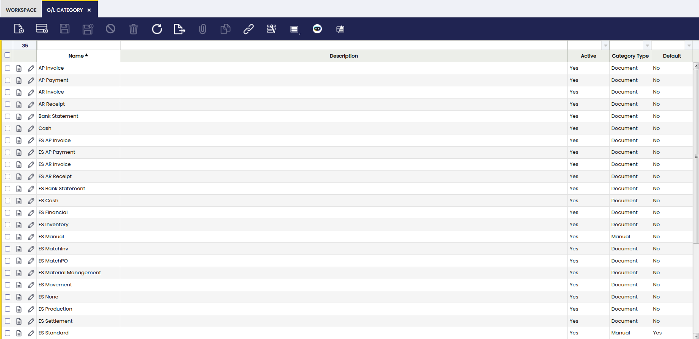
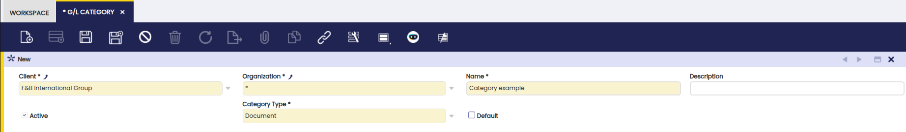
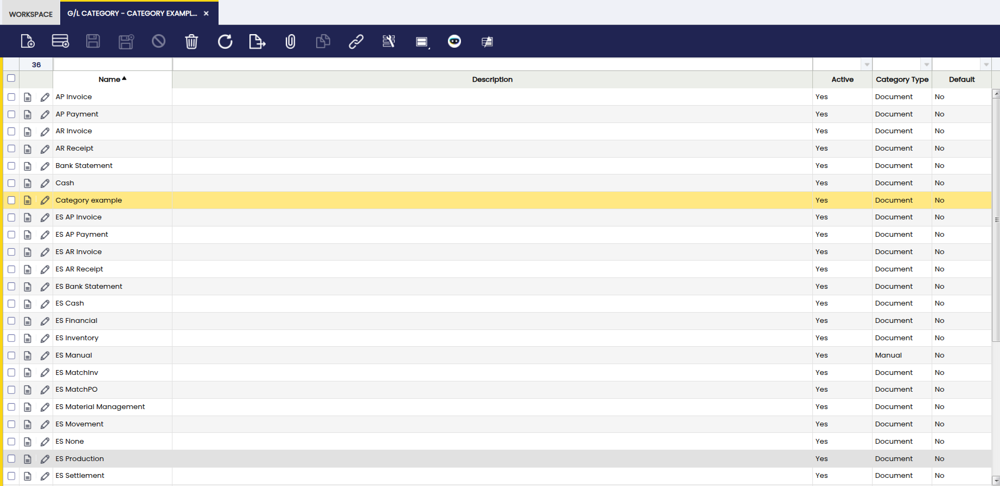

# G/L Category

:material-menu: `Application` > `Financial Management` > `Accounting` > `Setup` > `G/L Category`

## Overview

In this window, the user can **view, create, and manage G/L Categories used to classify accounting entries in the General Ledger**.

G/L (General Ledger) Categories act as **classification identifiers that are later assigned to** [Document Types](./document-type.md). Once a G/L Category is linked to a Document Type, **all accounting entries generated from that document are automatically categorized during posting**, ensuring consistent classification without manual intervention.

These categories can be applied to journals generated from documents, manually entered journals, or imported journals, and are mainly used for **reporting, analysis, and grouping ledger lines across different sources**.

The main purpose of the G/L Category window is to **define a controlled set of accounting classifications** that standardize how ledger entries are grouped and analyzed.

G/L Categories are typically created when:

- A new **Document Type** requires a distinct accounting classification.
- There is a need to **differentiate accounting entries** in financial reports (for example, separating operational journals from adjustment or closing entries).
- Imported or manually created journals must be **clearly identified by origin or business purpose**.

Once created, G/L Categories are assigned in the **Document Type** window. From that point on, every document posted using that Document Type will automatically apply the corresponding G/L Category to its accounting entries. Creating unnecessary or overly granular categories is discouraged, as categories are intended to represent **stable, high-level classifications** rather than transactional details.

## Header

Fields to note:

- **Client**: The client this category belongs to.
- **Organization**: The organization that will use the category.
- **Name**: A descriptive record identifier that is used as a default search option. It is up to 60 characters in length.
- **Description**: Additional information about the category.
- **Active**: A flag indicating whether this record is available for use or deactivated.

    !!!info
        It is possible to deactivate categories you no longer want users to pick; existing postings remain unchanged.

- **Category Type**: It indicates the source of the journal for this category. Journals can be generated from a document, entered manually or imported.
- **Default**: When checked, this category is selected by default for new records that use this category. This option speeds up data entry when necessary.

## Example

Select the create new option, fill in the corresponding fields and save it.

The created category is available to use in journal entries, imports, and document processing.

---
This work is a derivative of [G/L Category](https://wiki.openbravo.com/wiki/G/L_Category){target="\_blank"} by [Openbravo Wiki](http://wiki.openbravo.com/wiki/Welcome_to_Openbravo){target="\_blank"}, used under [CC BY-SA 2.5 ES](https://creativecommons.org/licenses/by-sa/2.5/es/){target="\_blank"}. This work is licensed under [CC BY-SA 2.5](https://creativecommons.org/licenses/by-sa/2.5/){target="\_blank"} by [Etendo](https://etendo.software){target="\_blank"}.