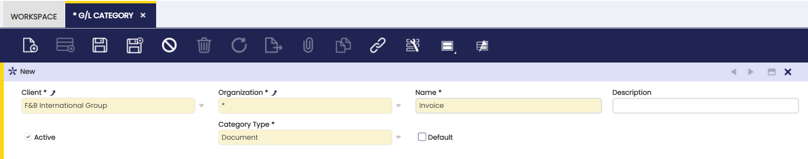
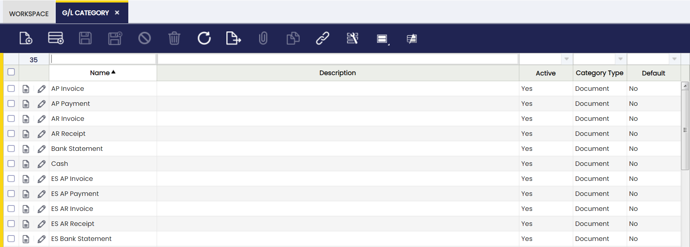

# G/L Category

:material-menu: `Application` > `Financial Management` > `Accounting` > `Setup` > `G/L Category`

In this window, the user can define G/L Categories to be used in the General Ledger.

The G/L Category Tab defines optional identifiers for a document or journal. Each Category may be used on a document, import or manual journal. 

The fields to note are:
- G/L Category: A classification used to group lines in the general ledger.
- Client: Client for this installation.
- Organization: Organizational entity within client
- Name: A non-unique identifier for a record/document often used as a search tool.
- Description : A space to write additional related information.**
- Active: A flag indicating whether this record is available for use or deactivated.
- Category Type: Source of the Journal with this category
- Document Category: A classification of document types that are shown and processed in the same window.
- Default: A value that is shown whenever a record is created.

Once the needed information is complete, the categories are defined as in the following example: 

---

This work is a derivative of [G/L Category](https://wiki.openbravo.com/wiki/G/L_Category){target="\_blank"} by [Openbravo Wiki](http://wiki.openbravo.com/wiki/Welcome_to_Openbravo){target="\_blank"}, used under [CC BY-SA 2.5 ES](https://creativecommons.org/licenses/by-sa/2.5/es/){target="\_blank"}. This work is licensed under [CC BY-SA 2.5](https://creativecommons.org/licenses/by-sa/2.5/){target="\_blank"} by [Etendo](https://etendo.software){target="\_blank"}.