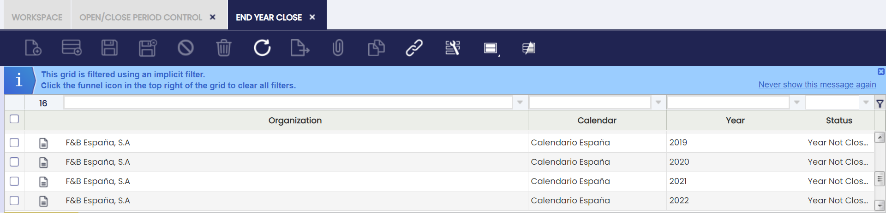
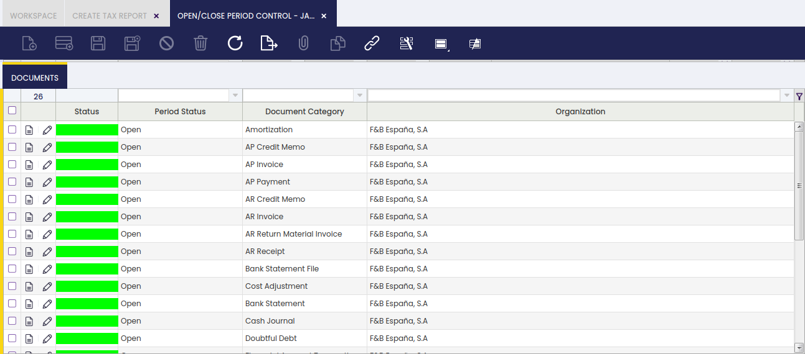

# Open/Close Period Control

:material-menu: `Application` > `Financial Management` > `Accounting` > `Setup` > `Open/Close Period Control`

## Overview

The **Open/Close Period Control** feature allows the user to manage which accounting periods are open or closed for a certain organization.

Before using this window, ensure that:

- [x] Your organization has a **[Fiscal Calendar](#fiscal-calendar)** defined.
- [x] The fiscal calendar contains **Years** and **Periods** (typically monthly).
- [x] The organization's type is **Legal with Accounting** and has **[Allow Period Control](../../../general-setup/enterprise-model/organization.md#organization-1)** enabled.

Here’s how the process works in Etendo:

1. **Create years and periods** in the [Fiscal Calendar](#fiscal-calendar) window.
2. **Open all periods** (including the "13th Period" for adjustments) in the Open/Close Period Control window.
3. **Close standard periods** (except the 13th Period) once all transactions for those periods are posted.

    !!!note
        Closing standard periods before running [Close Year](../../accounting/transactions.md#end-year-close) process is recommended for better monitoring but not required.

4. **Post any final adjustments** in the 13th Period using G/L Journals.
5. **Run the [Close Year](../../accounting/transactions.md#end-year-close) process** in the End Year Close window. This creates closing entries and permanently closes all periods for the year.  

    !!!warning
        Permanently closed periods can’t be reopened unless you run Undo Close Year first.

6. If needed, **run [Undo Close Year](../../accounting/transactions.md#undo-close-year)** to reopen periods and allow further changes. After making changes, you can run Close Year again.

!!!important
    - You can’t create years or periods in the Open/Close Period Control window—use the Fiscal Calendar window for that.
    - You can’t generate closing entries here—use the End Year Close window.
    - You can also check the status of any period in the [Period Control](../../../general-setup/enterprise-model/organization.md#period-control) tab of the Organization.

### Why Use this Feature?

Using period control helps the user:

- Track financial activity by controlling which periods are open for posting.
- Prevent unwanted changes to closed periods.
- Manage closing entries during year-end processes.

## Period Control

The **Open/Close Period Control** window allows the user to revise and manage all accounting periods created in the [Fiscal Calendar](#fiscal-calendar). You can **open**, **close**, or **permanently close** periods as needed for your organization.

**Fields to note:**

- **Status:** Shown in two columns—one with a color code, one with the status name. Statuses include:
    - *All Never Opened* (gray): Newly created periods.
    - *All Opened* (green): All document types are open.
    - *All Closed* (red): All document types are closed.
    - *Mixed* (orange): Some document types are open, others are closed.
    - *All Permanently Closed* (red): All document types are permanently closed.
- **Calendar:** Shows the organization’s calendar (read-only).
- **Organization**
- **Year**
- **Period No.**
- **Name:** Name of the period.
- **Starting Date:** When the period begins.
- **Ending Date:** When the period ends.

You can use these fields to filter and find the periods you need. For example, filter by calendar, organization, and year to see all periods for a specific year.

**Default Filters:** 

By default, this window only shows periods that:

- Are **not** closed.
- Belong to the organization you’re logged into.

    !!!info
        Remember you can remove these filters by clicking the funnel icon.

**Available Buttons:**

- **Open Period:** Allows posting in the period(s).
- **Close Period:** Blocks posting in the period(s). You can reopen a closed period if needed.

    !!!info
        It is possible to select multiple records to open or close periods in bulk.

    !!!important 
        - Only periods for "Legal with Accounting" organizations with "Allow Period Control" enabled can be opened or closed. 
        - If a period is open for all document types except one (e.g., AP Invoice), you can post all transactions except for that document type in that period.

### Period Control Example

Here’s a simple example of how period control works:

An organization has created and opened all periods for three years, including the "13th Period" for adjustments.

With the setup shown above, you can post any document to any period within those years. If you try to post to a period that doesn’t exist (like December 2018, in this example), Etendo will show an error.

Imagine you want to close the year 2019. Before running the "Close Year" process, you should close all standard periods for 2019 (except the 13th Period) to prevent further postings. Here’s how:

1. Go to the **Open/Close Period Control** window.
2. Filter by Calendar, Organization, and Year (e.g., 2019) to show the corresponding periods.
3. You should see all 13 periods for the year.
4. Select all periods except the 13th Period.
5. Click **Close Period** and confirm.

After this, all standard periods for 2019 are closed. You can only:

- Post G/L Journals in the 13th Period.
- Post closing entries created by the Close Year process.

!!!important
    If you need to make changes in a closed period, you must reopen it, which is only possible if the year is not permanently closed; otherwise, run Undo Close Year first.

## Documents Tab

Each accounting period in Etendo can be opened or closed for all document types at once, or for specific document types.

- When you open a period, all document types for that period are opened, so you can post any kind of transaction.
- You can also open or close individual document types (like AP Invoice or G/L Journal) within a period.

This is useful in case the user needs to prevent the creation of further documents of a certain type for a specific period.

**Status columns:**  
Each document type shows its status with a color and a name:

- **Never Opened** (gray): Not yet opened.
- **Open** (green): Posting is allowed.
- **Closed** (red): Posting is blocked.
- **Permanently Closed** (red): Locked; can only be reopened by undoing the year close.

!!!important
    - The 13th Period only allows G/L Journal entries.
    - If a period is open for all document types except one (for example, AP Invoice), you can post all transactions except for that type.

**How to open or close a document type in a period:**

1. Select a period in the Periods tab.
2. Go to the Documents tab to see all document types for that period.
3. Use filters to find the document types you want.
4. Select the document types.
5. Click **Open/Close Period**, choose the action, and click OK.

Etendo will confirm when the process is complete.

---

This work is a derivative of [Open/Close Period Control](https://wiki.openbravo.com/wiki/Open/Close_Period_Control){target="\_blank"} by [Openbravo Wiki](http://wiki.openbravo.com/wiki/Welcome_to_Openbravo){target="\_blank"}, used under [CC BY-SA 2.5 ES](https://creativecommons.org/licenses/by-sa/2.5/es/){target="\_blank"}. This work is licensed under [CC BY-SA 2.5](https://creativecommons.org/licenses/by-sa/2.5/){target="\_blank"} by [Etendo](https://etendo.software){target="\_blank"}.