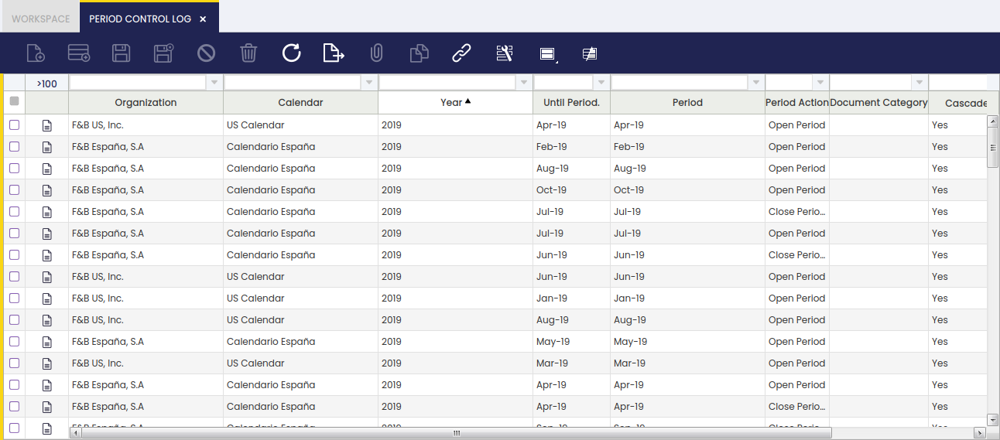

# Period Control Log

:material-menu: `Application` > `Financial Management` > `Accounting` > `Setup` > `Period Control Log`

## Overview

This window shows the log for period control.

The periods of a year can be opened, closed and permanently closed. The **Period Control Log** Window shows all the Openings and Closings of the Periods that had taken place in the application, therefore it can be used to understand how the Status of a Period has changed over time.

When a Period is Open or Closed through the Open/Close Period Control Window, or has been permanently Closed as a result of the closing of a Year through the End Year Close Window, a record is created in the Period Control Log.

For example, this screenshot shows the Period Control Log for an Organization that has opened all of its Periods for the Year 2019:

As shown in the image above, the main fields in this Window are:

-   Organization.
-   Calendar.
-   Year.
-   Period. The starting Period from which the Period Action is going to be performed (usually matches the Until Period)
-   Until Period. The ending Period to which the Period Action is going to be performed (usually matches the Period)
-   Period Action. The action that has taken place. It can be Open Period, Close Period or Permanently Close Period.
-   Document Category. If the Period Action has been done only for Document Type, it will be shown here. This means that the Period Action has affected only the shown Document Type for that Period, not all the other Document Types, which remains in the same status as before.

---

This work is a derivative of [Period Control Log](https://wiki.openbravo.com/wiki/Period_Control_Log){target="\_blank"} by [Openbravo Wiki](http://wiki.openbravo.com/wiki/Welcome_to_Openbravo){target="\_blank"}, used under [CC BY-SA 2.5 ES](https://creativecommons.org/licenses/by-sa/2.5/es/){target="\_blank"}. This work is licensed under [CC BY-SA 2.5](https://creativecommons.org/licenses/by-sa/2.5/){target="\_blank"} by [Etendo](https://etendo.software){target="\_blank"}.