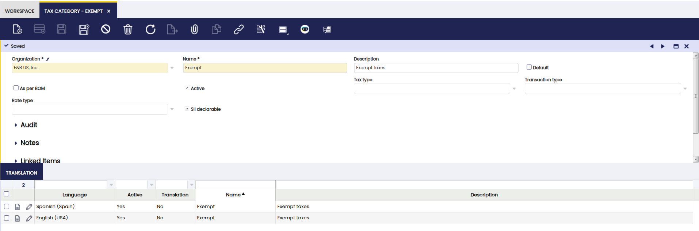

# Tax Category

:material-menu: `Application` > `Financial Management` > `Accounting` > `Setup` > `Tax Category`

## Overview

A Tax Category is used to group products or services that share the same **tax treatment**. Since not all items have the same tax rate (standard, reduced, or exempt), tax categories help organize these differences and ensure taxes are applied automatically and correctly during transactions.

Each product or service must be assigned to one tax category, and [tax rates](../setup/tax-rate.md) are also linked to categories. When a transaction is created, Etendo only considers the tax rates associated with the selected category, reducing manual intervention and preventing errors.

Additional factors, such as the [Business Partner tax category](../setup/business-partner-tax-category.md) and tax rate configuration, help the system determine the **final applicable tax**.

### Header

It is possible to create as many tax categories as required to be later on linked to the corresponding tax rates and products. The Header defines the main information of the tax category.

Fields to note:

- **Name**: A name to identify the tax category.
- **Description of the Tax Category**: Optional explanation of its purpose or usage. Once created, the tax categories must be assigned to the corresponding products and services in the [Product](../../../master-data-management/master-data.md#product) window.
- **Default**: This checkbox indicates if this record will be used as a default value.
- **As per BOM**: When enabled, taxes are calculated proportionally based on the product’s Bill of Materials (BOM). This requires a single summary-level tax rate.

    !!!info
        If the tax category is flagged as **As per BOM**, it indicates that products with this category will use the products included in its Bill of Materials list to calculate proportionally the taxes. In this case, only **one Tax Rate** has to be configured for this tax category flagged as **Summary level**.

### Line

Tax categories can be translated to any language required.

### Example

A company sells different types of items:

| Item Type   | Tax Rate | Tax Category |
|-------------|-----------|--------------|
| Electronics | 21%       | Standard VAT |
| Food        | 10%       | Reduced VAT  |
| Books       | 0%        | Exempt       |

- **Create** three tax categories: Standard VAT, Reduced VAT, and Exempt.

- **Assign** each tax rate to its corresponding category.

- **Assign** products to the appropriate category.

When a product is added to an invoice, Etendo automatically selects the correct tax rate based on its tax category, ensuring accurate and consistent tax calculation. This structure helps centralize tax logic and simplifies tax maintenance across the system.

---

This work is a derivative of [Tax Category](https://wiki.openbravo.com/wiki/Tax_Category){target="\_blank"} by [Openbravo Wiki](http://wiki.openbravo.com/wiki/Welcome_to_Openbravo){target="\_blank"}, used under [CC BY-SA 2.5 ES](https://creativecommons.org/licenses/by-sa/2.5/es/){target="\_blank"}. This work is licensed under [CC BY-SA 2.5](https://creativecommons.org/licenses/by-sa/2.5/){target="\_blank"} by [Etendo](https://etendo.software){target="\_blank"}.