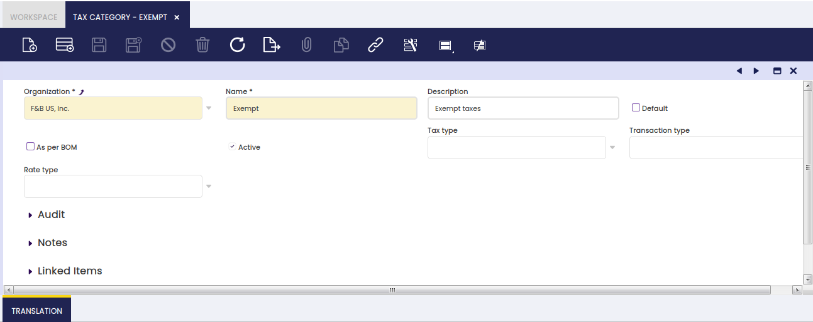

# Tax Category

:material-menu: `Application` > `Financial Management` > `Accounting` > `Setup` > `Tax Category`

## Overview

A tax category allows the user to group and manage similar product or services tax rates.

Not all the products and services have the same tax rate.

There are tax-exempt products and there are products or services to which a higher tax rate applies just due to the type of product or service.

Tax categories allow the user to group similar tax rates by having into account that:

-   the same tax category can be assigned to more than one product or service, by taking into account that it is recommended to split the tax categories by item type.
-   every product and service must be linked to one tax category same as each tax rate.  
    Therefore when that product or service is entered in an invoice only the tax rate/s which belong to that tax category will be used to get the applicable tax rate.
-   there are other variables which can reduce up to just "one" the correct tax rate to use while entering a product and a business partner in an invoice.  
    Those variables are related to the business partner tax category as well as the way each tax rate is configured.

### Tax Category

It is possible to create as many tax categories as required to be later on linked to the corresponding tax rates and products.

As shown in the image above, a tax category can be created by just entering:

-   a *Name*
-   and a *Description*

of the Tax Category.

Once created, the tax categories must be assigned to the corresponding products and services in the Product window.

If the tax category is flagged as *As per BOM*, it indicates that products with this category will use the products included in its Bill of Materials list to calculate proportionally the taxes. In this case, only one Tax\_Rate has to be configured for this tax category flagged as *Summary level*.

### Translation

Tax categories can be translated to any language required.

---

This work is a derivative of [Tax Category](https://wiki.openbravo.com/wiki/Tax_Category){target="\_blank"} by [Openbravo Wiki](http://wiki.openbravo.com/wiki/Welcome_to_Openbravo){target="\_blank"}, used under [CC BY-SA 2.5 ES](https://creativecommons.org/licenses/by-sa/2.5/es/){target="\_blank"}. This work is licensed under [CC BY-SA 2.5](https://creativecommons.org/licenses/by-sa/2.5/){target="\_blank"} by [Etendo](https://etendo.software){target="\_blank"}.