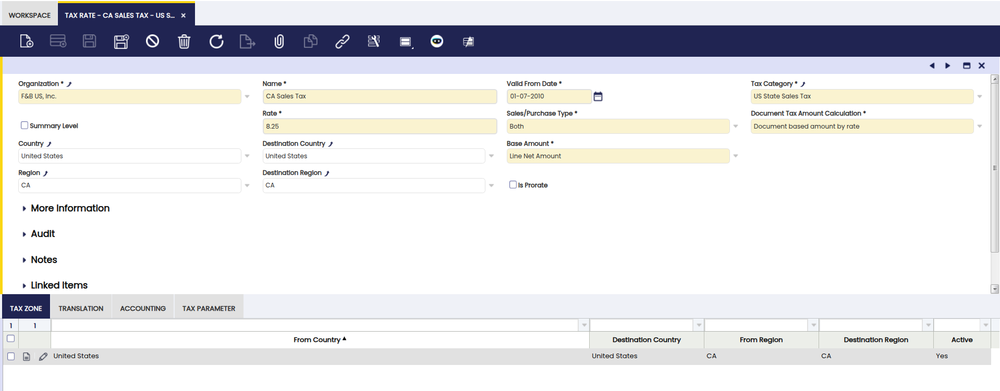
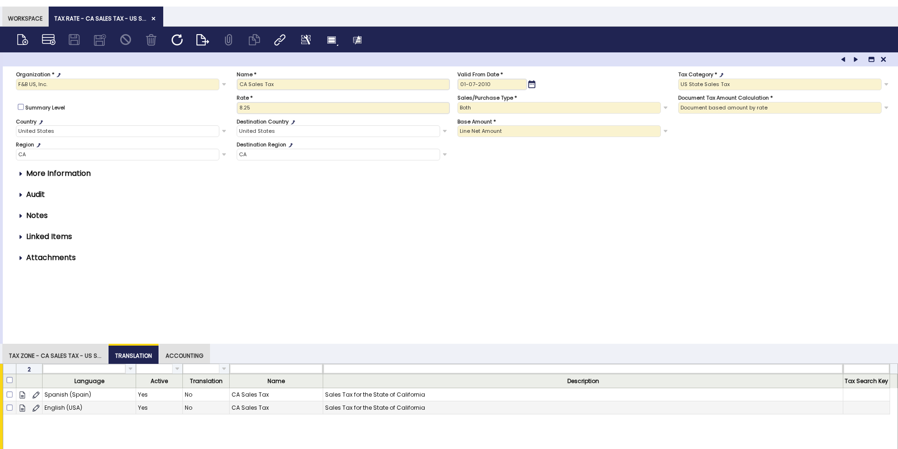
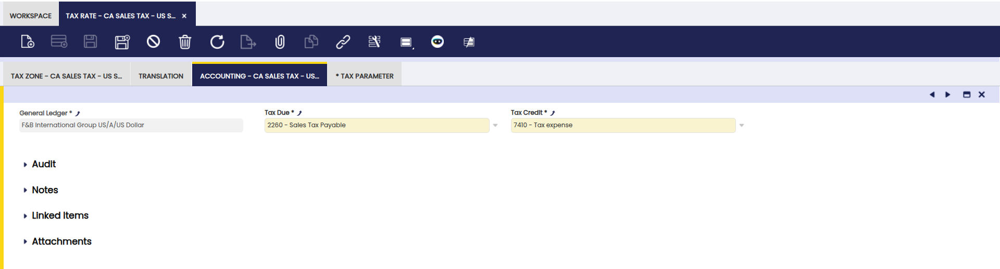

# Tax Rate

:material-menu: `Application` > `Financial Management` > `Accounting` > `Setup` > `Tax Rate`

## Overview

The Tax Rate window is where you define the taxes that Etendo applies automatically to your sales and purchase documents — such as orders and invoices. Each tax rate specifies the percentage to charge, which transactions it applies to, and how the tax amount is calculated and recorded in your accounts. Configuring tax rates correctly ensures that every document carries the right tax without manual work, and that your company meets its tax reporting obligations.

A tax rate is determined by a combination of configuration elements, including:

- **[Tax Category](../setup/tax-category.md)**
- **Percentage rate**
- **Sales/Purchase type**
- **[Business Partner Tax Category](../setup/business-partner-tax-category.md)**
- **Geographic origin and destination (Tax Zone)**
- **Special tax behaviors**: Withholding (a tax deducted at source before payment), Tax Exempt (no tax applies), Cash VAT (tax settled on payment rather than invoice date), Deductible (the company can recover the tax), and Not Deductible (the tax is treated as an expense).

When these parameters are properly configured, Etendo automatically assigns the correct tax to each transaction line based on predefined rules.

Taxes are first **associated to document lines**, then the actual tax amounts are calculated when the document is **processed**, ensuring accounting accuracy.

Some transactions require two separate taxes at the same time — for example, VAT and an income-tax withholding on a service invoice. Etendo handles this through summary taxes: you create one parent tax that groups the individual taxes underneath it. When you select the parent tax on a document line, Etendo automatically applies and calculates each underlying tax separately. This means you only have to choose one tax per line, even when two taxes apply.

## Obtaining Default Tax

When you add a product to an order or invoice, Etendo automatically selects the tax for that line. Understanding how this selection works helps you explain why a specific tax appeared on a document, or why no tax was found. The system checks the following conditions in order and stops at the first match:

1. **Project tax (sales only):** If the sales order was generated from a Project, the system uses the tax rate defined on the project line.
2. **Tax-exempt business partner (sales only):** If the business partner is marked as tax exempt, the system selects the most recently dated tax rate flagged as exempt, relative to the order or invoice date.
3. **Tax category match:** The system selects a tax from those defined in the same tax category as the product on the line.
4. **Business partner tax category:** If the tax rate is linked to a specific business partner tax category, it only applies to business partners assigned to that same category (as vendor or customer). Tax rates without a business partner tax category can apply to any partner. When both exist, the one with a matching business partner tax category takes priority.
5. **Geographic proximity (Tax Zone):** The system evaluates the origin and destination locations. Tax rates defined for more specific regions take priority over broader ones (for example, a region-level tax is selected over a country-level tax). This information is configured in the **Tax Zone** tab.
6. **Sales/Purchase type:** The system filters tax rates based on whether they are defined as Sales, Purchases, or Both.

If Etendo cannot find a tax that matches all applicable conditions, no tax is assigned to the line. This usually means a required tax rate has not been created yet or is missing a required configuration (for example, a Tax Zone entry or a Business Partner Tax Category link).

!!!note
    There is one additional filter that applies only to Orders and Invoices: Cash VAT. Cash VAT is a tax regime in which a company settles its VAT obligation when the invoice is actually paid, rather than when it is issued. Etendo marks each document automatically based on whether the organization and business partner use this regime. When a document is flagged as Cash VAT, the system selects only tax rates configured for Cash VAT; when it is not flagged, the system selects only standard (non-Cash-VAT) tax rates. This flag can be changed manually on the document header if needed.

Once the tax is selected (either the default or one chosen by the user), the system calculates an approximate tax amount on the document line. If the tax is defined as **summary**, this preliminary calculation uses the parent rate rather than expanding the child rates. The actual tax amount is calculated when the document is **processed**.

Tax lines on invoices follow one of two behaviors:

- **Recalculate (default):** The tax line is linked to an invoice line. When the invoice is processed, the system recalculates the tax amount based on the line data. Any manual edits to a recalculated tax line are overwritten during processing.
- **No Recalculate:** The tax line is manually entered in the invoice's Tax tab and is not linked to any invoice line. When the invoice is processed, the system keeps the manually entered amount as-is. This flag is set automatically when a tax is created manually (and cannot be changed afterward).

!!!info
    **No Recalculate** is useful for invoices that include tax amounts without a corresponding product line. For example, when importing goods, there is typically one tax-exempt invoice for the products and a separate invoice from the customs broker that contains only a tax amount (such as customs duty) without any product lines.

When a document is processed, the system calculates the final tax amounts from the selected taxes (unless they are defined as **No Recalculate** on invoices) following these steps:

1. All preliminary tax amounts shown before processing are cleared, as they are approximate and may be inaccurate.
2. For each distinct tax applied to the document lines, the system creates a tax entry and calculates the amount based on the base amounts of the associated lines (each line has only one tax).
3. For taxes defined as **summary**, the system expands the parent into its child tax rates and calculates each child amount separately, taking into account whether the children are configured as cascade.

## Header

The Header defines the main characteristics and behavior of the tax rate.

Fields to Note: 

- **Valid From Date**: Date when the tax becomes effective.

    !!! warning
        If a tax rate changes (for example, the government raises the VAT rate), do not edit the existing tax rate. Create a new tax rate with the updated percentage and a new Valid From Date. This preserves the original rate on past documents and ensures the new rate is applied from the effective date onward.

- **Tax Category**: Every tax rate must be linked to a given [tax category](../setup/tax-category.md) as the way of grouping similar tax rates.
- **Rate (%)**: Percentage applied to the tax base.
- **Sales/Purchase Type**: The way to distinguish between sales and purchase taxes. The tax type is another variable which Etendo takes into account while retrieving the correct tax rate in either sales and purchase transactions and it is also a very valuable variable to take into account while reporting taxes as there are tax reports which require to submit purchase and sales tax information separately.

    !!!info
        There is an additional option which is **Both**, this option allows that the **same tax rate** is used for both purchase and sales transactions.

- **Document Tax Amount Calculation**: The way how the tax amount is going to be calculated per each tax rate (or %). 
    The options available are:
    - **Document based amount by rate**: Etendo adds up all the taxable amounts on the document that share the same tax rate, and then applies the percentage once to the total. This is the most common option. It can produce very small rounding differences (a few cents) compared to calculating line by line.
    - **Line base amount by rate**: Etendo calculates the tax separately for each document line and then adds the results together. Use this option when your tax authority or your customer requires the tax to be shown and rounded at the individual line level.

- **Country/Region** and **Destination Country/Region**: Taxes such as VAT and US Sales Tax take into account where a transaction originates and where it is destined in order to determine whether the tax applies.
    These two fields allow to enter that information by taking into account if the tax is a **purchase** or a **sales** tax type, therefore when issuing a sales invoice from F&B US Inc (USA Country and New York Region) to a customer also located in Destination Country USA and Destination Region New York, only the sales tax rates created within that specified Tax Zone would be applied.

- **Base Amount**: The tax base amount to take into account in the tax amount calculation. The options available are:
    - **Line Net Amount**
    - **Line Net Amount + Tax Amount**
    - **Alternate Tax Base Amount**
    - **Alternate Tax Base Amount + Tax Amount**

- **Summary Level**: A tax rate can be defined as summary which means it will have **some tax rates underneath**.
    Summary tax rates are also set as **Parent Tax Rate** therefore its child tax rates can be linked to it. For instance, a sales invoice is issued to a business partner under a specific VAT regime which includes an additional tax rate besides the VAT rate.
    For this scenario, it is required to create three tax rates the parent one as summary and two more ones for the VAT rate and for the other rate, both of them linked to the parent.

    !!!info
        It is important to remark that when issuing the sales invoice for that business partner the tax rate shown/selected is the summary or parent one.

Under **More Information** section, there are also few relevant fields:

-   **Parent Tax Rate**: tax rates belonging to a summary tax rate should be linked to them in this field therefore the tax rate tree is properly structured.
-   **Business Partner Tax Category**: a tax rate can be linked to a specific business partner tax category, therefore it will only apply to the business partners belonging to that category.
-   **Withholding**: a tax rate can be set as **Withholding** therefore it is properly managed as a separated tax type in the fiscal reports.
    -   Withholding tax rates are **negative** tax rates.
-   **Tax Exempt**: a tax rate can be set as exempt therefore it is the one automatically shown in the order/invoice lines created for a given Customer set as tax-exempt as well.
-   **Cash VAT**: this kind of tax rates are used to support the Cash VAT regime, which allows companies to settle the VAT amount when they have collected/paid the invoices instead of in the invoice creation. 

    !!!note
        When using cash VAT tax rates, the Tax Due and Tax Credit Transitory accounts must be declared into the Accounting tab.

-   Tax rates can also be setup as **Not Taxable**. A not taxable tax rate can be linked to transactions subject to tax which become not taxable under a given situation. There are fiscal reports which require information about both type of taxes, exempt and not taxable.
-   **Deductible**: The organization can recover the tax amount. The VAT is posted to a **Tax Credit** account and can be offset against tax liabilities.
-   **Not Deductible**: The organization cannot recover the tax amount. The VAT is treated as an additional expense and is posted to the **Product Expense** account instead of Tax Credit.

The way **Deductible and Not Deductible** tax rates behave in terms of accounting is explained below:

-   Purchase invoice which includes a **deductible** tax amount. The VAT amount is posted to a Tax Credit account:

|     |     |     |     |
| --- | --- | --- | --- |
| Account | Debit | Credit | Comments |
| Product Expense | Line Net Amount |     | One per invoice line |
| Tax Credit | Tax Amount |     | One per tax line |
| Vendor Liability |     | Total Gross Amount | One per invoice |

-   Purchase invoice which includes a **not deductible** tax amount. The VAT amount cannot be posted to a Tax Credit account because it represents an expense:

|     |     |     |     |
| --- | --- | --- | --- |
| Account | Debit | Credit | Comments |
| Product Expense | Line Net Amount + Tax Amount |     | One per invoice line and tax rate |
| Vendor Liability |     | Total Gross Amount | One per invoice |

By default, the accounting amount that is generated in the supplier invoices when a non-deductible tax rate is used, is assigned to the accounting expense account configured in the **Accounting** tab of the product. In case the user needs to post the non-deductible tax amount to a specific account, the **Use the configured account** checkbox located within the Accounting tab in the Tax Rate window must be checked. In this case, the **Accounting Template Module** part of the Financial Extensions Bundle must be installed.

!!!info
    For more information, visit [Accounting Template Module user guide](../../../../optional-features/bundles/financial-extensions/accounting-template-module.md). 

### Tax Zone

Tax zone defines the origin country/region and destination country/region where a given tax rate applies, for those cases where it is not enough to define only one **Origin** Country/Region and only one **Destination** Country/Region at header level.

For instance, an **Export** tax rate must detail as Origin Country/Region the location of the warehouse organization and as Destination Country/Region the rest of countries and regions where it is possible to export the goods. This tax rate applies to sales transactions where the seller is your own company (the origin) and the buyer is located in another country (the destination). The origin country and region in this tab must match the address configured for your legal entity in Etendo.

The same would apply to an **Import** tax rate, in this case Origin Country/Region would be all the countries from where goods can be imported and the Destination Country/Region would be the organization's own location.

### Translation

The Translation tab allows the user to translate the tax rate **Name**, **Description**, and **Tax Search Key** into any language enabled in the system. This ensures that tax rate information is displayed in the appropriate language when users operate Etendo in a locale other than the default.

Each row in the grid represents an available language. To translate a tax rate, select the corresponding language row and enter the translated values in the **Name** and **Description** fields. The **Translation** column indicates whether a manual translation has been provided for that language.

### Accounting

Accounting tab allows the user to configure the account to be used while posting tax rate transactions to the general ledger.

- **Tax Due** account is the account used while posting sales tax amounts.
- **Tax Credit** account is the account used while posting purchase tax amounts.

A purchase invoice posting looks like:

|     |     |     |     |
| --- | --- | --- | --- |
| Account | Debit | Credit | Comments |
| Product Expense | Line Net Amount |     | One per invoice line |
| Tax Credit | Tax Amount |     | One per tax line. For Cash VAT regime the *Tax Credit Transitory* account is used instead. |
| Vendor Liability |     | Total Gross Amount | One per invoice |

And a sales invoice posting looks like:

|     |     |     |     |
| --- | --- | --- | --- |
| Account | Debit | Credit | Comments |
| Customer Receivable | Total Gross Amount |     | One per invoice |
| Product Revenue |     | Line Net Amount | One per Invoice Line |
| Tax Due |     | Tax Amount | One per Tax Line. For Cash VAT regime the *Tax Due Transitory* account is used instead. |

**Negative** Withholding tax rates need to have specific accounting information in this tab in order to get that withholding tax amounts are posted in a different account.

The accounting entries below apply when negative amounts are not permitted in your General Ledger configuration or in the AP Invoice document type (AP stands for Accounts Payable). In that case, a withholding amount — which is negative by nature — is automatically converted into a positive credit entry in the accounting records. If your system is configured to allow negative amounts, the withholding will be posted directly as a negative debit.

|     |     |     |     |
| --- | --- | --- | --- |
| Account | Debit | Credit | Comments |
| Product Expense | Line Net Amount |     | One per Invoice Line |
| Tax Credit | Tax Amount |     | One per tax line. For Cash VAT regime the *Tax Credit Transitory* account is used instead. |
| Tax Credit |     | Withholding Amount | One per withholding line |
| Vendor Liability |     | Total Gross Amount | (Line Net Amount+Tax Amount-Withholding Amount) |

## Examples

- **Simple tax rate**
    - Example: *Purchase VAT 18%*.
    - Use case: local purchase of goods subject to standard VAT.
    - Typical settings: Tax Category = **Normal VAT for Products**; Rate = **18%**; Origin = **Spain**; Destination = **Spain**.
    - Behaviour: when applied to a purchase invoice, VAT posts to the configured **Tax Credit** account.

- **Summary tax rate (combined tax + withholding)**
    - Example: *Service VAT 18% + Withholding 15%*.
    - Use case: a service invoice where both VAT and an income-tax withholding apply.
    - How to set it up:
        - Create a **Parent** tax rate of type **Summary** and assign it to the tax category **Normal VAT for Services** and to the appropriate **Business Partner Tax Category**.
        - Add two **child** tax rates under the parent (both must use the same tax and partner categories). For each child tax rate, open its record and set the **Parent Tax Rate** field (found under the More Information section of the Header tab) to point to the parent tax rate you just created. This is what links the child to the parent and builds the summary structure.
            - *Service VAT* — Rate: **18%** (positive).
            - *Withholding (Income Tax)* — Rate: **-15%** (negative withholding).
    - Behaviour: select the parent (summary) tax on the document line; during processing, the system uses the children to calculate and post the separate tax and withholding amounts.
    
    !!!note
        Withholding rates typically post to a different account — configure the child tax accounting accordingly.

---

This work is a derivative of [Tax Rate](https://wiki.openbravo.com/wiki/Tax_Rate){target="\_blank"} by [Openbravo Wiki](http://wiki.openbravo.com/wiki/Welcome_to_Openbravo){target="\_blank"}, used under [CC BY-SA 2.5 ES](https://creativecommons.org/licenses/by-sa/2.5/es/){target="\_blank"}. This work is licensed under [CC BY-SA 2.5](https://creativecommons.org/licenses/by-sa/2.5/){target="\_blank"} by [Etendo](https://etendo.software){target="\_blank"}.