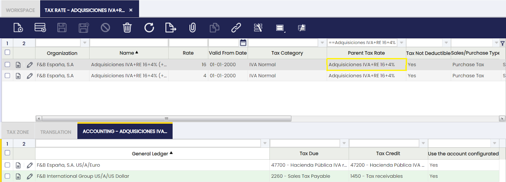
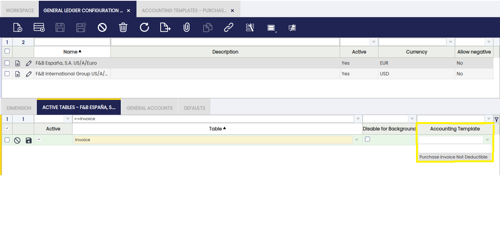

# Tax Rate

:material-menu: `Application` > `Financial Management` > `Accounting` > `Setup` > `Tax Rate`

## Overview

Each tax rate in Etendo is a combination of different variables such as the tax category, the rate and the business partner tax category among others. If all those variables are properly set up, the correct tax rate is automatically filled in every business transaction.

It is possible to create *tax rates* which are a *combination* of more than one tax rate. That scenario can apply to a business partner who is subject to VAT and Income tax at the same time while renting an office to a third party out of its "normal" business activities.

### Applying Taxes

Taxes are applied to orders and invoices. In this process, there are two steps: associate the desired tax to the line and process the document that will apply the tax and calculate the actual amount.

### Obtaining Default Tax

When in a document line (order or invoice) a product is selected, a default tax is associated to this line. Keep in mind that we can select the tax we want for this line. The selection of the default tax is achieved by the C\_GetTax DB stored procedure. The rules followed by this procedure are as follows:

For sale transactions with an associated project, if a project has a tax rate, this tax rate is taken. This works when an order is generated by a Project (Order). In this case, the tax is taken directly from the project line tax. For sale transactions, if a partner is marked as tax-exempt, the selected tax will be the one checked as exempt with the most recent date relative to the ordered or invoiced date.

Otherwise, the tax is selected from the ones defined in the same tax category as the product on the line. Taxes with defined business partner tax category can only be applied to those business partners with the same tax category (for vendor or customer). If the tax does not have a business partner tax category, it can be applied to any partner (with or without an associated tax category). If a tax with business partner tax category and another one without it can both be applied, the one with business partner tax category will be selected. In addition to this, the “to” and “from” locations are taken into account. At first, those taxes defined for closer regions are selected (if a tax is for region and another one for country, the region one will be selected). This information is associated to the tax rate, through the “Tax Zone” tab. Taxes are applied taking into account if they are defined as Sales, Purchases or Both.

Apart from these rules, and only in the case of Purchase/Sales Orders and Invoices, the system filters the tax rates taking into account the Cash VAT flag defined at the document's header too, which is automatically set based on the organization's and the business partner's configuration for sales and purchase documents respectively (although it can be manually overridden afterwards). Thus, in case the document is enabled for the Cash VAT regime, the system will get a Cash VAT tax rate and the other way around.

Once the tax is selected (the default one, or another one selected by the user), an approximated amount is calculated by the SL\_Order\_Tax or SL\_Invoice\_Tax callouts. If the tax is checked as summary, the calculation will be done using the rate defined in the parent, not exploding it and taking the real values from its children. In addition, information c\_order\_tax and c\_invoice\_tax tables are populated with taxes at this point. The actual amount is calculated when the document is processed.

When creating a new invoice, it is possible to write down taxes manually and check them as “no recalculate”. In this case, the tax is applied with the amount written down in the tax tab of the invoice, so no recalculation will be done while processing the invoice. When a tax in an invoice is marked as recalculated, if the tax is edited manually all changes will be lost when processing the invoice. This is because the tax amount of the invoice is recalculated. “No recalculate” taxes are not associated to any invoice line, whereas the recalculated ones are. So when a tax comes from a line, it will be checked as recalculate. If it is manually created, it will not be checked, and this value will be not updatable.

Not recalculating taxes is useful for invoices that include tax lines without a product. For example, it can be used for imported products: these products usually have an invoice that is tax-exempt and another invoice that is created by the custom broker without any product, but a tax amount for the imported products.

### Calculating actual amount

When these documents are processed (c\_order\_post and c\_invoice\_post), the actual taxes and amounts are calculated from the selected taxes (unless they are defined as “no recalculate” for invoices) following these steps:

Every tax at C\_OrderTax or C\_InvoiceTax tables is deleted. This is done because the taxes in these tables before the process of the document are for information only and can be inaccurate.

A new line is created in C\_OrderTax or C\_InvoiceTax tables for every different tax applied to the lines of the document (each line will have only one tax). The amount paid to the tax is calculated from the base amount of the lines that are associated to this tax.

For taxes defined as summary, a new line is inserted for each of its children and the amount is calculated taking into account whether or not the children are cascade.

### Tax

Tax rate window allows the user to create as many tax rates as required.

The fields to fill in to properly set up a tax rate are:

-   **"Valid From Date"**, which is the date when a tax rate becomes valid.  
    For instance, an existing tax rate increases its rate, in this case:
    -   it is recommended to create a new tax rate configured with the new requirements, rather than changing the original tax rate which can be still in use if required.  
        That way, there will be two tax rates which are exactly the same for a given organization but the rate (%) and the valid from date.
-   **"Tax Category"**, as every tax rate must be linked to a given tax category as the way of grouping similar tax rates.
-   **"Rate"**, which is the % or rate of the tax
-   **"Sales/Purchase Type"** as the way to distinguish between sales and purchase taxes.  
    The tax type is another variable which Etendo takes into account while retrieving the correct tax rate in either sales and purchase transactions. It is also a very valuable variable to take into account while reporting taxes as there are tax reports which require to submit purchase and sales tax information separately.  
    There is an additional option which is "Both", this option allows using the same tax rate for both purchase and sales transactions.
-   **"Country/Region"** and **"Destination Country/Region"**.  
    Tax such as *VAT* and *US Sales Tax* take into account from where/to where a transaction takes place in order to get it subject to the tax or not.  
    These two fields allow the user to enter that information by taking into account if the tax is a "purchase" or a "sales" tax type, therefore, when issuing a sales invoice from F&B US Inc (USA Country and New York Region) to a customer also located in Destination Country USA and Destination Region New York, only the sales tax rates created within that specified Tax Zone would be applied.
-   **"Summary Level"**, a tax rate can be defined as summary which means it will have some tax rates underneath.  
    Summary tax rates are also set as "*Parent Tax Rate*" therefore its child tax rates can be linked to it.  
    For instance, a sales invoice is issued to a business partner under a specific VAT regime which includes an additional tax rate besides the VAT rate.  
    For this scenario, it is required to create three tax rates, the parent one as summary, and two more for the VAT rate and for the other rate, both of them linked to the parent.  
    *"It is important to remark that when issuing the sales invoice for that business partner, **the tax rate shown/selected is the summary** or parent one."*
-   **"Base Amount"**, which is the tax base amount to take into account in the tax amount calculation. The options available are:
    -   Line Net Amount
    -   Line Net Amount + Tax Amount
    -   Alternate Tax Base Amount
    -   Alternate Tax Base Amount + Tax Amount
-   **"Document Tax Amount Calculation"** which is the way how the tax amount is going to be calculated per each tax rate (or %). The options available are:
    -   "Document based amount by rate", this option implies that the tax amount is going to be calculated as tax amount = (tax base amounts sum at the same rate \* tax rate)
    -   "Line base amount by rate", this option implies that the tax amount is going to be calculated by line as tax amount = (tax base amount line 1 \* tax rate) + (tax base amount line 2 \* tax rate) + ....+ (tax base amount line n + tax rate).

Under "More Information" section, there are also few relevant fields:

-   **"Parent Tax Rate"**, tax rates belonging to a summary tax rate should be linked to them in this field therefore the tax rate tree is properly structured.
-   **"Business Partner Tax Category"**, a tax rate can be linked to a specific business partner tax category, therefore it will only apply to the business partners belonging to that category.
-   **"Withholding"**, a tax rate can be set as "Withholding" therefore it is properly managed as a separated tax type in the fiscal reports.
    -   Withholding tax rates are "*negative*" tax rates.
-   **Tax Exempt**. A tax rate can be set as exempt therefore it is the one automatically shown in the order/invoice lines created for a given Customer set as tax-exempt as well.
-   **Cash VAT**. This kind of tax rates are used to support the Cash VAT regime, which allows companies to settle the VAT amount when they have collected/paid the invoices instead of in the invoice creation. When using cash VAT tax rates, the Tax Due and Tax Credit Transitory accounts must be declared into the Accounting tab.
-   Tax rates can also be setup as **"Not Taxable"**. A not taxable tax rate can be linked to transactions subject to tax which become not taxable under a given situation. There are fiscal reports which require information about both type of taxes, exempt and not taxable.
-   Specific tax rates can be setup as **"Deductible"** (for those Organizations for which tax deduction is NOT allowed).
-   Specific tax rates can be setup as **"Not Deductible"** (for those Organizations for which tax deduction is allowed).

The way Deductible and Not Deductible tax rates behave in terms of accounting is explained below:

-   Purchase invoice which includes a 100% deductible tax amount.  
    The VAT amount needs to be posted to the ledger in a Tax Credit account, therefore purchase invoice posting looks like:

|     |     |     |     |
| --- | --- | --- | --- |
| Account | Debit | Credit | Comments |
| Product Expense | Line Net Amount |     | One per invoice line |
| Tax Credit | Tax Amount |     | One per tax line |
| Vendor Liability |     | Total Gross Amount | One per invoice |

## Purchase invoice which includes NOT deductible tax amount

The VAT amount can not be posted to the ledger in a Tax Credit account as it means an expense, therefore purchase invoice posting looks like:

|     |     |     |     |
| --- | --- | --- | --- |
| Account | Debit | Credit | Comments |
| Product Expense | Line Net Amount + Tax Amount |     | One per invoice line and tax rate |
| Vendor Liability |     | Total Gross Amount | One per invoice |

!!! info
    To be able to use the functionality described below, the Financial Extensions Bundle must be installed. To do so, follow the instructions in marketplace: [Financial Extensions Bundle](https://marketplace.etendo.cloud/#/product-details?module=9876ABEF90CC4ABABFC399544AC14558){target="_blank"}. For more information about the available versions, core compatibility and new features, visit [Financial Extensions - Release notes](../../../../../../whats-new/release-notes/etendo-classic/bundles/financial-extensions/release-notes.md).   

The same behavior can be applied for the non-deductible tax. 

By default, the accounting amount that is generated in the supplier invoices when a non-deductible tax range is used, is assigned to the accounting expense account configured in the "Accounting" tab of the product. With this improvement, the amount of that non-deductible tax can be assigned to a specific account, the one configured in the accounting of the tax range itself. To do this, check the "Use the configured account" checkbox located inside the "Accounting" tab in the "Tax rate" window. 

As system administrator user, activate the accounting template field in the Active Table tab of the General Ledger Configuration window and then, set the template called Purchase Invoice Not Deductible. 

This checkbox, "Use the configured account", will only be visible if the checkbox under the heading "Non-deductible tax" was previously checked. The default value of this checkbox will be NO.

The VAT amount needs to be posted to the ledger in a Tax Credit account, therefore purchase invoice posting looks like:

|     |     |     |     |
| --- | --- | --- | --- |
| Account | Debit | Credit | Comments |
| Product Expense | Line Net Amount |     | One per invoice line |
| Tax Credit | Tax Amount |     | One per tax line |
| Vendor Liability |     | Total Gross Amount | One per invoice |

Tax rates examples:

-   **Simple tax rate**
    -   *"Purchase VAT Tax Rate at 18%"* belonging to the tax category "Normal VAT for Products", Country/Region set to Spain and Destination Country/Region set to Spain.
-   **Summary tax rate**
    -   "Service Sales VAT Tax Rate at 18.00% + Withholding (-15.00%)" belonging to the tax category "Normal VAT for Services" and to the business partner tax category "Business Partners subject to VAT and Income Tax".  
        This one must be setup as Summary type having two tax rates underneath which must belong to the same tax category and business partner tax category:
        -   "Service Sales VAT Tax Rate at 18.00% + Withholding (-15.00%) (VAT 18%)", rate = 18,00
        -   "Service Sales VAT Tax Rate at 18.00% + Withholding (-15.00%)" (W -15%)", rate = -15,00

### **Tax Zone**

Tax zone defines the origin country/region and destination country/region where a given tax rate applies, for those cases where it is not enough to define only one "Origin" Country/Region and only one "Destination" Country/Region at header level.

For instance, an "Export" tax rate must detail as Origin Country/Region the location of the warehouse organization and as Destination Country/Region the rest of countries and regions where it is possible to export the goods. This tax rate would apply to sales transactions between the "local" organization and its customers located abroad.

The same would apply to an "Import" tax rate, in this case Origin Country/Region would be all the country from where goods can be imported and the Destination Country/Region would be Organization one.

### **Translation**

Tax rates can be translated to any language required.

### **Accounting**

Accounting tab allows the user to configure the account to be used while posting tax rate transactions to the general ledger.

-   *"Tax Due"* account is the account used while posting sales tax amounts
-   *"Tax Credit"* account is the account used while posting purchase tax amounts.
-   *"Tax Due Transitory"* account is the transitory account used while posting sales tax amounts under the Cash VAT regime.
-   *"Tax Credit Transitory"* account is the transitory account used while posting purchase tax amounts under the Cash VAT regime.

A purchase invoice posting looks like:

|     |     |     |     |
| --- | --- | --- | --- |
| Account | Debit | Credit | Comments |
| Product Expense | Line Net Amount |     | One per invoice line |
| Tax Credit | Tax Amount |     | One per tax line. For Cash VAT regime the *Tax Credit Transitory* account is used instead. |
| Vendor Liability |     | Total Gross Amount | One per invoice |

And a sales invoice posting looks like:

|     |     |     |     |
| --- | --- | --- | --- |
| Account | Debit | Credit | Comments |
| Customer Receivable | Total Gross Amount |     | One per invoice |
| Product Revenue |     | Line Net Amount | One per Invoice Line |
| Tax Due |     | Tax Amount | One per Tax Line. For Cash VAT regime the *Tax Due Transitory* account is used instead. |

"Negative" Withholding tax rates need to have specific accounting information in this tab in order to get that withholding tax amounts are posted in a different account.

Below posting applies in the case that the "Allow Negative" feature is not enabled either for the General Ledger configuration used while posting or for the Document Type which in this case is an "AP Invoice"

In other words, a negative withholding posting means a negative debit posting which will turn into a positive credit posting if a negative feature is not enabled.

|     |     |     |     |
| --- | --- | --- | --- |
| Account | Debit | Credit | Comments |
| Product Expense | Line Net Amount |     | One per Invoice Line |
| Tax Credit | Tax Amount |     | One per tax line. For Cash VAT regime the *Tax Credit Transitory* account is used instead. |
| Tax Credit |     | Withholding Amount | One per withholding line |
| Vendor Liability |     | Total Gross Amount | (Line Net Amount+Tax Amount-Withholding Amount) |

---

This work is a derivative of [Tax Rate](https://wiki.openbravo.com/wiki/Tax_Rate){target="\_blank"} by [Openbravo Wiki](http://wiki.openbravo.com/wiki/Welcome_to_Openbravo){target="\_blank"}, used under [CC BY-SA 2.5 ES](https://creativecommons.org/licenses/by-sa/2.5/es/){target="\_blank"}. This work is licensed under [CC BY-SA 2.5](https://creativecommons.org/licenses/by-sa/2.5/){target="\_blank"} by [Etendo](https://etendo.software){target="\_blank"}.