## Overview

This section describes the windows related to the accounting transactions that are part of the Financial Management in Etendo. The corresponding windows are:

[:material-file-document-outline: Financial Type Configuration](#financial-type-configuration){ .md-button .md-button--primary }  

[:material-file-document-outline: Simple G/L Journal](#simple-gl-journal){ .md-button .md-button--primary }  

[:material-file-document-outline: G/L Journal](#gl-journal){ .md-button .md-button--primary }  

[:material-file-document-outline: End Year Close](#end-year-close){ .md-button .md-button--primary }  

[:material-file-document-outline: GL Posting by DB Tables ](#gl-posting-by-db-tables){ .md-button .md-button--primary }  

[:material-file-document-outline: Budget](#budget){ .md-button .md-button--primary }  

[:material-file-document-outline: Create Budget Reports in Excel](#create-budget-reports-in-excel){ .md-button .md-button--primary }  

[:material-file-document-outline: Not Posted Transaction Report](#not-posted-transaction-report){ .md-button .md-button--primary }  

[:material-file-document-outline: Reset Accounting](#reset-accounting){ .md-button .md-button--primary }  

[:material-file-document-outline: VAT Regularization](#vat-regularization){ .md-button .md-button--primary }  

## Financial Type Configuration

:material-menu: `Application` > `Financial Management` > `Accounting` > `Transactions` > `Financial Type Configuration`

### Overview

This feature allows entering in the system all the financings the company has. It is possible  to exploit the information through the bank pool report. 
Depending on the financial product used in this new **Financing** window, Etendo generates financing plans automatically (Leasing, Renting and Loans) and also manages the invoices and payments from this same window. 

The usual financing products are: 

- Invoice Advance
- Bank Guarantee 
- Confirming
- Foreign Trade
- Credit Account
- Factoring
- Leasing
- Loans
- Renting 
- Credit Cards. 

These financing methods are loaded into the system using a dataset.

!!! info
    For more information, visit [Financial Type](../../financial-management/accounting/setup.md#financial-type).

### Header
The main header has the following fields:

- **Organization**: drop-down list of organizations.    
- **Financial Type**: drop-down list of methods  Invoice Advance, Bank Guarantee, Confirming, Foreign Trade, Credit Account, Factoring, Leasing, Loans, Renting and Credit Cards.   
- **Financial Bank/Entity**: drop-down list of the business partner window.  
- **Financial Account**: drop-down list of the Financial Account window.    
- **Payment Method**: drop-down list of the payment methods indicated in the selected financial account.    
- **Name**: free field to add information.  
- **Date**: date field (contract signature date).   
- **Due Date**: date field. 
- **Lack (Month)**: numeric field (Integers)    
- **Currency**: drop-down list of the currency window.   
- **Amount Granted**: numeric field with 2 decimals.    
- **Amount Drawn**: numeric field with 2 decimals.  
- **Amount Available**: numeric field with 2 decimals.  
- **Residual Value**: numeric field with 2 decimals.    
- **Installment No**: integer numeric field.    
- **% Annual Interest**: % numeric field with 2 decimals.   
- **Periodic commission**: numeric field with 2 decimals.   
- **Opening Financial Expenses**: numeric field with 2 decimals.    
- **Frequency**: drop-down list (Monthly, Bimonthly, Quarterly, Quarterly, Semiannual, Annual)  
- **Payment Date**: numeric field. Integer (limit of 31)    
- **Purpose**: free field to add information.   
- **Warranty**: free field to add information.  
- **% Early Cancellation Fee**: % numeric field with 2 decimals.    
- **% Early Amortization Commission**: % numeric field with 2 decimals. 
- **Ledger account at long term**: informative field to indicate the accounting account of the  account tree.   
- **Ledger account at short term**: informative field to indicate the accounting account of the account tree.   
- **Ledger account at purchase option**: informative field to indicate the accounting account of the account tree.  
- **Project**: drop-down list of the “Multiphase Project“ window.   
- **Cost Center**: drop-down list of the “Cost Center” window.

### Lines
 
Lines contain the following fields:
 
- **Installment No**: numeric field. Integer. 
- **Amortization/ Expiration date**: date field.
- **Installment**: numeric field with 2 decimals.
- **Amortization/Renting**: numeric field with 2 decimals.
- **Interest**: numeric field with 2 decimals.
- **Commission**: numeric field with 2 decimals.
- **Total Amortization**: numeric field with 2 decimals.
- **Pending Amortization**: numeric field with 2 decimals.
- **Invoice**: the linkage to the generated invoice is shown (Leasing/Renting).
- **Payment**: the linkage to the generated payment is shown (Loan). 
- **Business Partner Finance**: business partners ‘ drop-down list (this is used as an informative field to know about advance invoices, Confirming, Comex, how much has each been financed).
- **Date**: date field. 
- **Project:** drop-down list of the “Multiphase Project“ window.
- **Cost Center**: drop-down list of the “Cost Center” window.
 

 
### Accounting 
 
 There are three sections: “Amortization/Renting”, “Interest” and “Commission”. There are six fields in total where three of them represent the product and the other three, the accounting concept. The 2 fields (product and accounting concept) cannot be filled in the same section. In each of these related fields, the product must be indicated from the **Products** window or **Accounting Concept** if the **Available in Financial Invoices** check box needed to assign to each column is activated. In the case of the type of financing **Loan**, it is obligatory to fill in the part of accounting concepts.
 
 
 

### Loan, Leasing or Renting calculation in the lines tab

Fill the necessary fields of the header according to the description of each of them indicated at the top of the document. Such information allows the automatic creation of the finance plan, which is created by clicking the “Update Finance plan” button at the upper right margin of the window.
 
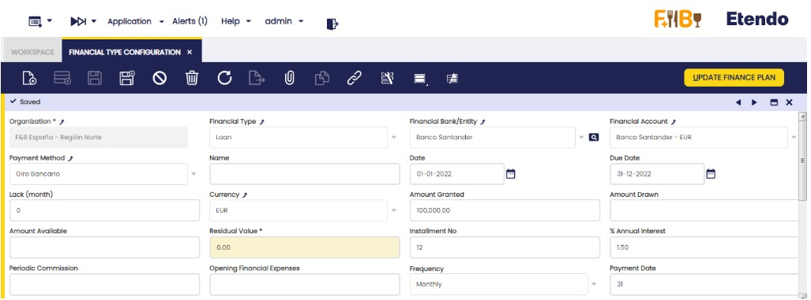
 
#### Loan: 
- **Installment No**: It starts with the installment number 0 and the “pending amortization” field has the value indicated in the “granted amount” field, and the “date” field has the indicated date in the header field “date”. The rest of the installments are correlative, adding 1 by 1.
- **Amortization/Expiration date**: To see the date of the installment number 1 of the finance plan, it is indicated when clicking the new button “Create finance plan”. A pop up is shown to indicate the date. Click “OK”. The rest of the lines are created with the frequency indicated in the “Frequency” field, with the date of the last installment created and the date indicated in the “payment date” field. If lack is indicated, the indicated date when clicking “Create finance plan” is the first lack installment, the rest of the installments, lack and amortization ones, are created according to the indicated frequency. The lack installments are indicated with the installment number 0.
- **Installment**: At first, the same installment is calculated for the entire loan. If the interest rate changes during the loan period, the installment is changed. To do this, change the 1% interest rate of the header and click the new button of the header “Update Finance Plan”. The information is updated from the following line to the last line with an associated payment.
- **Amortization/Renting**: Redeemed amount in the installment.
- **Interest**: Interest to pay in the installment.
- **Commission**: filled with the information entered in the “Periodic Commission” field of the header, if any. If not, the value is 0.
- **Total Amortization**: Addition of the values in the previous column “amortization/renting” and regarding the same calculated line. Read-only field.
- **Pending amortization**: Difference between the “granted amount” indicated in the header and the “total amortization” of the same calculated line. Read-only field.
- **Payment**: The related payment is shown.
- **Business Partner**: If indicated in the header, the business partner is shown in this field. If not, it can be manually indicated.
- **Project**: If indicated in the header, the project information is shown in this field. If not, it can be manually indicated.
- **Cost Center**: If indicated in the header, the cost center is shown in this field. If not, it can be manually indicated.
 
 
 
 
 
#### Leasing:
- **Installment No**: It starts with the installment number 0 and the “pending amortization” field has the value indicated in the “granted amount” field, and the “date” field has the indicated date in the … The rest of the installments are correlative, adding 1 by 1.
- **Amortization/Expiration date**: To see the date of the installment number 1 of the finance plan, it is indicated when clicking the new button “Create finance plan”. A pop up is shown to indicate the date. Click “OK”. The rest of the lines are created with the frequency indicated in the “Frequency” field, with the date of the last installment created and the date indicated in the “payment date” field. If lack is indicated, the indicated date when clicking “Create finance plan” is the first lack installment, the rest of the installments lack and amortization ones, are created according to the indicated frequency. The lack installments are indicated with the installment number 0.
- **Installment**: At first, the same installment is calculated for the entire leasing. If the interest rate changes during the leasing period, the installment is changed. To do this, change the 1% interest rate of the header and click the new button of the header “Update Finance Plan”. The information is updated from the following line to the last line with an associated invoice. Lastly, one last line with the residual value is included, if any, in the same date of the last calculated line.
- **Amortization/Renting**: Redeemed amount in the installment.
- **Interest**: Interest to pay in the installment.
- **Commission**: filled with the information entered in the “Periodic Commission” field of the header, if any. If not, the value is 0.
-  **Total Amortization**: Addition of the values in the previous column “amortization/renting” and regarding the same calculated line. Read-only field.
- **Pending amortization**: Difference between the “granted amount” indicated in the header and the “total amortization” of the same calculated line. Read-only field.
- **Invoice**: The related invoice is shown.
- **Payment**: The related payment is shown.
- **Business Partner**: If indicated in the header, the business partner is shown in this field. If not, it can be manually indicated.
- **Project**: If indicated in the header, the project information is shown in this field. If not, it can be manually indicated.
- **Cost Center**: If indicated in the header, the cost center is shown in this field. If not, it can be manually indicated.
 
 
 
 
 
#### Renting
- **Installment No**: It starts with the installment number 0 and the rest of the installments are correlative, adding 1 by 1.
- **Amortization/Expiration date**: To see the date of the installment number 1 of the finance plan, it is indicated when clicking the new button “Create finance plan”. A pop up is shown to indicate the date. Click “OK”. The rest of the lines are created with the frequency indicated in the “Frequency” field, with the date of the last installment created and the date indicated in the “payment date” field.
- **Installment**: The result of the “Granted amount” divided the installments number.
- **Amortization/Renting**: Redeemed amount in the installment.
- **Interest**: Interest to pay in the installment.
- **Commission**: filled with the information entered in the “Periodic Commission” field of the header, if any. If not, the value is 0.
- **Invoice**: The related invoice is shown.
- **Business Partner**: If indicated in the header, the business partner is shown in this field. If not, it can be manually indicated.
- **Project**: If indicated in the header, the project information is shown in this field. If not, it can be manually indicated.
- **Cost Center**: If indicated in the header, the cost center is shown in this field. If not, it can be manually indicated.
 
 
 
 
 
##### Generating payments or invoices

Once the amortization plan is created, payments (loans) and invoices (leasing and renting) for each line can be generated. This is possible individually (line by line) or in groups (3 lines can be selected and 3 different payments/invoices are generated).
 
In order to do this, select the required line/s and click the “Create payment” (loans) or “Create invoice” (leasing or renting) buttons shown in the upper right margin of the window.
 
**Loan**:
 
 
 
**Leasing**:
 
 
 

 
**Renting**:

 

 
##### Credit account and credit cards reported in financial accounts.
 
The Credit account and Credit card information is automatically entered. To do this, create a new header and indicate the finance method, “Credit account” or “Credit card”. Then, the button “Add Financial Account” is enabled in the upper right margin. 
 

 
When clicking the button, a pop up is shown and it is possible to select a financial account (only those with the “Add to bank pool” flag checked are shown).
 

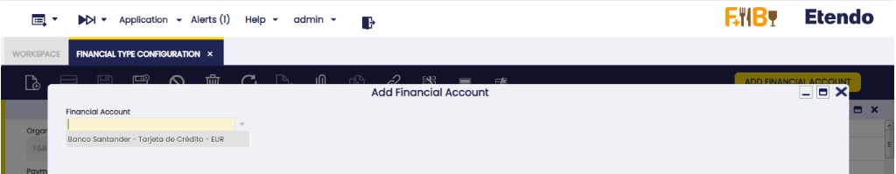

Once this credit account/credit card is created in the financings and its information has to be updated, click the “Update Financial Account” button in the upper right margin.
 

 
The fields to be copied from the account or credit card are the equivalent ones in the “Financial Account” field, the amount of residual value to be indicated in the “Amount Available” field and the “Credit Limit” amount to be indicated in the “Amount Granted” field. All other fields in the header are editable to include the rest of the information.

## Simple G/L Journal

:material-menu: `Application` > `Financial Management` > `Accounting` > `Transactions` > `Simple G/L Journal`

### Overview

In Etendo there is a GL Journal window that allows the user to manually enter GL journals in the system. This window has three tabs (Batch, Header and Lines) and in some cases this can be difficult for the user since it might be enough with just two levels (Header and lines). Another issue that this window has is that only accounting schemas can be selected, so when posting the GL journal there is only one entry in the fact\_Acct table.

##### Benefits of the Simple G/L Journal

-   It is a simpler window since it is not necessary to enter a batch. There is one less level of data entry.
-   It is simpler to search journal entries. Without the batch level, it is possible to directly search for specific journal entries.
-   In this window, it is possible to see journal entries that have been created using the GL Journal window, so it is possible to search journal entries as well.

### Header

A G/L journal header can include journals which can contain several journal lines.

Important field to note:

-   *Multi-general ledger*: A flag
    -   If it is not marked, the General ledger field is shown from then on.
    -   If it is marked, the system will not show the General ledger field, and it will not be taken into account for next operations.

### Lines

The lines tab allows the user to enter the journal entries of a G/L journal as well as G/L item payment related information.

One field to note:

-   G/L Item: Combo where all G/L Items are shown. It has a logical display, and it is only shown when **Multi-general ledger** is flagged in the header.

!!! info
    If **Multi-general ledger** is not flagged, then the Account field is shown instead.

#### Accounting

Accounting information related to the GL Journal

When Posting the Header:

-   All accounting entries are created either with account combinations (Account) or GL item. There cannot be mixed lines.
-   If **Multi-General Ledger** is:
    -   Not marked: It can only select accounts that belong to just one accounting schema (defined in the header) so when posting the document there will be just one journal entry. This behaviour will not change. Posting process exactly as GL Journal window
    -   Marked: the user selects G/L Items and since it can have different valid combinations when posting the document, it will have as many entries as in different accounts it is defined the GL item and the organization defined in the header.

#### Exchange Rates

The exchange rate tab allows the user to enter an exchange rate between the organization's general ledger currency and the currency of the G/L Journal to be used while posting the G/L Journal to the ledger.

!!! info
    This tab will only be displayed when Multi General Ledger is enabled.

### GL Journal Reverse 

!!! info
    To be able to include this functionality, the Financial Extensions Bundle must be installed. To do that, follow the instructions from the marketplace: [Financial Extensions Bundle](https://marketplace.etendo.cloud/#/product-details?module=9876ABEF90CC4ABABFC399544AC14558){target="\_blank"}. For more information about the available versions, core compatibility and new features, visit [Financial Extensions - Release notes](../../../../../whats-new/release-notes/etendo-classic/bundles/financial-extensions/release-notes.md).

This functionality is specifically useful for companies that have a month close, instead of an end year close, but with pending payments (in or out). It allows the user to open or close the period without taking into account the payments until they are made.

In order to use this functionality, in both “GL journal” and “Simple GL journal” windows, the user can click the button “Reverse Journal” in the toolbar when selecting an entry.

In this way, Etendo automatically creates a reverse entry that compensates the amount in the credit and debit columns. 
> 
!!! info
    It is important to note that, by default, the reverse document will be created as a draft. That is why Etendo shows the check “process document” when clicking the “Reverse Journal” button. In this way, the user can complete the document.

As seen below, Etendo shows a success notification in green with the new GL Journal number.

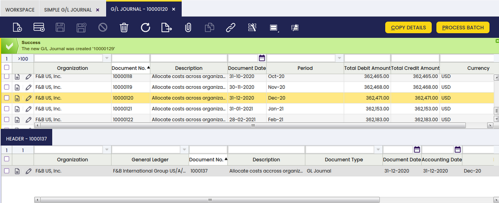

When comparing the original GL Journal to the reverse GL Journal, the debit and credit columns show the compensation, since the amounts are reversed.

##### Original GL journal

##### Reverse GL Journal

#### Changing description option in the Simple GL Journal window

If the GL Journal entry is created in the Simple GL Journal window, it is possible for the user to change the description of the GL journal, once it clicks on the “Reverse Journal” button, in the corresponding pop up window. 
 

This is useful to distinguish between the original GL journal and the reverse one. 

### Bulk Posting

!!! info
    To be able to include this functionality, the Financial Extensions Bundle must be installed. To do that, follow the instructions from the marketplace: [Financial Extensions Bundle](https://marketplace.etendo.cloud/#/product-details?module=9876ABEF90CC4ABABFC399544AC14558){target="\_blank"}. For more information about the available versions, core compatibility and new features, visit [Financial Extensions - Release notes](../../../../../whats-new/release-notes/etendo-classic/bundles/financial-extensions/release-notes.md).

The Bulk Posting functionality allows the user to post or unpost multiple records by selecting the corresponding records and clicking the **Bulk posting** button.

Also, the Accounting Status of the record/s is shown in the status bar, in form view, or in a column, in grid view.
>
!!! info
    For more information, visit [the Bulk Posting module user guide](../../../../../user-guide/etendo-classic/optional-features/bundles/financial-extensions/bulk-posting.md).

### G/L Journal Clone

!!! info
    To be able to include this functionality, the Financial Extensions Bundle must be installed. To do that, follow the instructions from the marketplace: [Financial Extensions Bundle](https://marketplace.etendo.cloud/#/product-details?module=9876ABEF90CC4ABABFC399544AC14558){target="_blank"}. For more information about the available versions, core compatibility and new features, visit [Financial Extensions - Release notes](../../../../../whats-new/release-notes/etendo-classic/bundles/financial-extensions/release-notes.md).

With this functionality, the user is able to seamlessly clone a selected entry. This feature not only duplicates the entry but also creates a detailed description that includes the original order number.

In order to do this, select the record to clone and click the copy record button in the toolbar.

In this way, a copy of the original record is generated, including a description and a copy number, as seen below.

This functionality enhances the efficiency of managing journal entries, making it easier to replicate and document transactions accurately.

## G/L Journal

:material-menu: `Application` > `Financial Management` > `Accounting` > `Transactions` > `G/L Journal`

### Overview

A G/L (General Ledger) journal allows the user to post journal entries to the ledger and create G/L item payments.

As already explained, most of the accounting entries are created while posting documents such as purchase invoices, sales invoices, etc.

The accounting entries which do not match with an existing Document Type need to be posted to the ledger by using a G/L Journal.

Besides, a G/L Journal can be used to create **G/L Item Payments** or payments not related to orders or invoices.

!!! info
    This feature is very useful while posting an employee payroll to the ledger as the payroll payment can be created at the same time.

Finally, a G/L Journal can also be configured as a **template**.

This feature allows the user to create the same journal entries as the ones contained in the G/L Journal set as a template.

This feature is also very useful while posting employee payroll, for instance.

#### Batch

A G/L journal batch allows the user to group G/L journals of similar characteristics which can all be processed at the same time.

As shown in the image above, a *G/L Journal batch* can contain below data:

-   the **accounting period**
-   the **accounting date**
-   and the **currency**

None of the data above is mandatory at this point because a G/L journal can contain several journals having different accounting periods and accounting dates. The same applies to the currency as a G/L journal can contain several journals of different general ledger configurations.

Once a batch is created and saved, it is possible to create as many G/L Journals as required, which once ready can be completed and processed at the same time as a **unique** batch.

A G/L journal and therefore its content can be set up as **Template**, that template can be later on used while creating a new G/L journal by using the process button **Copy Lines** as described in the next section.

##### G/L Journal set up as “Template”

As already mentioned, a G/L Journal and therefore its content can be configured as a **Template**. In order to do so,  it is required to follow the steps below:

**1.** **create a G/L journal** to account the employee payroll corresponding to the period of January 2022, for instance. That G/L Journal needs to be marked as **Template**.

**2.** Create a **new G/L journal** to account the employee payroll corresponding to the period of January 2022. Enter an **Accounting Date** and a **Period**:

**3.** Press the **Copy Details** process button.

A new window is shown containing all the templates available:

!!! info
    Note that it is possible to search for a template by using the G/L journal document number set as template and the description fields. 

**4.** **Select a template and click OK**. After that, Etendo populates the most recently created G/L Journal with the same journal entries, only the dates are different.

It may be necessary to change the journal entries amounts. In order to do so, it is possible to edit the G/L Journal Lines and then change the amounts.

The last step is to post the G/L Journal, therefore the corresponding journal entries are posted to the ledger.

### Header

A G/L journal header can include journals, which can contain several journal lines.

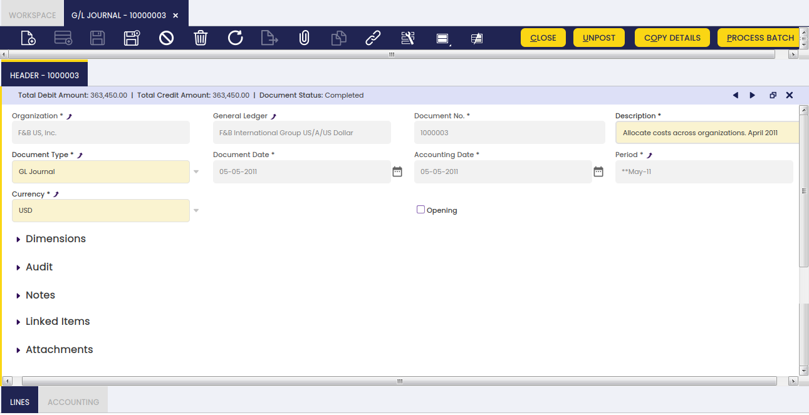

A G/L Journal header contains the following data:

-   The organization and the organization's General Ledger configuration which once selected defaulted the field **Currency** to the one of the general ledger configuration, for instance USD. The currency can however be changed to EUR for instance. Etendo will apply the corresponding EUR -> USD conversion rate as the posting to the ledger must be in USD.
-   The *document date* which does not have to be the same as the accounting date.  
    The document date is automatically populated with the current date by default, but can always be changed.
-   The *accounting period* and the *accounting date* within that period. These dates can be automatically populated with the values entered in the Journal batch if any, however these dates can always be changed.

There is a checkbox named ***Opening*** which can be flagged just to state that a journal contains **opening balance accounts entries.**

There is a **list of actions** which can be executed from the G/L Journal header:

-   **Copy Details** button allows the user to copy the journal entries of a journal configured as a ***Template*** into the current journal
-   **Complete** button allows the user to complete the G/L Journal once the corresponding journal lines have been entered whenever the total debit amount matches the total credit amount
-   **Post/Unpost** button allows the user to Post/Unpost a G/L Journal once completed
-   **Close** button allows the user to close a G/L Journal for which no other action needs to take place or to reactivate it if it is not already posted
-   **Process Batch** button completes the G/L Journal/s of the batch

!!! info
    Note that upon **G/L Journal completion a **G/L Item** payment** will be created for each journal line that has the **Open Items** checkbox selected as explained in the G/L Item payments creation section.

!!! info
    The Journal will be completed even if any of the Payment/s creation failed. In this case, an error message is shown indicating the Lines that tried to create a Payment but failed.

### Lines

The lines tab allows the user to enter the journal entries of a G/L journal as well as G/L item payment related information.

#### Accounting

Accounting information related to the GL Journal

### Deferred GL Journal 
#### Duplicate Journal Entries

!!! info
    To be able to include this functionality, the Financial Extensions Bundle must be installed. To do that, follow the instructions from the marketplace: [Financial Extensions Bundle](https://marketplace.etendo.cloud/#/product-details?module=9876ABEF90CC4ABABFC399544AC14558){target="\_blank"}. For more information about the available versions, core compatibility and new features, visit [Financial Extensions - Release notes](../../../../../whats-new/release-notes/etendo-classic/bundles/financial-extensions/release-notes.md).

<iframe width=**854** height=**480** src=**https://www.youtube.com/embed/K7XOBkmRLAQ** title=**YouTube video player** frameborder=**0** allow=**accelerometer; autoplay; clipboard-write; encrypted-media; gyroscope; picture-in-picture** allowfullscreen></iframe>

This functionality allows the user to duplicate a journal entry as many times as required, indicating the regularity and the period in which the first copy must be made. Starting from the second copy, the duplication will take place with the corresponding regularity.
The process to create a journal entry from the beginning and duplicate it later is shown below.

1- Enter the “G/L Journal” window and create a header:

2- Create a new record:

3- Create the lines (to be recorded) and complete the entry. Once these three steps are done, the “Create Deferred Plan” button will be shown in the upper right margin. 

4 - Click the button and a pop-up with three fields will be shown:
• Expense Plan Type: copies regularity.
    • Period Number: required number of copies.
    • Period: period in which the first copy will be made.

5 - Once this information is entered, click the “Done” button and as many records will be generated as the number of copies indicated.

By default, this functionality is only available for the “GL Journal” window, since the record copies are grouped under only one header. It is also possible to duplicate these entries in the “Simple GL Journal” only if there is a preference configured in the “Preference” window with the property “Display Create Deferred Plan Button” and the value “Y”.

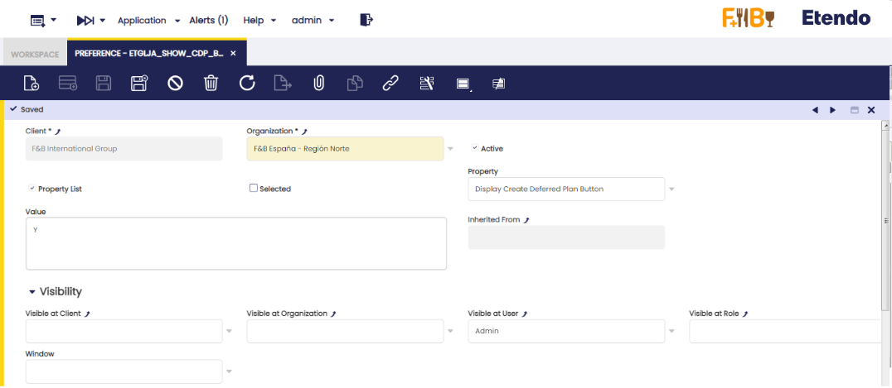

Once this preference is configured, the button will be enabled in “Simple GL Journal”. The flow is the same but the duplicated copies will not be created under a header. That is, this information will not be shown in the “GL Journal” window, except the information to be copied is already in it, in which case it will be shown.

### GL Journal Reverse 

!!! info
    To be able to include this functionality, the Financial Extensions Bundle must be installed. To do that, follow the instructions from the marketplace: [Financial Extensions Bundle](https://marketplace.etendo.cloud/#/product-details?module=9876ABEF90CC4ABABFC399544AC14558){target="\_blank"}. For more information about the available versions, core compatibility and new features, visit [Financial Extensions - Release notes](../../../../../whats-new/release-notes/etendo-classic/bundles/financial-extensions/release-notes.md).

This functionality is specifically useful for companies that have a month close, instead of an end year close, but with pending payments (in or out). It allows the user to open or close the period without taking into account the payments until they are made.

In order to use this functionality, in both “GL journal” and “Simple GL journal” windows, the user can click the button “Reverse Journal” in the toolbar when selecting an entry.

In this way, Etendo automatically creates a reverse entry that compensates the amount in the credit and debit columns. 
> 
!!! note
    By default, the reverse document is created as a draft. That is why Etendo shows the check “process document” when clicking the “Reverse Journal” button. In this way, the user can complete the document.

As seen below, Etendo shows a success notification in green with the new GL Journal number.

When comparing the original GL Journal to the reverse GL Journal, the debit and credit columns show the compensation, since the amounts are reverse.

##### Original GL journal

##### Reverse GL Journal

This is useful to distinguish between the original GL journal and the reverse one. 

### Bulk Posting

!!! info
    To be able to include this functionality, the Financial Extensions Bundle must be installed. To do that, follow the instructions from the marketplace: [Financial Extensions Bundle](https://marketplace.etendo.cloud/#/product-details?module=9876ABEF90CC4ABABFC399544AC14558){target="\_blank"}. For more information about the available versions, core compatibility and new features, visit [Financial Extensions - Release notes](../../../../../whats-new/release-notes/etendo-classic/bundles/financial-extensions/release-notes.md).

The Bulk Posting functionality allows the user to post or unpost multiple records by selecting the corresponding records and clicking the **Bulk posting** button.

Also, the Accounting Status of the record/s is shown in the status bar, in form view, or in a column, in grid view.
>
!!! info
    For more information, visit [the Bulk Posting module user guide](../../../../../user-guide/etendo-classic/optional-features/bundles/financial-extensions/bulk-posting.md).

## End Year Close

:material-menu: `Application` > `Financial Management` > `Accounting` > `Transactions` > `End Year Close`

### Overview

The **Close Year** process allows the user to close a fiscal year. This process also permanently closes all the periods of the year (standard ones and adjustment ones).

It is important to remark that it is not required to close the standard periods of a year prior to closing that year, however it can help to keep tracking of the periods of the year already reviewed and closed.

The close year process requires that the next year is started, and its first period is opened.

!!! info
    Once a year is closed, the status of that year and all its periods can be reviewed in the Open/Close Period Control window.

As already mentioned, all the periods of the year are now shown as **Period Status**=**Permanently Closed**, that means that it is not possible to post any transaction within that year anymore, unless the **Undo Close Year** process is run for that year.

**Close Year** process creates the following accounting entries:

1\. The **Profit and Loss Closing** entry.

-   This accounting entry resets all **Revenue** and **Expense** Account Types and the difference is posted in the Income Summary account.
    -   In other words, the **Expense** accounts are **Credited and the **Revenue** accounts are **Debited** and the difference, if any, is posted in the Income Summary account.  
        Let us take an expense account with a debit balance of 500,00. The P&L Closing entry creates a credit accounting entry of 500,00 in the Expense account of the example, therefore it gets a balance equal to zero.  
        If the revenue accounts total balance is higher than the expense accounts total balance that difference is credited in the Income Summary account, that means a positive result or a profit.  
        If the revenue accounts total balance is lower than the expense accounts total balance that difference is debited in the Income Summary account, that means a negative result or a loss.
-   This accounting entry is posted the last day of the last period of the year being closed, that is the **Adjustment Period** or **13th Period** of the year.
-   Etendo does not create a G/L Journal for this accounting entry but just the accounting entry.

2\. The **Closing** entry or **Balance Sheet Closing** entry.

-   This accounting entry credits all the accounts which have a debit balance and debits all the accounts which have a credit balance. The aim of this accounting entry is to get that Asset and Liability accounts get a zero balance.
    -   In order words, let us take an Asset account with a debit balance of 8.000,00. The closing entry creates a credit accounting entry of 8.000,00 in the Asset account of the example.
-   This account entry is posted the last day of the last period of the year being closed, that is the **Adjustment Period** or **13th Period** of the year.
-   Etendo does not create a G/L Journal for this accounting entry but just the accounting entry.
-   This entry is created only if the Reverse Permanent Account Balances checkbox is set to yes.

Finally, if a Retained Earnings account is specified for the general ledger configuration, an additional entry dated on the last day of the year is created.

This entry moves the Income Summary account balance to the **Retained Earnings** account.

3\. And the **Opening** or **Balance Sheet Opening** entry.

-   This accounting entry is the reversal entry of the closing entry.
    -   Following the example of point 2 above, the opening entry creates a debit accounting entry of 8.000,000 in the Asset account of the example. That amount is the opening balance of the asset account for the new year.
-   This accounting entry is posted the first day of the first period of the next year.
-   This entry is created only if the Reverse Permanent Account Balances checkbox is set to yes.

##### End-year close process example

This example describes the **2019 end-year closing** process of a sample legal with an accounting organization.

This article describes the end-year closing process intentionally keeping the organization's activity as simple as possible.

The company in this example started its activity prior to 2019, therefore a G/L Journal set as **Opening** can be created to record the 2019 opening entry and get it posted to the ledger.

To make it simple, the company in this example executed detailed **regular** activities which created the corresponding **regular** journal entries in the general ledger:

Let us imagine that **F&B España** closes the standard periods as soon as each period is over and that is done even for the last standard period which is **December 2019**.

The accountants can use the **13th Period** to post accounting adjustment to the ledger through the posting of G/L Journal/s, prior running the **Year Close** process.

Once 2019 is over and ready to be closed, the company in this example can execute the 2019 **Close Year** process from the End Year Close window.

The process button **Year Close** runs the end-year close process for this sample organization.

##### Reverse Permanent Account Balances set to **Yes**

Etendo creates **closing entries** detailed below if the **Reverse Permanent Account Balances** checkbox of the Organization's general ledger is set to **Yes** before running the **Close Year** process.

!!! info
    Note that below accounting entries can also be reviewed in the **End Year Close** window in the Accounting Tab.

-   Dated on the latest day of the year below **P&L Closing Entry**.  
    This entry resets all **Revenue** and **Expense** account which is posted in the account defined as Income Summary.  
    
 
-   Dated on the latest day of the year below **Closing Entry**.
    This entry resets all **Asset**, **Liability** and **Owner's Equity** accounts.x Besides, an additional entry is created to move the Income Summary account balance to the Retained Earning account:
    
 
-   Dated on the day of the following year (01-01-2022) below **Opening Entry**. This entry is the reversal entry of the above closing entry:
    
    The organization in this example can launch the 2020 Balance Sheet and the 2021 Profit and Loss reports from the Balance Sheet and P&L structure window:

2020 Balance Sheet:

2021 Profit and Loss:

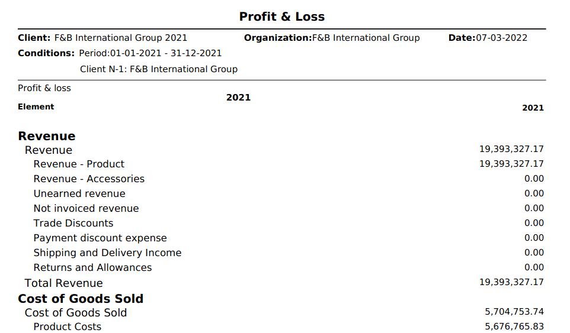

##### Reverse Permanent Account Balances set to **No**

Etendo creates below **closing** entries if the **Reverse Permanent Account Balances** checkbox of the Organization's general ledger is set to **No** before running the **Close Year** process.

!!! info
    Note that below accounting entries can also be reviewed in the **End Year Close** window in the Accounting Tab.

-   Dated on the latest day of the year (31-12-2019) below **P&L Closing Entry**:
 
     
-   and dated on the latest day of the year (31-12-2019) below entry as a Retained Earnings account is defined for the organization's general ledger:
 
     

The organization in this example can launch the 2019 Balance Sheet and the 2019 Income Statement reports from the Balance Sheet and P&L structure window. It will get the same Balance Sheet and Income Statement as the ones shown for the **Reverse Permanent Account Balances set to **Yes** scenario.

#### End Year Close

In the **End Year Close** window, all the Years previously created in the Fiscal Calendar window are shown. Those years can be closed in this window.

The records shown in this window are filtered by their **Status** and the **Organization**, by showing only the Years which are not closed yet and belongs to the Organization in which the User is logged. These filters can be removed by clicking in the funnel icon.

This window shows two Tabs. The first Tab shows all the existing Years. Once selected a record in this Tab, the lower tab shows the related Accounting entries, meaning the closing entries generated by the Close Year process as well as the corresponding opening entries of the next year.

This way, it is easier and quicker to see the Accounting generated when a Year is closed. More information can be found in the Accounting Tab below.

The way to Close a Year is:

-   Use the filters of the grid to show the Year to close.
-   Select the Year.
-   Click on the Year Close button and click OK.

Once done, Etendo informs that the process has been completed successfully.

All the Periods for that Year and that Organization will be permanently Closed. The way to Undo the Close of the Year is the same, but clicking Undo Close Year.

As shown in the image above, the main fields in this window are:

-   Organization.
-   Calendar.
-   Year.

#### Undo Close Year

If a year (i.e 2019) is closed, it will not be possible to do any posting within that year unless the **Undo Close Year** process is run for that year.

This process opens the year and all the periods of the year. It also reverts all the ledger entries posted by the end-year close process; therefore closing/opening entries are not shown in the Journal Entries Report anymore, unless the end-year close process is run once again for the year.

-   Status: It can be **Year Not Closed** or **Year Closed**

#### Accounting

In the **Accounting** Tab of the End Year Close Window, all the Accounting entries generated when a Year is Closed or when it is Opened are shown, grouped by Account. This Account entries can be:

-   Opening Entries
-   Income Statements
-   Closing Entries
-   Regular Entries
-   Divide Up

This way, it is easier to review the Accounting entries made in the Closing Year Process.

As shown in the image above, the main fields in this window are:

-   General Ledger.
-   Type. It can be an Opening Entry, Closing Entry, Income Statement, Regular Entry or Divide Up.
-   Account. Notice that **the account entries are grouped by Account**, showing only one record.
-   Debit.
-   Credit.

For explaining this Tab, it is better to follow the same example as in the Introduction section and show how this Tab presents the results.

##### Reverse Permanent Account Balances set to **Yes**

Etendo creates below **closing entries** if the **Reverse Permanent Account Balances** checkbox of the Organization's general ledger is set to **Yes**:

-   Dated on the latest day of the year (31-12-2019) below **P&L Closing Entry**.  
    This entry resets all **Revenue** and **Expense** accounts.
    
 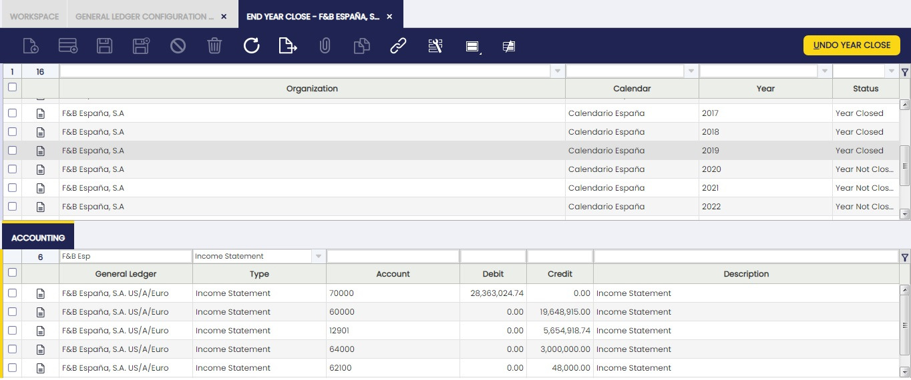
     
-   Dated on the latest day of the year (31-12-2019) below **Closing Entry**.  
    This entry resets all **Asset**, **Liability** and **Owner's Equity** accounts.
 
     
-   Dated on the day of the following year (01-01-2020) below **Opening Entry**.  
    This entry is the reversal entry of the above closing entry:
 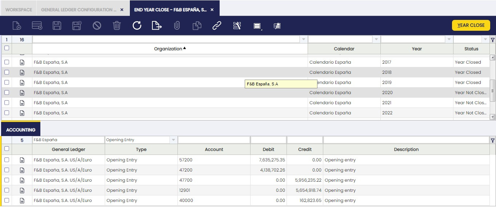
     

##### Reverse Permanent Account Balances set to **No**

Etendo creates below **closing** entries if the **Reverse Permanent Account Balances** checkbox of the Organization's general ledger is set to **No**:

-   Dated on the latest day of the year (31-12-2019) below **P&L Closing Entry**:
 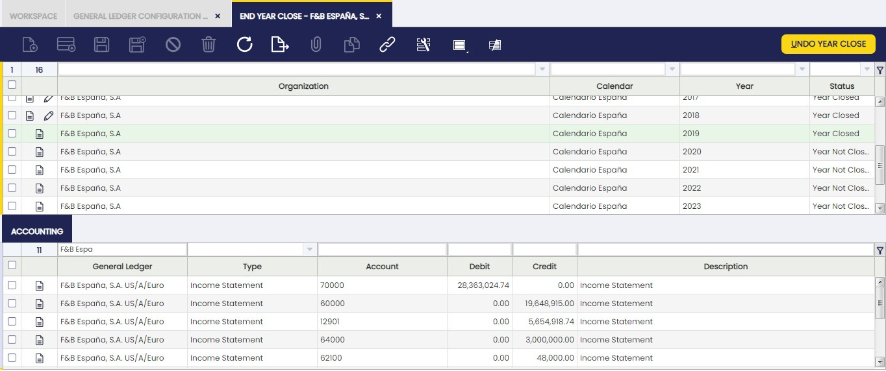
     
-   and dated on the latest day of the year (31-12-2019) below entry as a Retained Earnings account is defined for the organization's general ledger:
 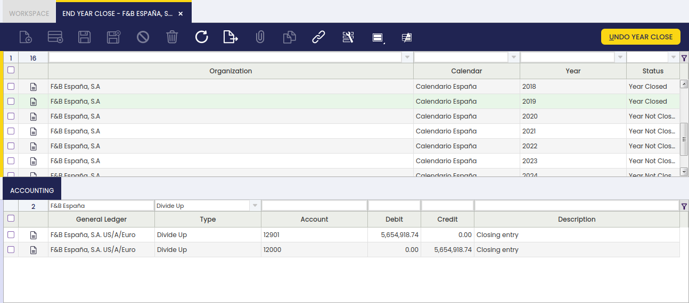

## GL Posting by DB Tables

:material-menu: `Application` > `Financial Management` > `Accounting` > `Transactions` > `GL Posting by DB Tables`

### Overview

The G/L Posting by DB Table allows the user to massively post the transactions related to a given transactional table or to all of them.

As shown in the image above, the **G/L Posting by DB Tables** feature allows the user to:

-   select an Organization or all of them if a particular organization is not selected
-   select a Table or all of them if a particular table is not selected.
-   and select a **From date** and **To date**, if no dates are selected all the transactions available will be posted.

After running the process, Etendo informs about the number of ledger entries posted to the ledger for each table in order to post once again the transactional table/s to the ledger.

This process can be launched whenever it is required:

-   It can be run if there are pending transactions to be massively posted whenever the Accounting Sever Process is not enabled or if it is not enabled for a given set of tables.
-   It can also be run after running the process Reset Accounting as a way of regenerate the ledger entries.

## Budget

:material-menu: `Application` > `Financial Management` > `Accounting` > `Transactions` > `Budget`

### Overview

Etendo creates and edits budgets to be used for informative purposes allowing the user to access the data about budget versus actual. 

### Header

These are the actions which can be executed from the header in order to create budgets for a selected year to be used for informative purposes: 
 
**Export Budget to Excel:**  exports budget to an Excel document.
**Copy Budget:** copy budget already created. 
**Check Export Actual Data:** when checked, actual quantities will be exported to Excel in addition to the budgeted quantities. 

### Lines

The user is able to add budget lines. Each line may refer to a specified period, business partner, product, etc.

## Create Budget Reports in Excel

:material-menu: `Application` > `Financial Management` > `Accounting` > `Transactions` > `Create Budget Reports in Excel`

By using the necessary filters such as business partner, product, partner group, product category, etc, the user is able to generate budget reports in Excel to be used for specific purposes.  

## Not Posted Transaction Report

:material-menu: `Application` > `Financial Management` > `Accounting` > `Transactions` > `Not Posted Transaction Report`

### Overview

Not Posted Transaction Report lists the transactions and/or documents in status **Complete** which are not already posted.

This report can be used to make sure that there are no documents pending to be post:

-   while closing an accounting period or a fiscal year as once a period is closed it is not possible to post within that period
-   while running financial reports, as not posted transaction or document will not be taken into account in the financial reports

Not posted transactions and/or documents shown are split by type, for instance:

-   Journal
-   Vendor Invoice
-   Invoice or customer invoice
-   Vendor Payment
-   Financial Transaction
-   Receipt or payment in
-   etc

and it is possible to navigate to the document not posted and therefore get it posted by clicking on the **Date** field next to the document or transaction.

Finally, it is important to remark that:

-   **Date From** and **Date To** filters allows the user to narrow down the not posted transactions to be shown in the report by taking into account their transaction or document date.
-   It is not required to enter a **general ledger configuration** to narrow down the accounting information because:
    -   if a document is not posted, it is not posted for any of the general ledgers for which it should be posted
    -   and if a document is posted, it is posted for all the general ledgers for which it should be posted.

## VAT Regularization

:material-menu: `Application` > `Financial Management` > `Accounting` > `Transactions` > `VAT Regularization Process`

!!!info
    To be able to include this functionality, the Financial Extensions Bundle must be installed. To do that, follow the instructions from the marketplace: [Financial Extensions Bundle](https://marketplace.etendo.cloud/#/product-details?module=9876ABEF90CC4ABABFC399544AC14558){target="\_blank"}. For more information about the available versions, core compatibility and new features, visit [Financial Extensions - Release notes](../../../../../whats-new/release-notes/etendo-classic/bundles/financial-extensions/release-notes.md).

### Overview

The VAT Regularization module allows you to automatically adjust the accounts to ensure that the VAT balance is correct. This means, checking the accounts in which this process is necessary and creating the corresponding GL journal to regularize the VAT. This process is essential for maintaining accurate financial records and compliance with tax regulations.

The following are the required steps to carry this out for a specific period of time.

### VAT Regularization Process

#### Account Setup

In order to enable an account to be part of the VAT regularization process, it is necessary to enter the Account tree window, select the organization to which the account belongs, and, in the Element Value tab, select the corresponding account and check the VAT Regularization box as active.

#### VAT Regularization Process

1. Go to `Application` > `Financial Management` > `Accounting` > `Transactions` > `VAT Regularization Process` window.
2. Complete the following required fields:
    - **General Ledger**: Select the general ledger to which the account to be regularized belongs.
    - **Organization**: Select the organization to which the account belongs.
    - **Date From**: Start date of the regularization.
    - **Date To**: End date of the regularization.
    - **VAT Regularization Date**: Date on which the regularization will take place.
    - **Description**: Description identifying the periods being regularized.
    
3. Click the **Search** button. This will display a grid with the accounts marked with the VAT Regularization checkbox, as explained in [Account Setup](#account-setup).

4. The Amount field shows us the value to be regularized. In addition, the Amount field in the header gives us a sum of all the amounts of the accounts that were chosen to regularize. In this case, it is the same value as the amount of the line because there is only one account to regularize.
5. Select an account in the VAT debtor/creditor account field to balance the accounts once the VAT accounts once the simple GL journal entry is generated.

#### GL Journal Entry Generation
1. Click the **Process** button to generate the simple GL journal entry.
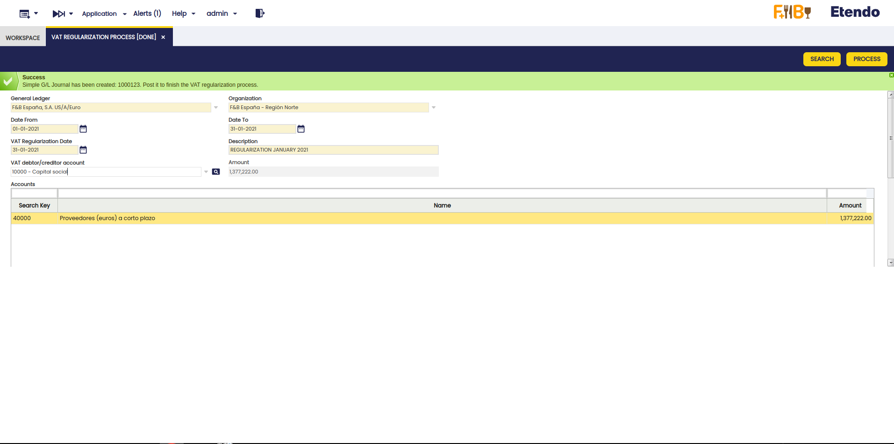

    !!!important
        Remember this process affects all the accounts resulting from the search, so selecting the corresponding accounts must be done when marking the VAT regulularization checkbox in the setup step.

2. Go to the Simple G/L Journal window and filter the Document No. field by the number generated in the process (e.g. **1000123**).

3. Here, verify that the header has been created with the corresponding lines.

#### Entry Review and Posting

1. Check that a line has been created per account to be regularized (in this case, account 40000) and that the amount to be regularized (-1,377,222.00) has been added in the Debit field in positive.

2. Verify that another line has been created with the account selected in the VAT debtor/creditor account field with the corresponding amount in the Credit field.

3. Post the manual journal entry with the **Post** process.
4. Generate the GL journal report again and verify that the **Balance** for account 40000 is zero, which indicates that the VAT has been regularized correctly.

!!!info
    With this module, from Etendo Classic, version 24.2.0, and Financial Extensions Bundle, version 1.15.0, the field sorting has been modified so that GL journal entries are always sorted at the end of the day. This change ensures that, in the General Ledger report and in General Ledger Report Advanced, the manual journal entries of the day are displayed correctly sorted.

## Reset Accounting

:material-menu: `Application` > `Financial Management` > `Accounting` > `Transactions` > `Reset Accounting`

### Overview

The reset accounting process allows the user to totally or partially remove the ledger entries of an organization. The ledger entries can be massively re-created again by using the **Accounting Server Process** or the **G/L Posting by DB Tables** process. The manual changes done for the accounting entries description will obviously be lost after running this process.

