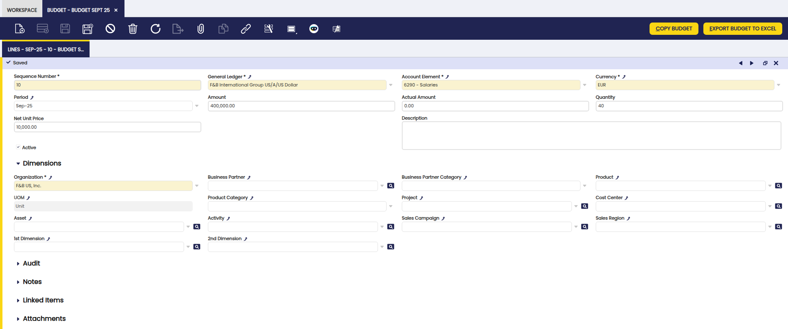

---
tags:
  - Etendo Classic
  - Financial Management
  - Accounting
  - Budget
  - Financial Extensions
---

# Budget

:material-menu: `Application` > `Financial Management` > `Accounting` > `Transactions` > `Budget`

<iframe width="560" height="315" src="https://www.youtube.com/embed/2VFxpx8j8Sk?si=TuLZUdBGrOCSpXIE" title="YouTube video player" frameborder="0" allow="accelerometer; autoplay; clipboard-write; encrypted-media; gyroscope; picture-in-picture; web-share" referrerpolicy="strict-origin-when-cross-origin" allowfullscreen></iframe>

## Overview

!!! info
    To be able to include this functionality, the Financial Extensions Bundle must be installed. To do that, follow the instructions from the marketplace: [Financial Extensions Bundle](https://marketplace.etendo.cloud/#/product-details?module=9876ABEF90CC4ABABFC399544AC14558){target="_blank"}. For more information about the available versions, core compatibility and new features, visit [Financial Extensions - Release notes](../../../../../whats-new/release-notes/etendo-classic/bundles/financial-extensions/release-notes.md).

!!! warning
    If you do not have the **Financial Report Budget** module from the [Financial Extensions Bundle](https://marketplace.etendo.cloud/#/product-details?module=9876ABEF90CC4ABABFC399544AC14558){target="_blank"}, this window will remain in a legacy version with limited functionality. You will not be able to include G/L items in the actual values considered in the budget report, the report will not have the difference column and the dimensions to filter the report will not include all the accounting dimensions as in this case.

It allows creating and managing budgets, both for income and expenditures, for reporting purposes, offering users the possibility to compare budgeted values with actual values posted in the corresponding General Ledger.

!!! example
    A budget can be defined, for example, by assigning an expected expenditure of EUR 400,000 in salaries and $2,000 in Internet services for the month of September 2025. 
    
    
    
    At the end of the period, users can verify the actual value and analyze the difference with respect to the defined budget.

    

The actual values considered include both accounting entries and manual entries (G/L Item), ensuring a comprehensive view of budget execution.

## Header

The header defines the main data for each budget:

- **Organization**: organization to which the budget belongs.
- **Name**: identifying name of the budget.
- **Year**: fiscal year to which the budget applies.
- **Description**: additional or explanatory information about the budget.
- **Active**: checkbox that enables or disables the budget. 
- **Export Actual Data**: checkbox, when checked, actual quantities will be exported to Excel in addition to the budgeted quantities.

## Lines

In the Lines tab, the user can add budget lines. Each line can refer to a specific period, projecting and comparing expenses/income according to the selected accounting account. The accounting dimensions are available as filters, selectable one at a time, in the Dimensions section (business partner, product, etc.)

Fields to note:

- **Sequence Number**: sequence number of the line.
- **General Ledger**: associated accounting ledger.
- **Account Element**: linked accounting account. This element is what determines if the budget refers to an income or an expenditure.
- **Currency**: currency in which the budget is expressed.
- **Period**: accounting period to which the line corresponds.
- **Amount**: budgeted amount. This is the number to be considered when expressing the difference between the budgeted amount and the actual amount in the generated budget report.
- **Actual Amount**: actual amount recorded. This information is updated once the report is generated, only if the Export Actual Data checkbox was selected.
- **Quantity**: budgeted quantity. This is an optional value.
- **Net Unit Price**: net unit price. This is an optional value.
- **Description**: additional information about the line.
- **Active**: checkbox that enables or disables the line.

## Buttons

**Export Budget to Excel**: generates an Excel document as a Report with budget information.

**Copy Budget**: duplicates lines from previously created budgets.

## Report

The budget report allows a comparison between the budgeted and actual amounts. It includes a Difference column, which shows the result of subtracting the actual value from the budgeted value, thus facilitating the analysis of deviations.

The fields presented in the report are:

- **Qty**: budgeted quantity.
- **Price**: unit price.
- **Amount**: budgeted amount.
- **Actual**: actual amount recorded.
- **Difference**: difference between budgeted and actual amounts.
- **Period**: corresponding accounting period.
- **Accounting dimensions**: filters applied by dimensions (e.g., business partner, cost center, product, project, etc.).
- **Organization**: organization to which the budget corresponds.
- **Description**: additional information about the line.
- **Currency**: currency in which the budget is expressed.

Example of report results:

---

This work is a derivative of [Financial Management](http://wiki.openbravo.com/wiki/Financial_Management){target="\_blank"} by [Openbravo Wiki](http://wiki.openbravo.com/wiki/Welcome_to_Openbravo){target="\_blank"}, used under [CC BY-SA 2.5 ES](https://creativecommons.org/licenses/by-sa/2.5/es/){target="\_blank"}. This work is licensed under [CC BY-SA 2.5](https://creativecommons.org/licenses/by-sa/2.5/){target="\_blank"} by [Etendo](https://etendo.software){target="\_blank"}.
