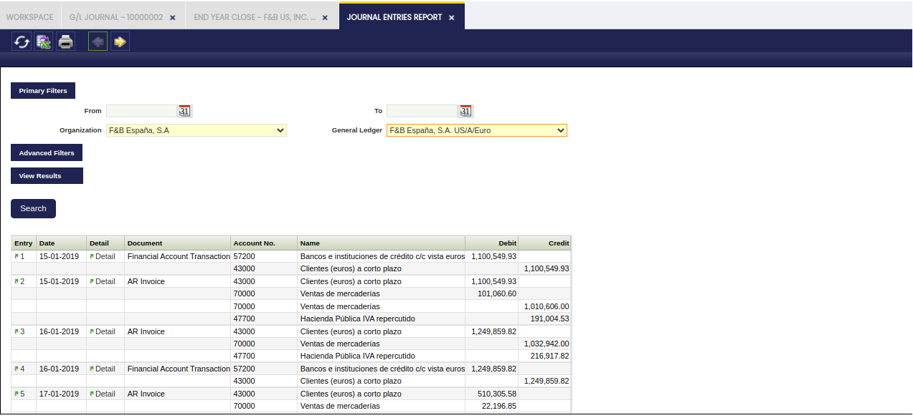
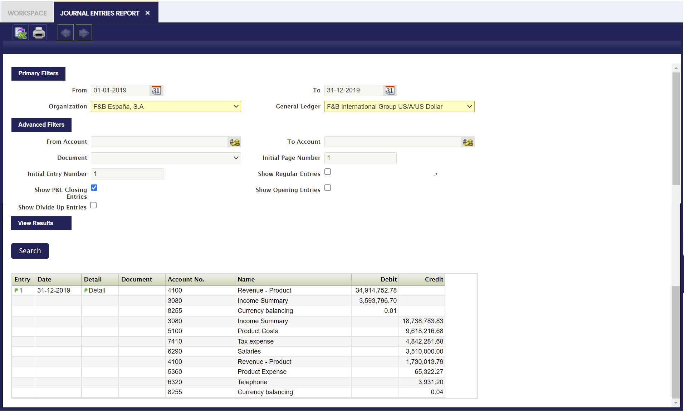
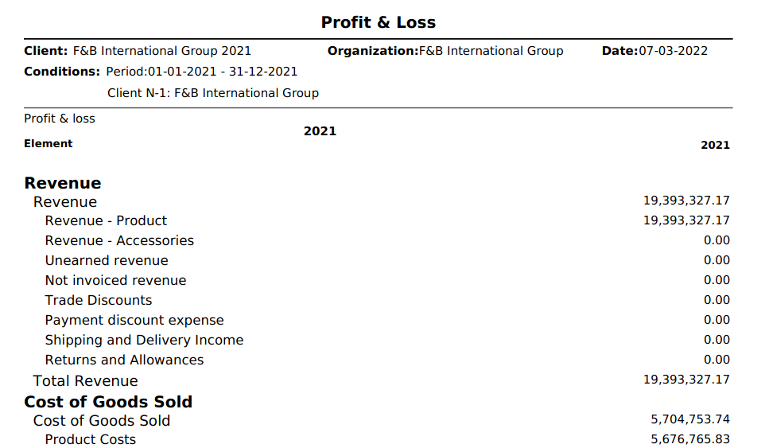
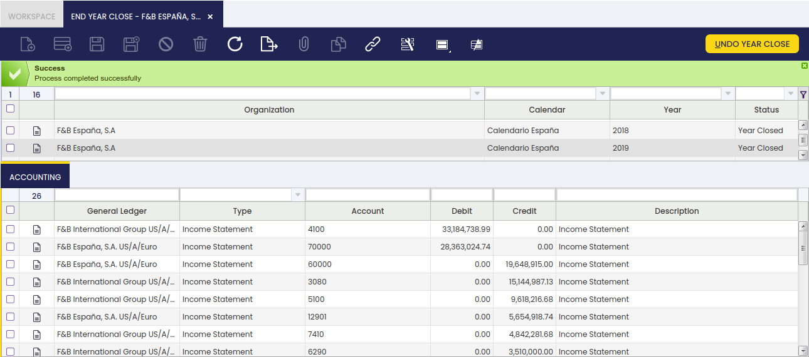
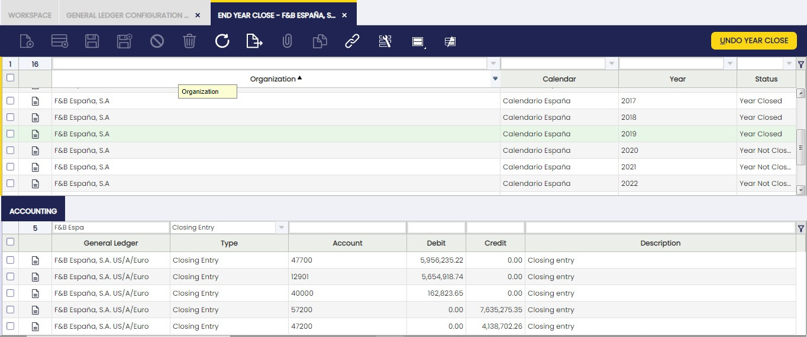
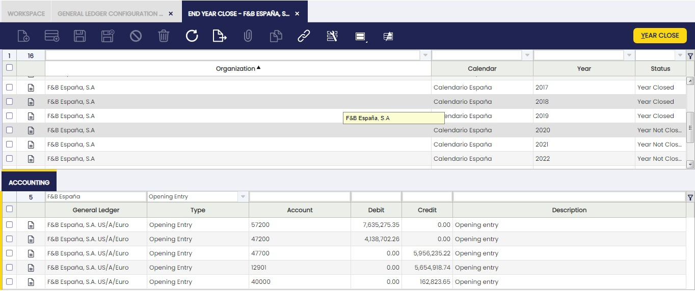

---
tags:
  - Etendo Classic
  - Financial Management
  - End Year Close
  - Fiscal Year
  - Accounting Transactions
---

# End Year Close

:material-menu: `Application` > `Financial Management` > `Accounting` > `Transactions` > `End Year Close`

## Overview

The **Close Year** process allows the user to close a fiscal year. This process also permanently closes all the periods of the year (standard ones and adjustment ones).

It is important to remark that it is not required to close the standard periods of a year prior to closing that year, however it can help to keep tracking of the periods of the year already reviewed and closed.

The close year process requires that the next year is started, and its first period is opened.

!!! info
    Once a year is closed, the status of that year and all its periods can be reviewed in the Open/Close Period Control window.

As already mentioned, all the periods of the year are now shown as **Period Status**=**Permanently Closed**, that means that it is not possible to post any transaction within that year anymore, unless the **Undo Close Year** process is run for that year.

**Close Year** process creates the following accounting entries:

1\. The **Profit and Loss Closing** entry.

-   This accounting entry resets all **Revenue** and **Expense** Account Types and the difference is posted in the Income Summary account.
    -   In other words, the **Expense** accounts are **Credited and the **Revenue** accounts are **Debited** and the difference, if any, is posted in the Income Summary account.  
        Let us take an expense account with a debit balance of 500,00. The P&L Closing entry creates a credit accounting entry of 500,00 in the Expense account of the example, therefore it gets a balance equal to zero.  
        If the revenue accounts total balance is higher than the expense accounts total balance that difference is credited in the Income Summary account, that means a positive result or a profit.  
        If the revenue accounts total balance is lower than the expense accounts total balance that difference is debited in the Income Summary account, that means a negative result or a loss.
-   This accounting entry is posted the last day of the last period of the year being closed, that is the **Adjustment Period** or **13th Period** of the year.
-   Etendo does not create a G/L Journal for this accounting entry but just the accounting entry.

2\. The **Closing** entry or **Balance Sheet Closing** entry.

-   This accounting entry credits all the accounts which have a debit balance and debits all the accounts which have a credit balance. The aim of this accounting entry is to get that Asset and Liability accounts get a zero balance.
    -   In order words, let us take an Asset account with a debit balance of 8.000,00. The closing entry creates a credit accounting entry of 8.000,00 in the Asset account of the example.
-   This account entry is posted the last day of the last period of the year being closed, that is the **Adjustment Period** or **13th Period** of the year.
-   Etendo does not create a G/L Journal for this accounting entry but just the accounting entry.
-   This entry is created only if the Reverse Permanent Account Balances checkbox is set to yes.

Finally, if a Retained Earnings account is specified for the general ledger configuration, an additional entry dated on the last day of the year is created.

This entry moves the Income Summary account balance to the **Retained Earnings** account.

3\. And the **Opening** or **Balance Sheet Opening** entry.

-   This accounting entry is the reversal entry of the closing entry.
    -   Following the example of point 2 above, the opening entry creates a debit accounting entry of 8.000,000 in the Asset account of the example. That amount is the opening balance of the asset account for the new year.
-   This accounting entry is posted the first day of the first period of the next year.
-   This entry is created only if the Reverse Permanent Account Balances checkbox is set to yes.

##### End-year close process example

This example describes the **2019 end-year closing** process of a sample legal with an accounting organization.

This article describes the end-year closing process intentionally keeping the organization's activity as simple as possible.

The company in this example started its activity prior to 2019, therefore a G/L Journal set as **Opening** can be created to record the 2019 opening entry and get it posted to the ledger.

To make it simple, the company in this example executed detailed **regular** activities which created the corresponding **regular** journal entries in the general ledger:

Let us imagine that **F&B España** closes the standard periods as soon as each period is over and that is done even for the last standard period which is **December 2019**.

The accountants can use the **13th Period** to post accounting adjustment to the ledger through the posting of G/L Journal/s, prior running the **Year Close** process.

Once 2019 is over and ready to be closed, the company in this example can execute the 2019 **Close Year** process from the End Year Close window.

The process button **Year Close** runs the end-year close process for this sample organization.

##### Reverse Permanent Account Balances set to **Yes**

Etendo creates **closing entries** detailed below if the **Reverse Permanent Account Balances** checkbox of the Organization's general ledger is set to **Yes** before running the **Close Year** process.

!!! info
    Note that below accounting entries can also be reviewed in the **End Year Close** window in the Accounting Tab.

-   Dated on the latest day of the year below **P&L Closing Entry**.  
    This entry resets all **Revenue** and **Expense** account which is posted in the account defined as Income Summary.  
    
 
-   Dated on the latest day of the year below **Closing Entry**.
    This entry resets all **Asset**, **Liability** and **Owner's Equity** accounts.x Besides, an additional entry is created to move the Income Summary account balance to the Retained Earning account:
    
 
-   Dated on the day of the following year (01-01-2022) below **Opening Entry**. This entry is the reversal entry of the above closing entry:
    
    The organization in this example can launch the 2020 Balance Sheet and the 2021 Profit and Loss reports from the Balance Sheet and P&L structure window:

2020 Balance Sheet:

2021 Profit and Loss:

##### Reverse Permanent Account Balances set to **No**

Etendo creates below **closing** entries if the **Reverse Permanent Account Balances** checkbox of the Organization's general ledger is set to **No** before running the **Close Year** process.

!!! info
    Note that below accounting entries can also be reviewed in the **End Year Close** window in the Accounting Tab.

-   Dated on the latest day of the year (31-12-2019) below **P&L Closing Entry**:
 
     
-   and dated on the latest day of the year (31-12-2019) below entry as a Retained Earnings account is defined for the organization's general ledger:
 
     

The organization in this example can launch the 2019 Balance Sheet and the 2019 Income Statement reports from the Balance Sheet and P&L structure window. It will get the same Balance Sheet and Income Statement as the ones shown for the **Reverse Permanent Account Balances set to **Yes** scenario.

### End Year Close

In the **End Year Close** window, all the Years previously created in the Fiscal Calendar window are shown. Those years can be closed in this window.

The records shown in this window are filtered by their **Status** and the **Organization**, by showing only the Years which are not closed yet and belongs to the Organization in which the User is logged. These filters can be removed by clicking in the funnel icon.

This window shows two Tabs. The first Tab shows all the existing Years. Once selected a record in this Tab, the lower tab shows the related Accounting entries, meaning the closing entries generated by the Close Year process as well as the corresponding opening entries of the next year.

This way, it is easier and quicker to see the Accounting generated when a Year is closed. More information can be found in the Accounting Tab below.

The way to Close a Year is:

-   Use the filters of the grid to show the Year to close.
-   Select the Year.
-   Click on the Year Close button and click OK.

Once done, Etendo informs that the process has been completed successfully.

All the Periods for that Year and that Organization will be permanently Closed. The way to Undo the Close of the Year is the same, but clicking Undo Close Year.

As shown in the image above, the main fields in this window are:

-   Organization.
-   Calendar.
-   Year.

### Undo Close Year

If a year (i.e 2019) is closed, it will not be possible to do any posting within that year unless the **Undo Close Year** process is run for that year.

This process opens the year and all the periods of the year. It also reverts all the ledger entries posted by the end-year close process; therefore closing/opening entries are not shown in the Journal Entries Report anymore, unless the end-year close process is run once again for the year.

-   Status: It can be **Year Not Closed** or **Year Closed**

### Accounting

In the **Accounting** Tab of the End Year Close Window, all the Accounting entries generated when a Year is Closed or when it is Opened are shown, grouped by Account. This Account entries can be:

-   Opening Entries
-   Income Statements
-   Closing Entries
-   Regular Entries
-   Divide Up

This way, it is easier to review the Accounting entries made in the Closing Year Process.

As shown in the image above, the main fields in this window are:

-   General Ledger.
-   Type. It can be an Opening Entry, Closing Entry, Income Statement, Regular Entry or Divide Up.
-   Account. Notice that **the account entries are grouped by Account**, showing only one record.
-   Debit.
-   Credit.

For explaining this Tab, it is better to follow the same example as in the Introduction section and show how this Tab presents the results.

##### Reverse Permanent Account Balances set to **Yes**

Etendo creates below **closing entries** if the **Reverse Permanent Account Balances** checkbox of the Organization's general ledger is set to **Yes**:

-   Dated on the latest day of the year (31-12-2019) below **P&L Closing Entry**.  
    This entry resets all **Revenue** and **Expense** accounts.
    
 
     
-   Dated on the latest day of the year (31-12-2019) below **Closing Entry**.  
    This entry resets all **Asset**, **Liability** and **Owner's Equity** accounts.
 
     
-   Dated on the day of the following year (01-01-2020) below **Opening Entry**.  
    This entry is the reversal entry of the above closing entry:
 
     

##### Reverse Permanent Account Balances set to **No**

Etendo creates below **closing** entries if the **Reverse Permanent Account Balances** checkbox of the Organization's general ledger is set to **No**:

-   Dated on the latest day of the year (31-12-2019) below **P&L Closing Entry**:
 
     
-   and dated on the latest day of the year (31-12-2019) below entry as a Retained Earnings account is defined for the organization's general ledger:
 

---

This work is a derivative of [Financial Management](http://wiki.openbravo.com/wiki/Financial_Management){target="\_blank"} by [Openbravo Wiki](http://wiki.openbravo.com/wiki/Welcome_to_Openbravo){target="\_blank"}, used under [CC BY-SA 2.5 ES](https://creativecommons.org/licenses/by-sa/2.5/es/){target="\_blank"}. This work is licensed under [CC BY-SA 2.5](https://creativecommons.org/licenses/by-sa/2.5/){target="\_blank"} by [Etendo](https://etendo.software){target="\_blank"}.
