---
tags:
  - Etendo Classic
  - Financial Management
  - Financial Type Configuration
  - Financing
  - Accounting Transactions
---

# Financial Type Configuration

:material-menu: `Application` > `Financial Management` > `Accounting` > `Transactions` > `Financial Type Configuration`

## Overview

This feature allows entering in the system all the financings the company has. It is possible  to exploit the information through the bank pool report. 
Depending on the financial product used in this new **Financing** window, Etendo generates financing plans automatically (Leasing, Renting and Loans) and also manages the invoices and payments from this same window. 

The usual financing products are: 

- Invoice Advance
- Bank Guarantee 
- Confirming
- Foreign Trade
- Credit Account
- Factoring
- Leasing
- Loans
- Renting 
- Credit Cards. 

These financing methods are loaded into the system using a dataset.

!!! info
    For more information, visit [Financial Type](../../financial-management/accounting/setup/financial-type.md).

## Header
The main header has the following fields:

- **Organization**: drop-down list of organizations.    
- **Financial Type**: drop-down list of methods  Invoice Advance, Bank Guarantee, Confirming, Foreign Trade, Credit Account, Factoring, Leasing, Loans, Renting and Credit Cards.   
- **Financial Bank/Entity**: drop-down list of the business partner window.  
- **Financial Account**: drop-down list of the Financial Account window.    
- **Payment Method**: drop-down list of the payment methods indicated in the selected financial account.    
- **Name**: free field to add information.  
- **Date**: date field (contract signature date).   
- **Due Date**: date field. 
- **Lack (Month)**: numeric field (Integers)    
- **Currency**: drop-down list of the currency window.   
- **Amount Granted**: numeric field with 2 decimals.    
- **Amount Drawn**: numeric field with 2 decimals.  
- **Amount Available**: numeric field with 2 decimals.  
- **Residual Value**: numeric field with 2 decimals.    
- **Installment No**: integer numeric field.    
- **% Annual Interest**: % numeric field with 2 decimals.   
- **Periodic commission**: numeric field with 2 decimals.   
- **Opening Financial Expenses**: numeric field with 2 decimals.    
- **Frequency**: drop-down list (Monthly, Bimonthly, Quarterly, Quarterly, Semiannual, Annual)  
- **Payment Date**: numeric field. Integer (limit of 31)    
- **Purpose**: free field to add information.   
- **Warranty**: free field to add information.  
- **% Early Cancellation Fee**: % numeric field with 2 decimals.    
- **% Early Amortization Commission**: % numeric field with 2 decimals. 
- **Ledger account at long term**: informative field to indicate the accounting account of the  account tree.   
- **Ledger account at short term**: informative field to indicate the accounting account of the account tree.   
- **Ledger account at purchase option**: informative field to indicate the accounting account of the account tree.  
- **Project**: drop-down list of the "Multiphase Project" window.   
- **Cost Center**: drop-down list of the "Cost Center" window.

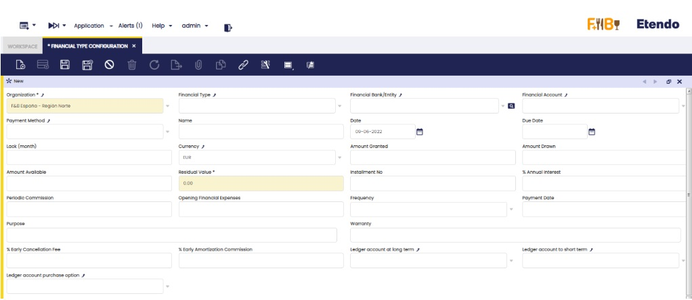

## Lines
 
Lines contain the following fields:
 
- **Installment No**: numeric field. Integer. 
- **Amortization/ Expiration date**: date field.
- **Installment**: numeric field with 2 decimals.
- **Amortization/Renting**: numeric field with 2 decimals.
- **Interest**: numeric field with 2 decimals.
- **Commission**: numeric field with 2 decimals.
- **Total Amortization**: numeric field with 2 decimals.
- **Pending Amortization**: numeric field with 2 decimals.
- **Invoice**: the linkage to the generated invoice is shown (Leasing/Renting).
- **Payment**: the linkage to the generated payment is shown (Loan). 
- **Business Partner Finance**: business partners ' drop-down list (this is used as an informative field to know about advance invoices, Confirming, Comex, how much has each been financed).
- **Date**: date field. 
- **Project:** drop-down list of the "Multiphase Project" window.
- **Cost Center**: drop-down list of the "Cost Center" window.
 
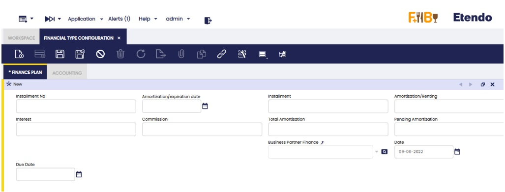
 
## Accounting 
 
 There are three sections: "Amortization/Renting", "Interest" and "Commission". There are six fields in total where three of them represent the product and the other three, the accounting concept. The 2 fields (product and accounting concept) cannot be filled in the same section. In each of these related fields, the product must be indicated from the **Products** window or **Accounting Concept** if the **Available in Financial Invoices** check box needed to assign to each column is activated. In the case of the type of financing **Loan**, it is obligatory to fill in the part of accounting concepts.
 
 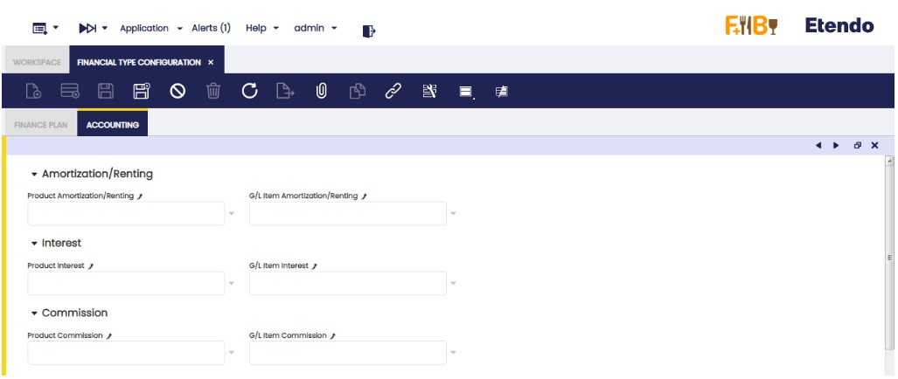
 

## Loan, Leasing or Renting calculation in the lines tab

Fill the necessary fields of the header according to the description of each of them indicated at the top of the document. Such information allows the automatic creation of the finance plan, which is created by clicking the "Update Finance plan" button at the upper right margin of the window.
 
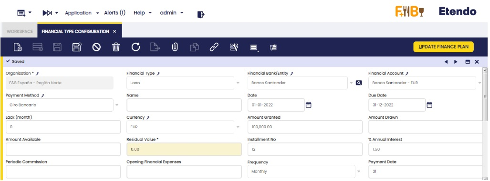
 
### Loan: 
- **Installment No**: It starts with the installment number 0 and the "pending amortization" field has the value indicated in the "granted amount" field, and the "date" field has the indicated date in the header field "date". The rest of the installments are correlative, adding 1 by 1.
- **Amortization/Expiration date**: To see the date of the installment number 1 of the finance plan, it is indicated when clicking the new button "Create finance plan". A pop up is shown to indicate the date. Click "OK". The rest of the lines are created with the frequency indicated in the "Frequency" field, with the date of the last installment created and the date indicated in the "payment date" field. If lack is indicated, the indicated date when clicking "Create finance plan" is the first lack installment, the rest of the installments, lack and amortization ones, are created according to the indicated frequency. The lack installments are indicated with the installment number 0.
- **Installment**: At first, the same installment is calculated for the entire loan. If the interest rate changes during the loan period, the installment is changed. To do this, change the 1% interest rate of the header and click the new button of the header "Update Finance Plan". The information is updated from the following line to the last line with an associated payment.
- **Amortization/Renting**: Redeemed amount in the installment.
- **Interest**: Interest to pay in the installment.
- **Commission**: filled with the information entered in the "Periodic Commission" field of the header, if any. If not, the value is 0.
- **Total Amortization**: Addition of the values in the previous column "amortization/renting" and regarding the same calculated line. Read-only field.
- **Pending amortization**: Difference between the "granted amount" indicated in the header and the "total amortization" of the same calculated line. Read-only field.
- **Payment**: The related payment is shown.
- **Business Partner**: If indicated in the header, the business partner is shown in this field. If not, it can be manually indicated.
- **Project**: If indicated in the header, the project information is shown in this field. If not, it can be manually indicated.
- **Cost Center**: If indicated in the header, the cost center is shown in this field. If not, it can be manually indicated.
 
 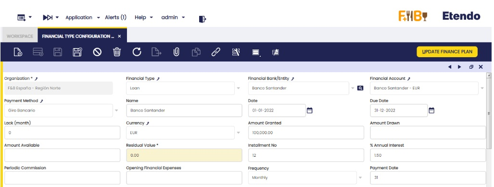
 
 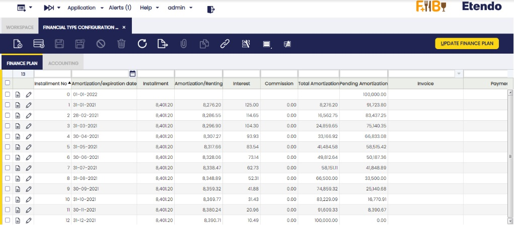
 
### Leasing:
- **Installment No**: It starts with the installment number 0 and the "pending amortization" field has the value indicated in the "granted amount" field, and the "date" field has the indicated date in the … The rest of the installments are correlative, adding 1 by 1.
- **Amortization/Expiration date**: To see the date of the installment number 1 of the finance plan, it is indicated when clicking the new button "Create finance plan". A pop up is shown to indicate the date. Click "OK". The rest of the lines are created with the frequency indicated in the "Frequency" field, with the date of the last installment created and the date indicated in the "payment date" field. If lack is indicated, the indicated date when clicking "Create finance plan" is the first lack installment, the rest of the installments lack and amortization ones, are created according to the indicated frequency. The lack installments are indicated with the installment number 0.
- **Installment**: At first, the same installment is calculated for the entire leasing. If the interest rate changes during the leasing period, the installment is changed. To do this, change the 1% interest rate of the header and click the new button of the header "Update Finance Plan". The information is updated from the following line to the last line with an associated invoice. Lastly, one last line with the residual value is included, if any, in the same date of the last calculated line.
- **Amortization/Renting**: Redeemed amount in the installment.
- **Interest**: Interest to pay in the installment.
- **Commission**: filled with the information entered in the "Periodic Commission" field of the header, if any. If not, the value is 0.
-  **Total Amortization**: Addition of the values in the previous column "amortization/renting" and regarding the same calculated line. Read-only field.
- **Pending amortization**: Difference between the "granted amount" indicated in the header and the "total amortization" of the same calculated line. Read-only field.
- **Invoice**: The related invoice is shown.
- **Payment**: The related payment is shown.
- **Business Partner**: If indicated in the header, the business partner is shown in this field. If not, it can be manually indicated.
- **Project**: If indicated in the header, the project information is shown in this field. If not, it can be manually indicated.
- **Cost Center**: If indicated in the header, the cost center is shown in this field. If not, it can be manually indicated.
 
 
 
 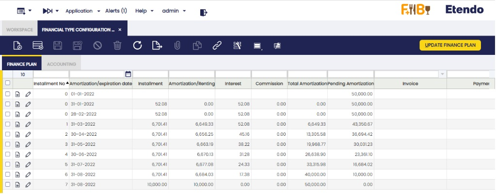
 
### Renting
- **Installment No**: It starts with the installment number 0 and the rest of the installments are correlative, adding 1 by 1.
- **Amortization/Expiration date**: To see the date of the installment number 1 of the finance plan, it is indicated when clicking the new button "Create finance plan". A pop up is shown to indicate the date. Click "OK". The rest of the lines are created with the frequency indicated in the "Frequency" field, with the date of the last installment created and the date indicated in the "payment date" field.
- **Installment**: The result of the "Granted amount" divided the installments number.
- **Amortization/Renting**: Redeemed amount in the installment.
- **Interest**: Interest to pay in the installment.
- **Commission**: filled with the information entered in the "Periodic Commission" field of the header, if any. If not, the value is 0.
- **Invoice**: The related invoice is shown.
- **Business Partner**: If indicated in the header, the business partner is shown in this field. If not, it can be manually indicated.
- **Project**: If indicated in the header, the project information is shown in this field. If not, it can be manually indicated.
- **Cost Center**: If indicated in the header, the cost center is shown in this field. If not, it can be manually indicated.
 
 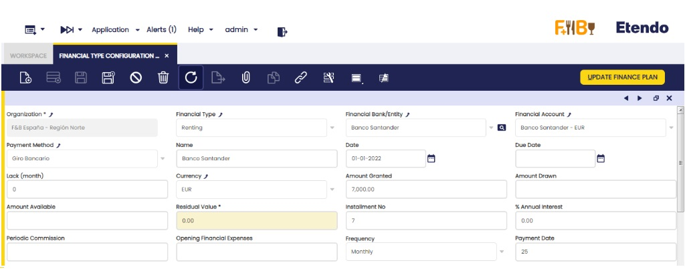
 
 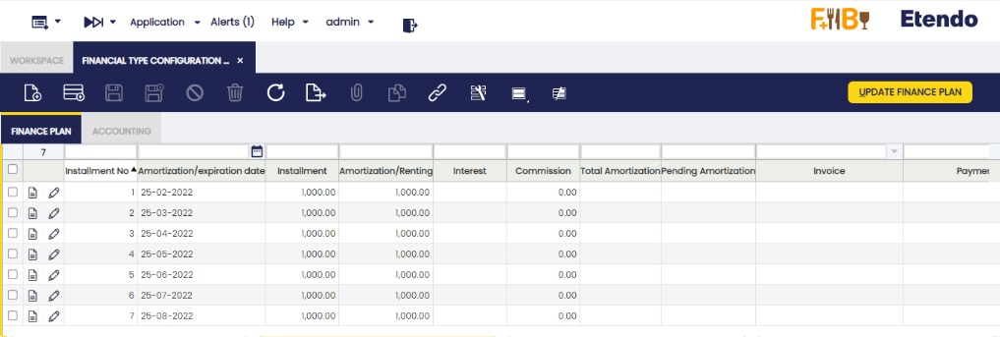
 
#### Generating payments or invoices

Once the amortization plan is created, payments (loans) and invoices (leasing and renting) for each line can be generated. This is possible individually (line by line) or in groups (3 lines can be selected and 3 different payments/invoices are generated).
 
In order to do this, select the required line/s and click the "Create payment" (loans) or "Create invoice" (leasing or renting) buttons shown in the upper right margin of the window.
 
**Loan**:
 
 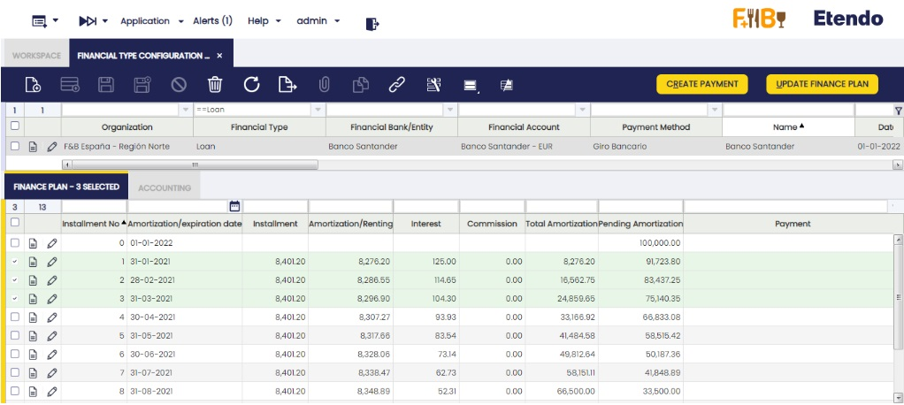
 
**Leasing**:
 
 
 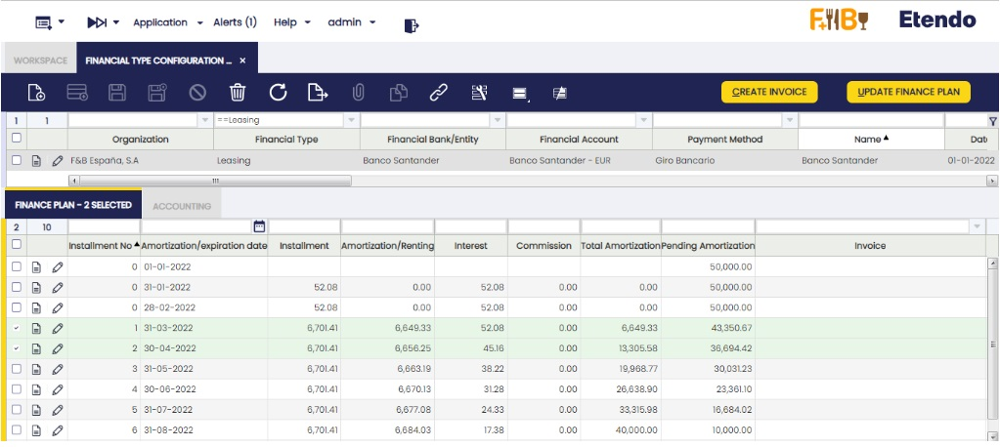

 
**Renting**:

 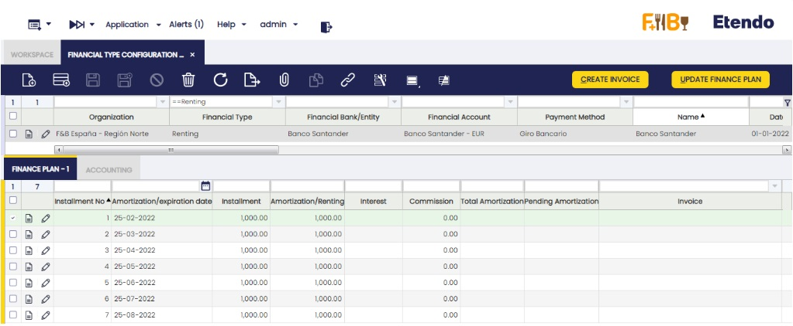

 
##### Credit account and credit cards reported in financial accounts.
 
The Credit account and Credit card information is automatically entered. To do this, create a new header and indicate the finance method, "Credit account" or "Credit card". Then, the button "Add Financial Account" is enabled in the upper right margin. 
 
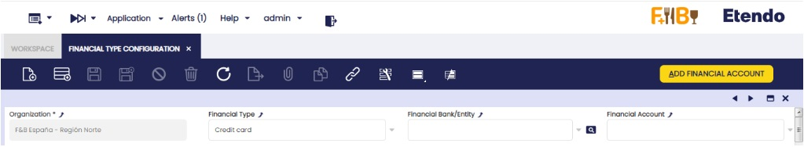
 
When clicking the button, a pop up is shown and it is possible to select a financial account (only those with the "Add to bank pool" flag checked are shown).
 
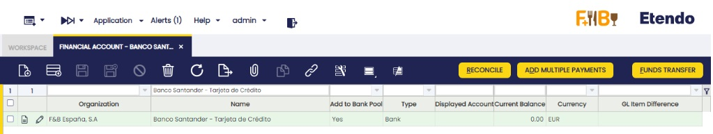

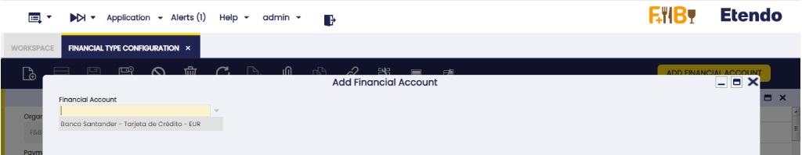

Once this credit account/credit card is created in the financings and its information has to be updated, click the "Update Financial Account" button in the upper right margin.
 
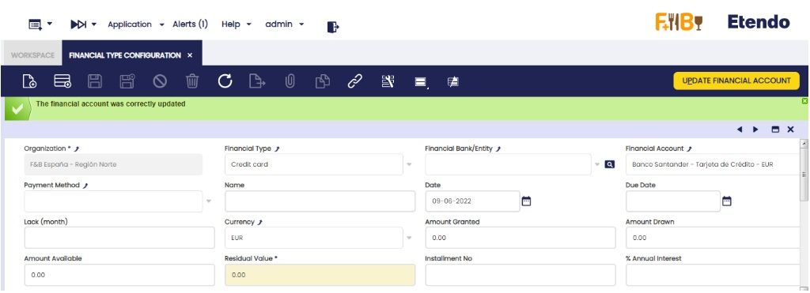
 
The fields to be copied from the account or credit card are the equivalent ones in the "Financial Account" field, the amount of residual value to be indicated in the "Amount Available" field and the "Credit Limit" amount to be indicated in the "Amount Granted" field. All other fields in the header are editable to include the rest of the information.

---

This work is a derivative of [Financial Management](http://wiki.openbravo.com/wiki/Financial_Management){target="\_blank"} by [Openbravo Wiki](http://wiki.openbravo.com/wiki/Welcome_to_Openbravo){target="\_blank"}, used under [CC BY-SA 2.5 ES](https://creativecommons.org/licenses/by-sa/2.5/es/){target="\_blank"}. This work is licensed under [CC BY-SA 2.5](https://creativecommons.org/licenses/by-sa/2.5/){target="\_blank"} by [Etendo](https://etendo.software){target="\_blank"}.
