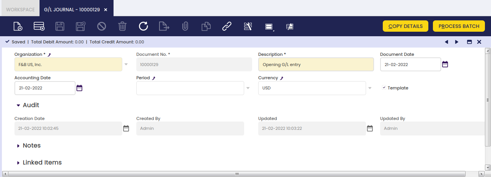
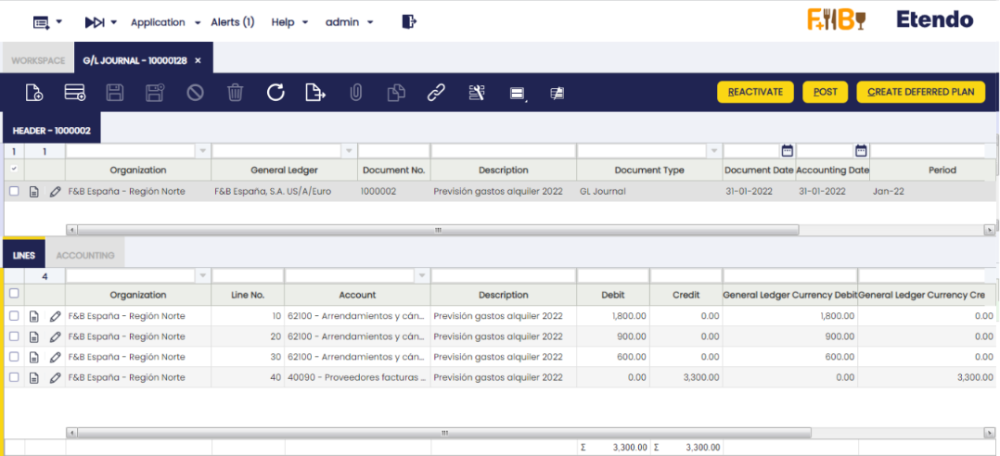
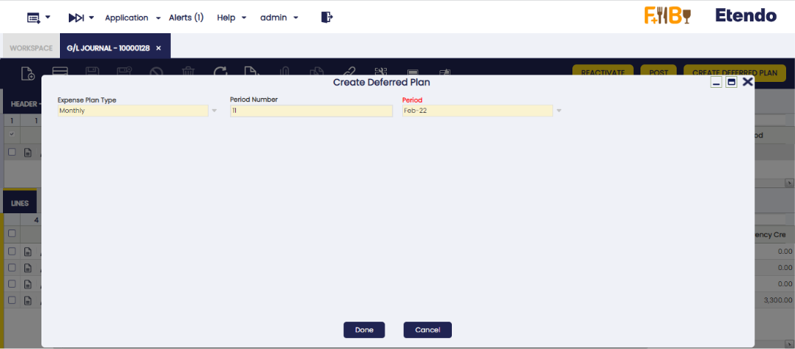
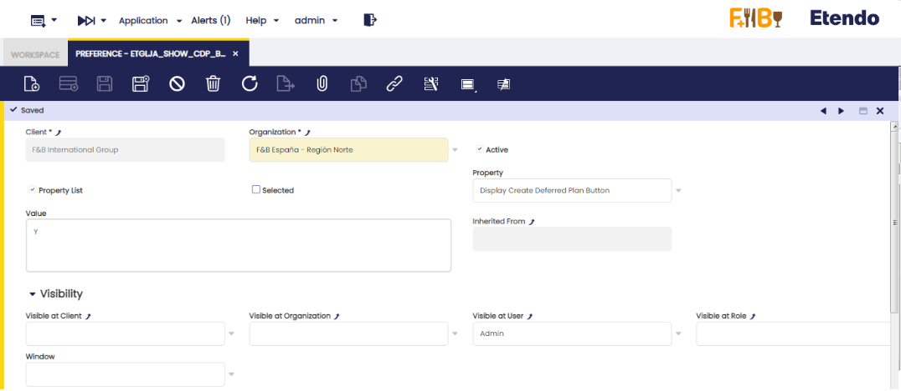
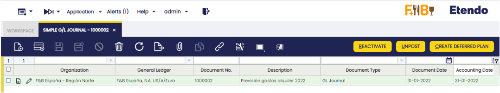

---
tags:
  - Etendo Classic
  - Financial Management
  - G/L Journal
  - General Ledger
  - Accounting Transactions
---

# G/L Journal

:material-menu: `Application` > `Financial Management` > `Accounting` > `Transactions` > `G/L Journal`

## Overview

A G/L (General Ledger) journal allows the user to post journal entries to the ledger and create G/L item payments.

As already explained, most of the accounting entries are created while posting documents such as purchase invoices, sales invoices, etc.

The accounting entries which do not match with an existing Document Type need to be posted to the ledger by using a G/L Journal.

Besides, a G/L Journal can be used to create **G/L Item Payments** or payments not related to orders or invoices.

!!! info
    This feature is very useful while posting an employee payroll to the ledger as the payroll payment can be created at the same time.

Finally, a G/L Journal can also be configured as a **template**.

This feature allows the user to create the same journal entries as the ones contained in the G/L Journal set as a template.

This feature is also very useful while posting employee payroll, for instance.

### Batch

A G/L journal batch allows the user to group G/L journals of similar characteristics which can all be processed at the same time.

As shown in the image above, a *G/L Journal batch* can contain below data:

-   the **accounting period**
-   the **accounting date**
-   and the **currency**

None of the data above is mandatory at this point because a G/L journal can contain several journals having different accounting periods and accounting dates. The same applies to the currency as a G/L journal can contain several journals of different general ledger configurations.

Once a batch is created and saved, it is possible to create as many G/L Journals as required, which once ready can be completed and processed at the same time as a **unique** batch.

A G/L journal and therefore its content can be set up as **Template**, that template can be later on used while creating a new G/L journal by using the process button **Copy Lines** as described in the next section.

##### G/L Journal set up as "Template"

As already mentioned, a G/L Journal and therefore its content can be configured as a **Template**. In order to do so,  it is required to follow the steps below:

**1.** **create a G/L journal** to account the employee payroll corresponding to the period of January 2022, for instance. That G/L Journal needs to be marked as **Template**.

**2.** Create a **new G/L journal** to account the employee payroll corresponding to the period of January 2022. Enter an **Accounting Date** and a **Period**:

**3.** Press the **Copy Details** process button.

A new window is shown containing all the templates available:

!!! info
    Note that it is possible to search for a template by using the G/L journal document number set as template and the description fields. 

**4.** **Select a template and click OK**. After that, Etendo populates the most recently created G/L Journal with the same journal entries, only the dates are different.

It may be necessary to change the journal entries amounts. In order to do so, it is possible to edit the G/L Journal Lines and then change the amounts.

The last step is to post the G/L Journal, therefore the corresponding journal entries are posted to the ledger.

## Header

A G/L journal header can include journals, which can contain several journal lines.

A G/L Journal header contains the following data:

-   The organization and the organization's General Ledger configuration which once selected defaulted the field **Currency** to the one of the general ledger configuration, for instance USD. The currency can however be changed to EUR for instance. Etendo will apply the corresponding EUR -> USD conversion rate as the posting to the ledger must be in USD.
-   The *document date* which does not have to be the same as the accounting date.  
    The document date is automatically populated with the current date by default, but can always be changed.
-   The *accounting period* and the *accounting date* within that period. These dates can be automatically populated with the values entered in the Journal batch if any, however these dates can always be changed.

There is a checkbox named ***Opening*** which can be flagged just to state that a journal contains **opening balance accounts entries.**

There is a **list of actions** which can be executed from the G/L Journal header:

-   **Copy Details** button allows the user to copy the journal entries of a journal configured as a ***Template*** into the current journal
-   **Complete** button allows the user to complete the G/L Journal once the corresponding journal lines have been entered whenever the total debit amount matches the total credit amount
-   **Post/Unpost** button allows the user to Post/Unpost a G/L Journal once completed
-   **Close** button allows the user to close a G/L Journal for which no other action needs to take place or to reactivate it if it is not already posted
-   **Process Batch** button completes the G/L Journal/s of the batch

!!! info
    Note that upon **G/L Journal completion a **G/L Item** payment** will be created for each journal line that has the **Open Items** checkbox selected as explained in the G/L Item payments creation section.

!!! info
    The Journal will be completed even if any of the Payment/s creation failed. In this case, an error message is shown indicating the Lines that tried to create a Payment but failed.

## Lines

The lines tab allows the user to enter the journal entries of a G/L journal as well as G/L item payment related information.

### Accounting

Accounting information related to the GL Journal

## Deferred GL Journal 
### Duplicate Journal Entries

!!! info
    To be able to include this functionality, the Financial Extensions Bundle must be installed. To do that, follow the instructions from the marketplace: [Financial Extensions Bundle](https://marketplace.etendo.cloud/#/product-details?module=9876ABEF90CC4ABABFC399544AC14558){target="\_blank"}. For more information about the available versions, core compatibility and new features, visit [Financial Extensions - Release notes](../../../../../whats-new/release-notes/etendo-classic/bundles/financial-extensions/release-notes.md).

<iframe width="560" height="315" src="https://www.youtube.com/embed/K7XOBkmRLAQ?si=l-p9u_IvzFmMc46F" title="YouTube video player" frameborder="0" allow="accelerometer; autoplay; clipboard-write; encrypted-media; gyroscope; picture-in-picture; web-share" referrerpolicy="strict-origin-when-cross-origin" allowfullscreen></iframe>

This functionality allows the user to duplicate a journal entry as many times as required, indicating the regularity and the period in which the first copy must be made. Starting from the second copy, the duplication will take place with the corresponding regularity.
The process to create a journal entry from the beginning and duplicate it later is shown below.

1- Enter the "G/L Journal" window and create a header:

2- Create a new record:

3- Create the lines (to be recorded) and complete the entry. Once these three steps are done, the "Create Deferred Plan" button will be shown in the upper right margin. 

4 - Click the button and a pop-up with three fields will be shown:
• Expense Plan Type: copies regularity.
    • Period Number: required number of copies.
    • Period: period in which the first copy will be made.

5 - Once this information is entered, click the "Done" button and as many records will be generated as the number of copies indicated.

By default, this functionality is only available for the "GL Journal" window, since the record copies are grouped under only one header. It is also possible to duplicate these entries in the "Simple GL Journal" only if there is a preference configured in the "Preference" window with the property "Display Create Deferred Plan Button" and the value "Y".

Once this preference is configured, the button will be enabled in "Simple GL Journal". The flow is the same but the duplicated copies will not be created under a header. That is, this information will not be shown in the "GL Journal" window, except the information to be copied is already in it, in which case it will be shown.

## GL Journal Reverse 

!!! info
    To be able to include this functionality, the Financial Extensions Bundle must be installed. To do that, follow the instructions from the marketplace: [Financial Extensions Bundle](https://marketplace.etendo.cloud/#/product-details?module=9876ABEF90CC4ABABFC399544AC14558){target="\_blank"}. For more information about the available versions, core compatibility and new features, visit [Financial Extensions - Release notes](../../../../../whats-new/release-notes/etendo-classic/bundles/financial-extensions/release-notes.md).

This functionality is specifically useful for companies that have a month close, instead of an end year close, but with pending payments (in or out). It allows the user to open or close the period without taking into account the payments until they are made.

In order to use this functionality, in both "GL journal" and "Simple GL journal" windows, the user can click the button "Reverse Journal" in the toolbar when selecting an entry.

In this way, Etendo automatically creates a reverse entry that compensates the amount in the credit and debit columns. 
> 
!!! note
    By default, the reverse document is created as a draft. That is why Etendo shows the check "process document" when clicking the "Reverse Journal" button. In this way, the user can complete the document.

As seen below, Etendo shows a success notification in green with the new GL Journal number.

When comparing the original GL Journal to the reverse GL Journal, the debit and credit columns show the compensation, since the amounts are reverse.

##### Original GL journal

##### Reverse GL Journal

This is useful to distinguish between the original GL journal and the reverse one. 

## Bulk Posting

!!! info
    To be able to include this functionality, the Financial Extensions Bundle must be installed. To do that, follow the instructions from the marketplace: [Financial Extensions Bundle](https://marketplace.etendo.cloud/#/product-details?module=9876ABEF90CC4ABABFC399544AC14558){target="\_blank"}. For more information about the available versions, core compatibility and new features, visit [Financial Extensions - Release notes](../../../../../whats-new/release-notes/etendo-classic/bundles/financial-extensions/release-notes.md).

The Bulk Posting functionality allows the user to post or unpost multiple records by selecting the corresponding records and clicking the **Bulk posting** button.

Also, the Accounting Status of the record/s is shown in the status bar, in form view, or in a column, in grid view.
>
!!! info
    For more information, visit [the Bulk Posting module user guide](../../../../../user-guide/etendo-classic/optional-features/bundles/financial-extensions/bulk-posting.md).

---

This work is a derivative of [Financial Management](http://wiki.openbravo.com/wiki/Financial_Management){target="\_blank"} by [Openbravo Wiki](http://wiki.openbravo.com/wiki/Welcome_to_Openbravo){target="\_blank"}, used under [CC BY-SA 2.5 ES](https://creativecommons.org/licenses/by-sa/2.5/es/){target="\_blank"}. This work is licensed under [CC BY-SA 2.5](https://creativecommons.org/licenses/by-sa/2.5/){target="\_blank"} by [Etendo](https://etendo.software){target="\_blank"}.
