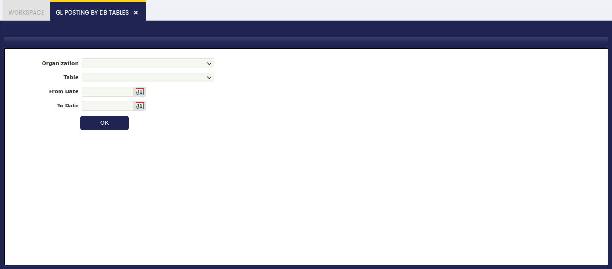

---
tags:
  - Etendo Classic
  - Financial Management
  - Accounting
  - GL Posting
  - Ledger Entries
---

# GL Posting by DB Tables

:material-menu: `Application` > `Financial Management` > `Accounting` > `Transactions` > `GL Posting by DB Tables`

## Overview

The G/L Posting by DB Table allows the user to massively post the transactions related to a given transactional table or to all of them.

As shown in the image above, the **G/L Posting by DB Tables** feature allows the user to:

-   select an Organization or all of them if a particular organization is not selected
-   select a Table or all of them if a particular table is not selected.
-   and select a **From date** and **To date**, if no dates are selected all the transactions available will be posted.

After running the process, Etendo informs about the number of ledger entries posted to the ledger for each table in order to post once again the transactional table/s to the ledger.

This process can be launched whenever it is required:

-   It can be run if there are pending transactions to be massively posted whenever the Accounting Sever Process is not enabled or if it is not enabled for a given set of tables.
-   It can also be run after running the process Reset Accounting as a way of regenerate the ledger entries.

---

This work is a derivative of [Financial Management](http://wiki.openbravo.com/wiki/Financial_Management){target="\_blank"} by [Openbravo Wiki](http://wiki.openbravo.com/wiki/Welcome_to_Openbravo){target="\_blank"}, used under [CC BY-SA 2.5 ES](https://creativecommons.org/licenses/by-sa/2.5/es/){target="\_blank"}. This work is licensed under [CC BY-SA 2.5](https://creativecommons.org/licenses/by-sa/2.5/){target="\_blank"} by [Etendo](https://etendo.software){target="\_blank"}.
