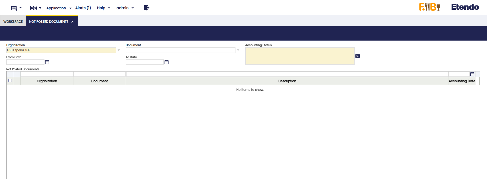
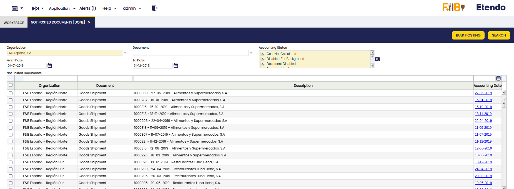
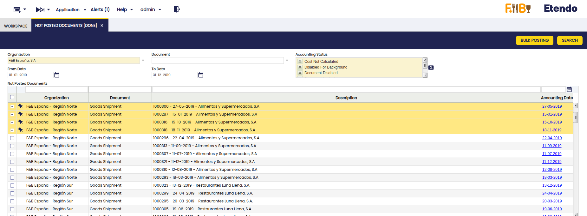
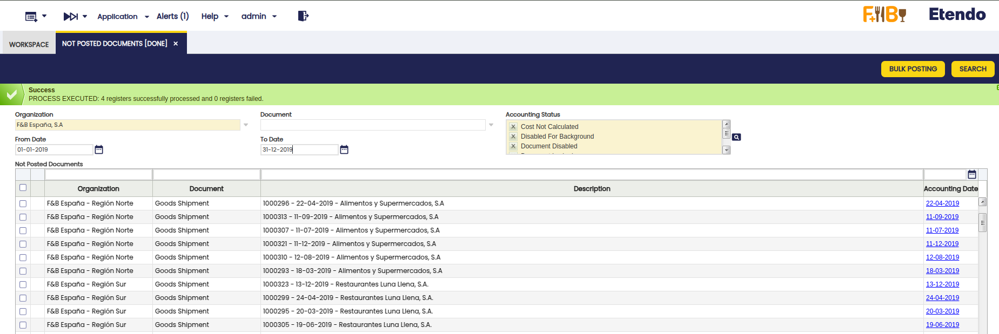

---
tags:
  - Etendo Classic
  - Financial Management
  - Accounting
  - Not Posted Documents
  - Bulk Posting
---

# Not Posted Documents

:material-menu: `Application` > `Financial Management` > `Accounting` > `Transactions` > `Not Posted Documents`

!!!info
    To be able to include this functionality, the Financial Extensions Bundle must be installed. To do that, follow the instructions from the marketplace: [Financial Extensions Bundle](https://marketplace.etendo.cloud/#/product-details?module=9876ABEF90CC4ABABFC399544AC14558){target="\_blank"}. For more information about the available versions, core compatibility and new features, visit [Financial Extensions - Release notes](../../../../../whats-new/release-notes/etendo-classic/bundles/financial-extensions/release-notes.md).

## Overview

The Not Posted Documents window, part of the Bulk Posting module, centralizes all unposted documents in one place. It allows users to quickly find, review, and post multiple documents at once. Filters help refine searches, and bulk posting actions streamline processing, making document management more efficient.

## Filters

- **Organization**: Filter documents according to the organization to which they belong. By default, the session organization is set.

- **Document**: (Optional) Type of document that the user is searching. The listed options are:

    - Amortization
    - Bank Statements 
    - Bill of Materials Production
    - Cost Adjustment
    - Doubtful Debt
    - GL Journal
    - Goods Receipt
    - Goods Shipment
    - Internal Consumption
    - Inventory
    - Landed Cost
    - Landed Cost Cost
    - Matched Purchase Invoices
    - Movements
    - Payment In
    - Payment Out
    - Purchase Invoice
    - Reconciliation
    - Return Material Receipt
    - Return to Vendor Shipment
    - Sales Invoice
    - Transaction
    - Work Effort

- **Accounting Status**: (Mandatory) Shows the possible statuses of accounting documents. Allows multiple selections. This is useful in cases where the document has already tried to be posted but failed, and its status is not **Unposted** but another, such as **Disabled for Accounting**. 
 
- **Accounting Date (From/To)**: Filters to define a search period.

## Buttons

### Search button

Clicking the Search button applies the selected filters and displays the matching documents in the results grid. From the results you can navigate to a document by clicking its Accounting Date, inspect details, and select records for bulk posting.

### Bulk Posting button

Once the fields are used to search for not posted documents, the user can massively select the necessary documents and use the **Bulk Posting** button to post multiple documents at once, as shown below. 

As you can see, this development greatly facilitates the management of documents to be posted, allowing users not only to identify them quickly, but also to post them in a massive and organized manner directly from a single interface.

!!! info
    For more information about the Bulk posting functionality, visit [the Bulk Posting user guide](../../../optional-features/bundles/financial-extensions/bulk-posting.md).

## Grid filtering

In the grid where documents are displayed after the search, users can filter the documents using the following criteria:

- Organization
- Type of document
- Document Description
- Accounting Date

---

This work is a derivative of [Financial Management](http://wiki.openbravo.com/wiki/Financial_Management){target="\_blank"} by [Openbravo Wiki](http://wiki.openbravo.com/wiki/Welcome_to_Openbravo){target="\_blank"}, used under [CC BY-SA 2.5 ES](https://creativecommons.org/licenses/by-sa/2.5/es/){target="\_blank"}. This work is licensed under [CC BY-SA 2.5](https://creativecommons.org/licenses/by-sa/2.5/){target="\_blank"} by [Etendo](https://etendo.software){target="\_blank"}.
