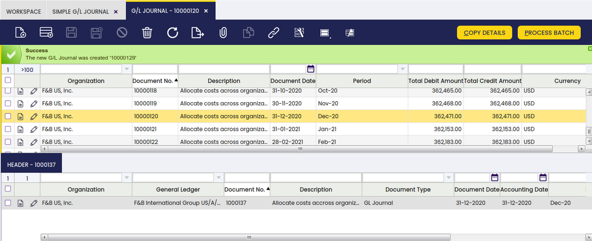
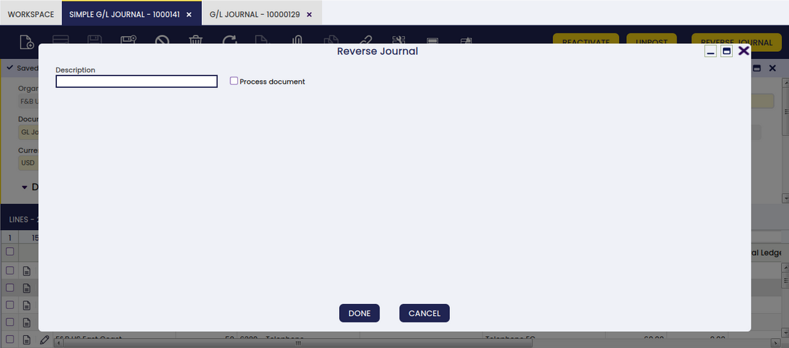
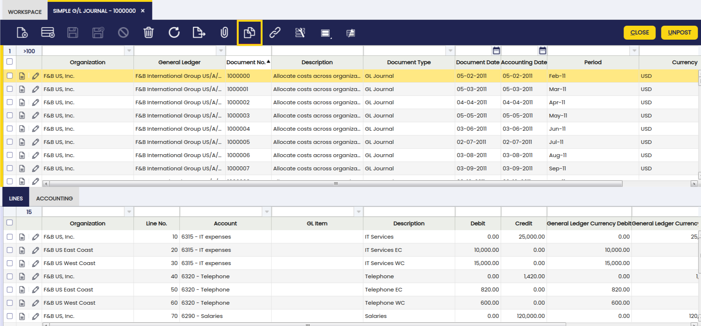

---
tags:
  - Etendo Classic
  - Financial Management
  - Simple G/L Journal
  - GL Journal
  - Accounting Transactions
---

# Simple G/L Journal

:material-menu: `Application` > `Financial Management` > `Accounting` > `Transactions` > `Simple G/L Journal`

## Overview

In Etendo there is a GL Journal window that allows the user to manually enter GL journals in the system. This window has three tabs (Batch, Header and Lines) and in some cases this can be difficult for the user since it might be enough with just two levels (Header and lines). Another issue that this window has is that only accounting schemas can be selected, so when posting the GL journal there is only one entry in the fact\_Acct table.

##### Benefits of the Simple G/L Journal

-   It is a simpler window since it is not necessary to enter a batch. There is one less level of data entry.
-   It is simpler to search journal entries. Without the batch level, it is possible to directly search for specific journal entries.
-   In this window, it is possible to see journal entries that have been created using the GL Journal window, so it is possible to search journal entries as well.

## Header

A G/L journal header can include journals which can contain several journal lines.

Important field to note:

-   *Multi-general ledger*: A flag
    -   If it is not marked, the General ledger field is shown from then on.
    -   If it is marked, the system will not show the General ledger field, and it will not be taken into account for next operations.

## Lines

The lines tab allows the user to enter the journal entries of a G/L journal as well as G/L item payment related information.

One field to note:

-   G/L Item: Combo where all G/L Items are shown. It has a logical display, and it is only shown when **Multi-general ledger** is flagged in the header.

!!! info
    If **Multi-general ledger** is not flagged, then the Account field is shown instead.

### Accounting

Accounting information related to the GL Journal

When Posting the Header:

-   All accounting entries are created either with account combinations (Account) or GL item. There cannot be mixed lines.
-   If **Multi-General Ledger** is:
    -   Not marked: It can only select accounts that belong to just one accounting schema (defined in the header) so when posting the document there will be just one journal entry. This behaviour will not change. Posting process exactly as GL Journal window
    -   Marked: the user selects G/L Items and since it can have different valid combinations when posting the document, it will have as many entries as in different accounts it is defined the GL item and the organization defined in the header.

### Exchange Rates

The exchange rate tab allows the user to enter an exchange rate between the organization's general ledger currency and the currency of the G/L Journal to be used while posting the G/L Journal to the ledger.

!!! info
    This tab will only be displayed when Multi General Ledger is enabled.

## GL Journal Reverse 

!!! info
    To be able to include this functionality, the Financial Extensions Bundle must be installed. To do that, follow the instructions from the marketplace: [Financial Extensions Bundle](https://marketplace.etendo.cloud/#/product-details?module=9876ABEF90CC4ABABFC399544AC14558){target="\_blank"}. For more information about the available versions, core compatibility and new features, visit [Financial Extensions - Release notes](../../../../../whats-new/release-notes/etendo-classic/bundles/financial-extensions/release-notes.md).

This functionality is specifically useful for companies that have a month close, instead of an end year close, but with pending payments (in or out). It allows the user to open or close the period without taking into account the payments until they are made.

In order to use this functionality, in both "GL journal" and "Simple GL journal" windows, the user can click the button "Reverse Journal" in the toolbar when selecting an entry.

In this way, Etendo automatically creates a reverse entry that compensates the amount in the credit and debit columns. 
> 
!!! info
    It is important to note that, by default, the reverse document will be created as a draft. That is why Etendo shows the check "process document" when clicking the "Reverse Journal" button. In this way, the user can complete the document.

As seen below, Etendo shows a success notification in green with the new GL Journal number.

When comparing the original GL Journal to the reverse GL Journal, the debit and credit columns show the compensation, since the amounts are reversed.

##### Original GL journal

##### Reverse GL Journal

### Changing description option in the Simple GL Journal window

If the GL Journal entry is created in the Simple GL Journal window, it is possible for the user to change the description of the GL journal, once it clicks on the "Reverse Journal" button, in the corresponding pop up window. 
 

This is useful to distinguish between the original GL journal and the reverse one. 

## Bulk Posting

!!! info
    To be able to include this functionality, the Financial Extensions Bundle must be installed. To do that, follow the instructions from the marketplace: [Financial Extensions Bundle](https://marketplace.etendo.cloud/#/product-details?module=9876ABEF90CC4ABABFC399544AC14558){target="\_blank"}. For more information about the available versions, core compatibility and new features, visit [Financial Extensions - Release notes](../../../../../whats-new/release-notes/etendo-classic/bundles/financial-extensions/release-notes.md).

The Bulk Posting functionality allows the user to post or unpost multiple records by selecting the corresponding records and clicking the **Bulk posting** button.

Also, the Accounting Status of the record/s is shown in the status bar, in form view, or in a column, in grid view.
>
!!! info
    For more information, visit [the Bulk Posting module user guide](../../../../../user-guide/etendo-classic/optional-features/bundles/financial-extensions/bulk-posting.md).

## G/L Journal Clone

!!! info
    To be able to include this functionality, the Financial Extensions Bundle must be installed. To do that, follow the instructions from the marketplace: [Financial Extensions Bundle](https://marketplace.etendo.cloud/#/product-details?module=9876ABEF90CC4ABABFC399544AC14558){target="_blank"}. For more information about the available versions, core compatibility and new features, visit [Financial Extensions - Release notes](../../../../../whats-new/release-notes/etendo-classic/bundles/financial-extensions/release-notes.md).

With this functionality, the user is able to seamlessly clone a selected entry. This feature not only duplicates the entry but also creates a detailed description that includes the original order number.

In order to do this, select the record to clone and click the copy record button in the toolbar.

In this way, a copy of the original record is generated, including a description and a copy number, as seen below.

This functionality enhances the efficiency of managing journal entries, making it easier to replicate and document transactions accurately.

---

This work is a derivative of [Financial Management](http://wiki.openbravo.com/wiki/Financial_Management){target="\_blank"} by [Openbravo Wiki](http://wiki.openbravo.com/wiki/Welcome_to_Openbravo){target="\_blank"}, used under [CC BY-SA 2.5 ES](https://creativecommons.org/licenses/by-sa/2.5/es/){target="\_blank"}. This work is licensed under [CC BY-SA 2.5](https://creativecommons.org/licenses/by-sa/2.5/){target="\_blank"} by [Etendo](https://etendo.software){target="\_blank"}.
