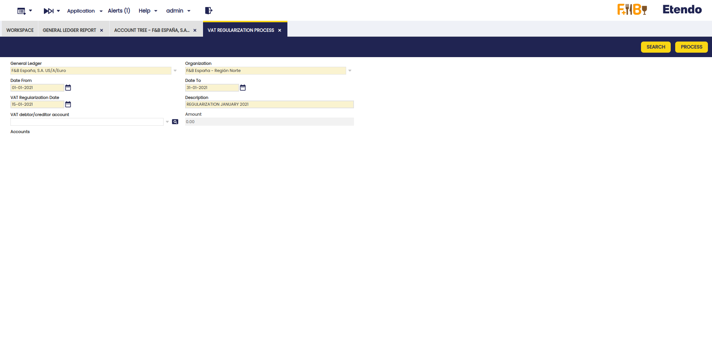
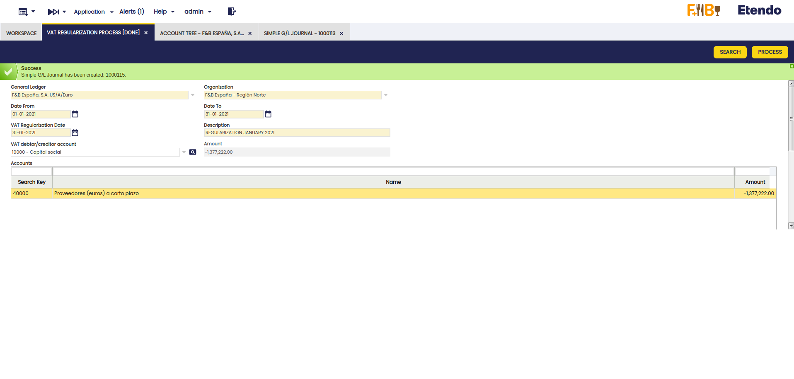
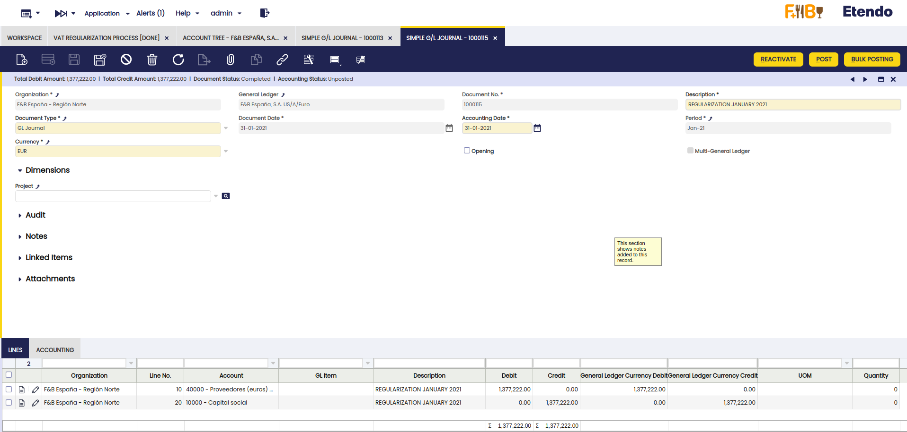
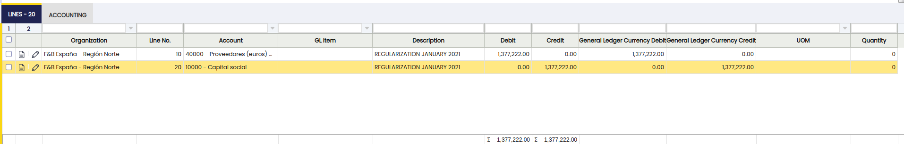

---
tags:
  - Etendo Classic
  - Financial Management
  - Accounting
  - VAT Regularization
  - Financial Extensions
---

# VAT Regularization

:material-menu: `Application` > `Financial Management` > `Accounting` > `Transactions` > `VAT Regularization Process`

!!!info
    To be able to include this functionality, the Financial Extensions Bundle must be installed. To do that, follow the instructions from the marketplace: [Financial Extensions Bundle](https://marketplace.etendo.cloud/#/product-details?module=9876ABEF90CC4ABABFC399544AC14558){target="\_blank"}. For more information about the available versions, core compatibility and new features, visit [Financial Extensions - Release notes](../../../../../whats-new/release-notes/etendo-classic/bundles/financial-extensions/release-notes.md).

## Overview

The VAT Regularization module allows you to automatically adjust the accounts to ensure that the VAT balance is correct. This means, checking the accounts in which this process is necessary and creating the corresponding GL journal to regularize the VAT. This process is essential for maintaining accurate financial records and compliance with tax regulations.

The following are the required steps to carry this out for a specific period of time.

## VAT Regularization Process

### Account Setup

In order to enable an account to be part of the VAT regularization process, it is necessary to enter the Account tree window, select the organization to which the account belongs, and, in the Element Value tab, select the corresponding account and check the VAT Regularization box as active.

### VAT Regularization Process

1. Go to `Application` > `Financial Management` > `Accounting` > `Transactions` > `VAT Regularization Process` window.
2. Complete the following required fields:
    - **General Ledger**: Select the general ledger to which the account to be regularized belongs.
    - **Organization**: Select the organization to which the account belongs.
    - **Date From**: Start date of the regularization.
    - **Date To**: End date of the regularization.
    - **VAT Regularization Date**: Date on which the regularization will take place.
    - **Description**: Description identifying the periods being regularized.
    
3. Click the **Search** button. This will display a grid with the accounts marked with the VAT Regularization checkbox, as explained in [Account Setup](#account-setup).

4. The Amount field shows us the value to be regularized. In addition, the Amount field in the header gives us a sum of all the amounts of the accounts that were chosen to regularize. In this case, it is the same value as the amount of the line because there is only one account to regularize.
5. Select an account in the VAT debtor/creditor account field to balance the accounts once the VAT accounts once the simple GL journal entry is generated.

### GL Journal Entry Generation
1. Click the **Process** button to generate the simple GL journal entry.

    !!!important
        Remember this process affects all the accounts resulting from the search, so selecting the corresponding accounts must be done when marking the VAT regulularization checkbox in the setup step.

2. Go to the Simple G/L Journal window and filter the Document No. field by the number generated in the process (e.g. **1000123**).

3. Here, verify that the header has been created with the corresponding lines.

### Entry Review and Posting

1. Check that a line has been created per account to be regularized (in this case, account 40000) and that the amount to be regularized (-1,377,222.00) has been added in the Debit field in positive.

2. Verify that another line has been created with the account selected in the VAT debtor/creditor account field with the corresponding amount in the Credit field.

3. Post the manual journal entry with the **Post** process.
4. Generate the GL journal report again and verify that the **Balance** for account 40000 is zero, which indicates that the VAT has been regularized correctly.

!!!info
    With this module, from Etendo, version 24.2.0, and Financial Extensions Bundle, version 1.15.0, the field sorting has been modified so that GL journal entries are always sorted at the end of the day. This change ensures that, in the General Ledger report and in General Ledger Report Advanced, the manual journal entries of the day are displayed correctly sorted.

---

This work is a derivative of [Financial Management](http://wiki.openbravo.com/wiki/Financial_Management){target="\_blank"} by [Openbravo Wiki](http://wiki.openbravo.com/wiki/Welcome_to_Openbravo){target="\_blank"}, used under [CC BY-SA 2.5 ES](https://creativecommons.org/licenses/by-sa/2.5/es/){target="\_blank"}. This work is licensed under [CC BY-SA 2.5](https://creativecommons.org/licenses/by-sa/2.5/){target="\_blank"} by [Etendo](https://etendo.software){target="\_blank"}.
