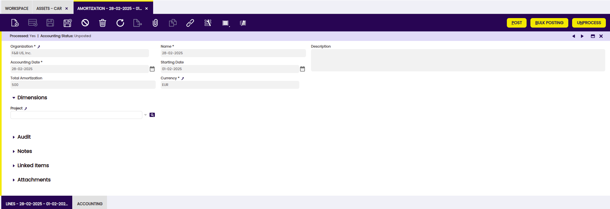
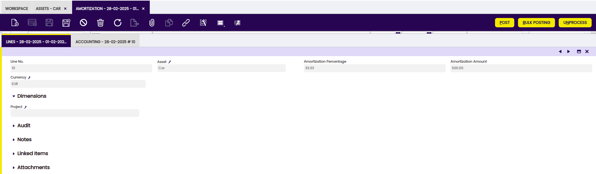
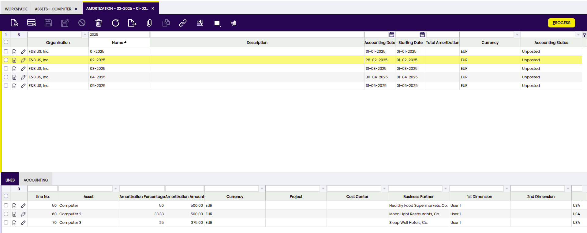

---
tags:
  - Etendo Classic
  - Financial Management
  - Assets
  - Amortization
  - Financial Extensions
---

# Amortization

:material-menu: `Application` > `Financial Management` > `Assets` > `Amortization`

## Overview

In the  Amortization window, assets depreciations are recorded, grouped by date. In addition, from this window, these records are processed and posted to the general ledger.

## Amortization window

From the header, amortizations are created for particular periods.

Fields to note: 

- **Organization**: Organizational entity within client.
- **Name**: A non-unique identifier for a record/document often used as a search tool.
- **Description**: A space to write additional related information.
- **Accounting Date**: The date on which the asset is to be booked.
- **Starting Date**: Date from which amortization begins. 
- **Total Amortization**: amortization amount. 
- **Currency**: An accepted medium of monetary exchange that may vary across countries.
- **Project**: Identifier of a project defined within the Project & Service Management module.

## Lines tab

Each line shows the amortized assets and details of amortization.

Fields to note: 

- **Line No.**: Indicates the unique line for a document. 
- **Asset**: the asset to be amortized.
- **Amortization Percentage**: Amortization Percentage (either calculated in Time or Percentage).
- **Amortization Amount**: Amortization Amount.
- **Currency**: Indicates the currency to be used when processing this document.
- **Project**: Identifier of a project defined within the Project & Service Management module.

## Accounting tab

Accounting information related to the amortization once the document is posted.

Fields to note: 

- **Accounting Date**: The date this transaction is recorded on in the general ledger. This date also indicates which accounting period within the fiscal year this transaction will be part of.
- **Account**: The account used. 
- **Debit**: The Account Debit Amount indicates the transaction amount converted to this organization's accounting currency.
- **Credit**: The Account Credit Amount indicates the transaction amount converted to this organization's accounting currency.

!!!info 
    For more information about Financial Account functionality visit [Financial Account](../../../basic-features/financial-management/receivables-and-payables/transactions/financial-account.md).

## Accounting Dimensions Assets

<iframe width="560" height="315" src="https://www.youtube.com/embed/1a1UNCnNNcI?si=DbicgZnWjtmkScDh" title="YouTube video player" frameborder="0" allow="accelerometer; autoplay; clipboard-write; encrypted-media; gyroscope; picture-in-picture; web-share" referrerpolicy="strict-origin-when-cross-origin" allowfullscreen></iframe>

!!! info
    To be able to include this functionality, the Financial Extensions Bundle must be installed. To do that, follow the instructions from the marketplace: [Financial Extensions Bundle](https://marketplace.etendo.cloud/#/product-details?module=9876ABEF90CC4ABABFC399544AC14558){target="_blank"}.For more information about the available versions, core compatibility and new features, visit [Financial Extensions - Release notes](../../../../../whats-new/release-notes/etendo-classic/bundles/financial-extensions/release-notes.md).

This module allows that in the Amortization window, unlike the standard operation in which asset depreciations were grouped according to specific dates, to group the depreciation records **only per periods** (monthly or yearly) in case of calculated type (time) and even yearly for calculated type (percentage). Also in the grouping the dimensions are not considered.
In addition, the accounting dimensions are maintained in the amortization lines to be used in the generation of accounting entries.

## Bulk Posting

!!! info
    To be able to include this functionality, the Financial Extensions Bundle must be installed. To do that, follow the instructions from the marketplace: [Financial Extensions Bundle](https://marketplace.etendo.cloud/#/product-details?module=9876ABEF90CC4ABABFC399544AC14558){target="\_blank"}. For more information about the available versions, core compatibility and new features, visit [Financial Extensions - Release notes](../../../../../whats-new/release-notes/etendo-classic/bundles/financial-extensions/release-notes.md).

The Bulk Posting functionality allows the user to post or unpost multiple records by selecting the corresponding records and clicking the **Bulk posting** button.

Also, the Accounting Status of the record/s is shown in the status bar, in form view, or in a column, in grid view.
> 
!!! info
    For more information, visit [the Bulk Posting module user guide](../../../../../user-guide/etendo-classic/optional-features/bundles/financial-extensions/bulk-posting.md).

## How to Reactivate Amortizations

!!! info
    To be able to include this functionality, the Financial Extensions Bundle must be installed. To do that, follow the instructions from the marketplace: [Financial Extensions Bundle](https://marketplace.etendo.cloud/#/product-details?module=9876ABEF90CC4ABABFC399544AC14558){target="\_blank"}. For more information about the available versions, core compatibility and new features, visit [Financial Extensions - Release notes](../../../../../whats-new/release-notes/etendo-classic/bundles/financial-extensions/release-notes.md).

Etendo allows multiple amortizations to be processed and unprocessed. This process is available for amortizations which share the same status. The status of the amortization can be seen in the status bar.  

---

This work is a derivative of [Financial Management](http://wiki.openbravo.com/wiki/Financial_Management){target="\_blank"} by [Openbravo Wiki](http://wiki.openbravo.com/wiki/Welcome_to_Openbravo){target="\_blank"}, used under [CC BY-SA 2.5 ES](https://creativecommons.org/licenses/by-sa/2.5/es/){target="\_blank"}. This work is licensed under [CC BY-SA 2.5](https://creativecommons.org/licenses/by-sa/2.5/){target="\_blank"} by [Etendo](https://etendo.software){target="\_blank"}.
