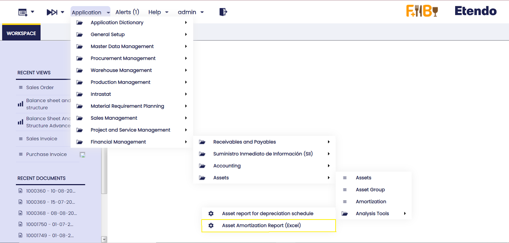
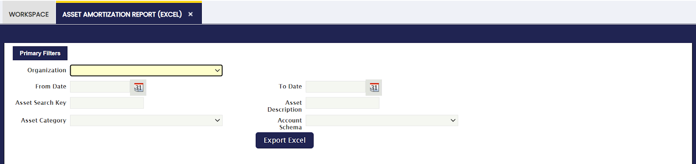
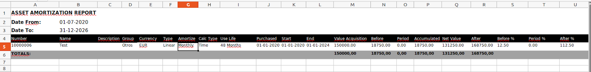

---
tags:
  - Etendo Classic
  - Financial Management
  - Assets
  - Asset Amortization Report
  - Financial Extensions
---

# Asset Amortization Report (Excel)

:material-menu: `Application` > `Financial Management` > `Assets` > `Asset Amortization Report (Excel)`

!!! info
    To be able to include this functionality, the Financial Extensions Bundle must be installed. To do that, follow the instructions from the marketplace: [Financial Extensions Bundle](https://marketplace.etendo.cloud/#/product-details?module=9876ABEF90CC4ABABFC399544AC14558){target="_blank"}. For more information about the available versions, core compatibility and new features, visit [Financial Extensions - Release notes](../../../../../whats-new/release-notes/etendo-classic/bundles/financial-extensions/release-notes.md).

## Overview

The Amortization report allows downloading excel reports. The report can be found in Financial Management > Assets > Analysis Tools > Asset Amortization Report. 

This report allows filtering by organization, date, asset or any particular description, category and general ledger configuration.  

Once the information is filtered, an excel sheet is downloaded as shown in the following image:

This report takes into account the amortization lines of each Asset. That is to say, the report will still be generated even if the amortization lines are not processed or posted. 

It is necessary to filter by date since the information comes out over this filtering. That is, the accumulated period, net value and subsequent report fields will depend on this filtering.

For example: Period date filtered 01-01-2022 and 31-12-2022

**Period:** The total of the amortization lines between 01/01/2022 and 12/31/2022 will be shown.  
**Accumulated:** The sum of the amortization lines between 01/01/2022 and 12/31/2022 and the total amortization lines prior to 01/01/2022 will be shown.  
**Net Value:** The Asset value minus the Accumulated field will be shown.   
**After:** The amortization lines after 31-12-2022 will be shown.   

!!! info
    When the end date within the Assets window is filled in, that Asset will not appear in the report if the filtered date is after the end date of the Asset.

---

This work is a derivative of [Financial Management](http://wiki.openbravo.com/wiki/Financial_Management){target="\_blank"} by [Openbravo Wiki](http://wiki.openbravo.com/wiki/Welcome_to_Openbravo){target="\_blank"}, used under [CC BY-SA 2.5 ES](https://creativecommons.org/licenses/by-sa/2.5/es/){target="\_blank"}. This work is licensed under [CC BY-SA 2.5](https://creativecommons.org/licenses/by-sa/2.5/){target="\_blank"} by [Etendo](https://etendo.software){target="\_blank"}.
