# Financial Management - Assets

## Overview

This section describes the windows related to assets, part of the Financial Management in Etendo. These are:

[:material-file-document-outline: Assets](#assets){ .md-button .md-button--primary }  

[:material-file-document-outline: Asset Group](#asset-group){ .md-button .md-button--primary }  

[:material-file-document-outline: Amortization](#amortization){ .md-button .md-button--primary }  

[:material-file-document-outline: Asset Amortization Report (Excel)](#amortization-report){ .md-button .md-button--primary }  

## Assets

:material-menu: `Application` > `Financial Management` > `Assets` > `Assets`

### Overview

The user can define company-owned assets and configure their amortization characteristics. 

### Assets window

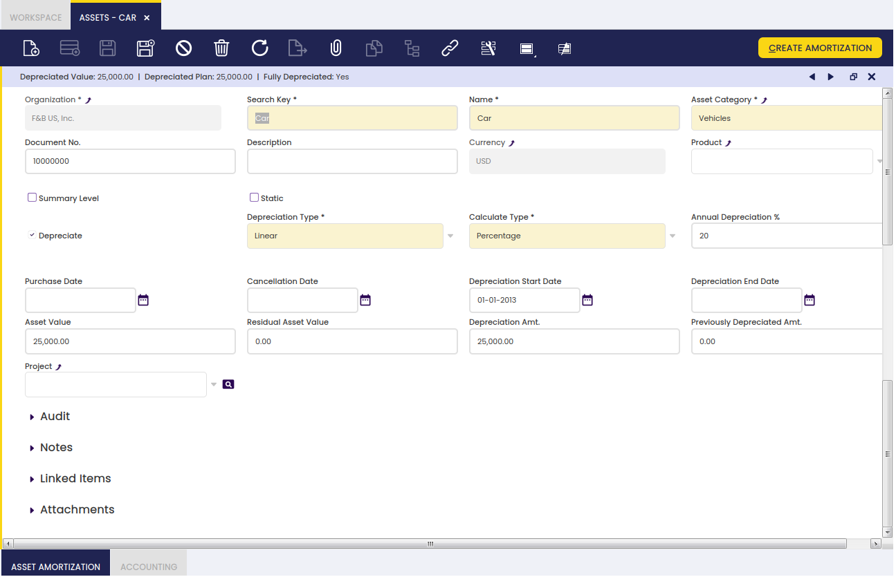

Fields to note:

-   **Organization** : Organizational entity within client.
-   **Search Key** : A fast method for finding a particular record.
-   **Name** : A non-unique identifier for a record/document often used as a search tool.
-   **Asset Category** : A classification of assets based on similar characteristics defined in the [Asset Group window](#asset-group-window). Configuration fields will be completed automatically according to the characteristics defined in this window. 
-   **Document No.** : An automatically generated identifier for all documents.
-   **Description** : A space to write additional related information.
-   **Currency** : An accepted medium of monetary exchange that may vary across countries.
-   **Product** : An item produced by a process.
-   **Summary Level** : When checked, it groups other assets and displays them in tree view. 
-   **Static** : Prevents from moving the record into the tree view.
-   **Depreciate** : The asset is used internally and will be depreciated.
-   **Depreciation Type** : Linear. It indicates the method used to depreciate this asset.
-   **Calculate Type** : It indicates how amortization will be calculated: Time (monthly or yearly) or Percentage (yearly).
-   **Annual Depreciation %** : Depreciation annual %
-   **Amortize** : Asset schedule.
-   **Usable Life - Years** : Years of the usable life of the asset.
-   **Usable Life - Months** : Months of the usable life of the asset.
-   **Every Month Is 30 Day** : If checked, it calculates the amortization plan every month to be considered as a 30 day month and years of 365 days. If it is not checked, it considers real month days and leap-years.
-   **Purchase Date** : Purchase date.
-   **Cancellation Date** : life-utility date.
-   **Depreciation Start Date** : Depreciation Start Date. The amortization plan will be calculated starting from this date.
-   **Depreciation End Date** : Depreciation end date.
-   **Asset Value** : Asset value.
-   **Residual Asset Value** : Residual asset value amount.
-   **Depreciation Amt.** : Depreciation Amount.
-   **Previously Depreciated Amt.** : This amount is subtracted to the Depreciation amount when calculating the amortization plan. Total amount to be depreciated = Depreciation Amount - Previously Depreciated Amount
-   **Depreciated Value** : Depreciated value.
-   **Project** : Identifier of a project defined within the Project & Service Management module.

#### Buttons

- **Create Amortization**: The Create Amortization button populates the Asset Amortization tab. It creates the amortization plan based on the asset definition.

- **Recalculate Amortization**: The Recalculate Amortization button allows the user to update information when needed. 

### Asset Amortization tab

Asset amortizations for a selected asset are added to this tab. 

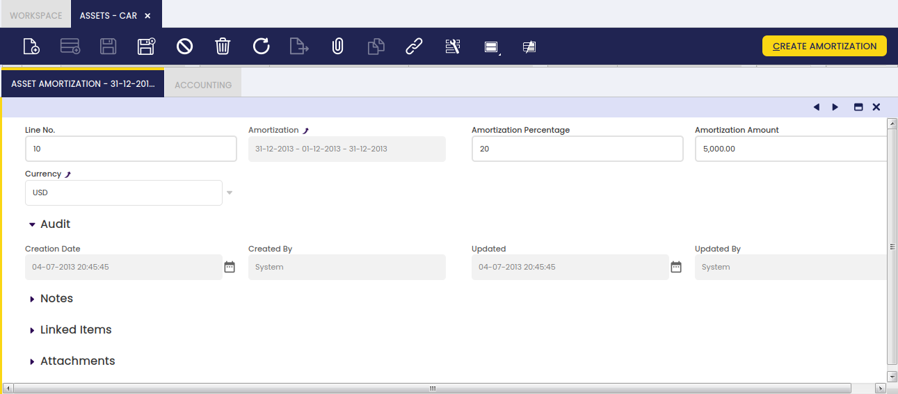

-   **Line No.** : A line stating the position of this request in the document.
-   **Amortization** : The depreciation or reduction of a product value over time.
-   **Amortization Percentage** : Amortization Percentage
-   **Amortization Amount** : Amortization Amount
-   **Currency** : An accepted medium of monetary exchange that may vary across countries.

The Asset Amortization tab shows the depreciation plan of the asset based on its usable life-time and its value that is the amount to be depreciated. The asset value is split within its usable life (months or years), therefore each depreciation plan line represents a percentage of the total depreciation amount of the asset.

!!! note
    It is important to remark that the proposed depreciation plan lines can be manually removed whenever they are not processed and posted. In that case, the create amortization process can be executed once again, therefore the depreciation plan is recalculated. This is very useful in those cases where the value of an asset changes or the usable life-time of an asset changes once its depreciation has started.

There is a restriction though, when removing lines, if the user plans to click the Recalculate Amortization button afterwards. The lines must be removed always starting from the latest one and without leaving undeleted lines in between. For example, having amortization lines such as:

-   Line 10 - January depreciation plan line
-   Line 20 - February depreciation plan line
-   Line 30 - March depreciation plan line

The depreciation line of February cannot be removed until the depreciation line of March is removed.

The process assumes that if the March depreciation line exists, then the February depreciation line exists.

### Accounting tab

The user can create and edit G/L accounts to be used in transactions which include a selected asset.

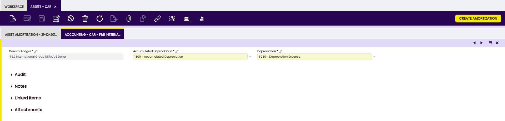

- **General Ledger**: The book containing all financial transactions recorded for the legal entity.
- **Accumulated Depreciation**: Accumulated Depreciation Account. 
- **Depreciation**: Depreciation account.

The shown accounts are configured by default and can be changed. 

### Accounting Dimensions Assets

!!! info
    To be able to include this functionality, the Financial Extensions Bundle must be installed. 
    To do that, follow the instructions from the marketplace: [Financial Extensions Bundle](https://marketplace.etendo.cloud/#/product-details?module=9876ABEF90CC4ABABFC399544AC14558){target="_blank"}.
    For more information about the available versions, core compatibility and new features, visit
    [Financial Extensions - Release notes](https://docs.etendo.software/latest/whats-new/release-notes/etendo-classic/bundles/financial-extensions/release-notes/).

In addition to the existing Product dimensions for assets, this module allows users to select **additional accounting dimensions** which 
will be automatically transferred to the amortization lines, allowing better integration with accounting processes. 

The dimensions the user can apply to the asset creation process are the following: 

- **Business Partner**
- **Activity**
- **1st Dimension**
- **2nd Dimension** 
- **Sales Region**
- **Campaign**
- **Cost Center**

!!! info
    When creating or recalculating the amortization schedule for an asset, the specified accounting dimensions are transferred to the lines of the amortization schedule.

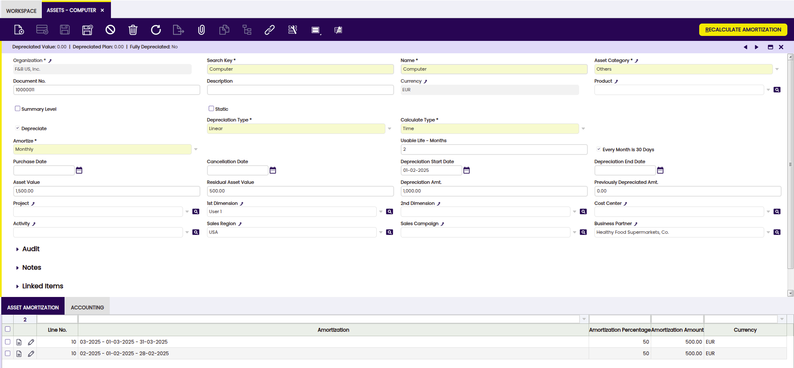

!!! info
    For more information about Dimensions configuration visit [Dimensions](../../../../etendo-classic/basic-features/financial-management/accounting/setup.md#dimension).

#### Buttons 

- **Create Amortization**: The Create Amortization button generates the amortization lines in the Asset Amortization tab related to the selected asset.  In addition, these same lines are added in the Amortization window, grouping them only according to the **depreciation period**, (monthly or yearly) in case of calculated type (time) and even yearly for calculated type (percentage).
 

## Asset Group

:material-menu: `Application` > `Financial Management` > `Assets` > `Asset Group`

### Overview

Assets can be grouped into different categories with the aim of helping their depreciation management and analysis.

### Asset Group window 

Asset Group window allows the user to create and configure every asset category your organization may need.

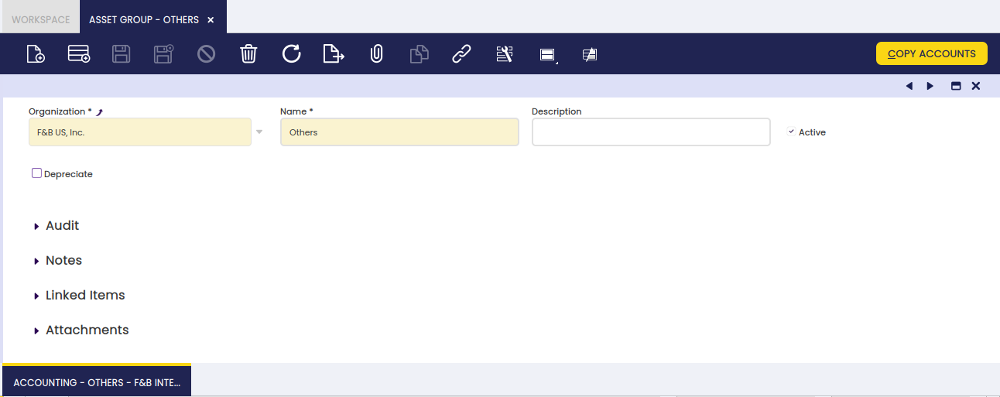

As shown in the image above, the creation of an asset category requires the user to enter below listed information for each category:

-   **Name** or short name which helps to easily find a category.
-   **Description** a space to write additional related information.
-   **Depreciate** indicates if the assets of this group will be depreciated.
-   **Depreciation Type** Linear. It indicates the method used to depreciate this asset.
-   **Calculate Type** it indicates how the depreciation will be calculated: Time (monthly or yearly) or Percentage (yearly).
-   **Annual Depreciation** Annual percentage used to depreciate this asset.
-   **Amortize** it refers to the periods chosen between depreciation entries (monthly, yearly).
-   **Usable Life - Months** Years of the usable life of the asset.
-   **Usable Life - Years** Months of the usable life of the asset.

Depreciation configuration will be inherited from the asset category when creating a new asset from the Asset window.

### Accounting tab

Each asset category allows the user to configure a different set of accounts to use to post asset depreciation.

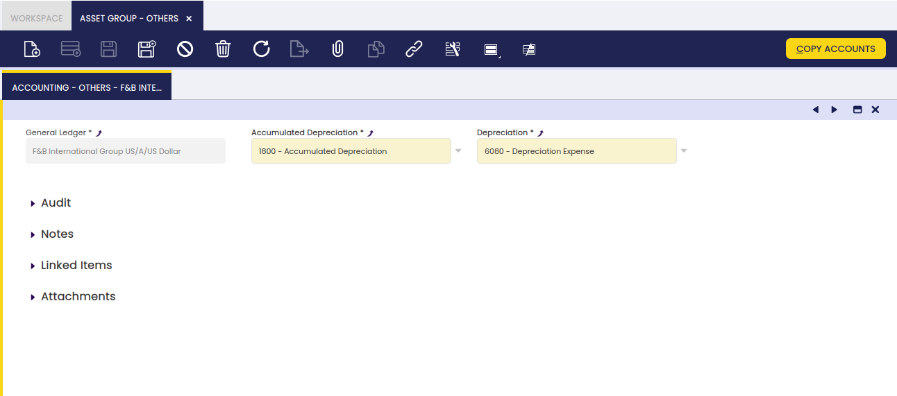

## Amortization

:material-menu: `Application` > `Financial Management` > `Assets` > `Amortization`

### Overview

In the  Amortization window, assets depreciations are recorded, grouped by date. In addition, from this window, these records are processed and posted to the general ledger.

### Amortization window

From the header, amortizations are created for particular periods.

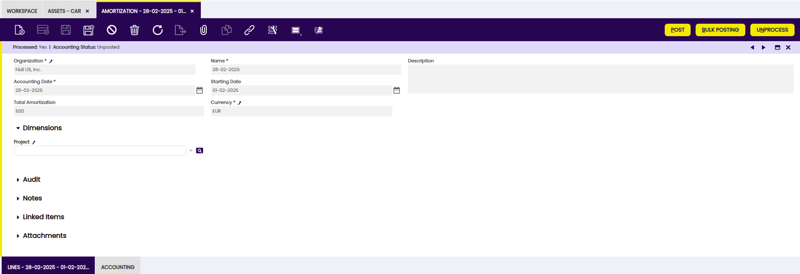

Fields to note: 

- **Organization**: Organizational entity within client.
- **Name**: A non-unique identifier for a record/document often used as a search tool.
- **Description**: A space to write additional related information.
- **Accounting Date**: The date on which the asset is to be booked.
- **Starting Date**: Date from which amortization begins. 
- **Total Amortization**: amortization amount. 
- **Currency**: An accepted medium of monetary exchange that may vary across countries.
- **Project**: Identifier of a project defined within the Project & Service Management module.

### Lines tab

Each line shows the amortized assets and details of amortization.

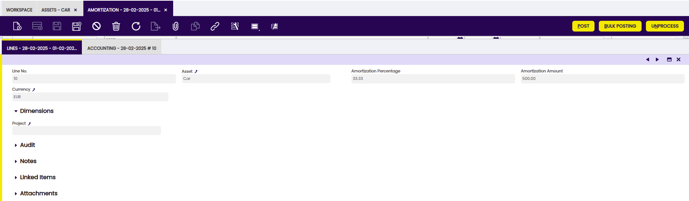

Fields to note: 

- **Line No.**: Indicates the unique line for a document. 
- **Asset**: the asset to be amortized.
- **Amortization Percentage**: Amortization Percentage (either calculated in Time or Percentage).
- **Amortization Amount**: Amortization Amount.
- **Currency**: Indicates the currency to be used when processing this document.
- **Project**: Identifier of a project defined within the Project & Service Management module.

### Accounting tab

Accounting information related to the amortization once the document is posted.

Fields to note: 

- **Accounting Date**: The date this transaction is recorded on in the general ledger. This date also indicates which accounting period within the fiscal year this transaction will be part of.
- **Account**: The account used. 
- **Debit**: The Account Debit Amount indicates the transaction amount converted to this organization's accounting currency.
- **Credit**: The Account Credit Amount indicates the transaction amount converted to this organization's accounting currency.

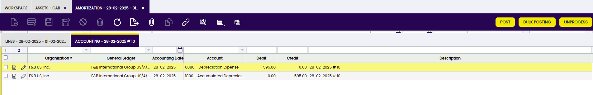

!!!info 
    For more information about Financial Account functionality visit [Financial Account](../../../basic-features/financial-management/receivables-and-payables/transactions.md#financial-account).

### Accounting Dimensions Assets

!!! info
    To be able to include this functionality, the Financial Extensions Bundle must be installed. To do that, follow the instructions from the marketplace: [Financial Extensions Bundle](https://marketplace.etendo.cloud/#/product-details?module=9876ABEF90CC4ABABFC399544AC14558){target="_blank"}.For more information about the available versions, core compatibility and new features, visit [Financial Extensions - Release notes](https://docs.etendo.software/latest/whats-new/release-notes/etendo-classic/bundles/financial-extensions/release-notes/).

This module allows that in the Amortization window, unlike the standard operation in which asset depreciations were grouped according to specific dates, to group the depreciation records **only per periods** (monthly or yearly) in case of calculated type (time) and even yearly for calculated type (percentage). Also in the grouping the dimensions are not considered.
In addition, the accounting dimensions are maintained in the amortization lines to be used in the generation of accounting entries.

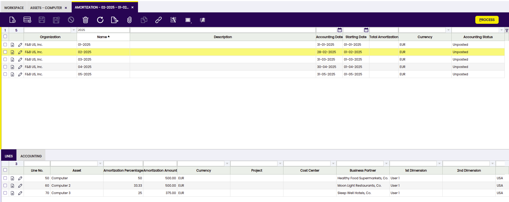

### Bulk Posting

!!! info
    To be able to include this functionality, the Financial Extensions Bundle must be installed. To do that, follow the instructions from the marketplace: [Financial Extensions Bundle](https://marketplace.etendo.cloud/#/product-details?module=9876ABEF90CC4ABABFC399544AC14558){target="\_blank"}. For more information about the available versions, core compatibility and new features, visit [Financial Extensions - Release notes](../../../../../whats-new/release-notes/etendo-classic/bundles/financial-extensions/release-notes.md).

The Bulk Posting functionality allows the user to post or unpost multiple records by selecting the corresponding records and clicking the **Bulk posting** button.

Also, the Accounting Status of the record/s is shown in the status bar, in form view, or in a column, in grid view.
> 
!!! info
    For more information, visit [the Bulk Posting module user guide](../../../../../user-guide/etendo-classic/optional-features/bundles/financial-extensions/bulk-posting.md).

## How to Reactivate Amortizations

!!! info
    To be able to include this functionality, the Financial Extensions Bundle must be installed. To do that, follow the instructions from the marketplace: [Financial Extensions Bundle](https://marketplace.etendo.cloud/#/product-details?module=9876ABEF90CC4ABABFC399544AC14558){target="\_blank"}. For more information about the available versions, core compatibility and new features, visit [Financial Extensions - Release notes](../../../../../whats-new/release-notes/etendo-classic/bundles/financial-extensions/release-notes.md).

Etendo allows multiple amortizations to be processed and unprocessed. This process is available for amortizations which share the same status. The status of the amortization can be seen in the status bar.  

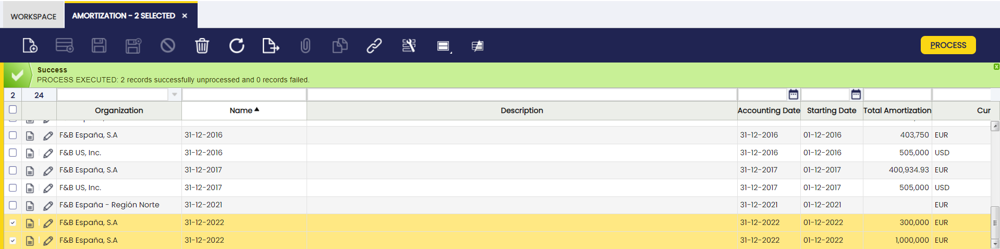

## Asset Amortization Report (Excel)

:material-menu: `Application` > `Financial Management` > `Assets` > `Asset Amortization Report (Excel)`

!!! info
    To be able to include this functionality, the Financial Extensions Bundle must be installed. To do that, follow the instructions from the marketplace: [Financial Extensions Bundle](https://marketplace.etendo.cloud/#/product-details?module=9876ABEF90CC4ABABFC399544AC14558){target="_blank"}. For more information about the available versions, core compatibility and new features, visit [Financial Extensions - Release notes](../../../../../whats-new/release-notes/etendo-classic/bundles/financial-extensions/release-notes.md).

The Amortization report allows downloading excel reports. The report can be found in Financial Management > Assets > Analysis Tools > Asset Amortization Report. 

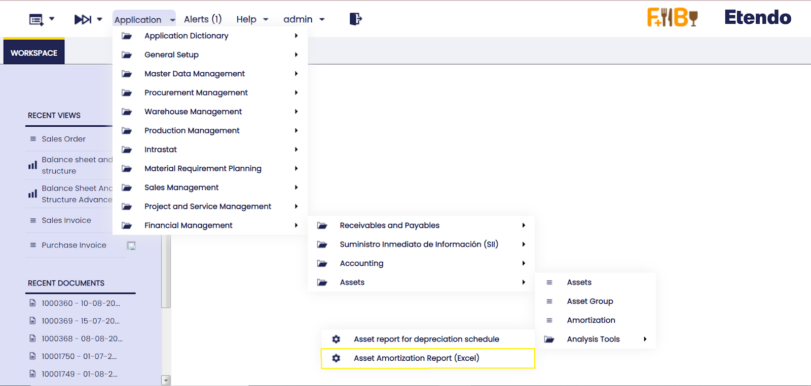

This report allows filtering by organization, date, asset or any particular description, category and general ledger configuration.  

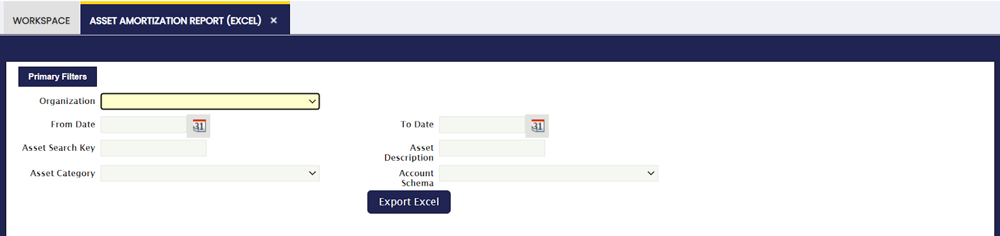

Once the information is filtered, an excel sheet is downloaded as shown in the following image:

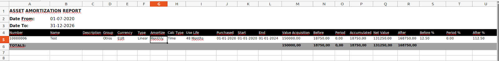

This report takes into account the amortization lines of each Asset. That is to say, the report will still be generated even if the amortization lines are not processed or posted. 

It is necessary to filter by date since the information comes out over this filtering. That is, the accumulated period, net value and subsequent report fields will depend on this filtering.

For example: Period date filtered 01-01-2022 and 31-12-2022

**Period:** The total of the amortization lines between 01/01/2022 and 12/31/2022 will be shown.  
**Accumulated:** The sum of the amortization lines between 01/01/2022 and 12/31/2022 and the total amortization lines prior to 01/01/2022 will be shown.  
**Net Value:** The Asset value minus the Accumulated field will be shown.   
**After:** The amortization lines after 31-12-2022 will be shown.   

!!! info
    When the end date within the Assets window is filled in, that Asset will not appear in the report if the filtered date is after the end date of the Asset.