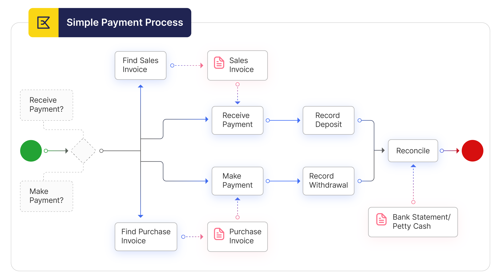
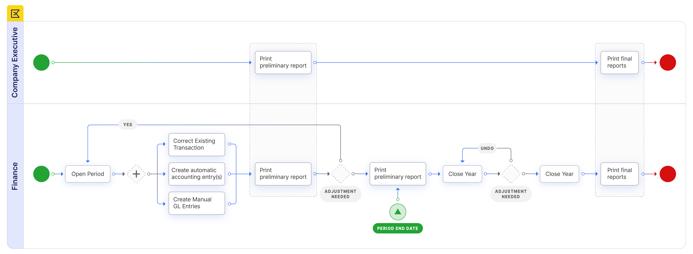
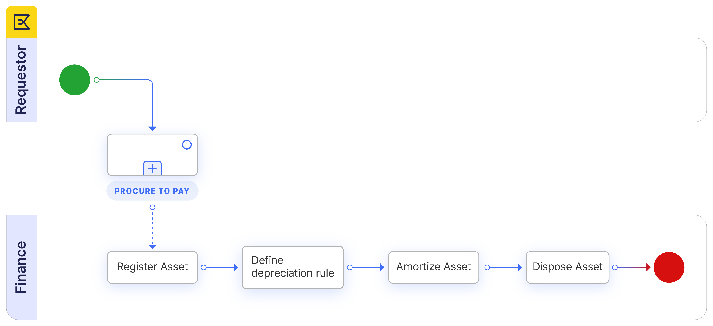

# Financial Management - Getting Started

## Overview

Etendo automatically generates an accounting representation of all the transactions within the enterprise that have an economic relevance.

Accounting is the system of tracking the assets, the debts, the income and the expenses of a business.
In Etendo, most of the accounting entries are automatically created while posting [documents](../financial-management/accounting/setup.md#document-type). 

- [Goods Receipts](../procurement-management/transactions.md#goods-receipts) and [Purchase Invoices](../procurement-management/transactions.md#purchase-invoice) in the [Procurement Management](../procurement-management/getting-started.md) business area
- [Goods Shipments](../sales-management/transactions.md#goods-shipment) and [Sales Invoices](../sales-management/transactions.md#sales-invoice) in the [Sales Management](../sales-management/getting-started.md) business area.

Accounting entries not directly related to [documents](../financial-management/accounting/setup.md#document-type) managed within a given application area can be created and posted in a [G/L Journal](../financial-management/accounting/transactions.md#gl-journal). For instance a provision for stock depreciation accounting entry.

There are three ways of accounting in Etendo:

- To manually post each document by using the process button *Post*.
The process button *Post* can be found in the window used to create a given document. For instance a purchase invoice is created and therefore could be posted in the [Purchase Invoice window](../procurement-management/transactions.md#purchase-invoice). This button is shown for accounting users if the Attribute *ShowAcct* is visible for them. This configuration is enabled through a [Preference](../general-setup/application.md#preference).

- To manually post all the documents/transactions related to a given database table for instance the table *Invoices*, by using the process [GL posting by DB Tables](../financial-management/accounting/transactions.md#gl-posting-by-db-tables)

- or to automatically post accounting transactions of any type by scheduling the *Accounting Server Process* in the [Process Request](../general-setup/process-scheduling/process-request.md) window.

Accounting activities such as:

- creating and opening of the accounting periods
- entering and posting accounting transactions
- managing payables and receivables accounts as well as the asset depreciation
- reviewing and submitting financial and tax reports to the official authorities
- and closing the accounting year

are performed within the Financial Management application area.

Finally Etendo has an *integrated accounting system* that combines general accounting and analytical accounting:

- *General accounting* aims to primary exploit dimensions such as *Account* (or *Subaccount* in Etendo terms)
- *Analytical accounting* aims to exploit other dimensions such as *Cost Center* or *Campaign* to get a slightly different but also rich financial information.

In other words, Etendo allows to post transactions to the ledger which can include different dimensions:

- Those dimensions can be centrally maintained in the [Client](../general-setup/client.md) therefore are available to all the organizations within that Client.
Moreover Organizations of that Client can also have additional dimensions configured separately in its [General Ledger Configuration](../financial-management/accounting/setup.md#general-ledger-configuration).

Those dimensions are then available just for that Organization.

- On the other hand, those dimensions can not be centrally maintained in the [Client](../general-setup/client.md) but independently maintained in the [Organization's General Ledger Configuration](../financial-management/accounting/setup.md#dimension).

This application area covers the [Period End Close to Financial Report](../financial-management/getting-started.md#period-end-close-to-financial-report) business flow and the [Payables and Receivables Management](../financial-management/getting-started.md#payables-and-receivables-management) business flow.

## Payables and Receivables Management

<iframe width="560" height="315" src="https://www.youtube.com/embed/DmeLeQkg-cg?si=See53a-gprwcumPw" title="YouTube video player" frameborder="0" allow="accelerometer; autoplay; clipboard-write; encrypted-media; gyroscope; picture-in-picture; web-share" allowfullscreen></iframe>

Payables and Receivables Management addresses customer collections and supplier payments as well as other payments not related to invoices but to orders (prepayments) or G/L Items.

### Configuration

The following setup needs to be done before performing the process:

- [Payables and Receivables Document Types](../financial-management/accounting/setup.md#document-type).
- [Payment Methods](../financial-management/receivables-and-payables/transactions.md#payment-method).
- [Financial Accounts](../financial-management/receivables-and-payables/transactions.md#financial-account).
- [Business Partners](../master-data-management/master-data.md#business-partner) to use above configured Payment Methods and Financial Accounts.

!!!note
    It is not required to perform any additional setup for the Payables and Receivables Management business process if Food & Beverage (F&B) sample client shipped with Etendo by default is going to be used to explore it. The sample data set already contains the roles, warehouses, business partners, products and prices pre-configured.

### Execution

Overall the *Payables and Receivables Management* business process can be split into the following steps:

- the creation of the orders and invoices to be paid
- the creation of payments do not related to orders/invoices
- the review of the status of the pending payments
- the receipt of the payments made by the customers
- the payment of the supplier's invoices
- the recording of the financial account transactions
- and the reconciliation of the financial account transactions

#### Creation of the orders/invoices to be paid

In the [Procure to Pay](../procurement-management/getting-started.md#procure-to-pay-business-flow) and [Order to Cash](../procurement-management/getting-started.md#procure-to-pay-business-flow) business process we have seen how the orders and invoices have been generated.

Every time that a Purchase or Sales Order is booked or a Purchase or Sales Invoice is completed a Payment Plan is created for that Order / Invoice.

A payment plan contains the payment amount/s expected for the document and its fulfillment. At the same time the invoice  Payment Monitor section gets activated that allows tracking the invoice payment status directly from the invoice window.

!!!note
    The Payment Monitor section allows to track the purchase & sales invoice payment status directly from the invoice window. In this section it is possible to know whether an invoice is fully paid or not. If the invoice has not been fully paid then the Payment Monitor informs the user how much has been received, how much is pending, the due date of the next payment and the amount that is expected to be received on that date. The status is updated automatically when any payment action happens and by a background process. The date when the payment status was last time calculated is displayed in the form. Grid filtering allows to filter invoices based on fully paid or not criteria.

#### Creation of payments do not related to orders/invoices

In the [Period End Close to Financial Report](../financial-management/getting-started.md#period-end-close-to-financial-report) business process we have seen how a payment can be made or received by using a [GL Journal](../financial-management/accounting/transactions.md#gl-journal) therefore it is not related to an order/invoice but to a G/L Item.

A G/L Item payment created in a G/L Journals implies:

- the creation of a [Payment Made](../financial-management/receivables-and-payables/transactions.md#payment-out) if the payment information is entered in the *Credit* line of the G/L Journal.

The status of this payment would either be *Payment Made* or *Awaiting Execution* or *Withdrawn not Cleared* depending on the [configuration](../financial-management/receivables-and-payables/setup.md#payment-method-configuration) of the payment method used and linked to the financial account where the money is taken from.

- Or the creation of a [Payment Received](../financial-management/receivables-and-payables/transactions.md#payment-in) if the payment information is entered in the *Debit* line of the G/L Journal.

The status of this payment would either be *Payment Received* or *Awaiting Execution* or *Deposited not Cleared* depending on the [configuration](../financial-management/receivables-and-payables/setup.md#payment-in-configuration) of the payment method used and linked to the financial account where the money is going to be deposited in.

#### Review of the status of the pending payments

On a periodic basis the Finance Staff reviews the status of the payments pending to be collected / to be paid by looking:

- At the [Payment Report](../financial-management/receivables-and-payables/analysis-tools.md#payment-report) and filtering by the status Awaiting Payment which means that no payment has been either received or made against the order or invoice yet.

     Overdue check-box allows to narrow down the search and to show only overdue payments.
     Payment Type displays Receivables, Payables or both.

- In addition to this Sales and Purchase Invoice windows in grid view are available to search open invoices by setting Payment Complete field to No.

#### Receipt of the customer's payments

When a Payment is Received the Finance staff can register it in different ways:

- In the [Payment In](../financial-management/receivables-and-payables/transactions.md#payment-in) window by selecting the Sales Invoices and/or Orders payment is received against.

!!!note
    Many businesses do not wish to extend credit to specific customers and may therefore have a payment term that requires payment against an order. In effect this is a prepayment of an invoice. Later when an invoice is created from an order that already has a payment received against it the invoice automatically inherits the payment received against the order.

- Using the [Add Payment button](../sales-management/transactions.md#lines_5) directly within the corresponding Sales Invoice. It can be when the user has received a single payment for a particular invoice and prefers to browse for that invoice in order to allocate the payment to it.

- It is also possible to automate receiving of a payment on completion of a Sales Invoice through the configuration of the [Payment Method](../financial-management/receivables-and-payables/transactions.md#payment-method).

If collection does not happen on time:

- The Expected Date of the [Payment Plan](../sales-management/transactions.md#payment-plan_1) can be modified, preventing the debt from being overdue.

- The Amount due of the Payment Plan can be:
     split in two or more amounts due at a later expected date.
    or grouped in just one amount due at a later expected date.

- The outstanding balance for a customer can be totally or partially written off.

#### Payment of the supplier's invoices

There are 3 ways to pay vendor bills:

- Using the Payment Proposal process. This process supports the automatic payment of a large number of invoices based on the due dates of the lines of the Payment Plan associated with the open Purchase Invoices. The finance staff can request a proposal of all invoices to be paid based on a number of criteria, review that proposal, and then automatically make the payment.

- In the Payment Out window by selecting the Purchase Invoices and/or Orders payment is made against.

!!!note
    Many businesses do not have credit extended to them and may therefore be required to make a payment against a purchase order. In effect this is a prepayment of a purchase invoice. Later when an invoice is created from an order that already has a payment made against it the invoice automatically inherits the payment made against the order.
  
  

- Using the Add Payment button directly within the corresponding Purchase Invoice. It can be when the user needs to make a single payment for a particular invoice and prefers to browse for that invoice in order to allocate the payment to it.

- It is also possible to automate making of a payment on completion of a Purchase Invoice through the configuration of the Payment Method.

#### Recording of the financial account transactions

Finance Staff records Withdrawals and Deposits as transactions in the [Financial Account](../financial-management/receivables-and-payables/transactions.md#financial-account) window by pressing the Add Transaction button and selecting either the received or made payments.
This step in the process can also be completely automated through the configuration of the [Payment Method](../financial-management/receivables-and-payables/setup.md#payment-method-configuration) so that the payments are automatically withdrawn or deposited when they are completed.

#### Reconciliation of the financial account transactions

Finance Staff receives a bank statement (a paper or electronic bank statement) and reconciles the transactions in the Financial Account marked as Deposited / Withdrawn not Cleared with the actual transactions on the bank statement. This process can be done

- Manually (one by one reconciling the transactions in the Etendo Financial Account with the bank statement lines) by using the Reconcile button of the Financial Account window.

- Automatically by Importing Statement first and then Matching Statement using a matching algorithm.

Additionally, any transactions (receipts and payments) shown on the bank statement and not reflected in the Financial Account should also be entered into Etendo to get them reconciled.

Finally Finance Staff prints the Reconciliation reports (Reconciliation Details, Reconciliations Summary) that explain any difference in the end balance shown for the Financial Account in Etendo and the end balance shown on the bank statement.

## Accounting
### Period End Close to Financial Report

<iframe width="560" height="315" src="https://www.youtube.com/embed/8WAyKf16HmY?si=lHqZ4KLHM-9siwQ8" title="YouTube video player" frameborder="0" allow="accelerometer; autoplay; clipboard-write; encrypted-media; gyroscope; picture-in-picture; web-share" allowfullscreen></iframe>

*Period End Close to Financial Report* business flow manages the open and close of periods.

#### Configuration

This section details the basic and not that basic accounting configuration needed prior to the execution of the *Period End Close to Financial Report* business flow.

#### Basic Configuration

There are three Etendo accounting concepts which need to be explained before describing the basic accounting configuration:

- [Fiscal Calendar](../financial-management/accounting/setup.md#fiscal-calendar)

A fiscal calendar in Etendo is the year and the periods, normally months, when financial transactions and journal entries are posted to the ledger.

- [Account Tree](../financial-management/accounting/setup.md#account-tree)

An account tree is the way Etendo captures the *Chart of Accounts* (CoA) of an Organization.

The Chart of Accounts is a list of all the accounts used in an organization's general ledger.

Accounts such as balance sheet accounts (assets, liabilities and owner's equity) and income statement accounts (revenues, expenses, gains and losses).

!!!Note 
    It is important to remark that in Etendo , the financial reports such as the Balance Sheet and the Income Statement are produced based upon the Chart of Accounts structure.

- [General Ledger configuration](../financial-management/accounting/setup.md#general-ledger-configuration)

The general ledger configuration captures the accounting rules to use while posting the organization's financial transactions to the ledger. Accounting rules such as the *Currency* and the *Chart of Accounts* among others.

Having said that, the accounting configuration detailed in this section is the one required for *legal entities with accounting*, including the business units, because these organization types are the only ones which can have assigned:

- a Chart of Accounts
- a General Ledger configuration
- and a Fiscal Calendar

Obviously these organization types allow posting transactions to the ledger.
Rest of the Organization types behave as explained in the [Initial Organization Setup](../general-setup/enterprise-model/initial-organization-setup.md) and in the [Organization](../general-setup/enterprise-model/organization.md) section.

Very briefly:

- *Legal without accounting* organizations do not require accounting therefore do not require any basic nor advanced accounting configuration.
- *Generic* organizations however can have their own General Ledger configuration and Chart of Accounts but the accounting periods can not be opened and closed independently at its level.
This type of organization inherits the Fiscal Calendar of the *legal with accounting* organization they belong to.
- and finally *Organization* ones can have as well a general ledger configuration and a Chart of Accounts but with the aim of being shared among all the organizations underneath.
This organization type can not have a fiscal calendar assigned and besides the transactions within it are not allowed.

Additionally, some countries such as Spain or France require that a specific *Chart of Accounts* is used in the statutory books, therefore the authorities can see the same list of accounts and the same level of detail in the Income statement and in the Balance Sheet.

On the other hand, there are countries such as the USA where a specific *Chart of Accounts* is not required.

For those cases Etendo provides a Generic Chart of Accounts module which includes a sample Chart of Accounts which can be modified as required.
It is recommended to start from a sample chart of accounts like the generic one and evolve it for the organization's needs rather than starting from scratch.

In-country taxes setup is another key element of the basic accounting configuration.
There can be Localization Packs which include the setup of the taxes for the country while there can be others which do not include the setup of the taxes for the country.
The Generic CoA module does not include any taxes setup.

#### Execution 

Overall the Period End Close to Financial Report business flow can be split into the following steps once the accounting period has been opened:

- the opening of the accounting
- the review of the accounting transactions
- the creation of accounting transactions and G/L item payments
- the printing of the Trial Balance
- the adjustments required prior to the income calculation
- the adjustments require prior to the closing of the accounting year
- the printing of the preliminary Income Statement and Balance Sheet
- the closing of the accounting year
- and the printing of the final Income Statement and Balance Sheet

##### Opening of the accounting

This very first step implies to initialize the balance of the ledger accounts and the financial accounts or banks. The way to do that in Etendo is:

- The ledger accounts balance can be initialized by using a [G/L Journal](../financial-management/accounting/transactions.md#gl-journal) set as *Opening*, therefore that ledger entry is set as the *Opening Ledger Entry*.
A journal line can be created for each account and its opening balance, once done the G/L Journal will validate that the Total Debit of all the entries equals to the Total Credit.
- The financial accounts balance can be initialized in the [Financial Account](../financial-management/receivables-and-payables/transactions.md#financial-account) window, in the *Initial Balance* field, therefore the corresponding financial account/s or banks need to be previously created.

##### Review of the accounting transactions

As already mentioned in Etendo most of the accounting entries are automatically created while posting documents such as a purchase invoice or a sales invoice.
For instance the accounting of a purchase invoice will take:

- the expense account setup for the product being purchased in the [Accounting](../master-data-management/master-data.md#accounting) tab of the *Product* window
- the vendor liability account setup for the vendor in the [Vendor Accounting](../master-data-management/master-data.md#vendor-accounting) tab of the *Business Partner* window
- and the tax credit account setup in the [Accounting](../financial-management/accounting/setup.md#accounting_1) tab of the *Tax Rate* window.

Etendo allows reviewing and correcting if needed the accounting entries of transactional documents such as the invoices.
Same way Etendo allows unposting wrongly posted transactional documents one by one to get them corrected and properly posted once more.

Additionally, the [Accounting Transactions Details](../financial-management/accounting/analysis-tools.md#accounting-transaction-details) report shows all the transactions posted in the ledger with all the details and the [Not Posted Transactions](../financial-management/accounting/transactions.md#not-posted-transaction-report) report shows the transactions which need to be accounted for but have not been accounted yet.

Finally Etendo allows to massively fix accounting errors if any, for instance a vendor liability account wrongly assigned to a vendor or to a set of vendors.
The way to do that is:

- run the [Reset Accounting](../financial-management/accounting/transactions.md#reset-accounting) process for the table being affected for instance the *C_Invoice* table (Purchase Invoice and Sales Invoice table).
- correct the accounting configuration
- get the transactions posted once again by using the [GL Posting by DB Tables](../financial-management/accounting/transactions.md#gl-posting-by-db-tables) feature.
This feature performs a massive posting of all the accounting or just the accounting of a table for instance the *C_Invoice* table (Purchase Invoice and Sales Invoice table).

##### Creation of accounting transactions and G/L item payments

As already mentioned, accounting entries not related to documents managed within a given application area can be created and posted to the ledger by using a [G/L Journal](../financial-management/accounting/transactions.md#gl-journal).
A G/L Journal can also be used to make and/or receive payments do not related to orders/invoices but to G/L items.
G/L items payments are also managed within the [Payables and Receivables management](../financial-management/getting-started.md#payables-and-receivables-management) area.

##### Printing of the Trial Balance to check that Debit=Credit

The [Trial Balance](../financial-management/accounting/analysis-tools.md#trial-balance) is a list indicating the balances of every single general ledger account at a given point in time.

The purpose of the trial balance is to check that debits are equal to credits. If debits do not equal credits that means that an erroneous journal entry must have been posted.

Etendo does not allow posting journal entries which do not balance. A G/L Journal can only be posted if Debit equals Credit, however there could be situations where while posting an invoice rounding differences drive that debit does not exactly equal credit. 

In these situations the difference is posted in a specific suspense account. [Suspense](../financial-management/accounting/setup.md#general-accounts) accounts are configured in the General Ledger configuration.

##### Adjustments required prior to the income calculation

An organization's income statement shows the organization's financial performance over a period of time (usually one year) as the difference between:

- the organization's revenue
- and the organization's expenses

In order to get an accurate income calculation, there are some adjustments required to be done first:

- the organization needs to *review the revenues and the expenses* to be sure that the ones accounted within the period which are going to be closed are the ones which should be accounted regardless whether they are paid or not. This kind of adjustment is not required if the organization follows the accrual method of accounting that is Etendo method of accounting.
Under the accrual method of accounting, revenue is recorded as soon as services are provided or goods are delivered and therefore invoiced, regardless of when cash is received.
Similarly, expenses are recognized as soon as the company receives goods or services and therefore gets invoiced, regardless of when it actually pays for them.

- the organization needs to calculate the *Cost of Goods Sold* (CoGS). The CoGS is the amount that the company paid for the goods that it sold over the course of the period. This calculation depends on the method of keeping track of inventory. There are two primary methods, the perpetual method and the periodic method:

   the perpetual method is used by any business that keeps real-time information on inventory levels and that tracks inventory on an item-by-item basis.
   This method allows very accurate recordkeeping as to the Cost of Goods Sold which is the sum of the cost of all the items sold over the period.

   The periodic method is used by any business that counts inventory at regular intervals.
   When using this method Cost of Goods Sold is calculated using the following equation:
   (Beginning Inventory + Inventory purchases - Ending Inventory = Cost of Goods Sold)
   Besides if a business is dealing with changing per-unit inventory costs, a specific method of calculating the CoGS needs to be used, that could either be FIFO, LIFO or Average Cost.

Finally an income statement can separate *Operating Expenses* such as salaries and rent from *Non-Operating Expenses* such as a lawsuit.

Operating Expenses are the expenses related to the normal operation of the business and are likely to be incurred in future periods as well.

This way allows the calculation of the *Operating Income* as the difference between the *Gross Profit* and the *Total Operating Expenses*.

##### Adjustments required prior to the closing of the accounting year

Other adjustments required can be:

- Long term amounts must be reclassified to short term amounts. The long term amount reclassified to short term amount is the amount due in the next year.
This process is usually done for long term doubts for instance. In Etendo this kind of transaction can be manually created by using a [GL Journal](../financial-management/accounting/transactions.md#gl-journal).
- Taxes such as the VAT needs to be settled periodically.
It is important to remark that VAT accounts balance has to be equal to 0 in the last period of the year, as either the organization has to pay to the tax authorities or the other way around.
- Assets depreciation needs to be properly accounted within the period being closed as this adjustment will affect:

   the income statement as depreciation is an expense
   and the debit side of the balance sheet as assets will be decreased by the depreciation amount of the period.

##### The printing of the preliminary Income Statement and Balance Sheet

Once configured, Etendo allows getting and printing the Income Statement and the Balance Sheet whenever it is required as the structure of these reports is based on the chart of accounts tree.

It is very useful to print these financial reports prior to the closing of the year as it allows getting a sense of whether there are some missing adjustments required to be done prior to the closing of the year or not.

During the accounting cycle there are other reports which can also be printed:

- the [General Ledger Report](../financial-management/accounting/analysis-tools.md#general-ledger-report) list all the debits entries and all the credits entries of every T-Account within a given period of time
- the [Journal Entries Report](../financial-management/accounting/analysis-tools.md#journal-entries-report) lists in a chronological order every journal entry posted in the ledger.

##### The closing of the fiscal year

Etendo allows to perform below detailed checks prior to the closing of the fiscal year:

- Run the [Not Posted Transaction](../financial-management/accounting/transactions.md#not-posted-transaction-report) report to verify that there are no transactions and/or documents in status *Complete* not posted yet.
- Check that there are no documents still having a *Draft* status, specially those which require to be [accounted](../financial-management/accounting/setup.md#active-tables).
- Unscheduled the [Accounting Server Process](../general-setup/process-scheduling/process-request.md) therefore an stable scene can be assured.
- Check the [Financial Account/s](../financial-management/receivables-and-payables/transactions.md#financial-account) current balance in Etendo and compare it with the information provided by the banks. It is possible to adjust financial account balance by using G/L Items or [how to transfer funds between financial accounts](../../how-to-guides/how-to-transfer-funds-between-financial-accounts.md).

Before running the close year process the accounting periods can be [closed](../financial-management/accounting/setup.md#openclose-period-control) not to allow any further posting within those periods, but the *13th period*.
The *13th period* is an *adjustment period* which can be used to post the adjustments required to the ledger through [G/L Journals](../financial-management/accounting/transactions.md#gl-journal) prior to closing the year.

The *Close Year* process can be executed from the [End Year Close](../financial-management/accounting/transactions.md#end-year-close) window.

The end-year close process can be executed for *Legal with Accounting* organization types as that organization's type has a *Fiscal Calendar* and *General Ledger* configured.

There is a check-box in the [General Accounts](../financial-management/accounting/setup.md#general-accounts) tab of the *General Ledger Configuration* window which shows how the end-year closing outcome is going to be for the organizations' General Ledger.
That check-box is named *Reverse Permanent Account Balances*. 

- If it is checked the closing of the year process includes an entry to reverse the balance sheet accounts besides the P&L closing entry.
- If it does not check the closing of the year process includes just the P&L closing entry.

Etendo uses the adjustment period (i.e. December 31st) for accounting the closing transactions if any, and the next period's first date (i.e. January 1st) for accounting the opening transactions if any.

!!!info
    For more information, visit the [End Year Close](../financial-management/accounting/transactions.md#end-year-close) window.

##### The printing of the final Income Statement and Balance Sheet

Once a year has been closed every financial report contains the corresponding closing and opening transactions:

- the [Balance Sheet](../financial-management/accounting/analysis-tools.md#balance-sheet-and-pl-structure) will show the financial situation of the organization as of the end of the closed accounting period.
Etendo allows to get a two columns balance sheet:
          One column shows the balances as of the end of the most recent accounting period
          and the other column shows the balances as of the prior period end.

This balance allows seeing how the financial position of the organization has changed over time.

- the [Income Statement](../financial-management/accounting/analysis-tools.md#balance-sheet-and-pl-structure) will show the organization performance over the year closed

And besides: 

- the [General ledger Journal](../financial-management/accounting/analysis-tools.md#general-ledger-report) allows to show for a given accounting period below entries posted by the Close Year process:
    the opening balance entry
    the closing balance entry
    and the P&L closing entry

## Assets 
### Asset Acquisition to Dispose

<iframe width="560" height="315" src="https://www.youtube.com/embed/_PhqumhZr8U?si=KKUCdccNMHP6f0SV" title="YouTube video player" frameborder="0" allow="accelerometer; autoplay; clipboard-write; encrypted-media; gyroscope; picture-in-picture; web-share" allowfullscreen></iframe>

Manages global assets life cycle from acquisition to disposition, including depreciation and other write-downs.

## Relationship with other areas

Financial Management has a connection with other application areas, as there are documents or transactions in those areas which can be posted and therefore be part of a ledger journal to be finally managed within the Financial Management application area.

- [Procurement Management](../procurement-management/getting-started.md) as Purchase Invoices are posted there and Goods Shipments as well as Supplier's Payments or Payments Out can be posted there.
- [Sales Management](../sales-management/getting-started.md) as Sales Invoices are posted there and Goods Shipment as well as customers's Payments or Payments In can be posted there.
- [Warehouse Management](../warehouse-management/getting-started.md) as Physical Inventory is posted there.
- Production Management as for the processing of the Work Effort raw materials are consumed and posted there at cost price as well as Products manufactured.

---

This work is a derivative of [Financial Management](http://wiki.openbravo.com/wiki/Financial_Management){target="\_blank"} by [Openbravo Wiki](http://wiki.openbravo.com/wiki/Welcome_to_Openbravo){target="\_blank"}, used under [CC BY-SA 2.5 ES](https://creativecommons.org/licenses/by-sa/2.5/es/){target="\_blank"}. This work is licensed under [CC BY-SA 2.5](https://creativecommons.org/licenses/by-sa/2.5/){target="\_blank"} by [Etendo](https://etendo.software){target="\_blank"}.