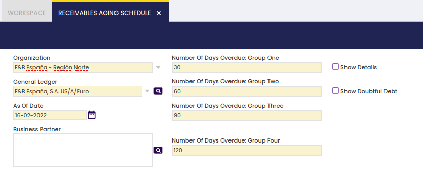
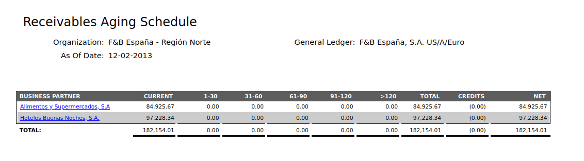
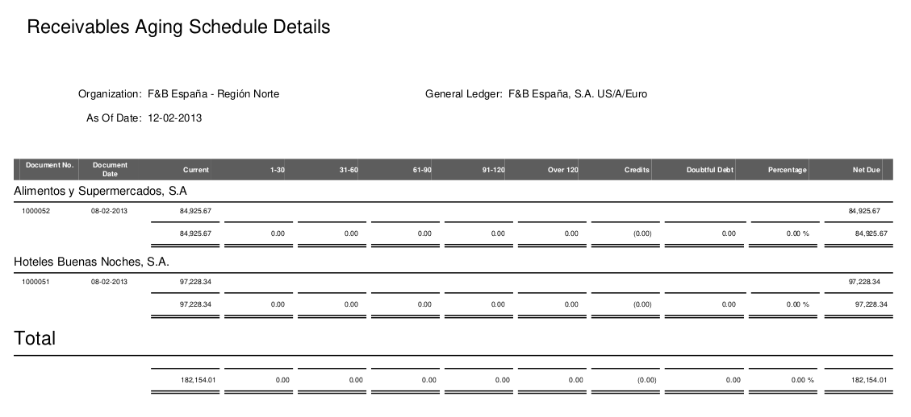
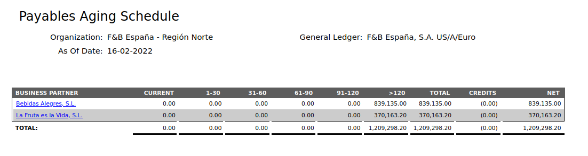
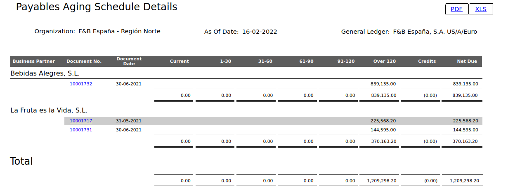
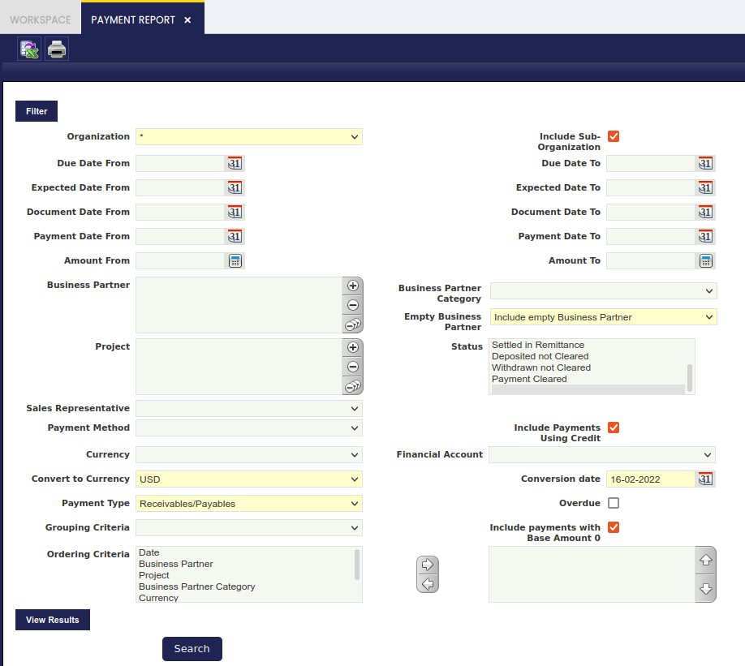
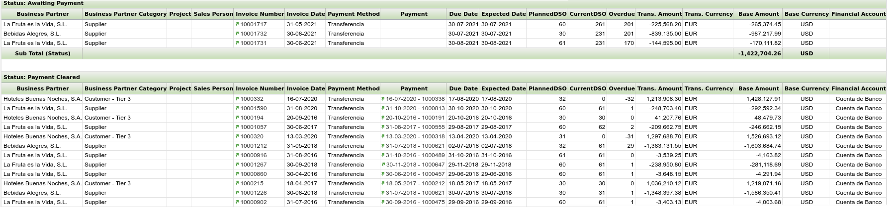
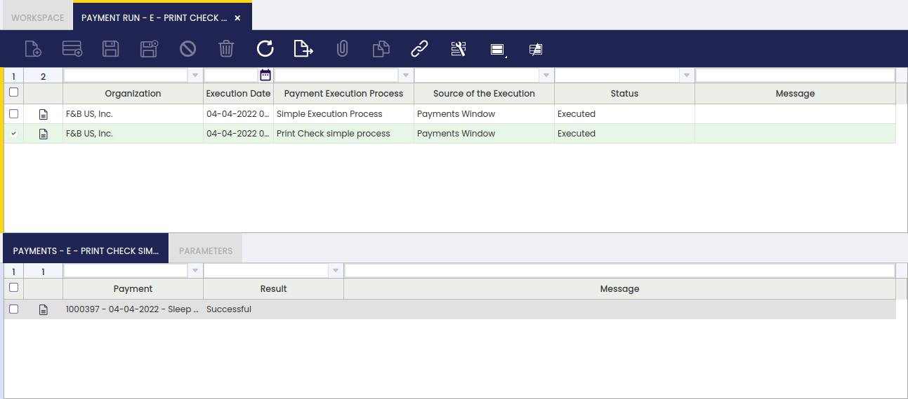
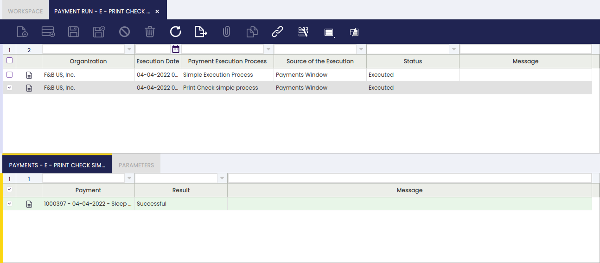
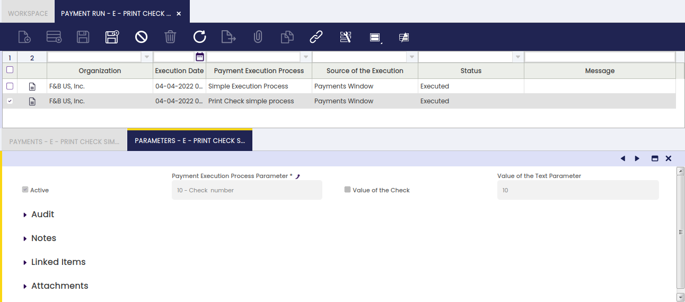

## Overview

This section describes the windows related to financial reports in Etendo. These are:

[:material-file-document-outline: Cashflow Forecast Report](#cashflow-forecast-report){ .md-button .md-button--primary }  

[:material-file-document-outline: Receivables Aging Schedule](#receivables-aging-schedule){ .md-button .md-button--primary }  

[:material-file-document-outline: Payables Aging Schedule](#payables-aging-schedule){ .md-button .md-button--primary }  

[:material-file-document-outline: Payment Report](#payment-report){ .md-button .md-button--primary }  

[:material-file-document-outline: Payment Run](#payment-run){ .md-button .md-button--primary }  

## Cashflow Forecast Report

:material-menu: `Application` > `Financial Management` > `Receivables and Payables` > `Analysis Tools` > `Cashflow Forecast Report`

### **Overview**

The report displays the position of a financial account in a future date, taking into account items planned to collect or pay in the given financial account.

## Receivables Aging Schedule

:material-menu: `Application` > `Financial Management` > `Receivables and Payables` > `Analysis Tools` > `Receivables Aging Schedule`

### Overview

The report shows the past due receivables as of the date the user selects.

### **Source of Information**

The source of the information for this report is invoices as the origin of the receivables and the payables.

-   **Invoices**
    -   The due date of an invoice depends on the payment terms, and it is calculated based on the invoice date.
    -   If invoice has multiple payment plan lines, each line has its own due date.
    -   If there exists payments against the invoice, only those which are in a not confirmed status as of the date of the date filter are considered for this report.

### **Multi-currency**

This report supports multi-currency.

-   **Invoices**: If the exchange rate exists at document level, then the amount is calculated based on this value, if it does not exist, then the rate is taken at client level (Conversion Rates window).

### **Filters**

-   **Organization** (Mandatory).
-   **General Ledger** (Mandatory). The user can filter the results by organization's general ledger. All the amounts will be converted to the currency of the general ledger.
-   **As of Date** (Mandatory). This is the date as of which the report will be processed. Past due dates and payment dates will be calculated based on this date.
-   **Business Partners** (Optional). The user can select multiple Business Partners to filter the results.
-   **Number of Days Overdue: Group One/Two/Three/Four** (Mandatory). The results shown are grouped according to the day ranges the user must enter. The user can enter the ending day for each range, and then, the application will automatically modify the beginning day for the next ranges. For example: in group One the user enters 30, so the range is now 0 - 30, in group Two the user enters 60 so the second range is 31 - 60, and so on and so forth.
-   **Show Details** (Optional). This checkbox offers the user the option to either show the detailed version of the report or the summarized one. It is also used when printing and exporting to an xls file.
-   **Show Doubtful Debt** (Optional). This checkbox offers the user the option to show information about Doubtful Debts in the report.
-   **Voided invoices need to be included** (Only available if Preference "Enable void documents filter in Aging Reports" is set to Y). This checkbox offers the user the option to include/exclude voided documents from the report.
-   **Reversed payments need to be included** (Only available if Preference "Enable reversed payment documents filter in Aging Reports" is set to Y). This checkbox offers the user the option to include/exclude reversed payment documents from the report.

### **HTML/PDF/Excel output**

The report can be generated in HTML, PDF and Excel Spreadsheet format.

### **Receivables Aging Schedule**

It should display a table showing the following data:

-   **Business partner**. A business partner with pending receivables. This is also a link to the detailed version of the report for this Business Partner.
-   **Current**. A sum of all the current debts the business partner has with the organization that are not due as of the date selected.
-   **First day range**. The amount the business partner owes the organization that is due, and its due date is between the range.
-   **Second day range**. Same as above.
-   **Third day range**. Same as above.
-   **Fourth day range**. Same as above.
-   **Fifth day range**. Same as above.
-   **Total**. Current + All the amounts of the day ranges
-   **Credits**. Amount of money that the business partner has left as credit, to be used later. The amount is between brackets because it must be subtracted when calculating the totals.
-   **Net**. Total - Credit of the Business Partner.

If the credits are posted in the same account as the Receivables, then the Net would match the balance of the Business Partner. If the credits are posted in a different account, such as prepayments, then the balance of the Business Partner would match with the Total.

If the **Show Doubtful Debt** check is selected, two more fields are shown.

-   **Doubtful Debt**. The amount classified as Doubtful Debt for that particular Business Partner.
-   **Percentage**. The percentage that represents the Doubtful Debt over the Net Debt of that particular Business Partner.

Also, when Show Doubtful Debt is selected, the Total amount is the sum of all the debts that are not doubtful. Therefore, the Net is Total + Doubtful - Credits

### **Receivables Aging Schedule Details**

It should display a table showing the following data: By clicking on the PDF or the XLS link, either a PDF or a spreadsheet file are generated.

The information is grouped by Business Partner, in case the report is run for more than one. For each Business Partner, the information shown is:

-   **Document No.**. The number of the document and also a link to it.
-   **Document Date**. The accounting date of the document.
-   **Past due date buckets**. The pending amount of the Invoice. It is shown in one column or another depending on the due date and the as of date filter.
-   **Net Due**. The outstanding amount of the Invoice as of date. It is the sum of the amounts in the past due date buckets.
-   **Credits**. Each line represents a Payment that has generated credit, and the amount is the credit left to be used as of date. The amount is between brackets because it must be subtracted when calculating the totals.
-   **A summary line for the Past due date buckets and Credits**.

If the credits are posted in the same account as the Receivables, then the total Net Due would match the balance of the Business Partner. If the credits are posted in a different account, such as prepayments, then the balance of the Business Partner would match with the total Net Due plus the Credits (undoing the subtraction of the credits to the total).

Plus, there is a summary line for all the Business Partners.

If the **Show Doubtful Debt** check is selected, two more fields are shown.

-   **Doubtful Debt**. The amount classified as Doubtful Debt for that particular Invoice.
-   **Percentage**. The percentage that represents the Doubtful Debt over the Net Due of that particular Invoice.

Also, when Show Doubtful Debt is selected, the Total amount is the sum of all the debts that are not doubtful. Therefore, the Net Due is Total + Doubtful - Credits

## Payables Aging Schedule

:material-menu: `Application` > `Financial Management` > `Receivables and Payables` > `Analysis Tools` > `Payables Aging Schedule`

### Overview

The report shows the past due payables as of the date the user selects.

### **Source of Information**

The source of the information for this report is invoices as the origin of the receivables and the payables.

-   **Invoices**
    -   The due date of an invoice depends on the payment terms and iit s calculated based on the invoice date.
    -   If the invoice has multiple payment plan lines, each line has its own due date.
    -   If there exist payments against the invoice, only those which are in a not confirmed status as of the date of the date filter are considered for this report.

### **Multi-currency**

This report supports multi-currency.

-   **Invoices**: If the exchange rate exists at document level, then the amount is calculated based on this value, if it doesn't exist then the rate is taken at client level (Conversion Rates window).

### **Filters**

-   **Organization** (Mandatory).
-   **General Ledger** (Mandatory). The user can filter the results by organization's general ledger. All the amounts will be converted to the currency of the general ledger.
-   **As of Date** (Mandatory). This is the date as of which the report will be processed. Past due dates and payment dates will be calculated based on this date.
-   **Business Partners** (Optional). The user can select multiple Business Partners to filter the results.
-   **Number of Days Overdue: Group One/Two/Three/Four** (Mandatory). The results shown are grouped according to the day ranges the user must enter. The user can enter the ending day for each range, and then, the application will automatically modify the beginning day for the next ranges. For example: in the group One, the user enters 30 so the range is now 0 - 30, in the group Two, the user enters 60 so the second range is 31 - 60, and so on.
-   **Show Details** (Optional). This checkbox offers the user the option to either show the detailed version of the report or the summarized one. It is also used when printing and exporting to an XLS file.
-   **Voided invoices need to be included** (Only available if Preference "Enable void documents filter in Aging Reports" is set to Y). This checkbox offers the user the option to include/exclude voided documents from the report
-   **Reversed payments need to be included** (Only available if Preference "Enable reversed payment documents filter in Aging Reports" is set to Y). This checkbox offers the user the option to include/exclude reversed payment documents from the report

### **HTML/PDF/Excel output**

The report can be generated in HTML, PDF and Spreadsheet format.

### **Payables Aging Schedule**

It should Display a table showing the following data:

-   **Business partner**. A business partner with pending payables. This is also a link to the detailed version of the report for this Business Partner.
-   **Current**. A sum of all the current debts the business partner has with the organization that are not due as of the date selected.
-   **First day range**. The amount owed to the business partner, and it's due date is between the range.
-   **Second day range**. Same as above.
-   **Third day range**. Same as above.
-   **Fourth day range**. Same as above.
-   **Fifht day range**. Same as above.
-   **Total**. Current + All the amounts of the day ranges
-   **Credits**. Amount of money left as credit to the business partner to be used later. The amount is between brackets because it must be subtracted when calculating the totals.
-   **Net**. Total - - Credit of the Business Partner.

If the credits are posted in the same account as the Payables, then the Net would match the balance of the Business Partner. If the credits are posted in a different account, such as prepayments, then the balance of the Business Partner would match with the Total.

### **Payables Aging Schedule Details**

It displays a table showing the following data: By clicking on the PDF or the XLS link, either a PDF or a spreadsheet file are generated.

The information is grouped by Business Partner, in case the report is run for more than one. For each Business Partner, the information shown is:

-   **Document No.**. The number of the document and also a link to it.
-   **Document Date**. The accounting date of the document.
-   **Past due date buckets**. The pending amount of the Invoice. It is shown in one column or another depending on the due date and the as of date filter.
-   **Net Due**. The outstanding amount of the Invoice as of date. It is the sum of the amounts in the past due date buckets.
-   **Credits**. Each line represents a Payment that has generated credit, and the amount is the credit left to be used as of date. The amount is between brackets because it must be subtracted when calculating the totals.
-   **A summary line for the Past due date buckets and Credits**.

If the credits are posted in the same account as the Payables, then the total Net Due would match the balance of the Business Partner. If the credits are posted in a different account, such as prepayments, then the balance of the Business Partner would match with the total Net Due plus the Credits (undoing the subtraction of the credits to the total).

Plus, there is a summary line for all the Business Partners.

## Payment Report

:material-menu: `Application` > `Financial Management` > `Receivables and Payables` > `Analysis Tools` > `Payment Report`

### Overview

The Payment Report displays Receivables and/or Payables information, which can be filtered by an extensive set of available filters.

Receivables and/or Payables information is shown grouped by the payment status, besides additional grouping and ordering criteria can also be defined.

The Payment Report is an Etendo dimensional report which contains below specific filtering options:

-   **Dates**: enter a **Date From** and a **Date To** to be used while retrieving the payment's data, in relation to:
    -   the payment due date
    -   the document paid date
    -   and the payment date
-   **Amounts**: enter an **Amount From** and an **Amount To** to be used while retrieving the payment's data
-   **Empty Business Partner**: select whether it is required or not to include in the report payments not related to a business partner but to a **G/L item** or a **Fee**. The options available are:
    -   **Include Empty Business Partner**: if this selection is made, the report includes also payments not related to a business partner.
    -   **Exclude Empty Business Partner**: if this selection is made, the report excludes any payment not related to a single business partner.
    -   **Only Empty Business Partner**: if this selection is made, the report only includes payments not related to a single business partner.
-   the Payment Status: the options available are:
    -   Awaiting Payment
    -   Awaiting Execution
    -   Voided
    -   Payment Made
    -   Payment Received
    -   Deposited not Cleared
    -   Withdrawn not Cleared
    -   Payment Cleared
-   the **Sales Representative.** It will show only Payments related to Invoices that have been invoiced for this Sales Representative.
-   the **Payment Method** and the **Financial Account** of the payment
-   the checkbox **"Include Payments Using Credit"** allows to
-   the **"Convert to Currency"** field allows the user to select a currency, therefore the "Transaction Amounts" in other currency than the one chosen are converted to the chosen currency and displayed in the field "Base Amount".
-   the "**Conversion date**" field allows the user to define a date to select the system conversion rate to exchange transaction amounts.
-   the **Payment Type**: the options available are:
    -   Receivables
    -   Payables
    -   Receivables & Payables
-   the checkbox "**Overdue**" allows the user to include in the report just overdue payments.
-   Finally, it is also possible to define an additional **Grouping Criteria** and **Ordering Criteria** to be used while showing the payment data output.
    -   **Grouping criteria** such as:
        -   Business Partner
        -   Project
        -   Business Partner Category
        -   Currency
        -   Account (Financial Account)
    -   **Ordering criteria** such as:
        -   Date (Payment Date)
        -   Project
        -   Business Partner Category
        -   Currency
        -   Due date (Payment due date)
        -   Account (Financial Account)
        -   Business Partner

!!! warning
    Note that if "Business Partner" for instance is selected as grouping criteria, it will be removed from the ordering criteria list, as grouping implies ordering.

The Payment Report is launched by pressing the process button "**Search**". An example of the output of the report is shown in the image below:

Some relevant fields to note are:

-   **Invoice Number**: the green arrow allows the user to navigate to the payment plan of the sales/purchase invoice if there is only one invoice number shown in this field.
-   **Payment**: the green arrow allows the user to navigate to the invoice/document's payment
-   **PlannedDSO** (Planned Days Sales Outstanding): the number of days between the date of the invoice and the date it was due to be paid, calculated with the formula **(Invoice) Due date - Invoice Date**.
-   **CurrentDSO** (Current Days Sales Outstanding):
    -   if there is a payment, this field shows the number of days between the date of the invoice and the date of the payment, calculated with the formula **Payment Date - Invoice Date**.
    -   if there is not a payment, this field shows the number of days the invoice is pending to be paid, calculated with the formula **Current Date - Invoice Date**.
-   **Overdue** this fields indicates whether a payment was received on time (overdue number is set to zero), early (overdue number is a negative number) or late (overdue number is a positive number)

An invoice marked with an (\*) means that the invoice has been paid by using a credit payment.

Several invoices marked with (\*\*) means that the invoices have been paid by using the same credit payment.

## Payment Run

:material-menu: `Application` > `Financial Management` > `Receivables and Payables` > `Analysis Tools` > `Payment Run`

### Overview

The payment run window is a read-only window which shows relevant information of each payment run executed within an organization.

A payment run can contain only one payment or several payments grouped and executed together.

It is possible to check the status and result of the payment run as well as the result and message of every single payment inside each payment run.

### Payment Run

The execution date and the execution status of each payment run is shown in this window among other relevant data such as the source of the execution.

The Payment Run window only shows the payments received or made which required an additional execution step, therefore an Automatic Execution Type is configured for the payment method used while making/receiving those payments.

The source of the payment execution can be:

-   **Automatically from Invoice process** - which means that the payment is automatically executed upon invoice completion.
    -   To get this option, the payment method needs to be configured as described below:
        -   the Automatic Receipt check-box is selected for the payments received
        -   and/or the Automatic Deposit check-box is selected for the payments received
        -   and the Deferred checkbox is not selected.
-   **Automatically from Payment process** - which means that the payment is automatically executed upon payment creation.
    -   To get this option the Deferred checkbox needs to be selected.
-   **Execute Payment Form** - which means that the payment has been executed from the Payment Execution form.
    -   To get this option the Deferred checkbox needs to be selected, therefore the deferred payment can be later on executed in the payment execution form.
-   **Payment Proposal Window** - which means that the payment has been executed from the Payment Proposal window.
    -   To get this option the Deferred checkbox needs to be selected, therefore the deferred payment can be later on executed from the payment proposal window.
-   **Payments Window** - which means that the payment has been executed either in the payment out or in the payment in window.
    -   To get this option the Deferred checkbox needs to be selected, therefore the deferred payment can be executed later on in the corresponding payment window.

There are three "Status" available:

-   Executed, which means that the payment run has been executed. The automatic execution processes currently delivered by Etendo will all get an "Executed" status.
-   and "Partially Executed" and "Pending" which are status that can be used by modules such as the Check Printing module to manage those cases where a payment was not successfully executed due to any problem occurring due to a connection failure.

#### Payments

The payment tab lists the payments executed in a payment run.

#### Parameters

The parameters tab shows the value of the payment execution process parameter/s.

An Execution Process can have a set of parameters defined.

For instance, the "Print Check simple process" execution process delivered by Etendo only requires the check number upon execution of the payment.

This work is a derivative of ["Financial Management"](http://wiki.openbravo.com/wiki/Financial_Management) by [Openbravo Wiki](http://wiki.openbravo.com/wiki/Welcome_to_Openbravo), used under [CC BY-SA 2.5 ES](https://creativecommons.org/licenses/by-sa/2.5/es/). This work is licensed under [CC BY-SA 2.5](https://creativecommons.org/licenses/by-sa/2.5/) by [Etendo](https://etendo.software).