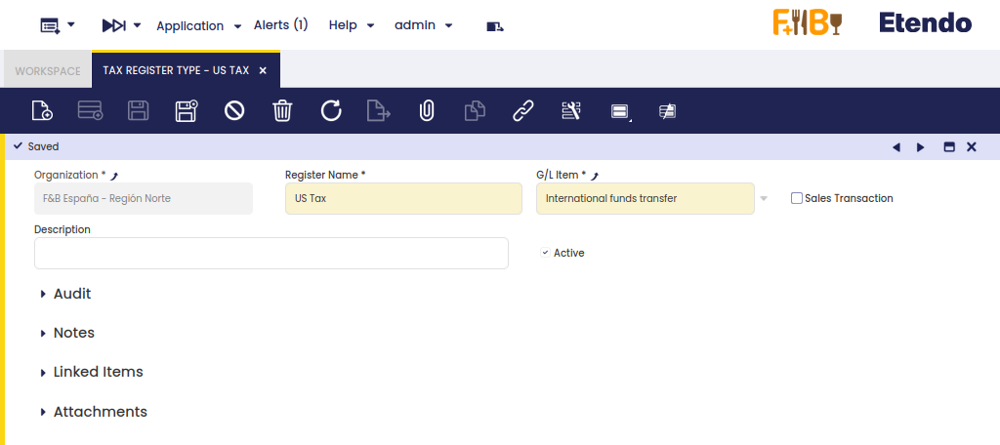
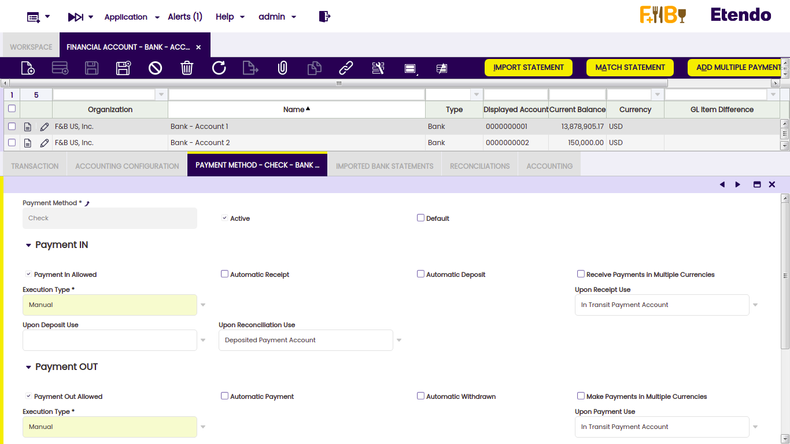
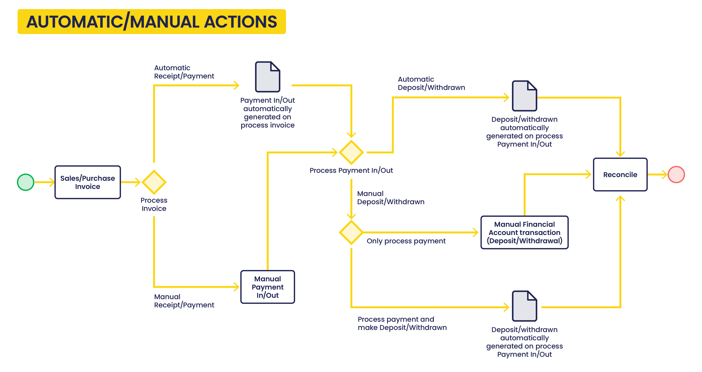
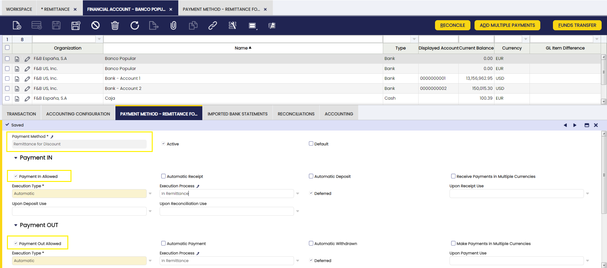

## Overview

This section describes the windows that are necessary to configure the financial management transactions as regards receivables and payables in Etendo. The corresponding windows are:

[:material-file-document-outline: Tax Register Type](#tax-register-type){ .md-button .md-button--primary }  

[:material-file-document-outline: Payment Method](#payment-method){ .md-button .md-button--primary }  

[:material-file-document-outline: Matching Algorithm](#matching-algorithm){ .md-button .md-button--primary }  

[:material-file-document-outline: Bank File Format](#bank-file-format){ .md-button .md-button--primary }  

[:material-file-document-outline: Execution Process](#execution-process){ .md-button .md-button--primary }  

[:material-file-document-outline: Remittance Type](#remittance-type){ .md-button .md-button--primary }  

[:material-file-document-outline: Doubtful Debt Method](#doubtful-debt-method){ .md-button .md-button--primary }  

## Tax Register Type

:material-menu: `Application` > `Financial Management` > `Receivables and Payables` > `Setup` > `Tax Register Type`

### Overview

A tax register type is used to collect all the tax rates of a type to take into account while calculating the total tax amount of a given tax register type within a period of time.

Tax register types are a key variable of the Tax Payment process as that is the process which calculates the total tax amount of each tax register type created and configured.

In other words, the "Tax Payment" process helps to calculate the amount of taxes to be paid to or to be received from the corresponding tax authority as the difference between:

-   the "Sales" tax register types or the total tax amount that is charged by an organization and paid by its customers
-   and the "Purchase" tax register types or the total tax amount that is paid by an organization to other businesses on the supplies that it receives.

### Header

The tax register type window allows the user to create tax register types.

As shown in the image above, it is possible to create:

-   "**Sales**" related tax register types which will therefore include **sales related "Tax Rates"** in the "**Lines**" tab
-   as well "**Purchase**" related tax register types which will therefore include **purchase related "Tax Rates"** in the "**Lines**" tab

Besides, every tax register type needs to be linked to a G/L Item.

The ledger accounts defined for that G/L Item will be the ones to use while posting the tax payment calculated as the difference between the "Sales" tax register type and the "Purchase" tax register type.

### Lines

The lines tab allows the user to associate tax rates to the tax register type.

As shown in the image above, each tax rate selected needs also to be linked to a document type.

Therefore, it is not only possible to configure the tax rates which will be taken by the tax payment process as part of a tax register type but also the document types which will be taken into account.

**Sales document types** which can be linked to the corresponding sales tax are:

-   AR Invoice
-   AR Credit Note
-   Reversed Sales Invoice
-   ES Return Material Sales Invoice

**Purchase document types** which can be linked to the corresponding sales tax are:

-   AP Invoice
-   AP Credit Note
-   Reversed Purchase Invoice

## Payment Method

:material-menu: `Application` > `Financial Management` > `Receivables and Payables` > `Setup` > `Payment Method`

### Overview

**Payment Methods** represent means of payment employed by your enterprise or by a business partner, such as:

-   Cash
-   Credit Card
-   PayPal
-   Cheque
-   Direct Debit
-   Standing Order
-   Bank Transfer
-   Note Payable

Each **payment transaction** is associated with a **Payment Method**. A payment method defines how a payment in/out is going to be managed within the receivables and payables Payment Cycle, and besides how it is going to be accounted.

**Payment Methods** are associated with Financial Accounts, so that payments can be registered in a bank or cashbook.

The payment methods which can be used within the payables and receivables management are the ones assigned to a Financial Account, therefore if any payment method configuration needs to be modified, it has to be done in the Payment Method tab of the financial account.

It is possible to associate multiple **Payment Methods** to a single Financial Account.

For instance, both checking and electronic payments may be associated with a single Financial Account as each payment method has its own configuration.

#### Payment Cycle

To better understand the configuration of a **Payment Method**, it is necessary to understand the flow of events within the payment cycle:

-   **Order:** the sales order or purchase order is used in this process of payables and receivables management in the case of an advance payment:
    -   when the sales invoice or purchase invoice gets booked, the payment information can be generated for the order from either the Payment In window or the Payment Out window.
-   **Invoice:** the purchase invoice generates a debt to a vendor and the sales invoice a debt-claim for a customer.
-   **Receipt or Payment:** the registration of the transfer of money in or out before the transaction is confirmed in our bank account or cashbook.
-   **Financial Account update:** the addition of the transaction in the Financial Account as a "Deposit" or as a "Withdrawal", related to the movement of the money in or out of our bank account or cashbook.
-   **Reconciliation:** the confirmation of the movement of the money after receiving the bank statement or cash balance.

In the image below, a Simple Payment Workflow is shown:

The way to create each payment stage in Etendo is described below:

**First Stage:**

A "**Receipt**" can be registered in:

-   the Sales Invoice window by using the process button "Add Payment".
-   and in the Payment In window by using the process button "Add details".

A "**Payment**" can be registered in:

-   the Purchase Invoice window by using the process button "Add Payment".
-   and in the Payment Out window by using the process button "Add Details".

Above payment stages can create an **accounting event** depending on the payment method accounting configuration.

-   If it is configured to account at this stage, Receipts and Payments can be accounted in the Payment In / Payment Out window by using the process button "Post" or by running the accounting background process.

**Second Stage:**

A "**Deposit**" can be registered in:

-   the Financial Account by using the process button "Add Transaction".
-   and in the Payment In window by using the process button "Add details" and then the Action: "Process Received Payment(s) and Deposit"

A "**Withdrawal**" can be registered in:

-   the Financial Account by using the process button "Add Transaction".
-   and in the Payment Out window by using the process button "Add details" and then the action: "Process Made Payment(s) and Withdrawal"

Above payment stages can create an **accounting event** depending on the payment method accounting configuration.

-   If it is configured to account at this stage, Deposits and Withdrawals can be accounted in the Financial Account window by using the process button "Post" or by running the accounting background process.

**Third and final stage:**

A "**Reconciliation**" can be registered in:

-   the Reconciliation tab of the Financial Account window.

Above payment stage can create an **accounting event** depending on the payment method accounting configuration.

-   If it is configured to account at this stage, Reconciliations can be accounted in the Reconciliation tab of the Financial Account window by using the process button "Post" or by running the accounting background process.

#### Payment Status

To better understand the configuration of the payment method, it is also necessary to understand the **payment status** related to the process steps.

During the whole Payment Cycle, the payment is defined by one status so the user knows the last step of the process that took place and the following step that should take place.

In the following explanation and diagram below, the different Payment Statuses are explained.

-   **Awaiting Payment:** This status appears when a Receipt/Payment has been created in either the Payment In window or in the Payment Out window, but it has no details of what it is going to be received or paid.
-   **Awaiting Execution:** This status appears when the Receipt/Payment has been created and processed and there is an automated execution process to be executed.  
    This is an *optional* status which will be skipped if:
    -   the Payment Method is Manual
    -   or if the Payment Method is Automatic and it is not set as "Deferred".
-   **Payment Received/Made:** This status appears when the Receipt/Payment has been completed and processed.
-   **Deposited/Withdrawn not Cleared:** This status appears when the Receipt/Payment has been added to the Financial Account screen, therefore the corresponding Deposit/Withdrawal transaction has been created in the Financial Account.
-   **Payment Cleared:** This status appears when the Deposit/Withdrawal reconciliation has been executed.

In more detail, the way those payment status change within the payables and receivables payment cycle is:

1\. The **Receipt** of the money in or the **Payment** of the money out, before the transaction is confirmed on the bank account, changes the payment status to either:

-   **Awaiting Execution**, if there is an execution process set up in the payment method used for the financial account
-   or **Payment Received** in the case of a receipt of the money in
-   or **Payment Made** in the case of a payment of money out.

If there is an execution process set up in the payment method, the extra action of executing that process changes the status from "Awaiting Execution" to either "Payment Received" or "Payment Made".

2\. The **Deposit** of the payment in the financial account changes the payment status from **"Payment Received"** to **"Deposited not Cleared"**

and the **Withdrawal** of the payment from the financial account changes the payment status from **"Payment Made"** to **"Withdrawn not Cleared"**.

3\. The **Clearing** or reconciliation of the payments changes the payment status from either **"Deposited not Cleared"** or **"Withdrawn not Cleared"** to **"Payment Cleared"**

#### Payment Method

The image below shows the Payment Method window. That is the window where payment methods are configured.

However, payment methods are assigned to financial accounts, therefore, a different configuration of a given payment method can also be defined in the payment method tab of the financial account window.

As a consequence, the same method of payment can have different configuration "versions" depending on the financial account it has been assigned to.

It is very important to remark that:

-   the **configuration of a payment method created in a financial account overwrites the "generic" configuration of that payment method** while managing payments associated to that payment method in that financial account.
-   even more, **the payment methods which can be use**:
    -   while issuing a sales invoice for instance
    -   or while assigning a by default payment method to a vendor

**are the ones which are already assigned to a financial account**.

In other words, it is not possible to use a payment method if it is not assigned to a financial account.

Finally, if reviewing the payment method assigned to a business partner is required,  the steps to follow are:

-   navigate to the financial account assigned to that business partner if any
-   and then to the payment method tab of the financial account.

Payment Method configuration includes the features below:

-   if it is going to be used for **receiving payments** and/or **making payments**
-   if it implies a **manual execution**, for instance "Cash" or an **automatic execution**, for instance "Check"
-   if it is going to **automatically create the registration of the transfer of money** before the transaction is confirmed on our bank account or cashbook.
    -   that is a "**Receipt**" in case of receiving a payment
    -   that is a "**Payment**" in case of making a payment
-   if it is going to **automatically add the transaction in the financial account** related to the movement of the money in or out of our bank account or cashbook.
    -   that is a "**Deposit**" in case of receiving a payment
    -   that is a "**Withdrawn**" in case of making a payment
-   if it allows the user to **receive or make payments in other currencies** than the financial account currency
-   and finally, how the payment is going to be **accounted**.

!!! info
    To learn more, visit the section [Accounting Payment Workflow](../../financial-management/receivables-and-payables/setup.md#accounting-payment-workflow).

Payment Methods can be configured as explained below in detail:

#### **Payment Method configuration**

##### Payment In Configuration:

-   **Payment In Allowed:** If checked, the Payment Method is enabled to receive payments.
-   **Automatic Receipt:** If checked, on completion of a Sales Invoice the payment is automatically received.  
    In order to use this option, the corresponding customer needs to have a "Financial Account" defined by default in the customer tab of the Business Partner window. The reason why is:
    -   this check automatically creates a "Receipt" transaction in the Payment In window. A payment in requires a financial account.
-   **Automatic Deposit:** If checked, on completion of the Receipt the payment is automatically deposited in the financial account.  
    In order to use this option, the corresponding customer needs to have a "Financial Account" defined by default in the customer tab of the Business Partner window. The reason why is:
    -   this check automatically creates a "Deposit" transaction in the transaction tab of the financial account window. A deposit requires a financial account.
-   **Receive Payments in Multiple Currencies:** If checked, it is possible to receive payments in other currencies than the Financial Account default currency.
    -   Above means that a sales invoice in USD can be deposited in a Financial Account configured in EUROS, for instance. For getting that working the corresponding customers need to have a Sales Price List in USD assigned.
    -   It will be possible to enter a given exchange rate while creating the payment in the Sales Invoice window, by using the "Add Payment" button.
    -   It will be possible to select both USD currency and a given exchange rate, while "manually" receiving the payment in the Payment In window, or while "manually" creating the deposit of the payment in the transaction tab of the financial account window, by using the "Add Transaction" button and then the "Add Payment In/Out" button.
-   **Execution Type**. There are payments which might or might not require an additional step to be executed. Therefore, there are two execution types:
    -   **Manual:** this is the execution type by default, unless it is changed to "Automatic". This type implies the "Reception" of the payment as a manual event without the need of any additional system step. For example, payment by cash.
    -   **Automatic:** if the execution type is changed to "Automatic" Etendo allows the user to choose an "Execution Process, in other words the "Reception" of the payment requires to execute an additional step for instance the recording of a "Check Number".  
        There are three execution process available:
        -   **Simple Execution Process** - this process does not require any action as it automatically changes the payment status from Awaiting Execution to Payment Received.
        -   **Print Check simple process** - this process shows a window which allows the user to enter a check number while processing the payment in the Payment In window, and changes the payment status from Awaiting Execution to Payment Made. The check number entered is saved as the "Reference Number" of the Payment.
            -   In case there are more than one payment and a given check number is entered, the process automatically saves as many consecutive check numbers as payments. Those numbers are also saved as "Reference Number" of the Payments.
        -   **Leave as Credit** - this process is just use Return Materials functionality as it allows the user to change a negative payment in/out into a positive credit for the business partner (customer/vendor).
    -   **Deferred:**
        -   If not checked the payment once processed is also automatically executed, this applies to "Simple Execution Process" where no additional action is needed.
        -   If checked, the payment is processed but it is not executed. It has to be manually executed once the payment gets an "Awaiting Execution" Payment Status in the Payment In window by using the button "Execute Payment". That applies to "Print Check simple process" where a check number needs to be entered for instance.
-   **Upon Receipt Use:** Account to be used to account the payment Receipt.
    -   Would normally be either left blank if the financial transaction is going to be created later in the workflow or if it is not required any posting at this stage in the cycle, otherwise the "In Transit Payment Account" can be assigned to get that:
        -   the payment Receipt is posted in the "In Transit Payment IN Account" defined in the Accounting Configuration tab of the financial account window.
-   **Upon Deposit Use:** Account to be used to account the payment Deposit.
    -   Would normally be left blank if no financial transaction required for the Deposit event or if it is not required any posting at this stage, otherwise the "Deposited Payment Account" can be assigned to get that:
        -   the payment Deposit is posted in the "Deposit Account" defined in the Accounting Configuration tab of the financial account window.
-   **Upon Reconciliation Use:** Account to be used to account payment Reconciliation.
    -   Would normally be set to the "Cleared Payment Account", but could be left blank if the payment Receipt or if the payment Deposit have already been posted earlier in the process. If it is set to "Cleared Payment Account":
        -   the payment Reconciliation is posted in the "Cleared Payment Account" defined in the Accounting Configuration tab of the financial account window.

##### Payment Out Configuration:

-   **Payment Out Allowed:** If checked the Payment Method is enabled to make payments.
-   **Automatic Payment:** If checked, on completion of a Purchase Invoice the payment is automatically received.  
    In order to use this option,  the corresponding vendor needs to have a "Financial Account" defined by default in the vendor tab of the Business Partner window. The reason why is:
    -   this check automatically creates a "Payment" transaction in the Payment Out window. A payment out requires a financial account.
-   **Automatic Withdrawn:** If checked, on completion of the payment, the payment is automatically withdrawn from the financial account.  
    In order to use this option, the corresponding vendor needs to have a "Financial Account" defined by default in the vendor tab of the Business Partner window. The reason why is:
    -   this check automatically creates a "Withdrawal" transaction in the transaction tab of the financial account window. A withdrawn requires a financial account.
-   **Make Payments in Multiple Currencies:** If checked, it is possible to make payments in other currencies than the Financial Account default currency.
    -   The information above means that a purchase invoice in USD can be withdrawn in a Financial Account configured in EUROS, for instance. In order to use this option, the corresponding vendor needs to have a Purchase Price List in USD assigned.
    -   It will be possible to enter a given exchange rate while creating the payment out in the Purchase Invoice window, by using the "Add Payment" button.
    -   It will be possible to select both USD currency and a given exchange rate, while "manually" making the payment out in the Payment Out window, or while "manually" creating the withdrawn of the payment out in the transaction tab of the financial account window, by using the "Add Transaction" button and then the "Add Payment In/Out" button.
-   **Execution Type**. Same as above but for the payments made.
-   **Upon Payment Use:** Account to be used to account the payment.
    -   Would normally be either left blank if the financial transaction is going to be created later in the workflow or if it is not required any posting at this stage in the cycle, otherwise the "In Transit Payment Account" can be assigned to get that:
        -   the payment is posted in the "In Transit Payment OUT Account" defined in the Accounting Configuration tab of the financial account window.
-   **Upon Withdrawal Use:** Account to be used to account the payment Withdrawal.
    -   Would normally be left blank if no financial transaction required for the Withdrawal event or if it is not required any posting at this stage, otherwise the "Withdrawal Payment Account" can be assigned to get that:
        -   the payment Withdrawal is posted in the "Withdrawal Account" defined in the Accounting Configuration tab of the financial account window.
-   **Upon Reconciliation Use:** Account to be used to account payment Reconciliation.
    -   Would normally be set to the "Cleared Payment Account", but could be left blank if the payment or if the withdrawal have already been posted earlier in the process. If it is set to "Cleared Payment Account":
        -   the payment Reconciliation is posted in the "Cleared Payment Account" defined in the Accounting Configuration tab of the financial account window.

One of the key features allowed by the payment method configuration is to get that two of the three payment cycle stages can be automated:

As shown in the image above, if the **Automatic Receipt/Payment and Automatic Deposit/Withdrawn are selected**, the manual actions to execute are:

-   the creation and booking of the sales/purchase invoice
-   the payment in/out reconciliation in the financial account

because, the Payment In/Out as well as the Deposit/Withdrawn transactions are automatically created.

If the **Automatic Receipt/Payment and Automatic Deposit/Withdrawn are NOT selected**, the manual actions to execute are:

-   the creation and booking of the sales/purchase invoice
-   the creation of the Payment In/Out
-   and the creation of the Deposit/Withdrawal transaction in the financial account, unless the action "Process Made Payment(s) and Withdrawal" or "Process Received Payment(s) and Deposit" are selected while processing the payment.

##### **Accounting Payment Workflow**

Etendo allows a flexible payment accounting process, that means that a payment associated with a given payment method can be posted or not in any of its Payment Cycle stages.

As already described a payment received from a customer goes through below stages:

-   Step 1 - the "Receipt" of the payment
-   Step 2 - the "Deposit" of the Receipt in the Financial Account
-   Step 3 - and finally the "Reconciliation" of the Deposit once the bank statement has been received.

Analogue situation happens while making a payment to a vendor:

-   Step 1 - the "Payment"
-   Step 2 - the "Withdrawal" of the payment from the Financial Account
-   Step 3 - and finally the "Reconciliation" of the Withdrawal once the bank statement has been received.

For each step, it is possible to specify the default account for the receivables and payables cycles independently.

Each financial account needs to have at least one default account for both the receivables and payables cycle at either step 1, step 2 or step 3.

Both on the payables and receivables side, the first step containing an account represents the moment in which the supplier liability or customer receivables are cancelled.

For instance, if the Receive Payment Account is empty and you specify a Deposit Account, the customer receivables is cancelled at the moment of the deposit, not at the time of recording of the payment.

Any subsequent step having an account would offset the account in the previous step with the account in that step to represent the diminishing of the risk.

In other words, each of the stages can be posted in the windows/tabs where those are created if there is a value defined in the "Upon...Use" fields.

For instance:

-   if for a payment method the value "**In Transit Payment Account**" is selected in the field "**Upon Receipt Use**" that means that:
    -   the receipt of the payment can be posted in the Payment In window by using the process button "Post".
    -   the customer receivable is going to be cancelled by the "**In Transit Payment IN Account**" defined in the accounting configuration tab of the financial account window.
-   if for a payment method the value "**Deposited Payment Account**" is selected in the field "**Upon Deposit Use**" that means that:
    -   the deposit of the payment can be posted in the Transaction tab of the financial account window by using the process button "Post".
    -   the payment receipt is going to be cancelled by the "**Deposit Account**" defined in the accounting configuration tab of the financial account window.
-   if for a payment method the value "**Cleared Payment Account**" is selected in the field "**Upon Clearing use**"
    -   that means that the reconciliation of the deposit can be posted in the Reconciliation tab of the financial account window by using the process button "Post".
    -   the deposit of the payment is going to be cancelled by the "**Cleared Payment Account**" defined in the accounting configuration tab of the financial account window.

!!! note
    If any account is left empty, it implies that the process button "Post" is shown as "Post: Disable for accounting" in the corresponding window.

## Matching Algorithm

:material-menu: `Application` > `Financial Management` > `Receivables and Payables` > `Setup` > `Matching Algorithm`

### Overview

Etendo allows the user to reconcile deposit and withdrawal transactions of a financial account in two ways:

1.  **Automatically** by matching up the bank statement lines (imported or not) with the financial account transactions.  
    In this case, a matching algorithm is necessary to drive the matching process.
2.  **Manually** by using the Reconcile process button of the financial account window.  
    This way of reconciliation does not require a matching algorithm.

Etendo delivers out of the box the "**Standard**" matching algorithm, which can be found and configured in the **Matching Algorithm** window.

#### Matching Algorithm

The matching algorithm window lists and allows the user to configure the algorithm/s to use while matching up bank statement lines with financial account transactions.

As shown in the image above, the "**Standard**" matching algorithm has three checkboxes which allow the user to configure the financial account transactions matching process:

-   **Match BP Name:** This option gets a strong match if the business partner name of the bank statement line matches the business partner name of the financial account transaction.
-   **Match Reference:** This option gets a strong match if the reference of the bank statement line matches the reference of the financial account transaction.
-   **Match Transaction Date:** This option gets a strong match if the business partner name of the bank statement line matches the business partner name of the financial account transaction.

!!! info
    It is possible to select all the above checks at once or just some of them in order to configure how to get a strong match.

## Bank File Format

:material-menu: `Application` > `Financial Management` > `Receivables and Payables` > `Setup` > `Bank File Format`

### Overview

Etendo allows the user to import a bank statement file to an organization's financial account if a bank file format is configured for the organization.

Etendo delivers some modules which, once installed, allow the user to import bank statement files into Etendo in different formats:

-   OFX Bank Statement Format
-   CSV Generic Bank Statement Importer
-   WePay CSV Importer
-   and the Spanish one Cuaderno 43

Once a bank statement file is imported to an organization's financial account:

-   the overall information such as the file name and the import date are saved in the Imported Bank Statements tab of the financial account
-   and the content of the bank statement file is saved line by line in the corresponding Bank Statement Lines tab.

#### Bank File Format

The bank file format window lists the bank file format modules installed for an organization.

As shown in the image above, a bank file format can be applied to the organization in the Enterprise Module Management window after being installed, therefore it is available for any organization of the client.

#### Exceptions
Exceptions can be added to a bank file import format, therefore they are not taken by the import process.
It is possible to define the text to exclude while matching transactions and bank statement lines on a given financial account or in all of them.

## Execution Process

:material-menu: `Application` > `Financial Management` > `Receivables and Payables` > `Setup` > `Execution Process`

### Overview

Some payment types require an additional activity to be executed upon completion of the payment.

For instance, a payment with a check might require the recording of the check number and the printing of the check.

Overall, the execution process is a definition of the **activity/ies** that the system or the user has to execute to get that a payment is finally recorded as:

-   **made/withdrawn from the financial account**
-   or **received/deposited in the financial account**.

#### Process

The execution process window lists the available execution processes.

Etendo delivers by default execution processes described below:

-   **Simple Execution Process** - this process runs a system activity which changes the payment status from "Awaiting Execution" to "Payment Received"/"Payment Made" (or "Deposited not Cleared"/"Withdrawn not Cleared")
-   **Print Check simple process** - this process opens a window which allows the user to enter a check number while processing the payment.
-   **Leave as Credit** - this process is just use Return Materials functionality as it allows the user to change a negative payment in/out into a positive credit for the business partner (customer/vendor).

The payments that require a separate activity to be executed need to be configured to make them work, that implies the selection of the "**Automatic**" option in the field "**Execution Process**", therefore an execution process of the ones listed above can be selected while configuring the payment method.

#### Parameter

The parameter tab allows the user to configure the additional activity to execute upon completion of a payment. For instance, to record a check number.

As shown in the image above, the "**Print Check Simple Process**" has one parameter named "**Check Number**". That parameter is an "**In**" "**Parameter Type**" which "**Input Type**" is "**Text**".

Above configuration means that the check number needs to be entered as a text by the user.

An **"In" parameter type** can also be a checkbox, therefore instead of entering a text, the user needs to select a checkbox or not. It is also possible to define whether the default value of the checkbox is going to be "Yes" or "No".

Besides, the parameter types can also be a "**Constant**", therefore the "**Default Text Value**" of the constant can be specified.

!!! info
    The value register for any of the above defined parameter's types is saved in the Parameters tab of the corresponding payment run.

## Remittance Type 

:material-menu: `Application` > `Financial Management` > `Receivables and Payables` > `Setup` > `Remittance Type`

To configure the remittance payment method it is necessary to previously execute a dataset that has created this payment method and the execution process. 

!!! info
    The "Deferred" field should always be checked for payment methods that apply to remittances.

!!! info
    No accounting will be defined for any of the transactions associated with the remittance payment method, so that no double accounting is generated. Remittance accounting is configured from the remittance types window.

The next step is the configuration of the type of remittance and the assignment of the accounting accounts for its posting.
It is possible to create as many remittance types as financial accounts available so that the appropriate accounting accounts can be assigned to each of them. 

The following accounts are defined: 
**Sent account:** the account to be used in the remittance posting. 
**Settlement account:** account to be used for the remittance settlement posting, which refers to the amount having been collected or paid.

To finish the process, the payment methods applicable to each financial account should be associated. 

!!! info
    It is important that those banks from which remittance transactions are to be made have a third party partner.

### Non-Discount Remittances
To configure Non-Discount Remittances, define this payment method from the Payment Method window.  

!!! info
    To create a Non-Discount remittance go to the [Remittance window](../../financial-management/receivables-and-payables/transactions.md#remittance). 

### Remit for Discount

To configure Remittances for Discount, define the type from the Remit for Discount check box as shown in the image below: 

!!! info
    To create a Remit for Discount remittance go to the [Remittance window](../../financial-management/receivables-and-payables/transactions.md#remittance).

## Doubtful Debt Method

:material-menu: `Application` > `Financial Management` > `Receivables and Payables` > `Setup` > `Doubtful Debt Method`

### Overview

Through this window, it is possible to define a Doubtful Debt Method, which will be available to use as a template when creating a new Doubtful Debt Run.

#### Doubtful Debt Method

Fields to note:

-   **Days Overdue:** This field is used as a filter when selecting the existing debts. It can be removed afterwards.
-   **Percentage:** This field is used when selecting the existing debts as the default percentage of the debt that is going to be considered as doubtful. It can be changed afterwards.

---
This work is a derivative of ["Financial Management"](http://wiki.openbravo.com/wiki/Financial_Management){target="_blank"} by [Openbravo Wiki](http://wiki.openbravo.com/wiki/Welcome_to_Openbravo){target="_blank"}, used under [CC BY-SA 2.5 ES](https://creativecommons.org/licenses/by-sa/2.5/es/){target="_blank"}. This work is licensed under [CC BY-SA 2.5](https://creativecommons.org/licenses/by-sa/2.5/){target="_blank"} by [Etendo](https://etendo.software){target="_blank"}.