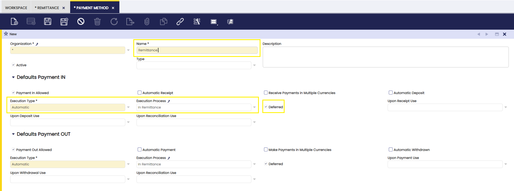
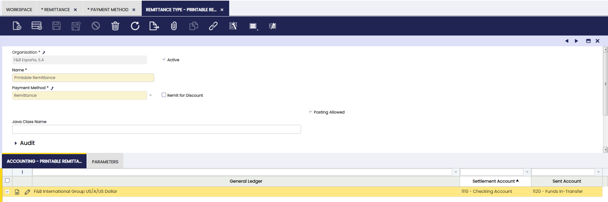
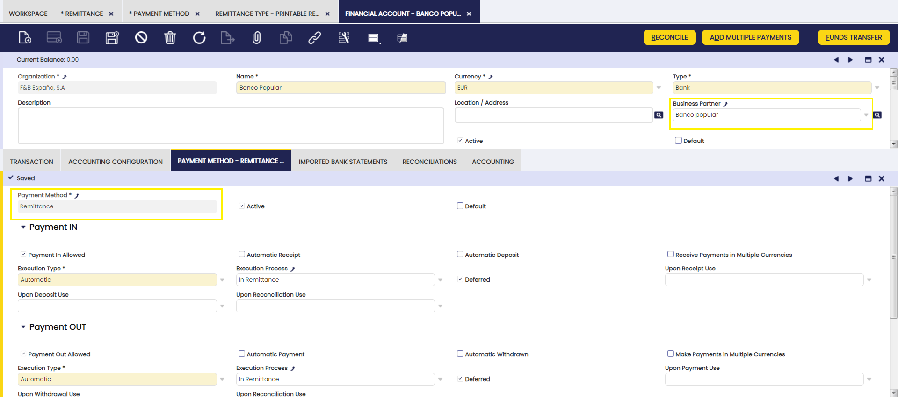
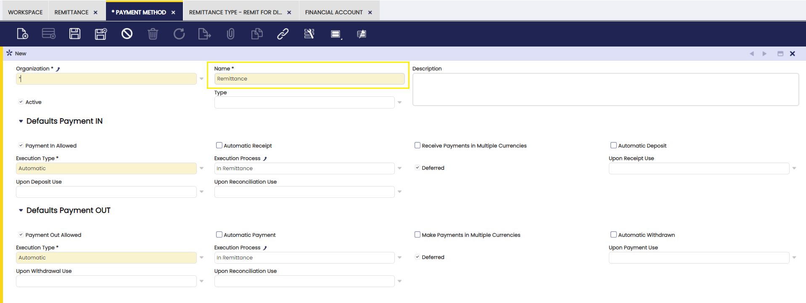
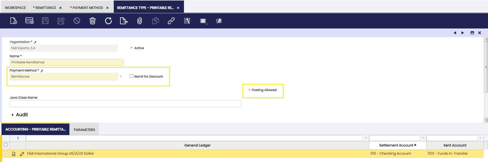
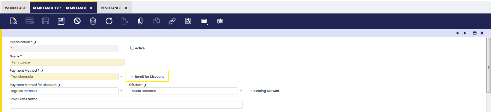
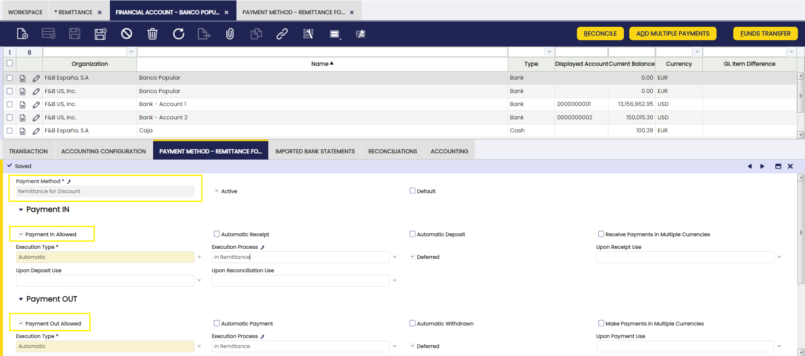

---
tags:
  - Etendo Classic
  - Financial Management
  - Remittance Type
  - Remittance Configuration
  - Receivables and Payables
---

# Remittance Type

:material-menu: `Application` > `Financial Management` > `Receivables and Payables` > `Setup` > `Remittance Type`

To configure the remittance payment method it is necessary to previously execute a dataset that has created this payment method and the execution process. 

!!! info
    The "Deferred" field should always be checked for payment methods that apply to remittances.

!!! info
    No accounting will be defined for any of the transactions associated with the remittance payment method, so that no double accounting is generated. Remittance accounting is configured from the remittance types window.

The next step is the configuration of the type of remittance and the assignment of the accounting accounts for its posting.
It is possible to create as many remittance types as financial accounts available so that the appropriate accounting accounts can be assigned to each of them. 

The following accounts are defined: 
**Sent account:** the account to be used in the remittance posting. 
**Settlement account:** account to be used for the remittance settlement posting, which refers to the amount having been collected or paid.

To finish the process, the payment methods applicable to each financial account should be associated. 

!!! info
    It is important that those banks from which remittance transactions are to be made have a third party partner.

## Non-Discount Remittances

To configure Non-Discount Remittances, define this payment method from the Payment Method window.  

!!! info
    To create a Non-Discount remittance go to the [Remittance window](../transactions/remittance.md). 

## Remit for Discount

To configure Remittances for Discount, define the type from the Remit for Discount check box as shown in the image below: 

!!! info
    To create a Remit for Discount remittance go to the [Remittance window](../transactions/remittance.md).

---

This work is a derivative of [Financial Management](http://wiki.openbravo.com/wiki/Financial_Management){target="_blank"} by [Openbravo Wiki](http://wiki.openbravo.com/wiki/Welcome_to_Openbravo){target="_blank"}, used under [CC BY-SA 2.5 ES](https://creativecommons.org/licenses/by-sa/2.5/es/){target="_blank"}. This work is licensed under [CC BY-SA 2.5](https://creativecommons.org/licenses/by-sa/2.5/){target="_blank"} by [Etendo](https://etendo.software){target="_blank"}.
