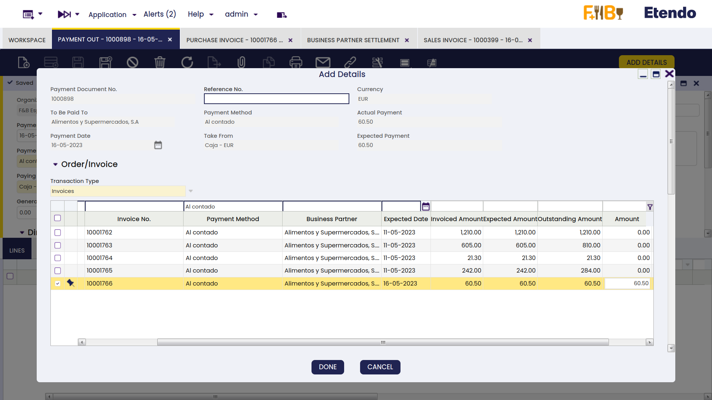
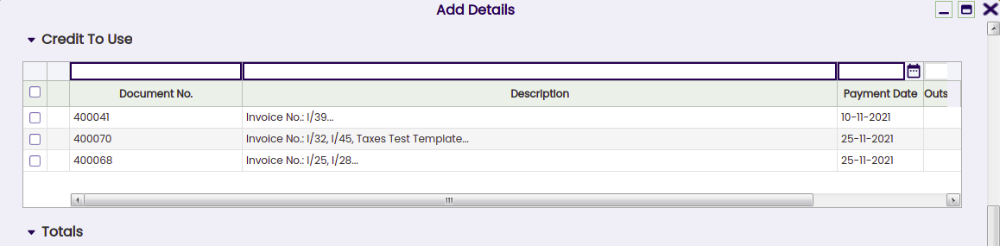
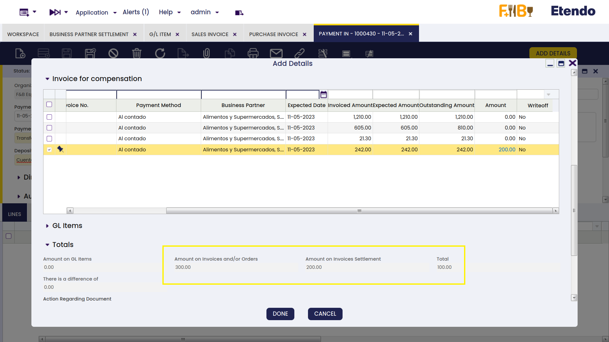
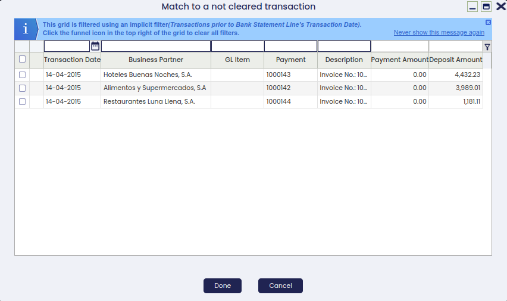
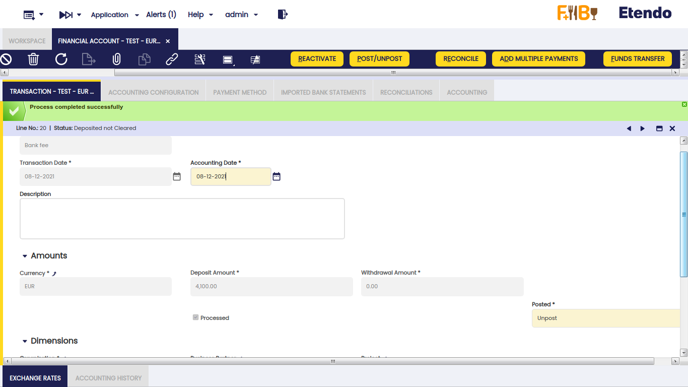
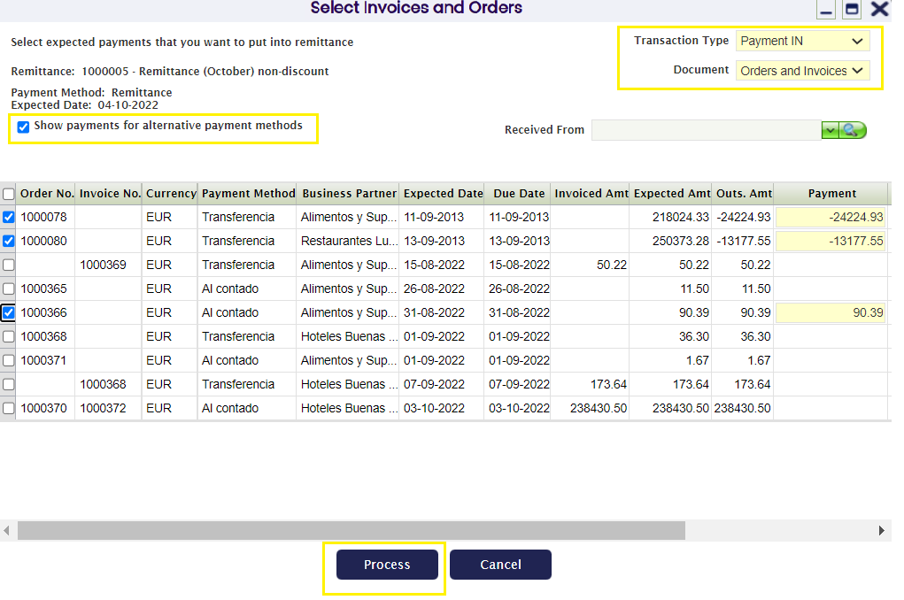
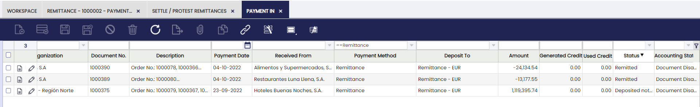
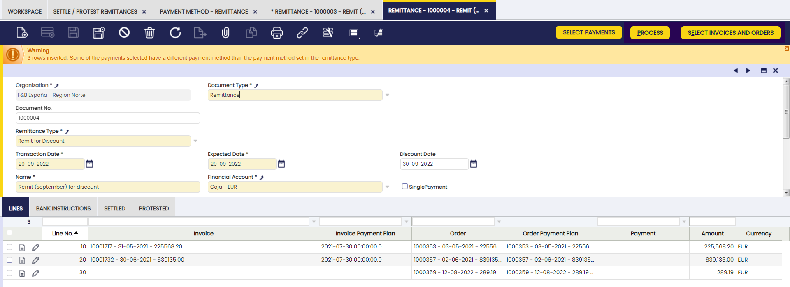

## Overview

Financial Management functional documentation provides a detailed description of all windows of the Financial Management application area.

## Purchase Invoice Payment Plan

:material-menu: `Application` > `Financial Management` > `Receivables and Payables` > `Transactions` > `Purchase Invoice Payment Plan`

### Overview

The purchase invoice payment plan window displays all the purchase invoice payment plans which are not fully paid.

This window offers another possibility of managing the same information found in the Payment Plan tab of the Purchase Invoice window for a given invoice.

The advantage of this window is that it offers a more immediate view of all the purchase invoice payment plans which still have an outstanding amount to be paid.

#### Payment Plan

Purchase invoice payment plan information is shown grouped in two sections.

**Invoice** section shows the information detailed below:

- **Invoice**. There is a link to the Purchase Invoice.
- **Document No.**. This is the Document Number of the Invoice.
- **Business Partner**. This is the Business Partner against whom the Invoice is issued.
- **Invoice Date**. That is the Creation date of the Invoice.
- **Total Gross Amount**. This is the Total amount of the Invoice.
- **Outstanding Amount**. This is the Outstanding amount of this Payment Plan.
- **Currency**. That is the Currency of the Invoice.

**Payment Plan** section shows the information detailed below:

- **Payment Method**. This is the payment method of the purchase invoice.
- **Due Date**. This is the original "Due Date" agreed with the vendor. This date is used as the "Reference Date" in some Financial Reports.
- **Expected Date**. This is the Date when the payment is expected to be made. When the Payment Plan is created, this date is the same date as the "Due Date", but it can be changed afterwards.  
  This date reflects a revision of the original Payment Plan in which the "Due Date" has changed.  
  This date is used as the "Reference Date" in some Reports, such as the Payment Report.

!!! info
    This field is the only one that can be changed in this window. If changed, that change will be also reflected in the payment plan tab of the corresponding purchase invoice.

- **Days Overdue**. This is the number of days from the expected date until the current day.

## Payment Out

:material-menu: `Application` > `Financial Management` > `Receivables and Payables` > `Transactions` > `Payment Out`

### Overview

Supplier's payments and prepayments can be made and managed in the payment out window. G/L item payments not related to orders/invoices can also be managed in this window.

Payments can be made against different types of documents:

- Purchase Orders, in effect this is a _prepayment_.  
  Later on, when an invoice is created from the order that already has a payment received against it, the invoice automatically inherits the payment received against the order.
- Purchase Invoices, in effect this is a payment of a vendor invoice.  
  Payments prior to the accounting date of the invoice are also considered a _prepayment_.
- And G/L Items, in effect this is a payment of any other expense to a vendor, for instance a fine or other types of fee not included in an invoice.  
  This type of payments can be created in this window by adding the corresponding G/L Item as well as the "Paid Out" amount, or can be automatically populated as a GL item if created as a GL Item payment in a G/L Journal.  
  Regardless the way they are created, both cases are managed in the same way depending on the Payment Method used.

Payments can be created **to pay to** a **single vendor** or **to pay to** several **vendors** at the same time.

At the end of the process a "**Payment Out**" transaction will imply the creation of a "**Withdrawal**" transaction in the corresponding Financial Account.

The creation of the withdrawal transaction in the financial account can be done:

- manually by using the Add Transaction process of the financial account.
- or automatically, if the payment method used is configured to do so, that implies the selection of the checkbox "Automatic Withdrawal".

### Header

The Payment Out window allows the user to make and manage supplier's payments done to settle different types of documents such as orders and invoices. This window also allows the user to manage the supplier's payments already made in the purchase invoice window, the same way as the G/L item payments made in a G/L Journal.

There are just a few mandatory fields to fill in while making a payment in this window:

- the **Organization** which is paying
- the **Payment Number** which follows the corresponding document sequence.
- the **Payment Method** to use for making the payment. There is a check-box in the "Add Payment" window which later on allows to select documents linked to alternative payment methods
- and the **Financial Account** from where the money is going to be taken in the field "**Paying From**".

Other relevant fields to note are:

- **Paying To** field, that is, the vendor we are making a payment to, it does not need to be entered upon creating a new record.
  - If a vendor is not selected, it implies the creation of a payment to pay different documents of different vendors.
  - If a vendor is selected, it implies the creation of a payment to pay different documents of the same vendor. In this case, the value of the fields "Payment Method" and "Paying From" change if the vendor has assigned a specific payment method and financial account to be used while paying its bills.
- **Reference No.**, this field is used to reflect the number associated with the payment in the Vendor documentation system, if any.
- **Currency**. It is possible to select a different currency than the financial account currency while making a payment. In order to do this, the payment method used and assigned to the financial account of the payment needs to be configured to make payments in multiple currencies.

#### Add Payment Window

The **Add Details** button opens the **Add Payment** window, where outstanding documents to be paid can be selected.

The **Add Payment** window is already explained in the Purchase Invoice payment article.

#### Payment of Several Document Types from Different Vendors

If no vendor has been selected in the field "Paying To", it is possible to pay different transaction types of different vendors by just selecting them.

!!! info
    Etendo allows the user to filter once more by a given business partner if it was not entered in the "Paying To" field by mistake.

The "Actual Payment Out" field will then show the sum up value of all the transactions being selected to be paid.

Once the payment is processed, the lines tab lists all the orders and invoices and even G/L items included in the payment, same as the "**Description**" field of the payment header.

#### Reactivating a payment

An already processed payment with status "Payment Made" or "Awaiting Execution" can be **Reactivated**. This option allows users to edit wrong payment data or to delete a wrongly created payment.

"Reactivate" button allows the user to do what is explained above as two different actions can be selected:

- **Reactivate**: This option reactivates the payment, keeping the payment lines.  
  Once the payment is reactivated, the user can easily modify the payment information by using the button "Add Details" and process it once again.
- **Reactivate and Delete lines**: This option reactivates the payment and removes all the payment lines.  
  This option is the one to use if the payment was wrongly created and therefore needs to be removed completely.  
  Once the payment is reactivated, the user can delete the payment header without the need of deleting the payment lines first.

An already processed and withdrawn payment with status "Withdrawn not Cleared" can be as well "**Reactivated**" as described above, but once the corresponding withdrawal transaction has been deleted from the financial account.

#### Posting a payment

A payment made and processed from the Payment Out window can be posted if the payment method used while creating the payment allows the user to do so once assigned to the financial account through which the payment is made. If that is not the case, Etendo shows a warning: "Document disabled for accounting".

A payment made posting looks like:

|                                                           |                |                |
| --------------------------------------------------------- | -------------- | -------------- |
| Account                                                   | Debit          | Credit         |
| Vendor Liability                                          | Payment amount |                |
| Upon Payment Use the "In Transit Payment OUT Account" i.e |                | Payment amount |

#### Voiding a payment

An already processed payment with status "Awaiting Execution" can be "**Voided**". The process button "Reactivate" allows the user to do that but only for payments in status "Awaiting Execution".

!!! info
    _Remember that a payment can get an awaiting execution status if the payment method used and assigned to the financial account is set up to have an automatic "Execution Type" and also the checkbox "Deferred" is selected._

Void action sets the payment line/s as "**Canceled**" which means that the document (order or invoice) is actually not paid therefore, a new payment can be created or added.

#### Credit payments

The field "**Generated Credit**" which can be found in the "Payment Out" header, allows the user to generate credit (or a credit payment in Etendo terms) for a business partner by just entering the credit amount in that field.

It is not possible to generate credit on a payment which is not related to a single vendor or creditor, therefore, the generated credit feature requires the user to select a business partner in the field "Paying To".

The creation of a credit payment requires not to select any document to pay in the **"Add Payment" window** which is shown after pressing the process button "**Add Details**", but to leave the credit amount to be used later.

A credit payment is created after processing. This credit payment specifies the amount left as credit in the "Description" field of the credit payment header.

Later on, the available credit generated for that vendor can be used to pay the vendor:

- in the "**Add Payment**" window once a new Payment Out is created for that vendor by just selecting the credit in the section "Credit to Use".

- or in the "**Select Credit Payments**" window which is **automatically shown** upon completion of a new vendor’s invoice.

!!! info
    In both cases, the "Description" field of the credit payment header will also specify the transactions/documents where the credit was used.

The Use Credit Source tab of the payment out window shows the credit payment used to pay a vendor's document (order, invoice or G/L item) payment.

#### Payments in multiple currencies

Etendo allows the user to make payments in a different currency than the financial account currency.

To use this option, the payment method assigned to the financial account used to make the payment needs to be configured to allow so, that implies to select the check-box "Make Payments in Multiple Currencies".

#### Prepayments exceeding the invoice amount to pay

Etendo allows to prepay by adding payments to the orders. The purchase invoice created from the order will inherit the payment done for the order.

When the actual prepaid amount exceeds the invoice amount to pay, the purchase invoice remains as **"Payment Complete" = "No"** until

- either a "negative" payment out is created to reflect that the supplier is paying back to the organization the difference, so final payment balance equals the purchase invoice amount
- or a credit payment is created to be later on used while paying another invoice to the same supplier.  
  This credit payment needs to be created as a new payment out related to the purchase prepaid invoice, that way the prepaid invoice is set as **"Payment Complete" = "Yes"**.

### Lines

Lines tab contains a list of the documents to be paid or already paid by the payment.

#### Execution history

The execution history tab shows information about the history of the payment execution attempts.

For some payment types, some additional steps are needed. For example, a payment with a check that needs to be filled in with a check number.

In that case, the payment method linked to the payment needs to be configured to require an "Automatic" **Execution Type** process.

All of the above implies an additional step to take in the Payment Out window, which is to execute the payment by using the process button "**Execute Payment**".

This process button is only shown in case of payment/s linked to an automation execution process for which the check-box "**Deferred**" is selected.

If the checkbox "Deferred" is not selected, the additional step is still required, but it will be automatically executed without any end-user action.

The Execution History tab is a read-only tab which shows information about the execution of the payment such as the execution date, just once the payment has been executed.

#### Exchange rates

The exchange rate tab allows the user to enter an exchange rate between the organization's general ledger currency and the currency of the payment made to be used while posting the payment to the ledger.

#### Used credit source

A credit payment can be used to settle more than one document payment. This table tracks the documents where a credit payment has been used.

The creation of a "Credit" payment is already explained in the Credit Payments section of this article, same as how a "Credit" payment or available credit can be used later on to pay a vendor.

This read-only tab shows the credit payment used to pay a vendor document (order, invoice or G/L item) payment.

### Payment Removal

The aim of this functionality is to delete and reactivate payments in an agile and easy way. Also, it allows eliminating and reactivating bank transactions and reconciliations.

!!! info
    To be able to include this functionality, the Financial Extensions Bundle must be installed. To do that, follow the instructions from the marketplace: [Financial Extensions Bundle](https://marketplace.etendo.cloud/#/product-details?module=9876ABEF90CC4ABABFC399544AC14558){target="_blank"}. For more information about the available versions, core compatibility and new features, visit [Financial Extensions - Release notes](../../../../../whats-new/release-notes/etendo-classic/bundles/financial-extensions/release-notes.md).

From this window, it is possible to delete payments by selecting the corresponding record and then clicking on the Remove Payment button.
On the other hand, it is possible to reactivate payments from the same window with the "Advanced Reactivation" button. This functionality allows the user to reactivate the payment without deleting manually its associated transactions, which is necessary if using the core button "Reactivate". This will return the payment to “Awaiting Payment” status and new payment details can be added.

In both cases:

- If the payment is included in the financial account, i.e., if it is in Deposited/Withdrawn not cleared status, the transaction in it will also be deleted (Financial Account window > Transaction tab).

- If the payment is reconciled through an automatic method, then in addition to the transaction in the financial account, the line of the bank statement to which it was linked (Financial Account window > Imported Bank Statements) and the corresponding line of the bank reconciliation (Financial Account > Reconciliations) will be deleted.

!!! info
    If the payment is posted, the accounting entry will be deleted.

### Bulk Posting

!!! info
    To be able to include this functionality, the Financial Extensions Bundle must be installed. To do that, follow the instructions from the marketplace: [Financial Extensions Bundle](https://marketplace.etendo.cloud/#/product-details?module=9876ABEF90CC4ABABFC399544AC14558){target="_blank"}. For more information about the available versions, core compatibility and new features, visit [Financial Extensions - Release notes](../../../../../whats-new/release-notes/etendo-classic/bundles/financial-extensions/release-notes.md).

The Bulk Posting functionality allows the user to post or unpost multiple records by selecting the corresponding records and clicking the **Bulk posting** button.

Also, the Accounting Status of the record/s is shown in the status bar, in form view, or in a column, in grid view.

!!! info
    For more information, visit [the Bulk Posting module user guide](../../../../../user-guide/etendo-classic/optional-features/bundles/financial-extensions/bulk-posting.md).

### Advanced Business Partner Settlement

!!! info
    To be able to include this functionality, the Financial Extensions Bundle must be installed. To do that, follow the instructions from the marketplace: [Financial Extensions Bundle](https://marketplace.etendo.cloud/#/product-details?module=9876ABEF90CC4ABABFC399544AC14558){target="\_blank"}. For more information about the available versions, core compatibility and new features, visit [Financial Extensions - Release notes](../../../../../whats-new/release-notes/etendo-classic/bundles/financial-extensions/release-notes.md).

  
From the **Payment Out** window, it is possible to create a settlement by clicking on the **Add Details** button.
In the pop-up window, Etendo shows a list of invoices to be settled each one with its corresponding invoice number, here the user is able to select the corresponding invoice or invoices to net. The **Actual Payment amount** to pay is set, then select the invoice/s to create a settlement and define the corresponding amount to be paid from the/each invoice.

From the **Invoice From Compensation** tab, select the sales invoice/s that will be used to pay and set the needed amount from the invoice/s to be netted.

Below that, in the **Totals** tab, Etendo shows the total reference amounts to be netted.

After clicking the button Done, the system nets the invoices and credits for the corresponding business partner and creates a settlement record.

The settlement record is registered in the **Business Partner Settlement** window where the lines for the invoice/s (sales and purchase) used to net will be shown.

!!! info
    For more information, visit [the Business Partner Settlement module user guide](../../financial-management/receivables-and-payables/transactions.md#business-partner-settlement).
  
### Advanced Bank Account Management

!!! info
    To be able to include this functionality, the Advanced Bank Account Management module of the Financial Extensions Bundle must be installed. To do that, follow the instructions from the marketplace: [Financial Extensions Bundle](https://marketplace.etendo.cloud/#/product-details?module=9876ABEF90CC4ABABFC399544AC14558){target="\_blank"}. For more information about the available versions, core compatibility and new features, visit [Financial Extensions - Release notes](../../../../whats-new/release-notes/etendo-classic/bundles/financial-extensions/release-notes.md).

This module includes the Bank account column to the Add details pop-up window to be able to filter possible payments by bank account.

!!! info
    For more information, visit the [Advanced Bank Account Management user guide](../../../optional-features/bundles/financial-extensions/advanced-bank-account-management.md).

## Payment Proposal

:material-menu: `Application` > `Financial Management` > `Receivables and Payables` > `Transactions` > `Payment Proposal`

### Overview

The payment proposal is a tool that helps the user to make payments by selecting the documents related to a given payment method or scheduled to be paid before a given due date. The system proposes what should be paid based on the selection criteria provided by the user.

The steps to follow are:

- _Enter_ the selection criteria, that could be:
  - to enter a given business partner whose invoices we want to pay
  - to enter a given payment method, for instance "Wire Transfer" if we want to generate at once all the wire transfer of the month
  - or to enter a given date in the field "Incl.documents up to this date" if we want to pay all the invoices having a due date before that date
  - etc
- _Run_ the process "**Select Expected Payments**".  
  This process selects the scheduled payment events of the orders/invoices, that match the selection criteria entered and makes a payment proposal.
- _Select_ those documents (orders and/or invoices) of the proposal that the organizations wants to pay.
- _Submit_ the proposal.  
  This action populates the Lines tab of the payment proposal window.
- _Run_ the process "**Generate Payments**".  
  This process generates the payment or payments by having into account that:
  - a payment can group separate orders/invoices to be paid for the same vendor into one payment
  - or group separate orders/invoices to be paid regardless the vendor into one payment.

#### Header

The payment proposal window allows the user to enter a set of selection criteria that help the user to make payments massively.

The fields to note are:

- **Business Partner:** if a business partner is entered only the documents due to that business partner will be proposed.
- **Payment Method:** if a payment method is entered, only the documents having that payment method assigned will be proposed, however pending invoices or orders linked to different payment methods can also be selected by clearing the implicit filters applied (by clicking the funnel icon.).
- **Paying From:** it is possible to select the Financial Account which has the above payment method configured from where we need to extract money.
- **Currency**: it is possible to select a currency if the payment method selected is configured to allow making payments in multiple currencies. If that is the case, a field is shown which allows the user to enter the "Exchange Rate" between the document's currency and the financial account's currency.
- **Incl. documents up to this date:** This field allows the user to enter a date, therefore the documents of the proposal will have a due date on or before the given date.

The **Select Expected Payments** header button displays the documents that match the selection criteria entered above.

!!! info
    Notice that the data shown in the grid is filtered using the previous criteria (implicit filter). In order to see pending invoices or orders of a different Payment Method for instance, it is necessary to clear the filters by clicking the funnel icon.

Besides, the "Select Expected Payments" window allows the user to:

- enter a "**Supplier Reference**", if any
- modify the "**Payment**" amount if the amount to pay is less than the outstanding amount
- and select the "**Write-off**" checkbox to write off the difference between the outstanding amount and the payment amount entered per each document/raw selected.

The "**Submit**" button finishes the process and gets that the selection is populated in the Lines tab.

Finally, the **Generate Payments** header button allows the user to take two actions:

- either to **group separate payments for the same vendor into one payment**,  
  this option allows the user to group pending orders/invoice of the same vendor to be paid in one payment transaction.
- or **group all orders/invoices into one payment**,  
  this option allows the user to group pending orders/invoice to be paid in one payment transaction, regardless the vendor.

Once executed:

- A system message displays the created payment's number/s.
- The payment summary information is reflected in the Status Bar of the Payment Proposal window.
- The Payment Out Plan and the Payment Monitor information of all the documents involved is updated.
- Finally, the Payment Status changes to _Awaiting Execution_ when an _Automatic_ Execution Type is defined or to _Payment Made_ if the execution is _Manual_. If there is an execution process defined, it can be run by clicking the Execute Payment button.

#### Lines

The lines tab shows the transactions (orders and/or invoices) included in the payment proposal.

A payment proposal can be "**Reactivated**" that means that the payment/s created are deleted and therefore removed from the Payment Out window.

## Sales Invoice Payment Plan

:material-menu: `Application` > `Financial Management` > `Receivables and Payables` > `Transactions` > `Sales Invoice Payment Plan`

### Overview

The sales invoice payment plan window displays all the sales invoice payment plans which are not fully paid.

The window offers another possibility of managing the same information which can be found in the Payment Plan tab of the Sales Invoice window for a given invoice.

The advantage of this window is that it offers a more immediate view of all the sales invoice payment plans which still have an outstanding amount to be paid.

#### Payment Plan

Sales invoice payment plan information is shown grouped in two sections.

**Invoice** section shows information detailed below:

- **Invoice**. There is a link to the Sales Invoice
- **Document No.**. This is the Document Number of the Invoice.
- **Business Partner**. This is the Business Partner against whom the Invoice is issued.
- **Invoice Date**. That is the creation date of the Invoice.
- **Total Gross Amount**. This is the Total amount of the Invoice.
- **Outstanding Amount**. This is the Outstanding amount of this Payment Plan.
- **Currency**. That is the Currency of the Invoice.

**Payment Plan** section shows below detailed information:

- **Payment Method**. This is the payment method of the sales invoice.
- **Due Date**. This is the original "Due Date" agreed with the customer. This date is used as the "Reference Date" in some Financial Reports such as the \[\[Projects:Payment_Aging_Balance/User_Documentation|Receivables Aging Inquiry.
- **Expected Date**. This is the Date when the payment is expected to be collected. When the Payment Plan is created, it is the same date as the "Due Date", but it can be changed afterwards.  
  This date reflects a revision of the original Payment Plan in which the "Due Date" has changed.  
  This date is used as the "Reference Date” in some Reports, such as the Payment Report.  
  Moreover, this field is the only one which can be changed in this window. If changed, that change will be also reflected in the payment plan tab of the corresponding purchase invoice.

**Days Overdue**

This is the number of days from the expected date until the current day.

## Payment In

:material-menu: `Application` > `Financial Management` > `Receivables and Payables` > `Transactions` > `Payment In`

### Overview

Customer's payments and prepayments received can be recorded and managed in the Payment In window. Besides, G/L item payments not related to orders/invoices can also be managed in this window.

Customer's payments can be received against:

- Sales Orders, in effect this is a _prepayment_.  
  Later on, when an invoice is created from the order that already has a payment received against it, the invoice automatically inherits the payment received against the order.
- Sales Invoices, in effect this is an invoice payment received from a customer.  
  Payments prior to the accounting date of the invoice are also considered a _prepayment_.
- And a G/L Items, in effect this is a payment of any other revenue received from a customer, for instance a fine.  
  This type of payments can be created in this window when selecting the G/L Item "Transaction Type" or can be automatically populated as a payment in this window if created in a G/L Journal.  
  Regardless the way they are created, both cases are managed in the same way depending on the Payment Method used.

!!! info
    Etendo allows the user to register payments received from a single customer or to register payments received from several customers at the same time.

At the end of the process, a "Payment In" transaction will imply the creation of a "Deposit" transaction in the corresponding Financial Account.

The creation of the deposit transaction in the financial account can be done:

- manually by using the Add Transaction process of the financial account.
- or automatically if the payment method used is configured to do so, that implies the selection of the check-box "Automatic Deposit".

### Header

The Payment In window allows the user to record and manage customer's payments received against different types of documents issued by the organization, such as orders and invoices. This window also allows the user to manage the customer's payments already recorded in the sales invoice window, in the same way as the G/L item payments received in a G/L Journal.

There are just a few mandatory fields to fill in while recording a payment in this window:

- the **Organization** which is receiving the payment
- the **Payment Number** which follows the corresponding document sequence
- the **Payment Method** used for receiving the payment. There is a check-box in the "Add Payment" window which later on allows the user to select documents linked to alternative payment methods
- and the **Financial Account** where the money is going to be deposited to.

Other relevant fields to note are:

- the **Amount** received. It does not need to be entered upon creating a new record.
- the **Received From** field shows the customer the user is receiving the payment from. It does not need to be entered upon creating a new record.
  - **If a customer is not selected,** it implies the creation of a payment which can collect the payment of different documents related to different customers.
  - **If a customer is selected,** it implies the creation of a payment which can collect the payment of different documents of the same customer. In this case, the value of the fields "Payment Method" and "Deposit To" change if the customer has assigned a specific payment method and financial account to be used while collecting its bills.
- **Reference No.**, this field is used to reflect the number printed on the payment justification document received from the customer.
- and the **Currency**. It is possible to select a different currency from the financial account currency while receiving a payment. In order to do so, the payment method used and assigned to the financial account of the payment needs to be configured to receive payments in multiple currencies.

#### Add payment window

The **Add Details** button opens the **Add Payment** window, where the documents being paid can be selected.

!!! info
    The "Add Payment" window is already explained in the [Sales Invoice Payment article](../../sales-management/transactions.md#payment).

#### Payment of several document types from different customers

If no customer has been selected in the field "Received From", it is possible to record the payment of different customers at the same time by just selecting the transactions to be paid.

!!! info
    Note that Etendo allows the user to filter once more by a given business partner if it was not entered in the "Received From" field by mistake. When this happens, payments must be done by executing them with the exact amount.

The **Actual Payment** amount entered is automatically spread among the pending debts (invoices or orders pending to be paid). It is possible to avoid this automatic distribution by setting the Preference _Add Payment: Automatically distribute amounts_ to 'N'

The user can check or uncheck the transactions as required, and can also modify the amounts shown in the "Amount" field.

It is important to note that:

- In this scenario, it is not possible to generate credit or refund a remaining amount to the customer because both actions need to be related to one single customer.  
  Therefore, if the amount paid and reflected in the actual payment field is higher than the sum of the invoice's grand total amount selected, an error message is shown saying that "There is an amount difference without any action selected".  
  In that case, either the actual payment amount needs to be decreased or another order/invoice to be paid needs to be selected.
- If the Actual Payment is less than the Expected Payment, the amount remaining can be left as:
  - an **underpayment**, that means registering a partial payment where the remaining debt will be paid afterwards by registering a new payment in
  - or can be **written off**, if that is selected, it means registering a partial payment where the remaining debt is not going to be paid, in this last case:
    - the customer's invoice is set as fully paid
    - the invoice posting to the ledger settles the total customer receivable amount
    - while the payment posting to ledger uses the account Write-off amounts to post the amount written-off.

#### Processing a payment

There are two options available while **processing** a payment received created in this window:

- Process Received Payment(s)
- or Process Received Payment(s) and deposit.

Both options above process the received payment in, but the second one also creates the corresponding "Deposit" transaction in the Financial Account used.

This last option is the only one shown if the payment method used and assigned to the financial account where the money is going to be deposited to is configured as "Automatic Deposit" = Yes.

Besides:

- A system message displays the created payment's number
- Payment summary information is reflected in the **Status Bar** of the **Payment In** window.
- The **Description** field is updated with paid Invoice and Order numbers and the amount left as credit
- Payment detail records are introduced in the **Lines** tab.
- This process also updates the **Payment In Plan** and **Payment Monitor** information of all the documents involved.
- The **Payment Status** changes to _Awaiting Execution_ when an _Automatic_ **Execution Type** is defined or to _Payment Received_ if the execution is _Manual_.  
  If there is an execution process defined, it can be run by clicking the "**Execute Payment**" button. The information will appear in the Execution History tab.

Note that there is no need to process:

- customer's payments received in the Sales Invoice window as those are already processed in there
- or G/L item's payments received in the G/L Journal window as those imply the automatic processing of the payment received.

#### Reactivating a payment

An already processed payment with status "Payment Received" or "Awaiting Execution" can be Reactivated. This option allows the user to edit wrong payment data or to delete a wrongly created payment.

"Reactivate" button allows the user to do what is explained above, as two different actions can be selected:

- **Reactivate**: This option reactivates the payment, keeping the payment lines.  
  Once the payment is reactivated this way, the user can easily modify the payment information by using the button "Add Details" and process it once again.
- **Reactivate and Delete lines**: This option reactivates the payment and removes all the payment lines.  
  This option is the one to use if the payment was wrongly created, therefore it has to be removed completely.  
  Once the payment is reactivated this way, the user can delete the payment header without the need of deleting the payment lines first.

An already processed and deposited payment with status "Deposited not Cleared" can be as well "Reactivated" as described above, but once the corresponding deposit transaction has been deleted from the financial account.

#### Posting a payment

A payment received and processed in the Payment In window can be posted if the payment method used while creating the payment allows the user to do so once assigned to the financial account through which the payment is received. If that is not the case, Etendo shows a warning : "Document disabled for accounting".

A payment received posting looks like:

|                                                           |                |                |
| --------------------------------------------------------- | -------------- | -------------- |
| Account                                                   | Debit          | Credit         |
| Upon Receipt Use the "In Transit Payment IN Account" i.e. | Payment amount |                |
| Customer Receivables                                      |                | Payment amount |

The posting will be different when the amount comes partially or totally from a debt classified as doubtful.

#### Voiding a payment

An already processed payment with status "Awaiting Execution" can be "**Voided**". The process button "Reactivate" allows the user to do that but only for payments in status "Awaiting Execution".

!!! info
    _Remember that a payment can get an awaiting execution status if the payment method used and assigned to the financial account is set up to have an automatic "Execution Type" and also the checkbox "Deferred" is selected._

Void action sets the payment line/s as "**Canceled**" which means that the document (order or invoice) is actually not paid therefore, a new payment can be created or added.

#### Credit payments

It is not possible to generate credit on a payment which is not related to a single customer, therefore generated credit feature requires:

- to select a business partner (or customer) in the field "**Received From**" of the **Payment In** window.
- and enter the amount to be left as credit in the field "**Amount**" of the **Payment In** window.

The creation of a credit payment requires not to select any document to pay in the "Add Payment" window which is shown after pressing the process button "Add Details", but to leave the amount to be used later.

A credit payment is going to be available for the customer after processing a payment as above.

This credit payment specifies the generated credit amount in the "Description" field of the credit payment header.

Later on, the available credit generated for that customer can be used for further payments:

- in the "Add Payment" window, once a new payment is created for that customer in the payment in window by just selecting a line and setting the amount in **credit to use grid.**

- or in the "Select Credit Payments" window which is automatically shown upon completion of a new customer's invoice.

Then, the "Description" field of the credit payment header will also specify the transactions/documents where the credit was used.

The Use Credit Source tab of the payment in window shows the credit payment used to pay a customer's document (order, invoice or G/L item) payment.

#### Payments in multiple currencies

Etendo allows the user to receive payments in a different currency than the financial account currency.

In order to do so, the payment method assigned to the financial account used to receive the payment needs to be configured to allow so, that implies to select the check-box "Receive Payments in Multiple Currencies".

#### Prepayments exceeding the invoice amount to pay

Etendo allows the user to prepay by adding payments to the orders. The sales invoice created from the order will inherit the payment done for the order.

It can happen that the actual prepaid amount exceeds the invoice amount to pay, therefore the sales invoice remains as "Payment Complete" = "No" until

- either a "negative" payment in is created to reflect that the organization is paying back to the customer the difference, so final payment balance equals the sales invoice amount
- or a credit payment is created to be later on used while booking the payment of another sales invoice from the same customer.  
  This credit payment needs to be created as a new payment in for a 0.00 amount and related to the sales prepaid invoice, that way the prepaid invoice is set as "Payment Complete" = "Yes".

### Lines

The lines tab contains a list of the documents paid by the payment.

#### Execution history

The execution history tab shows information about the history of the payment execution attempts.

For some payment types, some additional steps are needed. For example, a received payment with a check that needs to be filled in with the customer's check number.

In that case, the payment method linked to the payment needs to be configured to require an "Automatic" **Execution Type** process.

All of the above implies an additional step to take in the Payment In window, which is to execute the payment by using the process button "**Execute Payment**".

This process button is only shown in case of payment/s linked to an automation execution process for which the check-box "**Deferred**" is selected.

If the checkbox "Deferred" is not selected, the additional step is still required, but it will be automatically executed without any end-user action.

The Execution History tab is a read-only tab which shows information about the execution of the payment such as the execution date, obviously once the payment has been executed.

#### Exchange rates

The exchange rate tab allows the user to enter an exchange rate between the organization's general ledger currency and the currency of the payment received to be used while posting the payment to the ledger.

#### Used credit source

A credit payment can be used to settle more than one document payment. This table tracks the documents where a credit payment has been used.

The creation of a "Credit" payment is already explained in the Credit Payments section of this article, same as how a "Credit" payment or available customer's credit will appear on future customer's payments.

This read-only tab shows the credit payment used to pay a customer's document (order, invoice or G/L item) payment.

### Payment Removal

The aim of this functionality is to delete and reactivate payments in an agile and easy way. Also, it allows eliminating and reactivating bank transactions and reconciliations.

!!! info
    To be able to include this functionality, the Financial Extensions Bundle must be installed. To do that, follow the instructions from the marketplace: [Financial Extensions Bundle](https://marketplace.etendo.cloud/#/product-details?module=9876ABEF90CC4ABABFC399544AC14558){target="_blank"}. For more information about the available versions, core compatibility and new features, visit [Financial Extensions - Release notes](../../../../../whats-new/release-notes/etendo-classic/bundles/financial-extensions/release-notes.md).

From this window, it is possible to delete payments by selecting the corresponding record and then clicking on the Remove Payment button.
On the other hand, it is possible to reactivate payments from the same window with the "Advanced Reactivation" button. This functionality allows the user to reactivate the payment without deleting manually its associated transactions, which is necessary if using the core button "Reactivate". This will return the payment to “Awaiting Payment” status and new payment details can be added.

In both cases:

- If the payment is included in the financial account, i.e., if it is in Deposited/Withdrawn not cleared status, the transaction in it will also be deleted (Financial account window > Transaction tab).

- If the payment is reconciled through an automatic method, then in addition to the transaction in the financial account, the line of the bank statement to which it was linked (Financial Account window > Imported Bank Statements) and the corresponding line of the bank reconciliation (Financial Account > Reconciliations) will be deleted.

!!! info
    If the payment is posted, the accounting entry will be deleted.

### Bulk Posting

!!! info
    To be able to include this functionality, the Financial Extensions Bundle must be installed. To do that, follow the instructions from the marketplace: [Financial Extensions Bundle](https://marketplace.etendo.cloud/#/product-details?module=9876ABEF90CC4ABABFC399544AC14558){target="_blank"}. For more information about the available versions, core compatibility and new features, visit [Financial Extensions - Release notes](../../../../../whats-new/release-notes/etendo-classic/bundles/financial-extensions/release-notes.md).

The Bulk Posting functionality allows the user to post or unpost multiple records by selecting the corresponding records and clicking the **Bulk posting** button.

Also, the Accounting Status of the record/s is shown in the status bar, in form view, or in a column, in grid view.

!!! info
    For more information, visit [the Bulk Posting module user guide](../../../../../user-guide/etendo-classic/optional-features/bundles/financial-extensions/bulk-posting.md).

### Advanced Business Partner Settlement

!!! info
    To be able to include this functionality, the Financial Extensions Bundle must be installed. To do that, follow the instructions from the marketplace: [Financial Extensions Bundle](https://marketplace.etendo.cloud/#/product-details?module=9876ABEF90CC4ABABFC399544AC14558){target="\_blank"}.For more information about the available versions, core compatibility and new features, visit [Financial Extensions - Release notes](../../../../../whats-new/release-notes/etendo-classic/bundles/financial-extensions/release-notes.md).

From the **Payment In** window, it is possible to create a settlement by clicking on the **Add Details** button. In the pop-up window, Etendo shows a list of invoices to be settled each one with its corresponding invoice number, here the user is able to select the corresponding invoice or invoices to net. First, set the **Actual Payment amount** to be paid and then, select the invoice/s to create a settlement and define the corresponding amount to be paid from the/each invoice.

From the **Invoice From Compensation tab**, select the purchase invoice/s that will be used to pay and set the needed amount from the invoice/s to be netted.

Below that, in the **Totals** tab, Etendo shows the total reference amounts to be netted.

After clicking the button Done, the system nets the invoices and credits for the corresponding business partner and creates a settlement record.

The settlement record is registered in the **Business Partner Settlement** window where the lines for the invoice/s (sales and purchase) used to net will be shown.

!!! info
    For more information, visit [the Business Partner Settlement module user guide](../../financial-management/receivables-and-payables/transactions.md#business-partner-settlement).

### Advanced Bank Account Management

!!! info
    To be able to include this functionality, the Advanced Bank Account Management module of the Financial Extensions Bundle must be installed. To do that, follow the instructions from the marketplace: [Financial Extensions Bundle](https://marketplace.etendo.cloud/#/product-details?module=9876ABEF90CC4ABABFC399544AC14558){target="\_blank"}. For more information about the available versions, core compatibility and new features, visit [Financial Extensions - Release notes](../../../../whats-new/release-notes/etendo-classic/bundles/financial-extensions/release-notes.md).

This module includes the Bank account column to the Add details pop-up window to be able to filter possible payments by bank account.

!!! info
    For more information, visit the [Advanced Bank Account Management user guide](../../../optional-features/bundles/financial-extensions/advanced-bank-account-management.md).

## Financial Account

:material-menu: `Application` > `Financial Management` > `Receivables and Payables` > `Transactions` > `Financial Account`

### Overview

A Financial Account represents an account at a financial institution such as a bank account, a credit card issuer, an electronic payment service, as well as a cash or petty cash register.

Etendo allows the user to create as many Financial Accounts as required by the organization in the financial account window which therefore is used to record monetary transactions such as invoice payments, bank fees, credit card charges, etc.

Payment obligations and amounts due from customers are created in the Purchase and Sales invoice windows. Collections from customers and payments to suppliers for these invoices, however, are normally recorded in the Financial Account window or in the Payment In and Payment Out windows.

!!! warning
    It is very important to properly define every parameter of each Financial Account. During your Financial Account setup process, you will need information like: the bank account information, the payment methods allowed, the bank account currency/ies, the accounting information, etc.

### Account

The Financial Account window contains essential information such as the bank account number and allows the user to perform a set of processes such as to add deposit or withdrawal transactions to the financial account or to import and match a bank statement file.

The **essential financial account information** to be filled in the top section of the financial account window is:

- The **Name** and a **Description** of the account.
- The **Currency** of the account.
- The account **Type:** There are two account types: **Bank** and **Cash**.  
  Depending on the type selected, the required information to enter changes. There is no need to fill in the bank account information if the account type selected is "Cash".  
  It is possible to define additional account types by extending the **List** _Financial Account Type_.
- Whether this is the **Default** account to be used in transactions or not. When invoices, orders and other documents including a Financial Account are created, this will be the one shown by default.
- The **Business Partner** associated to this bank account. For example, the Financial Institution holding the account. This information is used for accounting purposes. Location address related to the business partner is just visual information, loaded when the business partner is selected.
- The **Initial Balance:** In most cases, the business is already up and running at the time Etendo is implemented. This field allows the user to initialize the initial balance of each Financial Account by providing the real balance of the cash / bank account as it was on a date of the last reconciliation. Later on, this field value is used as a **Starting / Beginning Balance** in the first reconciliation of this Financial Account in Etendo. This field is only editable when creating the Financial Account.
- The **Current Balance:** is the balance of the Financial Account as per Etendo records. It is calculated as the sum of the **Initial Balance** and every Financial Account transaction. This field is placed in the Status Bar.
- The **Matching Algorithm** to be used during the reconciliation process.
  - If **no matching algorithm** is selected in that field, it is not possible to import and then match a bank statement file but to Reconcile the account transactions.
  - If a matching algorithm such as the **Standard** matching algorithm is selected that allows the user to use the Import Statement process. This process allows the user to import data from a file to the Imported Bank Statements tab, and then use the Match Statement process to match the account transactions with the imported bank statement lines. This matching algorithm supports "G/L item transactions" recognition.
  - There is another algorithm delivered as a module named Advanced Matching Algorithm. This module allows Imported Bank Statement lines to be matched not only with the existing financial account transactions but also with payments, invoices or orders. If no transaction document of that type is found, it registers a credit payment for the Business Partners to be used later on. This matching algorithm supports the automatic creation of payments and financial account transactions (deposits and withdrawals), including the creation of "G/L item transactions".
- The **Funds Transfer Enabled** is used to enable/show funds transfer button process. By default, every financial account is set as enabled.

The next section **Bank Account** is visible only for accounts of the type **Bank** and are used to specify the bank account number. This section includes information such as:

- The **Generic Account No** - a generic account number to identify the bank account can be introduced here. This field must be mandatory set in case either the _Use Generic Accoun No._ or _Use SWIFT + Generic Account No._ is selected at the "**Bank Account Format**" field.
- The **IBAN** - The International Bank Account Number (IBAN) is an international standard for numbering bank accounts.  
  The IBAN consists of a two letter ISO 3166-1 country code, followed by two check digits, and up to thirty alphanumeric characters for the domestic bank account number, called the BBAN (Basic Bank Account Number). This field must be mandatory set in case the _Use IBAN_ option is selected at the "**Bank Account Format**" field. The IBAN code will be automatically validated when inserting/updating the record, taking into account the rules for the country bank defined.
- The **SWIFT Code** - Corresponds to the ISO 9362 international bank code identifier. It must be mandatory set in case the _Use SWIFT + Generic Account No._ option is selected at the "**Bank Account Format**" field.
- **Country** - you can select a country from the list to specify if the bank account is a domestic bank account or a foreign bank account.
- **Bank Account Format** - List that contains all the possible values for generating the Displayed Account Number, which will be later on used by other reports or processes to get the account identifier. Possible values are:
  - _Use Generic Account No._
  - _Use IBAN_
  - or _Use SWIFT + Generic Account No._

!!! info
    Note that other options can be added by other modules that extend the supported Bank Account Format.

**More information** section can include information such as:

- The **Type Write-off Limit** field, which allows the user to define different type of write-off limits for a financial account.   
  This field is displayed when the "Write-off limit" property value is set to "Y" in the Preference window.
  - The only option currently available is "Amount"
- And the **Write-off Limit** Value for the Write-off limit in a payment. When the type selected is Amount, the value holds the amount on financial account currency.  
  This field is displayed when the "Write-off limit" property value is set to "Y" in the Preference window.

    Let's take for instance the setup of a "Write-off Limit" amount of 1,00 $ for a given financial account.

    While registering a customer's payment in the Add Payment window, the system will not allow the user to write off an amount above the write-off limit amount defined.

    The same applies to supplier's payments created by using the Add Payment window or the Payment Proposal feature.

#### Buttons
##### Add Multiple Payments

The "Add Multiple Payments" process button allows the user to create and process financial account transactions by selecting several payments at the same time.

The payments shown for selection are the ones having a payment status equal to "Payment Made" or "Payment Received", therefore payments having an "Awaiting Execution" payment status for instance will not be shown for selection.

By default, the payments shown are the ones originally defined for this financial account. However, the user can remove this filter to show and select payments from other financial accounts.

Only actions to take are entering a "Transaction Date" and selecting as many payments as required at once.

Payments selected are then listed as either:

- "**BP Deposit**" transactions, in the case of "Payments Received"
- or "**BP Withdrawal**" transactions, in the case of "Payments Made"

in the "Transaction" tab of the Financial Account.

All those new transactions are created as already "processed", therefore can either be "reactivated" if required or finally "post" to the ledger if applicable.

##### Reconcile

The header process button "**Reconcile**" is shown for those financial accounts which do not have a matching algorithm assigned.

That button opens the "Reconciliation" window.

The reconciliation window has three main parts:

- the top section which includes overall information such as the financial account being reconciled, the date of the statement to reconcile, the beginning balance (or financial account "Initial Balance") and the ending balance as a result of the reconciliation. The ending balance is the last reconciliation balance of the financial account.
- the middle section which includes a list of the transactions pending to be reconciled, therefore marked as "Cleared" "No" in the financial account, transaction tab.
- and the bottom section which includes overall balance information as well as three process buttons "Save", "Reconcile" and "Cancel".

The "Beginning Balance" + the amounts "Received In" - the amounts "Paid Out" need to be equal to the "Ending Balance".

You can either enter the ending balance or what the statement says and then select the transactions paid out/received in or the other way around.

!!! info
    It is possible to create a "G/L item" transaction in case there are some minor differences between what the statements say and the recorded transactions pending to be reconciled.

The "**Save**" process button saves a "**Draft**" of the reconciliation in the Reconciliations tab of the financial account and marks the transaction/s selected as "Cleared" as also "Cleared" in the financial account, transaction tab.

It is always possible to reopen a saved reconciliation and modify whatever it is needed.

!!! info
    Note that there can only be one reconciliation in draft status in a financial account.

The "**Reconcile**" process button reconciles the transactions marked as cleared, therefore the reconciliation is processed and its status changes to "Completed".

Finally, the "**Cancel**" process button just closes the reconciliation window and removes the ending balance entered, if any.

##### Import Statement

The header process button **Import Statement** is shown for those financial accounts which have a matching algorithm assigned. This process button allows the user to import a bank statement which therefore is saved in the Imported Bank Statements tab of the financial account, and in the Bank Statement Lines sub-tab.

!!! info
    Etendo currently delivers the **Standard** matching algorithm. The behavior of the standard matching algorithm is explained in the next section "Match Statement".

!!! info
    Etendo allows the user to import a bank statement if an Import Bank File Format module has been previously installed. 

Etendo currently delivers below listed import bank file modules:

- OFX Bank Statement Format
- CSV Generic Bank Statement Importer
- WePay CSV Importer
- and the Spanish one Cuaderno 43

Depending on the module installed for this purpose, it will be possible to import bank statement files in OFX format or CSV format among others.

The "Import Statement" process button opens the "Import Bank File" window.

This window allows to:

- select a **bank statement file**
- and select the **file format** of the selected bank statement file to import.

##### Match Statement

Once a bank statement file has been imported, the button "Match Statement" opens a new window where the imported bank statement lines and the existing financial transactions are displayed. By default, there is an implicit filter which hides the bank statement lines that are already matched.

Before opening the window, a pop up is shown, asking whether the algorithm should run against unmatched bank statement lines or not. If so, the algorithm will try to find a match for all the unmatched bank statement lines. If not, the matching window will open and the user should do the matches manually.

This window has two column groups divided by the Match column.

- **Imported Bank Statement Lines** on the left side. This section list the bank statement deposits and the payments
  - **Date:** that is the date of the movement made in the bank account.
  - **Business Partner:** that is the business partner reported into the bank statement line.
  - **Reference No.:** that is the reference of the bank statement, if any.
  - **Amount:** that is the amount reported into the bank statement line, subtracting the Amount OUT from the Amount IN
- **Transaction in Etendo** on the right side. This section lists the financial account transactions which match the bank statement lines:
  - **Match:** it provides 3 buttons to operate with the bank statement lines (explained later on). Besides, the column can be used to filter by the matching status (Yes to show cleared lines, No to show not cleared lines).
  - **Affinity:** when the matching is automatically done by the Matching Algorithm, this field shows the affinity level of the match. If the user manually associates a transaction, this field is empty. The affinity is higher when the matching criteria are the same in both, the financial account transaction and the bank statement line.
  - **Matching Type:** the type of matching
  - **Transaction Date:** that is the date when the transaction was created in the financial account.
  - **Transaction Business Partner:** that is the business partner of the transaction.
  - **Transaction Amount:** that is the amount of the transaction, subtraction the Withdrawal Amount from the Deposit Amount

As already mentioned, the matching algorithm available is the "Standard matching algorithm".

The Standard matching algorithm can be configured to match by different set of criteria:

- **Match BP Name:** This option makes the matching strong if the business partner name of the bank statement line and the business partner of the transaction matches.
- **Match Transaction Date:** This option makes the matching strong if the transaction date of the bank statement line and date of the transaction matches.
- **Match Reference:** This option makes the matching strong if the reference of the bank statement line and the reference of the transaction matches.

All the criteria above can be selected, or just some of them.

!!! info
    Not matched transactions can be matched manually. 

Let us take for instance the starting situation shown below where there are three bank statement lines which do not match:

- the "magnifying glass" icon helps to search transactions to match as it opens a new window which shows the financial account transactions registered the same day as the bank statement line or before. Several transactions can be selected at the same time to match with a single bank statement line. In that case, the system automatically splits the original bank statement line as many times as transactions are selected.

Back to our example, there is no transaction which matches the second transaction of the bank statement file (the one with an amount equal to 1.500,00). If there was a match, it could be selected by using as well the "magnifying glass" icon.

- the "+" icon helps to add transactions to the financial account (and even create a payment to deposit or withdraw from the financial account) as it opens the "Add Transaction" window.

The image above shows that there was a "Received In" transaction pending to be created in the financial account. Once created it is matched.

Back to our example the current situation is shown in the image below:

There is only one transaction pending to be matched. The "magnifying glass" icon helps again to search for transactions to match.

If a transaction that almost matches is selected, Etendo shows a message which informs that the transactions do not fully match therefore a partial match can be performed. The user can set the 'Match Statement: hide partial match confirmation popup' to Y for the Financial Account window to hide this confirmation message in the future.

!!! info
    This last option will require to log out and log in.

This action matches the bank statement line and creates a new line pending to be matched for the difference.

- the ICON "unmatch" icon unmatches the transaction linked to the individual record. The user can also select multiple records and unmatch all of them in a batch using the **Unmatch Selected** button.

The user is able to force both reactivating and processing reconciliations in case some mistake was made, to permit reactivating old reconciliations to be able to correct that data.

This should not be the standard procedure, as there should be an exercise of reviewing data before validating/processing a reconciliation. In any case, errors happen and to be able to solve the situation without a big impact for the user, there are now these two buttons as advanced features.

!!! info
    This process will impact starting and ending balance of subsequent documents whenever ending balance changes for the reconciliation being edited.

##### Funds Transfer

The Funds Transfer functionality in the Financial Account window enables the movement of money between two different financial accounts within an organization. This action is typically used for internal transfers, such as moving funds from a bank account to a petty cash account, or between different currency accounts.

Fields to note:

- **Transaction date**: It is mandatory. This date is used for the records that this process creates. Transaction and accounting date
- **Deposit to**: This dropdown displays all the financial accounts that belong to the organization tree of the financial account that is selected and that have the **Funds Transfer** flag enabled.
- **G/L item**: Default value is set from **Default G/L Item for Funds Transfer** configured in Financial Account's organization or its parent organization. The user can overwrite this parameter. This dropdown is displayed with all the G/L Items that belong to the org tree of the financial account that is selected.
- **Deposit amount**: Mandatory.
- **Currency from**: Not editable. Currency of the financial account selected.
- **Currency to**: Not editable. Currency of the financial account to.
- **Multiple Rate By**: The conversion rate from one currency to another:
    - It is null by default
    - It is shown just when currencies are different
    - In case the user leaves this value as null the system uses the [conversion rate](../../general-setup/application.md#conversion-rates) configured in the system for that date. If there is nothing defined then an error is shown.
- **Bank fee**: The fee charged by the bank from/to where the transaction originated/was received. Not marked by default. When checked, two more fields are shown:
    - Bank fee from: To enter the corresponding fee amount.
    - Bank fee to: To enter the corresponding fee amount.
- **Description**: Description is set as **Funds Transfer Transaction** by default. The user can overwrite the description if needed.

#### Tabs

##### Transaction

The transactions of a financial account can be of two types:

- **Deposit** transactions in the case of receiving whatever document type (invoice, order, G/L item or fee) payment in
- or **Withdrawal** transactions in the case of making a payment out of whatever document type (invoice, order, G/L item or fee)

Those two transaction types can be created in three ways:

- **automatically**, if the payment method used to pay a document (and assigned to a given financial account) is configured to get that:
    - the supplier's payments once processed in the Payment Out window are automatically withdrawn from the financial account
    - the customer's payments once processed in the Payment In window are automatically deposited in the financial account.
    - or the "G/L Item Payments" once created in a G/L Journal are automatically either deposited to/withdrawn from the financial account.

- **in a batch**, by adding several payments as transactions through the Add Multiple Payments process window

- or **manually**, by creating a new record in the transaction tab of the financial account window.

- Fields to note in the transaction tab:
    - **Transaction Type:** The Transaction Type indicates the type of transaction to be submitted. The transaction tab also allows the user to create a "Deposit" or a "Withdrawal" transactions based on a "G/L Item" transaction type or on a "Payment".
        - Bank fee
        - BP Deposit
        - BP Withdrawal
    - **Transaction Date:** The Transaction Date field defines the date of the transaction being processed.
    - **Accounting Date:** The date this transaction is recorded for in the general ledger.
    - **Payment:** Payment selector.
    - **G/L Item:** General ledger item selector.
    - **Currency:** Indicates the currency to be used when processing this document.
    - **Deposit Amount:** amount in the case of receiving a payment.
    - **Withdrawal Amount:** amount in the case of making a payment.
    - **Dimensions:** Organization, Business partner and Project information.
    - **Foreign Amount**: Only shown in grid view. This column is populated if the payment was received or made in a currency different from the financial account currency.
    - **Foreign Currency**: Only shown in grid view. This column is populated if the payment was received or made in a currency different from the financial account currency.

        !!! info
            It is possible to allow the user **either to receive or make payments in multiple currencies** (foreign currency), while configuring the payment methods assigned to a given financial account. For more information about this option, visit [Payment Method](../../financial-management/receivables-and-payables/setup.md#payment-method-configuration).

1. If creating a **Bank Fee** is necessary, select **Bank Fee** in Transaction Type dropdown, enter a transaction and accounting date and the amount either received in or paid out.

2. Then save and process the transaction.

To create a new G/L item transaction, select `BP Deposit` or `BP Withdrawal` in transaction type and select the **G/L Item** in the G/L item dropdown, enter a transaction and accounting date, select a G/L Item, enter the amount either **received in** or **paid out** and save and process the transaction.

If the user needs to create a new payment transaction, it is allowed to select a created payment or create a new payment from the payment selector.

- If the payment is created, the user should choose the payment in the payment selector.

    

Description and amount fields in the transaction tab will be automatically filled and to complete the transaction it is necessary to save and process.

If creating a payment deposit transaction is necessary, the user should click '+' button' in the payment selector and an add payment popup will be opened. "**Received In**" needs to be selected in the field "Document".  
This window allows to:

- select already created and processed payments
  - use the field "Received From" to narrow down the searching of documents to pay
- use the business partner's "Available Credit" if any, selecting the credit in credit grid
- enter the "Actual Payment" amount received
- enter a "Payment Date"
- select the "Transaction Type" to pay
- use some other filters such as the Order or Invoice "Document No." or the "Amount From/To"
- and finally to enter a "G/L Item Payment" if needed, by adding "GL Items" in a GL item grid.  
  Last step is to process the just created payment and get it deposited in the financial account.

If creating a **payment withdrawal transaction** is necessary, the user should click '+' button' in the payment selector and an add payment popup will be opened. In the add payment popup, the option "**Paid Out**" needs to be selected in the field "Document". This window allows the user to:

- select already created and processed payments
- use the field "To Be Paid To" in order to narrow down the searching of documents to pay
- use the business partner's "Available Credit" if any, selecting the credit in credit grid
- enter a "Payment Date"
- select the "Transaction Type" to pay
- use some other filters such as the Order or Invoice "Document No." or the "Amount From/To"
- and finally to enter a "G/L Item Payment" if needed, by adding "GL Items" in a GL item grid.  
  Last step is to process the just created payment and get it deposited in the financial account.

Payment selector has applied an explicit filter (current financial account)

It is possible to add payments for alternative financial accounts by clicking the funnel icon to clear the filters.

###### Exchange Rates

This subtab allows the user to define an exchange rate to use while posting the financial account transaction to the ledger whenever the currency of the financial account is not the same as the general ledger currency.

###### Accounting History

This subtab shows the accounting history of a given transaction.

As shown in the image above, this tab shows the general ledger entries created while posting/unposting a given transaction to the ledger.

##### Accounting Configuration

The accounting configuration tab is used to define the accounts of a General Ledger to use while posting transactions such as a bank fee or a deposit.

As shown in the image above, the accounts listed below can be configured for a financial account and general ledger.

**General** section:

- **Bank Revaluation Gain Account**, this account is used to credit/debit an exchange rate gain:
  - The gain corresponding to an exchange rate decreased while making a payment is credited in this account.
  - The gain corresponding to an exchange rate increase while receiving a payment is credited in this account.

!!! info
    Remember that it is possible to receive payments and to make payments in a currency different to the financial account currency.

In case of a "Cash" Financial Account type, the ledger account used to credit an exchange rate gain is the "**Bank Revaluation Gain**" account of the Defaults tab of the General Ledger Configuration.

- **Bank Revaluation Loss Account** used to debit/credit an exchange rate loss :
  - The loss corresponding to an exchange rate increase while making a payment is debited in this account.
  - The loss corresponding to an exchange rate decrease while receiving a payment is debited in this account.

In case of a "Cash" Financial Account type, the ledger account used to credit an exchange rate gain is the "**Bank Revaluation Loss**" account of the Defaults tab of the General Ledger Configuration.

- **Bank Fee Account** used to debit/credit fee expenses/revenues

The checkbox **Enable Bank Statement** allows the user to post Bank Statements. If selected, two additional fields are shown:

- **Bank Asset Account**
- **Bank Transitory Account**

As a bank statement posting is a transitory posting until the transactions have been finally cleared, the "Bank Transitory Account" must be the same account as the one used upon clearing.

As soon as a "Bank Transitory Account" is defined, the system shows a warning stating that "When posting Bank Statements, the Bank Transitory Account should match the account used upon clearing for all payment methods in order to ensure properly balanced accounting. Do you want to propagate this value to all payment methods?"

- If the end-user presses (YES), the system fills-in the Bank Transitory Account selected in the field "Cleared Payment Account" of the "Payment IN" and "Payment OUT" sections.

**Payment IN / Payment OUT** sections:

These sections of the accounting configuration tab are closely related to another tab of the financial account window, the Payment Method tab.

The Payment Method tab allows the user to define which step of the payment workflow can be posted to the ledger. That can be defined for each payment method assigned to the financial account

The "Accounting Configuration" tab allows the user to select the ledger accounts to use while posting in transit payments in/out, deposit/withdrawal transactions or reconciliations linked to a given payment method.

It is important to remark that:

- None of the fields of the "**Payment In**" and "**Payment Out**" section are mandatory, as the accounting process can be different depending on the payment method configuration.
- However, if any of those fields is "empty" for instance the "**Deposit Account**", while it has been configured for a given payment method assigned to the financial account that the "Deposit" transaction needs to be posted, the posting process will generate an error.

More in detail:

**Payment In** section:

- **In Transit Payment Account** - This is the account which would be used in the first step, when the receipt of the payment is registered in the "Payment In" window.  
  The Payment Method used should have the value "In Transit Payment Account" defined in the field "Upon Receipt use".
- **Deposited Payment Account** - This is the account which would be used to post the second phase that is the "Deposit" of the receipt in the Financial Account. The Payment Method used should have the value "Deposited Payment Account" defined in the field "Upon Deposit use".
- **Cleared Payment Account** - This is the account which would be used to post the third step that is the reconciliation of the deposit. The payment method used should have the value ""Cleared Payment Account" defined in the field "Upon Reconciliation use".

**Payment out** section:

- **In Transit Payment Account** - This is the account which would be used in the first step, when the payment is made in the "Payment Out" window. The Payment Method used should have the value "In Transit Payment Account" defined in the field "Upon Payment use".
- **Withdrawal Payment Account** - This is the account which would be used to post the second phase that is the "Withdrawal" of the payment in the Financial Account. The Payment Method used should have the value "Withdrawal Payment Account" defined in the field "Upon Withdrawal use".
- **Cleared Payment Account** - This is the account which would be used to post the third step that is the reconciliation of the withdrawal. The Payment Method used should have the value "Cleared Payment Account" defined in the field "Upon Reconciliation use".

##### Payment Method

This tab lists all the payment methods assigned to the financial account. A payment can either be deposited in or withdrawn from the financial account if the payment method used is assigned to the financial account.

Every Financial Account can have more than one payment method assigned, payment methods such as "Check", "Wire Transfer", "Cash".

The fact of assigning a payment method or a set of payment methods to a given financial account means that it is possible to manage through a given financial account only those payments linked to any of the payment methods assigned to that financial account.

Payment Methods are created and configured in the Payment Method window. Once created and configured, there can be assigned to a financial account in this tab. The way to do that is:

- Click the '**Payment Method'** tab of the financial account
- Create a new record
- From the '**Payment Method'** drop down list, select a payment.
  - This action automatically populates the default configuration of the payment method.
- Change the default configuration if required
  - Any change to that configuration does not change the default configuration of the payment method because it only applies to the way that payment method is going to behave while being used for the financial account selected.

In this tab, there is the advanced feature (hidden by default) called **invoice paid status control**, this functionality provides a configuration option to be able to decide which status for each payment determines whether an invoice is paid or not.

- **Invoice paid status combo**: Sets the state from which is considered an invoice as paid.

This combo can be set at payment method level (payment in and payment out) in each financial account. By default this combo is set as **payment received** or **payment made**, therefore we get the usual behavior of Etendo.

!!! info
    For additional information about payment method configuration, visit the [_Payment Method_](../../financial-management/receivables-and-payables/setup.md#payment-method) article.

##### Imported Bank Statements

The tab lists the imported bank statement files as well as the bank statements created manually.

There are key fields to note:

- **Document No.:** that is the imported bank statement number which is provided by the corresponding document sequence.
- **Document Type:** that is the "Bank Statement File" document category (not "Bank Statement").
- **Name:** that is the name given by Etendo which is a combination of the transaction dates and the amount in/out difference.
- **Import Date:** that is the date when the file was imported.
- **Transaction Date:** that is the date to use while posting the bank statement to the ledger.
- **File name:** that is the name of the file imported

An imported bank statement file can be "**Reactivated**" as once imported it gets processed automatically.

Once reactivated, the bank statement header information as well as the bank statement lines can be changed as required.

Once done, the bank statement can be **Processed** once again.

A Bank statement can be posted if that is enabled in the accounting configuration tab of the financial account.

!!! info
    If the user is not able to import a bank statement file, it is also possible to create bank statements and bank statement lines manually.

###### Bank Statement Lines

This tab lists all the lines of a bank statement.

There are key fields to note:

- **Business Partner Name:** this field shows the name of the business partner in the bank statement lines
- **Business Partner:** this field shows the business partner found in Etendo by the matching algorithm, if any
- **G/L Item:** this field allows to manually enter a G/L Item if it is well known that a bank statement line is related to a G/L transaction. Etendo will recall that a bank statement line text was related to a given G/L transaction next time that a bank statement file is imported.  
  The G/L item entered here will then be used by the matching algorithm while matching up the bank statement lines with the financial account transactions.
- **Amount OUT:** that is the charged amount of the bank statement line
- **Amount IN:** that is the received amount of the bank statement line
- **Financial Account Transaction:** that is the financial account transaction once matched with the bank statement line, it may be empty when no matching transaction has been found
- **Matching type:** that can be "Manual" or "Automatic" depending on who did the math, either the matching algorithm used or the user.

##### Reconciliations

The reconciliation tab shows the reconciliations created manually if no matching algorithm is assigned to the financial account as well as the ones created while matching an imported bank statement file otherwise.

###### Manual Reconciliations

- As already explained, the process button Reconcile allows the user to manually reconcile existing financial account transactions in the "Reconciliation" window.
- Each reconciliation of that type once saved is also saved in this tab in "**Draft**" status until it is finally reconciled in the "**Reconciliation**" window therefore, its status changes to "**Completed**".
- It is possible to "**Reactivate**" a reconciliation of that type, therefore it can be changed in the "**Reconciliation**" window and be reconciled from that window once more.

###### Automatic Reconciliations

- In the same way, once a bank statement file has been imported, the bank statement lines can be automatically reconciled in the "**Match using imported Bank Statement Lines**" window accessible from the process button Match Statement.
- Each reconciliation of that type once saved is also saved in this tab in "**Draft**" status until it is finally reconciled in the "Match using imported Bank Statement Lines" window therefore, its status changes to "**Completed**".
- It is possible to "**Reactivate**" a reconciliation of that type, therefore it can be changed in the "**Match using imported Bank Statement Lines**" window and be reconciled from that window once more.

###### Reconciliations Posting

A Reconciliation of any type can be posted if the Payment Method used while creating the payment to be reconciled allows the user to do so once assigned to the financial account. If that is not the case, Etendo shows a warning : "Document disabled for accounting".

A "**Deposit Reconciliation**" posting looks like:

a. if the Payment Received was NOT posted in the **"Payment In"** window and the Deposit Transaction was also NOT posted in the "**Financial Account**" window:

|                                                             |                |                |
| ----------------------------------------------------------- | -------------- | -------------- |
| Account                                                     | Debit          | Credit         |
| Upon Reconciliation Use the "Cleared Payment Account" (i.e) | Payment amount |                |
| Customer Receivables                                        |                | Payment amount |

b. if the Payment Received was posted in the **"Payment In"** window and the Deposit Transaction was NOT posted in the "**Financial Account**" window:

|                                                             |                |                |
| ----------------------------------------------------------- | -------------- | -------------- |
| Account                                                     | Debit          | Credit         |
| Upon Reconciliation Use the "Cleared Payment Account" (i.e) | Payment amount |                |
| Upon Receipt Use the "In Transit Payment IN Account" (i.e)  |                | Payment amount |

c. if the Payment Received was posted in the **"Payment In"** window or not and the Deposit Transaction was posted in the "**Financial Account**" window:

|                                                             |                |                |
| ----------------------------------------------------------- | -------------- | -------------- |
| Account                                                     | Debit          | Credit         |
| Upon Reconciliation Use the "Cleared Payment Account" (i.e) | Payment amount |                |
| Upon Deposit Use the "Deposit Account" (i.e)                |                | Payment amount |

!!! info
    Each posting will be different when the amount comes partially or totally from a debt classified as doubtful. In that case, the posting will be as explained in the [_Doubtful Debt Run Window_](../../financial-management/receivables-and-payables/transactions.md#doubtful-debt-run)

A "**Withdrawal Reconciliation**" posting looks like:

a. if the Payment Made was NOT posted in the **"Payment Out"** window and the Withdrawal transactions was also NOT posted in the **Financial Account** window:

|                                                             |                |                |
| ----------------------------------------------------------- | -------------- | -------------- |
| Account                                                     | Debit          | Credit         |
| Vendor Liability                                            | Payment amount |                |
| Upon Reconciliation Use the "Cleared Payment Account" (i.e) |                | Payment amount |

b. if the Payment Made was posted in the **"Payment Out"** window and the Withdrawal transactions was NOT posted in the **Financial Account** window:

|                                                             |                |                |
| ----------------------------------------------------------- | -------------- | -------------- |
| Account                                                     | Debit          | Credit         |
| Upon Payment Use the "In Transit Payment OUT Account" (i.e) | Payment amount |                |
| Upon Reconciliation Use the "Cleared Payment Account" (i.e) |                | Payment amount |

c. if the Payment Made was posted in the **"Payment Out"** window or not and the Withdrawal transactions was posted in the **Financial Account** window:

|                                                             |                |                |
| ----------------------------------------------------------- | -------------- | -------------- |
| Account                                                     | Debit          | Credit         |
| upon Withdrawal Use the "Withdrawal Account" (i.e)          | Payment amount |                |
| Upon Reconciliation Use the "Cleared Payment Account" (i.e) |                | Payment amount |

###### Reconciliations Reporting

Additionally there are two reports which shows information about each reconciliation, those reports can be run from the process buttons:

- Reconciliations Details
- Reconciliation Summary

###### Cleared Items

This tab shows the transactions cleared or set as matched in a reconciliation.

As soon as either a **manual** or an **automatic** reconciliation is "Saved" in "**Draft**" status in the Reconciliations tab, this sub-tab allows to see the transactions cleared in the Reconciliation window or match against a bank statement line in the Mach Using imported Bank Statement Lines window.

It is not possible to remove the cleared items from this sub-tab but from either the "Reconciliation" window or the "Mach Using imported Bank Statement Lines" window whenever the reconciliation has been "**reactivated**".

Cleared item sub-tab allows to see below information:

- the **financial account transaction** reconciled
- the **payment** reconciled
- the **description** of the transaction reconciled for instance "Invoice No:..."
- and either the **Deposit Amount** or the **Withdrawal Amount** of the cleared transaction.

##### Accounting

The accounting tab is a read-only tab which shows every financial account transaction posting.

### Payment Removal

The aim of this functionality is to delete and reactivate payments in an agile and easy way. Also, it allows eliminating and reactivating bank transactions and reconciliations.

!!! info
    To be able to include this functionality, the Financial Extensions Bundle must be installed. To do that, follow the instructions from the marketplace: [Financial Extensions Bundle](https://marketplace.etendo.cloud/#/product-details?module=9876ABEF90CC4ABABFC399544AC14558){target="_blank"}. For more information about the available versions, core compatibility and new features, visit [Financial Extensions - Release notes](../../../../../whats-new/release-notes/etendo-classic/bundles/financial-extensions/release-notes.md).

#### Transactions

From this window, it is possible to delete and reactivate the transactions included in a financial account.

Payments can be found in this instance in Withdrawn not cleared, Deposited not cleared and Payment cleared status, in the latter case the payment is already reconciled, and therefore related to a bank reconciliation and a bank statement.

To remove a transaction, select the corresponding record in the Transaction tab and then click on the Remove Transaction button. If the payment is in Deposited not cleared or Withdrawn not cleared status, the process removes the transaction from the financial account, and the payment returns to its previous status. If the status is Payment cleared, the process also removes the related reconciliation line and also the related bank statement line.

Note that:

If the reconciliation is completed and the rest of the existing reconciliations are also completed, then the reconciliation in question is reopened to remove the matching reconciliation line and closed again.
If the reconciliation is completed and there is a reconciliation in Draft status, the draft reconciliation will be closed, the corresponding reconciliation is reactivated, the corresponding reconciliation line is deleted, it will be closed again and the one in Draft status will be reactivated.

To reactivate a transaction, select the corresponding record in the Transaction tab and then click on the Reactivate Transaction button. If the payment is in Deposited not cleared or Withdrawn not cleared status, the payment returns to its previous status but will remain associated to the financial account. If the status is Payment cleared, the process also deletes the related reconciliation line and also the related bank statement line.

Consider the following cases:

- If the reconciliation is completed and the rest of the existing reconciliations are completed, then the reconciliation in question will be reopened to delete the relevant reconciliation line and closed again.
- If the reconciliation is completed and there is a reconciliation in Draft status, the draft reconciliation is closed, the corresponding reconciliation is reactivated, the corresponding reconciliation line is deleted, it will be closed again and the one in Draft status will be reactivated.

#### Reconciliations

It is possible to delete and reactivate bank reconciliations.

The following situations can be possible:

- Delete a reconciliation in Completed or Draft status: in this case the corresponding reconciliation is deleted, the bank statement lines associated with it and the payments reconciled in it change their status to Deposited not cleared or Withdrawn not cleared.
- Reactivate a reconciliation in Completed status. The other existing reconciliations are also in Completed status: in this case the reconciliation is reactivated and its status returned to Draft.
- Reactivate a reconciliation in Completed status. There is another reconciliation in Draft status: in this case, the reconciliation in Draft status is completed first and the selected reconciliation is reactivated and its new status will be : Draft.

### Bulk Posting

!!! info
    To be able to include this functionality, the Financial Extensions Bundle must be installed. To do that, follow the instructions from the marketplace: [Financial Extensions Bundle](https://marketplace.etendo.cloud/#/product-details?module=9876ABEF90CC4ABABFC399544AC14558){target="_blank"}. For more information about the available versions, core compatibility and new features, visit [Financial Extensions - Release notes](../../../../../whats-new/release-notes/etendo-classic/bundles/financial-extensions/release-notes.md).

The Bulk Posting functionality allows the user to post or unpost multiple records by selecting the corresponding records and clicking the **Bulk posting** button. In the case of the "Financial Account" window, this option can be used in three tabs: Transaction, Imported Bank Statements and Reconciliations.

Also, the Accounting Status of the record/s is shown in the status bar, in form view, or in a column, in grid view.

!!! info
    For more information, visit [the Bulk Posting module user guide](../../../../../user-guide/etendo-classic/optional-features/bundles/financial-extensions/bulk-posting.md).

### Advanced Business Partner Settlement

!!! info
    To be able to include this functionality, the Financial Extensions Bundle must be installed. To do that, follow the instructions from the marketplace: [Financial Extensions Bundle](https://marketplace.etendo.cloud/#/product-details?module=9876ABEF90CC4ABABFC399544AC14558){target="\_blank"}. For more information about the available versions, core compatibility and new features, visit [Financial Extensions - Release notes](../../../../../whats-new/release-notes/etendo-classic/bundles/financial-extensions/release-notes.md).

Etendo allows performing a settlement from a bank reconciliation.
From the **Financial Account** window, once the bank statements are already imported and processed, the user is able to select the bank statement from the financial account and match it with the invoice to be paid by clicking on the **Match Statement** button.

In the pop-up window, Etendo shows a list of invoices to be settled each one with its corresponding invoice number, here the user is able to select the corresponding invoice to net with its **Actual Payment** amount to be paid.

From the **Invoice From Compensation** tab, the user selects the invoice that will be used to pay (either sales or purchase, depending on the invoice previously chosen) and sets the needed amount from the invoice to be netted.

After clicking the Done button, Etendo opens another pop-up window to show the information for the new settlement to be created for the user to confirm the details by clicking Done.

The settlement record (payment in and payment out) is also registered in the **Business Partner Settlement** window where a line for the invoice (sales and purchase) used to net will be shown.

!!! info
    For more information, visit the [the Business Partner Settlement module user guide](../../financial-management/receivables-and-payables/transactions.md#business-partner-settlement).

## Payment Execution

:material-menu: `Application` > `Financial Management` > `Receivables and Payables` > `Transactions` > `Payment Execution`

### Overview

Payment Execution form allows the user to massively execute deferred payments in an "Awaiting Execution" status.

The same applies to payments that failed during the execution process due to a paper jam or any other problem occurred due to a connection failure.

There are some mandatory filtering options:

- the **organization**
- the **payment method**
- and the **financial account**

!!! info
    Note that the payment method/s used while receiving/making the corresponding payment/s requires a "deferred" automatic execution process configured while being assigned and configured for a given Financial Account.

and some other available filters such as:

- Payment **Dates From/To**
- whether the payment is a "**Received In**" payment or a "**Paid Out**" payment

Once the process button "**Search**" is pressed, the payments to execute are shown.

Once the process button **"Process"** is pressed, a new window is displayed to allow the user to enter the input parameters required such as the check number, for instance if the execution process selected in the payment method used was "Print Check simple process".

Once the process button "Execute" is pressed, the payment changes its status to either "Payment Made/Payment Received" or "Withdrawal not Cleared/Deposit not Cleared", therefore the next payment can be processed and therefore executed.

Note that several payments can be selected to be executed grouped in the same payment run.

If that is the case, more than one payment for the same business partner can be paid by the same check number.

## Business Partner Settlement

:material-menu: `Application` > `Financial Management` > `Receivables and Payables` > `Transactions` > `Business Partner Settlement`

### Overview

This module provides a new document where it is possible to settle debts or credit of business partners that are both customers and providers. When a Business Partner is a Customer and a Provider, it is possible to have credit as both types. But it is not possible to consume a customer credit in a Payment Out document. In the same way, it is not possible to mix purchase or sales invoices on a single payment document. In some scenarios, when a business partner has sales and purchase invoices, it is desirable to cancel both debts without needing a financial transaction.

In this document, you have to select the invoices or credit amount that is desired to settle. When the document is processed, a Payment In and a Payment Out are created. Both have a total amount of zero, so no financial transaction is created. The amount settled on each payment is compensated by a GL Item line. Both payments use the same GL Item, so the balance of it after the process is zero.

#### Configuration

It is not required any specific configuration to work on with this module. It is expected that business partners are already completely defined as Customers and Vendors with their corresponding Financial Accounts and Currency.

It is also required to have at least one GL Item defined for the Organizations where these settlements are needed.

### Business Partner Settlement

In this window, all the settlements are registered. In a new one, you have to select:

- the type: Credit or Invoice
- the settlement date
- the Business Partner
- and the GL Item.
  GL Item balance after the settlement process is not going to be affected, therefore a specific ledger account out of the account tree can be created and used for it.

Depending on the settlement type, the selected process button on the top and child tabs below change accordingly to show either the credit payments or the invoices to be settled.

"Credit Settlement" type:

"Invoice Settlement" type:

#### Credit settlement

In credit settlements, you have to select the credit payments that are required to be settled.

Clicking Add Credit Payments button, a popup is opened where you can select from 2 grids the Credit In and the Credit Out payments.

In the Totals section, total amounts of the selected credit payments are calculated.

!!! warning
    You cannot close and add the credit payments until the total amounts of each grid are the same.

The information above means that Credit In Amount and Credit Out Amount should be the same, therefore Credit Payment is 0.00

#### Invoice settlement

As in credit settlements, by clicking Add Not Paid Invoices a popup is opened with 2 grids. The grids in this case show not paid invoices.

Once more, it is not possible to create settlement payments until "Pending Amount" is 0.00, as shown in the image below:

#### Process settlement

Depending on the status of the Settlement different actions are available:

Draft
In this status it is only possible to Process the settlement.

Processed
In this status it is possible to Cancel or Reactivate the settlement.

Cancelled
In this status it is not possible to perform any action.

#### Process

When the settlement is processed, a Payment In and a Payment Out are created. Each payment includes all the credit payments or invoices that were selected on the settlement.

See images below in the case of settlement payments related to invoices.

**Payment In**

**Payment Out**

The generated payments are set on the Business Partner Settlement header.

The invoices are inserted as Payment Lines while the credit payments are added to the payment as Used Credit.

As the total amount of the settlement payment must be zero, an additional payment line is added using the selected GL Item.

The amount in the lines related to the GL Item is the same in
both payments, therefore the net effect on the GL item balance is null. In other words, the balance of the GL Item is not altered by the settlement process.

**Settlement Payment In posting:**
2722.50 GL Item ledger account (55500) DEBIT
2722.50 Account Receivables (43000) CREDIT

**Settlement Payment Out posting:**
2722.50 Account Payables (40000) DEBIT
2722.50 GL Item ledger account (55500) CREDIT

Finally, as the Settlement Payment amount is zero, no "Transaction" is created in the Financial Account of the payment, therefore it will not be required to include it in any Reconciliation.

#### Reactivate

When a Settlement is reactivated, the generated payments are canceled creating a Reverse Payment. This process will restore the debt or credit so it is again available and the invoices are again not paid. The generated payments are removed from the header but the selection of credit or invoices is kept, so it is possible to add new items, remove some items and/or edit the settled amounts.

!!! info
    The settlement is left in Draft status so it is possible to process it again when needed.

#### Cancel

As in the Reactivate process, the settlement payments are canceled by creating a Reverse Payment and the settled credit or invoices are again available or not paid. But, in this case, these payments are not removed from the settlement header and the status is changed to Canceled.

!!! info
    In this status, it is not possible to modify the settlement anymore.

## Tax Payment

:material-menu: `Application` > `Financial Management` > `Receivables and Payables` > `Transactions` > `Tax Payment`

### Overview

The "Tax Payment" process helps to calculate the amount of taxes to be paid to or received from the tax authority.

Taxes such as the VAT are settled as the difference between:

- the VAT that is charged by an organization and paid by its customers, that is the Output VAT or VAT collected on Sales
- and the VAT that is paid by an organization to other businesses on the supplies that it receives, that is the Input VAT or VAT paid on purchases

Tax payment process can be run after below detailed configuration is done:

- A Tax Authority business partner needs to be created in the business partner window. This business partner needs to be setup as both "Customer" and "Vendor" because sometimes the organization will have to pay to the tax authority and the other way around.
- A G/L item needs to be created and then linked to each Tax Register Type. The G/L item is going to be used to post the corresponding tax payment to the ledger.
  - The "**G/L item Debit Account**" of the G/L item is the account to use while posting a tax payment to be received from the tax authority.
  - The "**G/L item Credit Account**" of the G/L item is the account to use while posting a tax payment to be made to the tax authority.
- As many Tax Register Type as required are linked to the tax rates of each type to take into account for the calculation of the tax payment.

#### Header

The tax payment window allows the user to calculate the amount of taxes to be paid to or received from the tax authority within a given period of time. It also allows the user to generate the corresponding payment to/from the tax authority.

As shown in the image above, the fields to fill in are:

- **Organization**: which is the organization for which the tax payment needs to be calculated
- **Name**: the name of the tax payment calculation
- **Business Partner**: that is the tax authority business partner who either receive the tax payment or make the tax payment.
- **Currency**: the currency of the tax payment
- **Starting Date**: that is the first date to take into account for the tax calculation.
  - Taxes such as the VAT are settled on a monthly basis, therefore the starting date can be the first day of a given month.
- **Ending Date**: that is the last date to take into account for the tax calculation.
  - Taxes such as the VAT are settled on a monthly basis, therefore the ending date can be the last day of a given month.
- **Journal Entry**: that is a read-only field which links to the journal entry created once the tax payment is processed and therefore included in a G/L Journal.
- **Generate Payment checkbox**: this checkbox allows the user to configure if a payment in/out is going to be created after processing the tax payment.
- This checkbox should not be selected in those cases where the tax authority needs to pay to the organization but instead of doing that, it compensates the amounts to be paid to it by the organization.

The **Create VAT Registers button** run the tax payment process and gets the tax amount of each "Tax Register Type" automatically populated in the "Tax Register Header" tab.

The **Process** button process the tax payment and includes the tax settlement posting in a **G/L Journal** accessible from the "**Journal Entry**" field of the Tax Payment window.

The "**Unprocess**" button undoes the tax payment and deletes the G/L Journal created.

#### Tax Register Header

Tax Register Header tab allows the user to see the calculated tax amount per each configured "Tax Register Type".

#### Lines

The lines tab is a read-only tab which lists all the tax transactions related to the tax rates configured as part of a "Tax Register Type".

Some relevant fields to note are:

- **Tax**: that is the tax rate included as part of the "Tax Register Type".
- **Invoice Tax**: that is the invoice linked to the tax rate.
- **Invoice Date**: that is the invoice date.
- **Document No.**: that is the document number for instance an invoice number.
- **Exempt Amount**: that is an exempt tax amount which will not be included in the tax payment. The set-up is in the customer tab of the business partner.
- **No VAT Amount**: amount that is not included in the tax calculation.
- **Nondeductible Amount**: amount that is non deductible.
- **Taxable Amount**: that is the taxable amount used for the calculation of the tax amount.
- **Tax Amount**: that is the tax amount.
- **Total Amount**: that is the total gross amount of the document/invoice.

## Remittance

:material-menu: `Application` > `Financial Management` > `Receivables and Payables` > `Transactions` > `Remittance`

<iframe width="560" height="315" src="https://www.youtube.com/embed/6z3t-E_sV0E" title="YouTube video player" frameborder="0" allow="accelerometer; autoplay; clipboard-write; encrypted-media; gyroscope; picture-in-picture; web-share" allowfullscreen></iframe>

!!! info
    To be able to include this functionality, the Financial Extensions Bundle must be installed. To do that, follow the instructions from the marketplace: [Financial Extensions Bundle](https://marketplace.etendo.cloud/#/product-details?module=9876ABEF90CC4ABABFC399544AC14558){target="_blank"}. For more information about the available versions, core compatibility and new features, visit [Financial Extensions - Release notes](../../../../../whats-new/release-notes/etendo-classic/bundles/financial-extensions/release-notes.md).

### Overview

In the Remittance window, the user is able to create remittances to manage payments in or out to customers or suppliers.

A remittance is a group of payments (in/out) or orders/invoices which can be remitted to the bank for its payment. The bank will then manage either the collection of the money from the customers or the payment to the vendors/suppliers.

### Configuration

To be able to use this functionality, it is necessary to configure some aspects first.

- Remittance Dataset: it is necessary to install the Remittance dataset before using the Remittance window. 

    For this, go to the *Enterprise Module Management* window and select the corresponding dataset as shown below.

    

    !!! info
        For more information, visit [Enterprise Module Management](../../general-setup/enterprise-model.md#enterprise-module-management).

- Remittance Type: It is necessary to define a remittance type with a certain payment method in the *Remittance Type* window.

    !!! info
        For more information, visit [Remittance Type window](../../financial-management/receivables-and-payables/setup.md#remittance-type).

- Business Partner default bank account: For each business partner, it is possible to   define a bank account that is selected by default each time creating a remittance is necessary.

    !!! info
        To read more, visit [Bank Account](../../master-data-management/master-data.md#remittance) in the Business Partner section.

### Remittance window

As shown in the image above, it is necessary to fill in the fields in the window and different buttons appear so as to continue with the process.

#### Buttons

**Select Payments**

Using this button, the user is able to select a payment to be included in the remittance.

**Process**

Using this button, the user processes the payments and groups lines according to the options shown in its corresponding pop-up window. 

!!! info
    If the Automated Remittance module in the Financial Extensions Bundle is installed, this process includes the date setting and the settlement of the remittance.  For more information, visit [the Automated Remittance user guide](../../../../../user-guide/etendo-classic/optional-features/bundles/financial-extensions/automated-remittance.md).
   

**Select Invoices and Orders**

In the Remittance window, the *select invoices and orders* button is shown. With this button, the user is able to select not only invoices, but also orders to include in the remittance. In the pop-up window shown when this button is clicked, the user can order and filter each column, payments in and out are shown at the same time and, orders and invoices are shown together.

**Protest Remittance**

!!!info
    This button is only available if the Automated Remittance module in the Financial Extensions Bundle is installed. To install it, follow the instructions from the marketplace: [Financial Extensions Bundle](https://marketplace.etendo.cloud/#/product-details?module=9876ABEF90CC4ABABFC399544AC14558){target="_blank"}.

The Protest Remittance button allows the automatic protest of remittances. This function facilitates the management of protests and the re-settlement of future remittances.

!!! info
    For more information, visit [the Automated Remittance user guide](../../../../../user-guide/etendo-classic/optional-features/bundles/financial-extensions/automated-remittance.md).

### Types of Remittances

There are two types of remittances:

**Non-Discount Remittances:** orders/invoices and purchases and/or payments (in/out) are grouped in a remittance that is sent to the bank to be managed.

- The remittance generates a series of payments according to the grouping required by the user (by business partner, due date, among others). The bank usually charges a certain amount for the management of each of these payments, hence the attempt to group them.
- The bank deducts the amount of the remittance from the financial account at the time the remittance is sent, taking care of managing the payments.

**Remittances for Discount:** sales orders/invoices and/or payments are grouped in a remittance that is sent to the bank. The bank advances the amount of the remittance and then manages it itself.

- The remittance generates as many payments (in/out) as those incorporated in the remittance plus one for the global amount, which is the one that is taken to the financial account due to the advance of such amount.
- The bank informs of the payments (in/out) that have been settled (normally, if in one month the bank does not respond, these payments are considered settled) and of those that have been protested.

=== "Non-Discount Remittance"
    To create a Non-Discount remittance follow these steps:

    1. Add a new remittance to the Remittance window and select “printable Remittance” as remittance type since it indicates it is a non-discount remittance.

        

    2. By clicking the “Select Invoices and Orders” button, the system displays a pop up with, by default, the "Show collections/payments for alternative payment methods" selector unchecked, displaying only invoices that have Remittance payment method.
        By checking this checkbox, the system shows all the invoices and orders pending to be taken to the bank. Select those operations needed to remit and process.

        

        So the system inserts the selected lines:

        

    3. If no further operations to the remittance are to be added, process the payment clicking the "Process" button.

        !!! warning
            When using the "process" button and grouping lines, it is necessary for the bank accounts of those lines of a remittance document to coincide. If they are different from one another, Etendo shows an error notification as seen below.

        

        !!! info
            Bank accounts can be defined in the header of [purchase](../../procurement-management/transactions.md#remittance_1) and [sales](../../sales-management/transactions.md#remittance_1) invoices as well as in [purchase](../../procurement-management/transactions.md#remittance) and [sales](../../sales-management/transactions.md#remittance) orders.

    4. When processing, the system shows the following options:

        - No grouping: generates a payment for each of the selected lines.
        - Group by invoice: generates a payment for each invoice (in case there is more than one).
        - Group by invoice and due date: generates a payment for each invoice and due date.
        - Group by business partner: generates as many payments as there are business partners on the selected lines. It allocates the total amount of all lines that apply to each business partner.
        - Group by business partner and due date: creates as many payments as there are business partners and payment dates on the selected lines.
        - Group by order: generates a payment for each order (in case there is more than one).
        - Group by order and due date: generates a payment for each order and due date.

        

    **Example**

    As an example, let us create the payment by selecting the Group by business partner option.  
    When processing, the 3 payments have been created for the 3 lines included in the remittance due to the fact that all of them correspond to the same business partner.

    

    When navigating to the payment, it can be observed that the status of the payments created is "Remitted".

    

    When the remittance is posted, an accounting entry is obtained, according to the accounts defined.

    ##### Settle/ Protest Remittance

    Once the bank confirms the corresponding payments, access the "Settle/Protest Remittances" window and check the settled and protested remittances.

    !!! info
        The selected date is the posting date of the created document.

    

    By settling the first line, it is observed that the line has been added to the settled tab of the corresponding remittance.

    

    Once the remittance is posted, the accounting entry is obtained according to the indicated configuration. The posting should be line by line of the settled transactions.
    The returned remittance lines will appear in the returned tab.

    The accounting of returned operations are accounted for in the same way as settled operations, from the 401 of the remittance statement to the 400, leaving the outstanding debt again.

    !!! info
        The returned transactions may be managed again later in other remittances or directly in the financial accounts.

    The status of settled remittance transactions is changed to "Withdrawn not Cleared" and in the case of payment outs to “Deposited not Cleared”.

    If one of the payments has been returned, the status of the document is set to "Awaiting Execution".

    

    !!! info
        It is possible to print the Non-discount remittances as well as the Remittances for Discount from the printer in the toolbar.

    ##### Settled payments to the financial account

    !!! info
        After the settlement, the system has automatically transferred these payments to the financial account indicated in the payments.

    

    ###### Reconcile Payments

    The Reconcile Payments option in any remittance process refers to the action of comparing and adjusting financial records to ensure that payments are accurately and properly recorded. By using the *reconcile* button in the *financial account* window, it is possible to access the window shown below.

    
=== "Remittance for Discount"

    To create a remittance for discount follow these steps:

    1. Create a remittance from the Remittances window. Select as type of remittance "Remittances for Discount". Once the header has been   created, add the lines, either invoices, orders or payments, that are to be included in this remittance.

        

    2. By clicking "Select Invoices and Orders" the system displays a pop up with, by default, the "Show collections/payments for alternative payment methods" selector unchecked, displaying only invoices that have Remittance payment method.
        By checking this check box, the system shows all the invoices and orders pending to be taken to the bank. Select those operations needed to remit and process.

        

        The system inserts the selected lines:

        

    3. If no further operations to the remittance are to be added, process the payment clicking the "Process" button.

        !!! warning
            When using the "process" button and grouping lines, it is necessary for the bank accounts of those lines of a remittance document to coincide. If they are different from one another, Etendo shows an error notification as seen below.

        

        !!! info
            Bank accounts can be defined in the header of [purchase](../../procurement-management/transactions.md#remittance_1) and [sales](../../sales-management/transactions.md#remittance_1) invoices as well as in [purchase](../../procurement-management/transactions.md#remittance) and [sales](../../sales-management/transactions.md#remittance) orders.

    4. When processing, the system shows the following options:
        - No grouping: generates a payment for each of the selected lines.
        - Group by invoice: generates a payment for each invoice (in case there is more than one).
        - Group by invoice and due date: generates a payment for each invoice and due date.
        - Group by business partner: generates as many payments as there are third parties on the selected lines. It allocates the total amount of all lines that apply to each third party.
        - Group by business partner and due date: creates as many payments as there are third parties and payment dates on the selected lines.
        - Group by order: generates a payment for each order (in case there is more than one).
        - Group by order and due date: generates a payment for each order and due date.

        In this case, it is recommended to select the option "No grouping", since as many payments as operations of the remittance will be generated and a payment sum of all the operations which is the one that the bank will advance. The rest of the payments will be settled as known.

        

    5. The next step is to take to the bank the sum payment of the remittance transactions, as in these cases the bank advances the money. From the financial account window, add the payment to the transaction and reconcile it with the bank statement.
      

    6. Finally, settle the executed payments and/or return the necessary ones.
      
      The status of the settled collections changed to Settled in Remittance and the status of the total payments of the remittance operations changed to Payment cleared.

## Doubtful Debt

:material-menu: `Application` > `Financial Management` > `Receivables and Payables` > `Transactions` > `Doubtful Debt`

### Overview

Doubtful debts are those debts which the company is unlikely to be able to collect. Moreover, a doubtful debt becomes a bad debt when there is no longer any doubt that the debt is uncollectible, therefore:

- **Doubtful Debt**: receivable that might become a bad debt at some point in the future.
- **Bad debt**: receivable that has been clearly identified as not being collectible.

Doubtful debts are useful in order to make provisions for possible losses beforehand.

#### User Story

The following example illustrates how Etendo manages Doubtful Debts posting to the ledger.

The Client Healthy Food Supermarkets, Co. who owes the company 1,000 EUR is going through a difficult situation, hence its debt is considered doubtful.

|                       |       |        |
| --------------------- | ----- | ------ |
| Account               | Debit | Credit |
| Doubtful Debt Account | 1000  |        |
| Customer Receivables  |       | 1000   |

|                                     |       |        |
| ----------------------------------- | ----- | ------ |
| Account                             | Debit | Credit |
| Bad Debt Expense Account            | 1000  |        |
| Allowance For Doubtful Debt Account |       | 1000   |

The Client Healthy Food Supermarkets, Co. makes a Payment of 350 EUR:

|                               |       |        |
| ----------------------------- | ----- | ------ |
| Account                       | Debit | Credit |
| In Transit Payment IN Account | 350   |        |
| Doubtful Debt Account         |       | 350    |

|                                     |       |        |
| ----------------------------------- | ----- | ------ |
| Account                             | Debit | Credit |
| Allowance For Doubtful Debt Account | 350   |        |
| Bad Debt Revenue Account            |       | 350    |

Later, the client becomes bankrupt, so its debt is considered bad:

|                       |       |        |
| --------------------- | ----- | ------ |
| Account               | Debit | Credit |
| Write-off             | 650   |        |
| Doubtful Debt Account |       | 650    |

|                                     |       |        |
| ----------------------------------- | ----- | ------ |
| Account                             | Debit | Credit |
| Allowance For Doubtful Debt Account | 650   |        |
| Bad Debt Revenue Account            |       | 650    |

#### Configuration

Before starting working with Doubtful Debt, some previous configuration steps are required:

- To configure Accounting for Doubtful Debts. The accounts that need to be configured are:
  - Doubtful Debt Account
  - Bad Debt Expense Account
  - Bad Debt Revenue Account
  - and Allowance for Bad Debts Account.
- To create a Preference in order to be able to see the amount of a debt that has been classified as doubtful when receiving a Payment.  
  This preference must be defined for the Client and the Organization that needs to see it.  
  This preference is an Attribute 'Doubtful_Debt_Visibility' which Value needs to be 'Y'
- To create a Document Type for Doubtful Debts.  
  This step is not a must, since there is already a Standard Document Type defined for Doubtful Debts.

#### Doubtful Debt

Doubtful Debts are defined in the Doubtful Debt Run Window. After being created, a record will appear in the grid of this window.

Fields to note:

- **Doubtful Debt Run:** A link to the Doubtful Debt Run that generated this Doubtful Debt
- **Invoice Payment Schedule:** A link to the Payment Plan of the Invoice to which this Doubtful Debt is related.
- **Outstanding Doubtful Debt Amount:** Doubtful Debt Amount which remains pending.

Possible Actions:

- **Reactivate:** A Doubtful Debt can be Reactivated in order to be modified or deleted afterwards. Notice that, like every other document, it cannot be Reactivated if it is Posted. In that case, it is necessary to Unpost it first.
- **Post:** A Doubtful Debt can be posted, creating an entry in the Journal that should look like this:

|                       |                      |                      |
| --------------------- | -------------------- | -------------------- |
| Account               | Debit                | Credit               |
| Doubtful Debt Account | Doubtful Debt Amount |                      |
| Customer Receivables  |                      | Doubtful Debt Amount |

|                                     |                      |                      |
| ----------------------------------- | -------------------- | -------------------- |
| Account                             | Debit                | Credit               |
| Bad Debt Expense Account            | Doubtful Debt Amount |                      |
| Allowance For Doubtful Debt Account |                      | Doubtful Debt Amount |

#### Accounting

Accounting information related to the doubtful debt.

### Bulk Posting

!!! info
    To be able to include this functionality, the Financial Extensions Bundle must be installed. To do that, follow the instructions from the marketplace: [Financial Extensions Bundle](https://marketplace.etendo.cloud/#/product-details?module=9876ABEF90CC4ABABFC399544AC14558){target="_blank"}. For more information about the available versions, core compatibility and new features, visit [Financial Extensions - Release notes](../../../../../whats-new/release-notes/etendo-classic/bundles/financial-extensions/release-notes.md).

The Bulk Posting functionality allows the user to post or unpost multiple records by selecting the corresponding records and clicking the **Bulk posting** button.

Also, the Accounting Status of the record/s is shown in the status bar, in form view, or in a column, in grid view.

!!! info
    For more information, visit [the Bulk Posting module user guide](../../../../../user-guide/etendo-classic/optional-features/bundles/financial-extensions/bulk-posting.md).

## Doubtful Debt Run

:material-menu: `Application` > `Financial Management` > `Receivables and Payables` > `Transactions` > `Doubtful Debt Run`

**Doubtful Debt Run** window is used to define which debts, and in what percentage, are considered doubtful. These Doubtful Debts are shown in the Doubtful Debt Window afterwards.

Some fields to note:

- **Doubtful Debt Method:** If there is a Doubtful Debt Method defined, it can be selected to automatically fill the needed fields with the provided values.
- **Days Overdue:** This field is used as a filter when selecting the existing debts. It can be removed afterwards.
- **Percentage:** This field is used when selecting the existing debts as the default percentage of the debt that is going to be considered doubtful. It can be changed afterwards.

**Select Doubtful Debt**. After filling the necessary fields, the "Select Doubtful Debt" button is shown. By clicking it, a new pop-up is shown for selecting the debts that are going to be considered doubtful.

All the pending debts are shown in this window pre-filtered by the previously set parameters. These filters can be removed by clicking the funnel icon.

Each row represents an Outstanding Debt, and it is possible to select as many as necessary to define them as doubtful.

For each line, it is possible to edit the **Doubtful Debt Amount** field. This is the amount that is going to be considered as doubtful. Notice that it is not possible to define a Doubtful Debt amount larger than the Outstanding Amount.

The field **Run Date** can also be modified per each row. When clicking the OK button, the selected records will be visible in the Doubtful Debt tab below.

**Process**:

It is necessary to click the Process button after selecting the records in order to generate the corresponding Doubtful Debt/s.

Once created, it will be possible to post them or to reactivate them through the Doubtful Debt Window.

#### Doubtful Debt

In this tab, the previously selected records are shown. Afterwards, it will be necessary to Process the Doubtful Debt in order for it to be available in the Doubtful Debt Window.

---

This work is a derivative of [Financial Management](http://wiki.openbravo.com/wiki/Financial_Management){target="\_blank"} by [Openbravo Wiki](http://wiki.openbravo.com/wiki/Welcome_to_Openbravo){target="\_blank"}, used under [CC BY-SA 2.5 ES](https://creativecommons.org/licenses/by-sa/2.5/es/){target="\_blank"}. This work is licensed under [CC BY-SA 2.5](https://creativecommons.org/licenses/by-sa/2.5/){target="\_blank"} by [Etendo](https://etendo.software){target="\_blank"}.