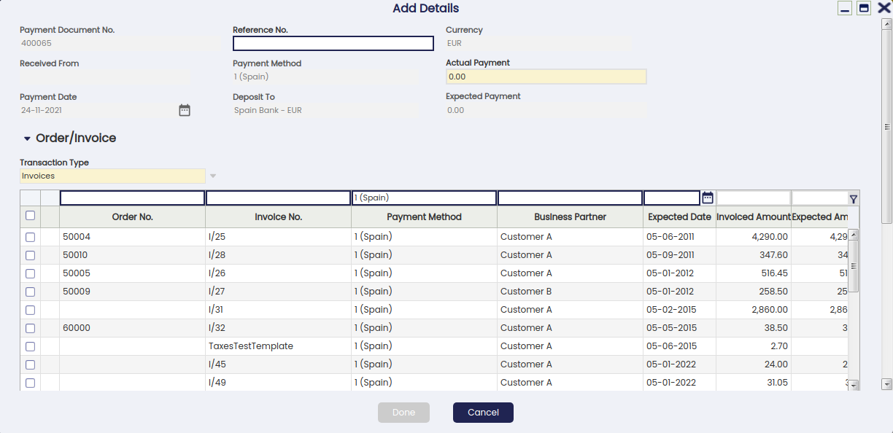
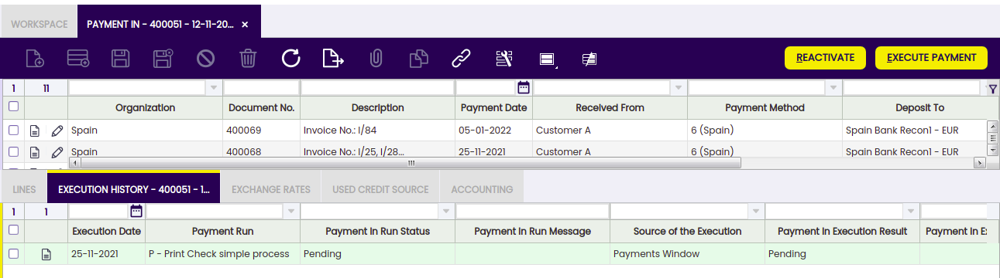
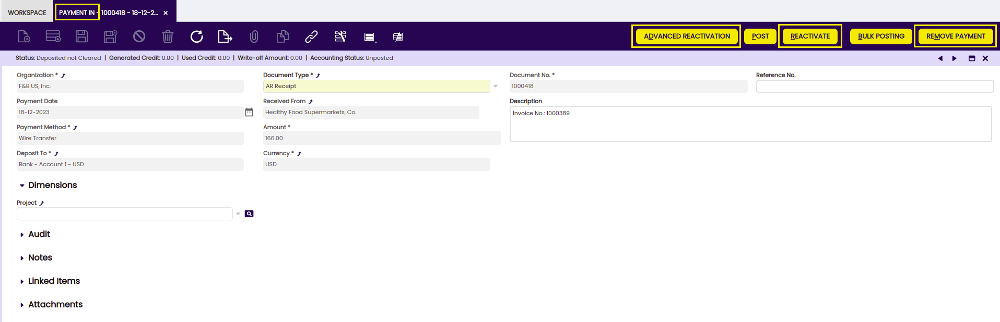
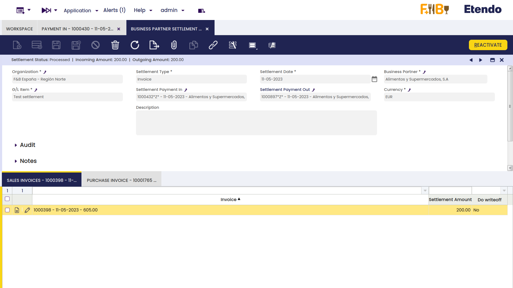

---
tags:
  - Etendo Classic
  - Financial Management
  - Payment In
  - Customer Payments
  - Receivables and Payables
---

# Payment In

:material-menu: `Application` > `Financial Management` > `Receivables and Payables` > `Transactions` > `Payment In`

## Overview

Customer's payments and prepayments received can be recorded and managed in the Payment In window. Besides, G/L item payments not related to orders/invoices can also be managed in this window.

Customer's payments can be received against:

- Sales Orders, in effect this is a _prepayment_.  
  Later on, when an invoice is created from the order that already has a payment received against it, the invoice automatically inherits the payment received against the order.
- Sales Invoices, in effect this is an invoice payment received from a customer.  
  Payments prior to the accounting date of the invoice are also considered a _prepayment_.
- And a G/L Items, in effect this is a payment of any other revenue received from a customer, for instance a fine.  
  This type of payments can be created in this window when selecting the G/L Item "Transaction Type" or can be automatically populated as a payment in this window if created in a G/L Journal.  
  Regardless the way they are created, both cases are managed in the same way depending on the Payment Method used.

!!! info
    Etendo allows the user to register payments received from a single customer or to register payments received from several customers at the same time.

At the end of the process, a "Payment In" transaction will imply the creation of a "Deposit" transaction in the corresponding Financial Account.

The creation of the deposit transaction in the financial account can be done:

- manually by using the Add Transaction process of the financial account.
- or automatically if the payment method used is configured to do so, that implies the selection of the check-box "Automatic Deposit".

## Header

The Payment In window allows the user to record and manage customer's payments received against different types of documents issued by the organization, such as orders and invoices. This window also allows the user to manage the customer's payments already recorded in the sales invoice window, in the same way as the G/L item payments received in a G/L Journal.

There are just a few mandatory fields to fill in while recording a payment in this window:

- the **Organization** which is receiving the payment
- the **Payment Number** which follows the corresponding document sequence
- the **Payment Method** used for receiving the payment. There is a check-box in the "Add Payment" window which later on allows the user to select documents linked to alternative payment methods
- and the **Financial Account** where the money is going to be deposited to.

Other relevant fields to note are:

- the **Amount** received. It does not need to be entered upon creating a new record.
- the **Received From** field shows the customer the user is receiving the payment from. It does not need to be entered upon creating a new record.
  - **If a customer is not selected,** it implies the creation of a payment which can collect the payment of different documents related to different customers.
  - **If a customer is selected,** it implies the creation of a payment which can collect the payment of different documents of the same customer. In this case, the value of the fields "Payment Method" and "Deposit To" change if the customer has assigned a specific payment method and financial account to be used while collecting its bills.
- **Reference No.**, this field is used to reflect the number printed on the payment justification document received from the customer.
- and the **Currency**. It is possible to select a different currency from the financial account currency while receiving a payment. In order to do so, the payment method used and assigned to the financial account of the payment needs to be configured to receive payments in multiple currencies.

### Add payment window

The **Add Details** button opens the **Add Payment** window, where the documents being paid can be selected.

!!! info
    The "Add Payment" window is already explained in the [Sales Invoice Payment article](../../sales-management/transactions.md#payment).

### Payment of several document types from different customers

If no customer has been selected in the field "Received From", it is possible to record the payment of different customers at the same time by just selecting the transactions to be paid.

!!! info
    Note that Etendo allows the user to filter once more by a given business partner if it was not entered in the "Received From" field by mistake. When this happens, payments must be done by executing them with the exact amount.

The **Actual Payment** amount entered is automatically spread among the pending debts (invoices or orders pending to be paid). It is possible to avoid this automatic distribution by setting the Preference _Add Payment: Automatically distribute amounts_ to 'N'

The user can check or uncheck the transactions as required, and can also modify the amounts shown in the "Amount" field.

It is important to note that:

- In this scenario, it is not possible to generate credit or refund a remaining amount to the customer because both actions need to be related to one single customer.  
  Therefore, if the amount paid and reflected in the actual payment field is higher than the sum of the invoice's grand total amount selected, an error message is shown saying that "There is an amount difference without any action selected".  
  In that case, either the actual payment amount needs to be decreased or another order/invoice to be paid needs to be selected.
- If the Actual Payment is less than the Expected Payment, the amount remaining can be left as:
  - an **underpayment**, that means registering a partial payment where the remaining debt will be paid afterwards by registering a new payment in
  - or can be **written off**, if that is selected, it means registering a partial payment where the remaining debt is not going to be paid, in this last case:
    - the customer's invoice is set as fully paid
    - the invoice posting to the ledger settles the total customer receivable amount
    - while the payment posting to ledger uses the account Write-off amounts to post the amount written-off.

### Processing a payment

There are two options available while **processing** a payment received created in this window:

- Process Received Payment(s)
- or Process Received Payment(s) and deposit.

Both options above process the received payment in, but the second one also creates the corresponding "Deposit" transaction in the Financial Account used.

This last option is the only one shown if the payment method used and assigned to the financial account where the money is going to be deposited to is configured as "Automatic Deposit" = Yes.

Besides:

- A system message displays the created payment's number
- Payment summary information is reflected in the **Status Bar** of the **Payment In** window.
- The **Description** field is updated with paid Invoice and Order numbers and the amount left as credit
- Payment detail records are introduced in the **Lines** tab.
- This process also updates the **Payment In Plan** and **Payment Monitor** information of all the documents involved.
- The **Payment Status** changes to _Awaiting Execution_ when an _Automatic_ **Execution Type** is defined or to _Payment Received_ if the execution is _Manual_.  
  If there is an execution process defined, it can be run by clicking the "**Execute Payment**" button. The information will appear in the Execution History tab.

Note that there is no need to process:

- customer's payments received in the Sales Invoice window as those are already processed in there
- or G/L item's payments received in the G/L Journal window as those imply the automatic processing of the payment received.

### Reactivating a payment

An already processed payment with status "Payment Received" or "Awaiting Execution" can be Reactivated. This option allows the user to edit wrong payment data or to delete a wrongly created payment.

"Reactivate" button allows the user to do what is explained above, as two different actions can be selected:

- **Reactivate**: This option reactivates the payment, keeping the payment lines.  
  Once the payment is reactivated this way, the user can easily modify the payment information by using the button "Add Details" and process it once again.
- **Reactivate and Delete lines**: This option reactivates the payment and removes all the payment lines.  
  This option is the one to use if the payment was wrongly created, therefore it has to be removed completely.  
  Once the payment is reactivated this way, the user can delete the payment header without the need of deleting the payment lines first.

An already processed and deposited payment with status "Deposited not Cleared" can be as well "Reactivated" as described above, but once the corresponding deposit transaction has been deleted from the financial account.

### Posting a payment

A payment received and processed in the Payment In window can be posted if the payment method used while creating the payment allows the user to do so once assigned to the financial account through which the payment is received. If that is not the case, Etendo shows a warning : "Document disabled for accounting".

A payment received posting looks like:

|                                                           |                |                |
| --------------------------------------------------------- | -------------- | -------------- |
| Account                                                   | Debit          | Credit         |
| Upon Receipt Use the "In Transit Payment IN Account" i.e. | Payment amount |                |
| Customer Receivables                                      |                | Payment amount |

The posting will be different when the amount comes partially or totally from a debt classified as doubtful.

### Voiding a payment

An already processed payment with status "Awaiting Execution" can be "**Voided**". The process button "Reactivate" allows the user to do that but only for payments in status "Awaiting Execution".

!!! info
    _Remember that a payment can get an awaiting execution status if the payment method used and assigned to the financial account is set up to have an automatic "Execution Type" and also the checkbox "Deferred" is selected._

Void action sets the payment line/s as "**Canceled**" which means that the document (order or invoice) is actually not paid therefore, a new payment can be created or added.

### Credit payments

It is not possible to generate credit on a payment which is not related to a single customer, therefore generated credit feature requires:

- to select a business partner (or customer) in the field "**Received From**" of the **Payment In** window.
- and enter the amount to be left as credit in the field "**Amount**" of the **Payment In** window.

The creation of a credit payment requires not to select any document to pay in the "Add Payment" window which is shown after pressing the process button "Add Details", but to leave the amount to be used later.

A credit payment is going to be available for the customer after processing a payment as above.

This credit payment specifies the generated credit amount in the "Description" field of the credit payment header.

Later on, the available credit generated for that customer can be used for further payments:

- in the "Add Payment" window, once a new payment is created for that customer in the payment in window by just selecting a line and setting the amount in **credit to use grid.**

- or in the "Select Credit Payments" window which is automatically shown upon completion of a new customer's invoice.

Then, the "Description" field of the credit payment header will also specify the transactions/documents where the credit was used.

The Use Credit Source tab of the payment in window shows the credit payment used to pay a customer's document (order, invoice or G/L item) payment.

### Payments in multiple currencies

Etendo allows the user to receive payments in a different currency than the financial account currency.

In order to do so, the payment method assigned to the financial account used to receive the payment needs to be configured to allow so, that implies to select the check-box "Receive Payments in Multiple Currencies".

### Prepayments exceeding the invoice amount to pay

Etendo allows the user to prepay by adding payments to the orders. The sales invoice created from the order will inherit the payment done for the order.

It can happen that the actual prepaid amount exceeds the invoice amount to pay, therefore the sales invoice remains as "Payment Complete" = "No" until

- either a "negative" payment in is created to reflect that the organization is paying back to the customer the difference, so final payment balance equals the sales invoice amount
- or a credit payment is created to be later on used while booking the payment of another sales invoice from the same customer.  
  This credit payment needs to be created as a new payment in for a 0.00 amount and related to the sales prepaid invoice, that way the prepaid invoice is set as "Payment Complete" = "Yes".

## Lines

The lines tab contains a list of the documents paid by the payment.

### Execution history

The execution history tab shows information about the history of the payment execution attempts.

For some payment types, some additional steps are needed. For example, a received payment with a check that needs to be filled in with the customer's check number.

In that case, the payment method linked to the payment needs to be configured to require an "Automatic" **Execution Type** process.

All of the above implies an additional step to take in the Payment In window, which is to execute the payment by using the process button "**Execute Payment**".

This process button is only shown in case of payment/s linked to an automation execution process for which the check-box "**Deferred**" is selected.

If the checkbox "Deferred" is not selected, the additional step is still required, but it will be automatically executed without any end-user action.

The Execution History tab is a read-only tab which shows information about the execution of the payment such as the execution date, obviously once the payment has been executed.

### Exchange rates

The exchange rate tab allows the user to enter an exchange rate between the organization's general ledger currency and the currency of the payment received to be used while posting the payment to the ledger.

### Used credit source

A credit payment can be used to settle more than one document payment. This table tracks the documents where a credit payment has been used.

The creation of a "Credit" payment is already explained in the Credit Payments section of this article, same as how a "Credit" payment or available customer's credit will appear on future customer's payments.

This read-only tab shows the credit payment used to pay a customer's document (order, invoice or G/L item) payment.

## Payment Removal

The aim of this functionality is to delete and reactivate payments in an agile and easy way. Also, it allows eliminating and reactivating bank transactions and reconciliations.

!!! info
    To be able to include this functionality, the Financial Extensions Bundle must be installed. To do that, follow the instructions from the marketplace: [Financial Extensions Bundle](https://marketplace.etendo.cloud/#/product-details?module=9876ABEF90CC4ABABFC399544AC14558){target="_blank"}. For more information about the available versions, core compatibility and new features, visit [Financial Extensions - Release notes](../../../../../../whats-new/release-notes/etendo-classic/bundles/financial-extensions/release-notes.md).

From this window, it is possible to delete payments by selecting the corresponding record and then clicking on the Remove Payment button.
On the other hand, it is possible to reactivate payments from the same window with the "Advanced Reactivation" button. This functionality allows the user to reactivate the payment without deleting manually its associated transactions, which is necessary if using the core button "Reactivate". This will return the payment to "Awaiting Payment" status and new payment details can be added.

In both cases:

- If the payment is included in the financial account, i.e., if it is in Deposited/Withdrawn not cleared status, the transaction in it will also be deleted (Financial account window > Transaction tab).

- If the payment is reconciled through an automatic method, then in addition to the transaction in the financial account, the line of the bank statement to which it was linked (Financial Account window > Imported Bank Statements) and the corresponding line of the bank reconciliation (Financial Account > Reconciliations) will be deleted.

!!! info
    If the payment is posted, the accounting entry will be deleted.

## Bulk Posting

!!! info
    To be able to include this functionality, the Financial Extensions Bundle must be installed. To do that, follow the instructions from the marketplace: [Financial Extensions Bundle](https://marketplace.etendo.cloud/#/product-details?module=9876ABEF90CC4ABABFC399544AC14558){target="_blank"}. For more information about the available versions, core compatibility and new features, visit [Financial Extensions - Release notes](../../../../../../whats-new/release-notes/etendo-classic/bundles/financial-extensions/release-notes.md).

The Bulk Posting functionality allows the user to post or unpost multiple records by selecting the corresponding records and clicking the **Bulk posting** button.

Also, the Accounting Status of the record/s is shown in the status bar, in form view, or in a column, in grid view.

!!! info
    For more information, visit [the Bulk Posting module user guide](../../../../../user-guide/etendo-classic/optional-features/bundles/financial-extensions/bulk-posting.md).

## Advanced Business Partner Settlement

!!! info
    To be able to include this functionality, the Financial Extensions Bundle must be installed. To do that, follow the instructions from the marketplace: [Financial Extensions Bundle](https://marketplace.etendo.cloud/#/product-details?module=9876ABEF90CC4ABABFC399544AC14558){target="\_blank"}.For more information about the available versions, core compatibility and new features, visit [Financial Extensions - Release notes](../../../../../../whats-new/release-notes/etendo-classic/bundles/financial-extensions/release-notes.md).

From the **Payment In** window, it is possible to create a settlement by clicking on the **Add Details** button. In the pop-up window, Etendo shows a list of invoices to be settled each one with its corresponding invoice number, here the user is able to select the corresponding invoice or invoices to net. First, set the **Actual Payment amount** to be paid and then, select the invoice/s to create a settlement and define the corresponding amount to be paid from the/each invoice.

From the **Invoice From Compensation tab**, select the purchase invoice/s that will be used to pay and set the needed amount from the invoice/s to be netted.

Below that, in the **Totals** tab, Etendo shows the total reference amounts to be netted.

After clicking the button Done, the system nets the invoices and credits for the corresponding business partner and creates a settlement record.

The settlement record is registered in the **Business Partner Settlement** window where the lines for the invoice/s (sales and purchase) used to net will be shown.

!!! info
    For more information, visit the [Business Partner Settlement Module - User Guide](../../../optional-features/bundles/financial-extensions/business-partner-settlement.md).

## Advanced Bank Account Management

!!! info
    To be able to include this functionality, the Advanced Bank Account Management module of the Financial Extensions Bundle must be installed. To do that, follow the instructions from the marketplace: [Financial Extensions Bundle](https://marketplace.etendo.cloud/#/product-details?module=9876ABEF90CC4ABABFC399544AC14558){target="\_blank"}. For more information about the available versions, core compatibility and new features, visit [Financial Extensions - Release notes](../../../../../../whats-new/release-notes/etendo-classic/bundles/financial-extensions/release-notes.md).

This module includes the Bank account column to the Add details pop-up window to be able to filter possible payments by bank account.

!!! info
    For more information, visit the [Advanced Bank Account Management user guide](../../../optional-features/bundles/financial-extensions/advanced-bank-account-management.md).

---

This work is a derivative of [Financial Management](http://wiki.openbravo.com/wiki/Financial_Management){target="\_blank"} by [Openbravo Wiki](http://wiki.openbravo.com/wiki/Welcome_to_Openbravo){target="\_blank"}, used under [CC BY-SA 2.5 ES](https://creativecommons.org/licenses/by-sa/2.5/es/){target="\_blank"}. This work is licensed under [CC BY-SA 2.5](https://creativecommons.org/licenses/by-sa/2.5/){target="\_blank"} by [Etendo](https://etendo.software){target="\_blank"}.
