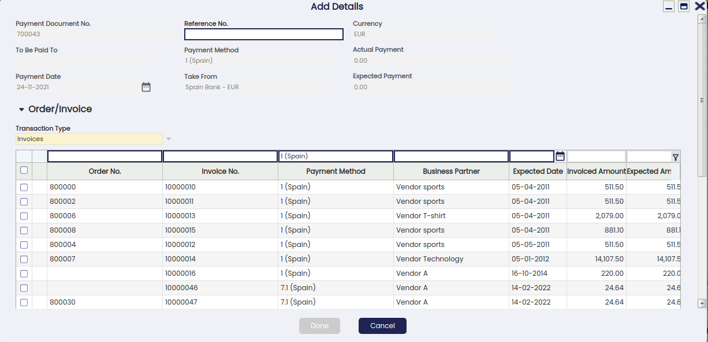
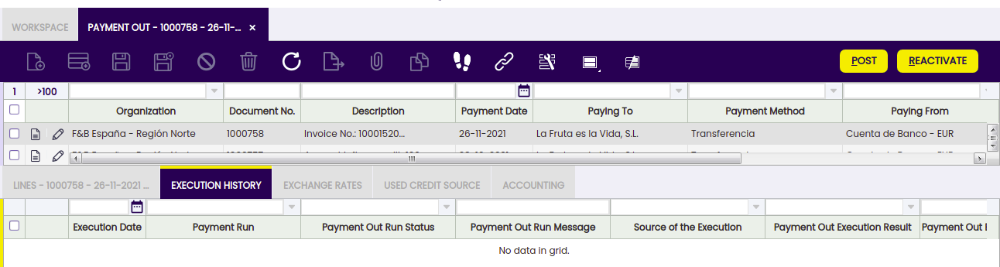
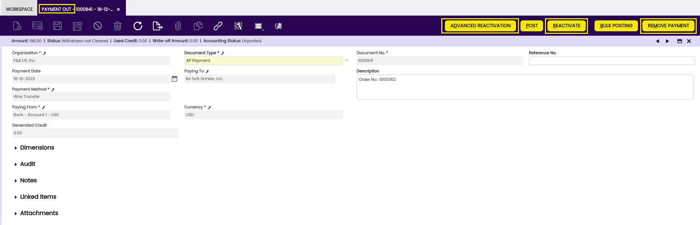
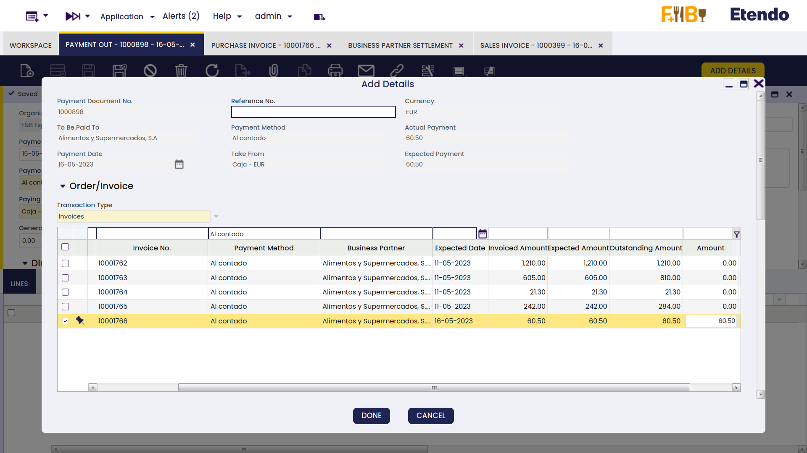
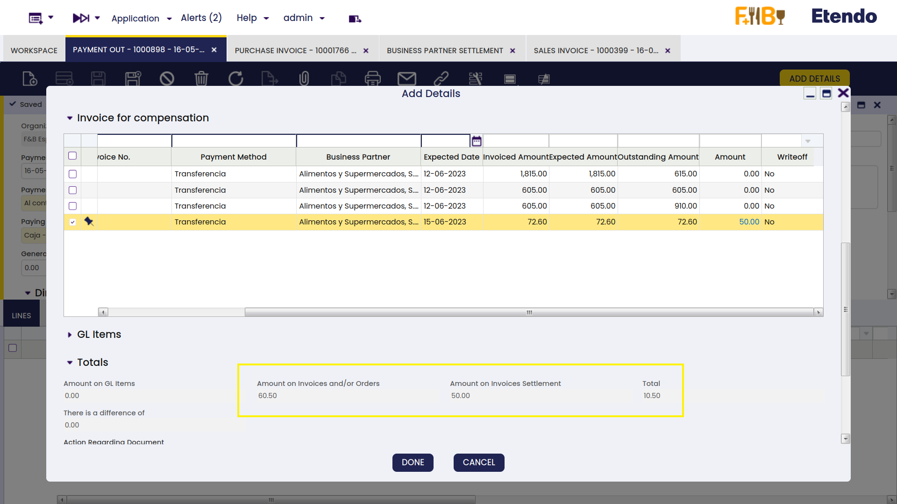
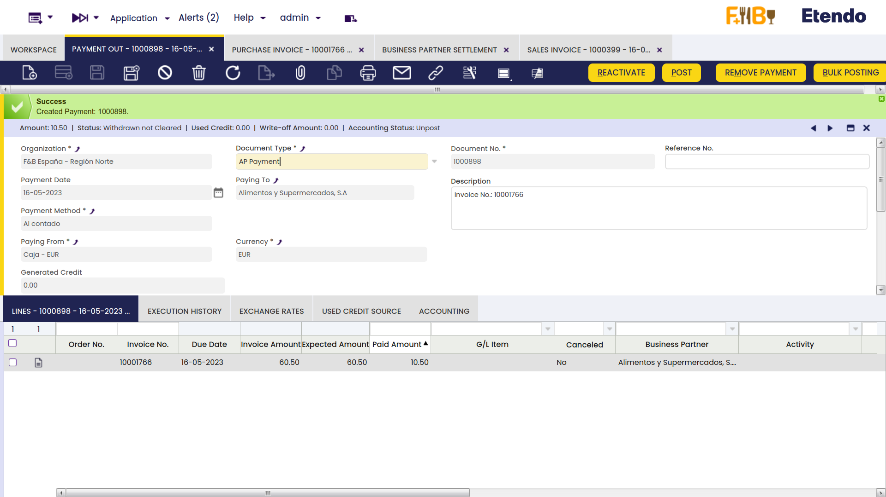
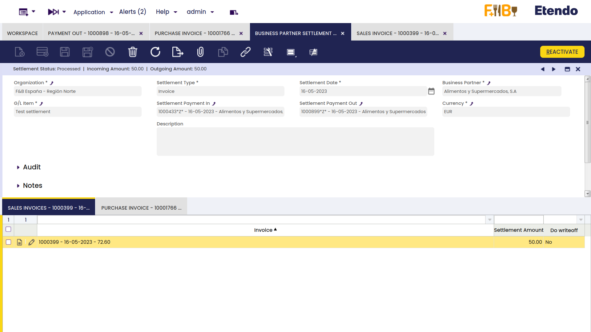

---
tags:
  - Etendo Classic
  - Financial Management
  - Payment Out
  - Supplier Payments
  - Receivables and Payables
---

# Payment Out

:material-menu: `Application` > `Financial Management` > `Receivables and Payables` > `Transactions` > `Payment Out`

## Overview

Supplier's payments and prepayments can be made and managed in the payment out window. G/L item payments not related to orders/invoices can also be managed in this window.

Payments can be made against different types of documents:

- Purchase Orders, in effect this is a _prepayment_.  
  Later on, when an invoice is created from the order that already has a payment received against it, the invoice automatically inherits the payment received against the order.
- Purchase Invoices, in effect this is a payment of a vendor invoice.  
  Payments prior to the accounting date of the invoice are also considered a _prepayment_.
- And G/L Items, in effect this is a payment of any other expense to a vendor, for instance a fine or other types of fee not included in an invoice.  
  This type of payments can be created in this window by adding the corresponding G/L Item as well as the "Paid Out" amount, or can be automatically populated as a GL item if created as a GL Item payment in a G/L Journal.  
  Regardless the way they are created, both cases are managed in the same way depending on the Payment Method used.

Payments can be created **to pay to** a **single vendor** or **to pay to** several **vendors** at the same time.

At the end of the process a "**Payment Out**" transaction will imply the creation of a "**Withdrawal**" transaction in the corresponding Financial Account.

The creation of the withdrawal transaction in the financial account can be done:

- manually by using the Add Transaction process of the financial account.
- or automatically, if the payment method used is configured to do so, that implies the selection of the checkbox "Automatic Withdrawal".

## Header

The Payment Out window allows the user to make and manage supplier's payments done to settle different types of documents such as orders and invoices. This window also allows the user to manage the supplier's payments already made in the purchase invoice window, the same way as the G/L item payments made in a G/L Journal.

There are just a few mandatory fields to fill in while making a payment in this window:

- the **Organization** which is paying
- the **Payment Number** which follows the corresponding document sequence.
- the **Payment Method** to use for making the payment. There is a check-box in the "Add Payment" window which later on allows to select documents linked to alternative payment methods
- and the **Financial Account** from where the money is going to be taken in the field "**Paying From**".

Other relevant fields to note are:

- **Paying To** field, that is, the vendor we are making a payment to, it does not need to be entered upon creating a new record.
  - If a vendor is not selected, it implies the creation of a payment to pay different documents of different vendors.
  - If a vendor is selected, it implies the creation of a payment to pay different documents of the same vendor. In this case, the value of the fields "Payment Method" and "Paying From" change if the vendor has assigned a specific payment method and financial account to be used while paying its bills.
- **Reference No.**, this field is used to reflect the number associated with the payment in the Vendor documentation system, if any.
- **Currency**. It is possible to select a different currency than the financial account currency while making a payment. In order to do this, the payment method used and assigned to the financial account of the payment needs to be configured to make payments in multiple currencies.

### Add Payment Window

The **Add Details** button opens the **Add Payment** window, where outstanding documents to be paid can be selected.

The **Add Payment** window is already explained in the Purchase Invoice payment article.

### Payment of Several Document Types from Different Vendors

If no vendor has been selected in the field "Paying To", it is possible to pay different transaction types of different vendors by just selecting them.

!!! info
    Etendo allows the user to filter once more by a given business partner if it was not entered in the "Paying To" field by mistake.

The "Actual Payment Out" field will then show the sum up value of all the transactions being selected to be paid.

Once the payment is processed, the lines tab lists all the orders and invoices and even G/L items included in the payment, same as the "**Description**" field of the payment header.

### Reactivating a payment

An already processed payment with status "Payment Made" or "Awaiting Execution" can be **Reactivated**. This option allows users to edit wrong payment data or to delete a wrongly created payment.

"Reactivate" button allows the user to do what is explained above as two different actions can be selected:

- **Reactivate**: This option reactivates the payment, keeping the payment lines.  
  Once the payment is reactivated, the user can easily modify the payment information by using the button "Add Details" and process it once again.
- **Reactivate and Delete lines**: This option reactivates the payment and removes all the payment lines.  
  This option is the one to use if the payment was wrongly created and therefore needs to be removed completely.  
  Once the payment is reactivated, the user can delete the payment header without the need of deleting the payment lines first.

An already processed and withdrawn payment with status "Withdrawn not Cleared" can be as well "**Reactivated**" as described above, but once the corresponding withdrawal transaction has been deleted from the financial account.

### Posting a payment

A payment made and processed from the Payment Out window can be posted if the payment method used while creating the payment allows the user to do so once assigned to the financial account through which the payment is made. If that is not the case, Etendo shows a warning: "Document disabled for accounting".

A payment made posting looks like:

|                                                           |                |                |
| --------------------------------------------------------- | -------------- | -------------- |
| Account                                                   | Debit          | Credit         |
| Vendor Liability                                          | Payment amount |                |
| Upon Payment Use the "In Transit Payment OUT Account" i.e |                | Payment amount |

### Voiding a payment

An already processed payment with status "Awaiting Execution" can be "**Voided**". The process button "Reactivate" allows the user to do that but only for payments in status "Awaiting Execution".

!!! info
    _Remember that a payment can get an awaiting execution status if the payment method used and assigned to the financial account is set up to have an automatic "Execution Type" and also the checkbox "Deferred" is selected._

Void action sets the payment line/s as "**Canceled**" which means that the document (order or invoice) is actually not paid therefore, a new payment can be created or added.

### Credit payments

The field "**Generated Credit**" which can be found in the "Payment Out" header, allows the user to generate credit (or a credit payment in Etendo terms) for a business partner by just entering the credit amount in that field.

It is not possible to generate credit on a payment which is not related to a single vendor or creditor, therefore, the generated credit feature requires the user to select a business partner in the field "Paying To".

The creation of a credit payment requires not to select any document to pay in the **"Add Payment" window** which is shown after pressing the process button "**Add Details**", but to leave the credit amount to be used later.

A credit payment is created after processing. This credit payment specifies the amount left as credit in the "Description" field of the credit payment header.

Later on, the available credit generated for that vendor can be used to pay the vendor:

- in the "**Add Payment**" window once a new Payment Out is created for that vendor by just selecting the credit in the section "Credit to Use".

- or in the "**Select Credit Payments**" window which is **automatically shown** upon completion of a new vendor's invoice.

!!! info
    In both cases, the "Description" field of the credit payment header will also specify the transactions/documents where the credit was used.

The Use Credit Source tab of the payment out window shows the credit payment used to pay a vendor's document (order, invoice or G/L item) payment.

### Payments in multiple currencies

Etendo allows the user to make payments in a different currency than the financial account currency.

To use this option, the payment method assigned to the financial account used to make the payment needs to be configured to allow so, that implies to select the check-box "Make Payments in Multiple Currencies".

### Prepayments exceeding the invoice amount to pay

Etendo allows to prepay by adding payments to the orders. The purchase invoice created from the order will inherit the payment done for the order.

When the actual prepaid amount exceeds the invoice amount to pay, the purchase invoice remains as **"Payment Complete" = "No"** until

- either a "negative" payment out is created to reflect that the supplier is paying back to the organization the difference, so final payment balance equals the purchase invoice amount
- or a credit payment is created to be later on used while paying another invoice to the same supplier.  
  This credit payment needs to be created as a new payment out related to the purchase prepaid invoice, that way the prepaid invoice is set as **"Payment Complete" = "Yes"**.

## Lines

Lines tab contains a list of the documents to be paid or already paid by the payment.

### Execution history

The execution history tab shows information about the history of the payment execution attempts.

For some payment types, some additional steps are needed. For example, a payment with a check that needs to be filled in with a check number.

In that case, the payment method linked to the payment needs to be configured to require an "Automatic" **Execution Type** process.

All of the above implies an additional step to take in the Payment Out window, which is to execute the payment by using the process button "**Execute Payment**".

This process button is only shown in case of payment/s linked to an automation execution process for which the check-box "**Deferred**" is selected.

If the checkbox "Deferred" is not selected, the additional step is still required, but it will be automatically executed without any end-user action.

The Execution History tab is a read-only tab which shows information about the execution of the payment such as the execution date, just once the payment has been executed.

### Exchange rates

The exchange rate tab allows the user to enter an exchange rate between the organization's general ledger currency and the currency of the payment made to be used while posting the payment to the ledger.

### Used credit source

A credit payment can be used to settle more than one document payment. This table tracks the documents where a credit payment has been used.

The creation of a "Credit" payment is already explained in the Credit Payments section of this article, same as how a "Credit" payment or available credit can be used later on to pay a vendor.

This read-only tab shows the credit payment used to pay a vendor document (order, invoice or G/L item) payment.

## Payment Removal

The aim of this functionality is to delete and reactivate payments in an agile and easy way. Also, it allows eliminating and reactivating bank transactions and reconciliations.

!!! info
    To be able to include this functionality, the Financial Extensions Bundle must be installed. To do that, follow the instructions from the marketplace: [Financial Extensions Bundle](https://marketplace.etendo.cloud/#/product-details?module=9876ABEF90CC4ABABFC399544AC14558){target="_blank"}. For more information about the available versions, core compatibility and new features, visit [Financial Extensions - Release notes](../../../../../../whats-new/release-notes/etendo-classic/bundles/financial-extensions/release-notes.md).

From this window, it is possible to delete payments by selecting the corresponding record and then clicking on the Remove Payment button.
On the other hand, it is possible to reactivate payments from the same window with the "Advanced Reactivation" button. This functionality allows the user to reactivate the payment without deleting manually its associated transactions, which is necessary if using the core button "Reactivate". This will return the payment to "Awaiting Payment" status and new payment details can be added.

In both cases:

- If the payment is included in the financial account, i.e., if it is in Deposited/Withdrawn not cleared status, the transaction in it will also be deleted (Financial Account window > Transaction tab).

- If the payment is reconciled through an automatic method, then in addition to the transaction in the financial account, the line of the bank statement to which it was linked (Financial Account window > Imported Bank Statements) and the corresponding line of the bank reconciliation (Financial Account > Reconciliations) will be deleted.

!!! info
    If the payment is posted, the accounting entry will be deleted.

## Bulk Posting

!!! info
    To be able to include this functionality, the Financial Extensions Bundle must be installed. To do that, follow the instructions from the marketplace: [Financial Extensions Bundle](https://marketplace.etendo.cloud/#/product-details?module=9876ABEF90CC4ABABFC399544AC14558){target="_blank"}. For more information about the available versions, core compatibility and new features, visit [Financial Extensions - Release notes](../../../../../../whats-new/release-notes/etendo-classic/bundles/financial-extensions/release-notes.md).

The Bulk Posting functionality allows the user to post or unpost multiple records by selecting the corresponding records and clicking the **Bulk posting** button.

Also, the Accounting Status of the record/s is shown in the status bar, in form view, or in a column, in grid view.

!!! info
    For more information, visit [the Bulk Posting module user guide](../../../../../user-guide/etendo-classic/optional-features/bundles/financial-extensions/bulk-posting.md).

## Advanced Business Partner Settlement

!!! info
    To be able to include this functionality, the Financial Extensions Bundle must be installed. To do that, follow the instructions from the marketplace: [Financial Extensions Bundle](https://marketplace.etendo.cloud/#/product-details?module=9876ABEF90CC4ABABFC399544AC14558){target="\_blank"}. For more information about the available versions, core compatibility and new features, visit [Financial Extensions - Release notes](../../../../../../whats-new/release-notes/etendo-classic/bundles/financial-extensions/release-notes.md).

  
From the **Payment Out** window, it is possible to create a settlement by clicking on the **Add Details** button.
In the pop-up window, Etendo shows a list of invoices to be settled each one with its corresponding invoice number, here the user is able to select the corresponding invoice or invoices to net. The **Actual Payment amount** to pay is set, then select the invoice/s to create a settlement and define the corresponding amount to be paid from the/each invoice.

From the **Invoice From Compensation** tab, select the sales invoice/s that will be used to pay and set the needed amount from the invoice/s to be netted.

Below that, in the **Totals** tab, Etendo shows the total reference amounts to be netted.

After clicking the button Done, the system nets the invoices and credits for the corresponding business partner and creates a settlement record.

The settlement record is registered in the **Business Partner Settlement** window where the lines for the invoice/s (sales and purchase) used to net will be shown.

!!! info
    For more information, visit the [Business Partner Settlement Module - User Guide](../../../optional-features/bundles/financial-extensions/business-partner-settlement.md).
  
## Advanced Bank Account Management

!!! info
    To be able to include this functionality, the Advanced Bank Account Management module of the Financial Extensions Bundle must be installed. To do that, follow the instructions from the marketplace: [Financial Extensions Bundle](https://marketplace.etendo.cloud/#/product-details?module=9876ABEF90CC4ABABFC399544AC14558){target="\_blank"}. For more information about the available versions, core compatibility and new features, visit [Financial Extensions - Release notes](../../../../../../whats-new/release-notes/etendo-classic/bundles/financial-extensions/release-notes.md).

This module includes the Bank account column to the Add details pop-up window to be able to filter possible payments by bank account.

!!! info
    For more information, visit the [Advanced Bank Account Management user guide](../../../optional-features/bundles/financial-extensions/advanced-bank-account-management.md).

---

This work is a derivative of [Financial Management](http://wiki.openbravo.com/wiki/Financial_Management){target="\_blank"} by [Openbravo Wiki](http://wiki.openbravo.com/wiki/Welcome_to_Openbravo){target="\_blank"}, used under [CC BY-SA 2.5 ES](https://creativecommons.org/licenses/by-sa/2.5/es/){target="\_blank"}. This work is licensed under [CC BY-SA 2.5](https://creativecommons.org/licenses/by-sa/2.5/){target="\_blank"} by [Etendo](https://etendo.software){target="\_blank"}.
