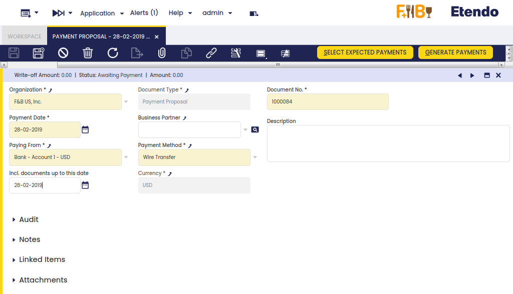

---
tags:
  - Etendo Classic
  - Financial Management
  - Payment Proposal
  - Supplier Payments
  - Receivables and Payables
---

# Payment Proposal

:material-menu: `Application` > `Financial Management` > `Receivables and Payables` > `Transactions` > `Payment Proposal`

## Overview

The payment proposal is a tool that helps the user to make payments by selecting the documents related to a given payment method or scheduled to be paid before a given due date. The system proposes what should be paid based on the selection criteria provided by the user.

The steps to follow are:

- _Enter_ the selection criteria, that could be:
  - to enter a given business partner whose invoices we want to pay
  - to enter a given payment method, for instance "Wire Transfer" if we want to generate at once all the wire transfer of the month
  - or to enter a given date in the field "Incl.documents up to this date" if we want to pay all the invoices having a due date before that date
  - etc
- _Run_ the process "**Select Expected Payments**".  
  This process selects the scheduled payment events of the orders/invoices, that match the selection criteria entered and makes a payment proposal.
- _Select_ those documents (orders and/or invoices) of the proposal that the organizations wants to pay.
- _Submit_ the proposal.  
  This action populates the Lines tab of the payment proposal window.
- _Run_ the process "**Generate Payments**".  
  This process generates the payment or payments by having into account that:
  - a payment can group separate orders/invoices to be paid for the same vendor into one payment
  - or group separate orders/invoices to be paid regardless the vendor into one payment.

### Header

The payment proposal window allows the user to enter a set of selection criteria that help the user to make payments massively.

The fields to note are:

- **Business Partner:** if a business partner is entered only the documents due to that business partner will be proposed.
- **Payment Method:** if a payment method is entered, only the documents having that payment method assigned will be proposed, however pending invoices or orders linked to different payment methods can also be selected by clearing the implicit filters applied (by clicking the funnel icon.).
- **Paying From:** it is possible to select the Financial Account which has the above payment method configured from where we need to extract money.
- **Currency**: it is possible to select a currency if the payment method selected is configured to allow making payments in multiple currencies. If that is the case, a field is shown which allows the user to enter the "Exchange Rate" between the document's currency and the financial account's currency.
- **Incl. documents up to this date:** This field allows the user to enter a date, therefore the documents of the proposal will have a due date on or before the given date.

The **Select Expected Payments** header button displays the documents that match the selection criteria entered above.

!!! info
    Notice that the data shown in the grid is filtered using the previous criteria (implicit filter). In order to see pending invoices or orders of a different Payment Method for instance, it is necessary to clear the filters by clicking the funnel icon.

Besides, the "Select Expected Payments" window allows the user to:

- enter a "**Supplier Reference**", if any
- modify the "**Payment**" amount if the amount to pay is less than the outstanding amount
- and select the "**Write-off**" checkbox to write off the difference between the outstanding amount and the payment amount entered per each document/raw selected.

The "**Submit**" button finishes the process and gets that the selection is populated in the Lines tab.

Finally, the **Generate Payments** header button allows the user to take two actions:

- either to **group separate payments for the same vendor into one payment**,  
  this option allows the user to group pending orders/invoice of the same vendor to be paid in one payment transaction.
- or **group all orders/invoices into one payment**,  
  this option allows the user to group pending orders/invoice to be paid in one payment transaction, regardless the vendor.

Once executed:

- A system message displays the created payment's number/s.
- The payment summary information is reflected in the Status Bar of the Payment Proposal window.
- The Payment Out Plan and the Payment Monitor information of all the documents involved is updated.
- Finally, the Payment Status changes to _Awaiting Execution_ when an _Automatic_ Execution Type is defined or to _Payment Made_ if the execution is _Manual_. If there is an execution process defined, it can be run by clicking the Execute Payment button.

### Lines

The lines tab shows the transactions (orders and/or invoices) included in the payment proposal.

A payment proposal can be "**Reactivated**" that means that the payment/s created are deleted and therefore removed from the Payment Out window.

---

This work is a derivative of [Financial Management](http://wiki.openbravo.com/wiki/Financial_Management){target="\_blank"} by [Openbravo Wiki](http://wiki.openbravo.com/wiki/Welcome_to_Openbravo){target="\_blank"}, used under [CC BY-SA 2.5 ES](https://creativecommons.org/licenses/by-sa/2.5/es/){target="\_blank"}. This work is licensed under [CC BY-SA 2.5](https://creativecommons.org/licenses/by-sa/2.5/){target="\_blank"} by [Etendo](https://etendo.software){target="\_blank"}.
