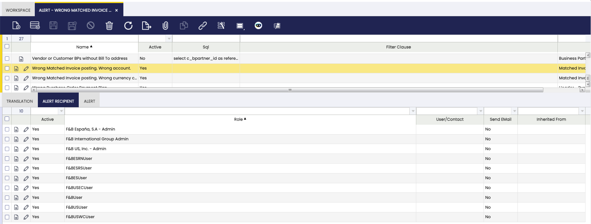

# Alert

## Overview

Alerts are notifications which inform about events happening whenever an alert rule has been properly defined to monitor those events.

The way **Alerts** work in Etendo is described below:

- Alert rules need to be previously defined as SQL queries. SQL queries define the event that is going to be monitored.  
  For instance, *Products without a defined price*, *Products under stock* or *Bank account without accounting information*
- An alert rule can be applied to every Etendo user or just to a set of them. Alert recipients are the Etendo users for which a given event is going to be monitored.
- An Etendo background process is permanently checking if the SQL query defined in each of the active rule alerts return any record.
  - If that is the case, Etendo creates and returns a new *alert instance*, which is saved in the *Alert Management* window in *New* status.

The *number of alerts instances* informing about events being monitored happening is shown in the **Top Navigation** menu:

## Alert View
Alerts instances can be visualized and managed in the *Alert Management* window which is opened by clicking the **Alert** option of the Top Navigation menu.

Alerts can have 4 different status:

- **New**: New alerts instances which reflect the events monitored happening.
- **Pending**: Acknowledge alert instances for which an end-user action is pending to be done to get them solved or fixed.
- **Ignore**: Not applicable alert instances which must be ignored.
- **Solved**: Alert instances solved as the event happening is fixed or solved.

The way to manage alerts instances is by manually selecting and moving them to the next or previous status once they are manually acknowledged, ignored or solved.

## Alert Window
:material-menu: `Application` > `General Setup` > `Application` > `Alert`

Alert window allows the definition of alert rules as SQL queries which define the event to be monitored and how it will be monitored.

Alerts are defined by entering below data:

- The *Name* of the alert which is the event to be monitored.
- The *SQL* query.
- and the *Tab* where the alert instance can be fixed or solved.

### Translation

Alerts can be translated to any language required.

### Alert Recipient

Alerts can be allocated to specific users or contact or to all of them.

!!! warning
    If no *Role* or *User* is configured in the *Alert Recipient tab* of a given alert, that alert will apply to any Etendo user or role.

Etendo supports alerts notification to user or roles by email: For this, it is required to properly configure **e-mail** server, account and password for the corresponding client in the header of the [Client](../client/client.md#email-configuration) window, *Email Configuration* section.

### Alert

Alert tab list the events happening which generate the corresponding alert.

---

This work is a derivative of [General Setup](https://wiki.openbravo.com/wiki/General_Setup){target="_blank"} by [Openbravo Wiki](http://wiki.openbravo.com/wiki/Welcome_to_Openbravo){target="_blank"}, used under [CC BY-SA 2.5 ES](https://creativecommons.org/licenses/by-sa/2.5/es/){target="_blank"}. This work is licensed under [CC BY-SA 2.5](https://creativecommons.org/licenses/by-sa/2.5/){target="_blank"} by [Etendo](https://etendo.software){target="_blank"}.