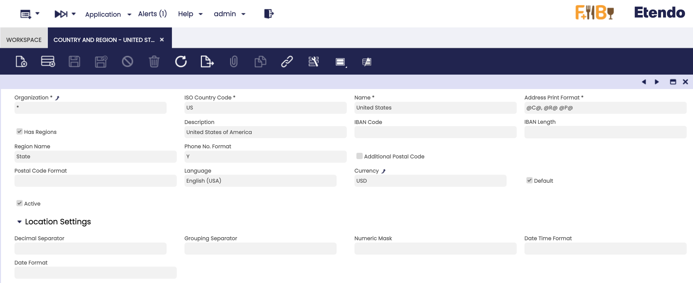
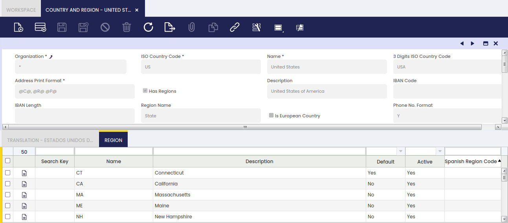
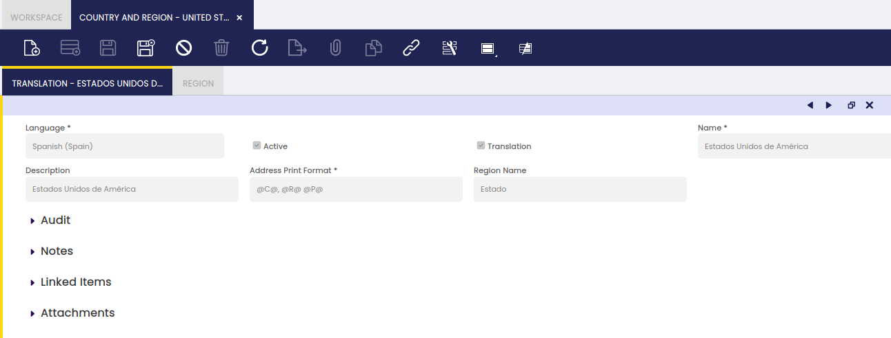
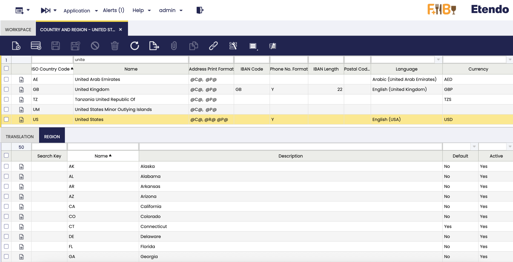

# Country and Region
:material-menu: `Application` > `General Setup` > `Application` > `Country and Region`

## Overview

Countries and regions are basic settings to share within Etendo.

Countries and their corresponding regions are automatically created and listed in this window once Etendo installation is completed.

!!! info
    All these countries and regions are linked to the system organization (\*), that means that those countries and regions will be shared by all the organizations in the system.

## Country and Region

This window allows the user to visualize and/or to create and maintain the countries and the regions to be used in daily business activities.

As shown in the image above, country relevant data is:

- The **country ISO code**.
    - Country ISO codes are worldwide used codes for the representation of the countries.
- The **address print format**.
- Whether it has any kind of **regions** such as states or not. "Has regions" flag needs to be enable to enter regions in the Region tab.
- The **region name**
- The country **IBAN code** of the country
    - IBAN or **International Bank Account Number** is a system of numbering that was created to categorize the bank accounts worldwide.
- The country **IBAN code length** of the country.
- The **Phone number format**
- The default **language**
- and the default **currency**

### Translation

Countries and regions can be translated to any language.

### Region

Regions tab allows the user to visualize and/or to create and maintain the regions of any type of country.

!!! info
    Country regions are simply defined by a name and a description.

---

This work is a derivative of [General Setup](https://wiki.openbravo.com/wiki/General_Setup){target="_blank"} by [Openbravo Wiki](http://wiki.openbravo.com/wiki/Welcome_to_Openbravo){target="_blank"}, used under [CC BY-SA 2.5 ES](https://creativecommons.org/licenses/by-sa/2.5/es/){target="_blank"}. This work is licensed under [CC BY-SA 2.5](https://creativecommons.org/licenses/by-sa/2.5/){target="_blank"} by [Etendo](https://etendo.software){target="_blank"}.