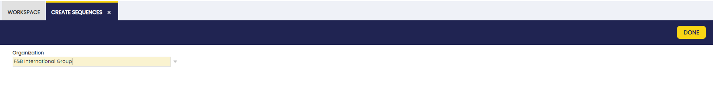

# Create Sequences
:material-menu: `Application` > `General Setup` > `Application` > `Create Sequences`

## Process Execution
In this process window, the **Create Sequences** process is executed.

When selecting the **organization** and executing the process, Etendo creates the sequences for the type of fields `Transactional Sequence` or `Non transactional Sequence`. The main advantage of these *new sequences* is dynamic masking, which makes it possible to add dates or dynamic strings.

!!! warning
    - The user can run this process only after a developer configures the sequence fields using `transactional` or `non-transactional` sequences.
    - For more information about this configuration, visit the technical documentation about [Sequences](../../../../../developer-guide/etendo-classic/how-to-guides/how-to-use-advanced-sequences.md).

## Document Sequence

:material-menu: `Financial Management`>`Accounting`>`Setup`>`Document Sequence`

After that, in the [Document Sequence](../../financial-management/accounting/setup.md#document-sequence) window the user can see and edit the sequences generated.

<figure markdown="span">
  
  <figcaption>List of sequences generated by the process</figcaption>
</figure>

---
This work is licensed under :material-creative-commons: :fontawesome-brands-creative-commons-by: :fontawesome-brands-creative-commons-sa: [ CC BY-SA 2.5 ES](https://creativecommons.org/licenses/by-sa/2.5/es/){target="_blank"} by [Futit Services S.L](https://etendo.software){target="_blank"}.