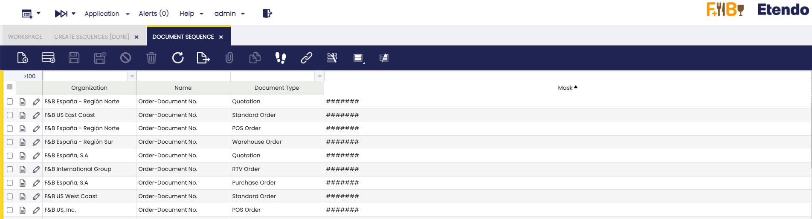

:material-menu: `Application` > `General Setup` > `Application` > `Create Sequences`

In this window, the Create Sequences process is executed.

When selecting the organization and executing the process, Etendo creates the sequences for the type of fields "Transactional Sequence" or "Non transactional Sequence".

The main advantage of these new sequences is dynamic masking, which makes it possible to add dates or dynamic strings.

!!! warning
    The user can run this process only after a developer configures the sequence fields using transactional or non-transactional sequences.

!!! info
    For more information about this configuration, visit the technical documentation about [Sequences](../../../../../developer-guide/etendo-classic/how-to-guides/how-to-use-advanced-sequences.md).

After that, in the `Financial Management`>`Accounting`>`Setup`>`Document Sequence` window the user can see and edit the sequences generated.

| _List of sequences generated by the process_ |

---

This work is a derivative of [General Setup](https://wiki.openbravo.com/wiki/General_Setup){target="_blank"} by [Openbravo Wiki](http://wiki.openbravo.com/wiki/Welcome_to_Openbravo){target="_blank"}, used under [CC BY-SA 2.5 ES](https://creativecommons.org/licenses/by-sa/2.5/es/){target="_blank"}. This work is licensed under [CC BY-SA 2.5](https://creativecommons.org/licenses/by-sa/2.5/){target="_blank"} by [Etendo](https://etendo.software){target="_blank"}.