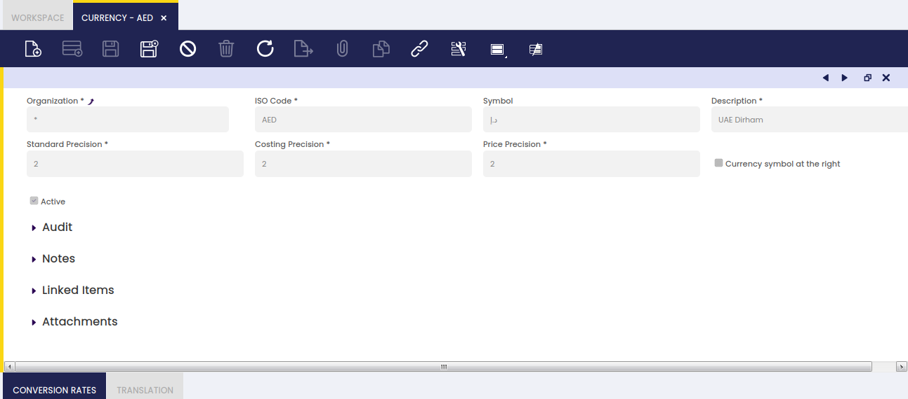
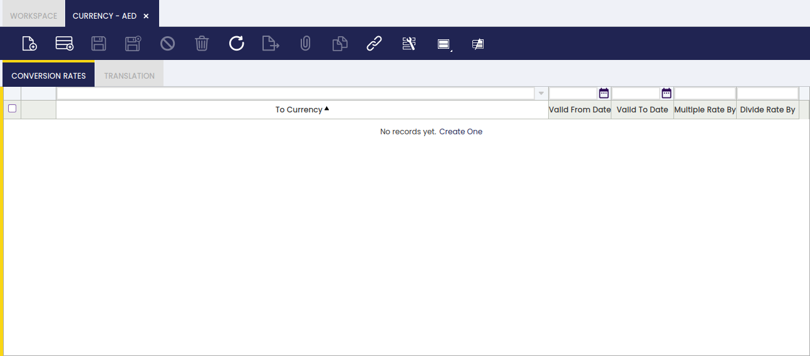

:material-menu: `Application` > `General Setup` > `Application` > `Currency`

### Overview

Currencies and conversion rates are basic settings in Etendo.

Currencies used worldwide are automatically created and listed in the currency window once Etendo installation is completed.

!!! info
    All these currencies are linked to the system organization (\*), that means that those currencies will be shared by all the organizations in the system.

### Currency

Currency window allows the user to visualize or to create and configure the currencies to use in monetary transactions.

As shown in the image above, currency relevant data is:

- the currency _ISO code_. Currency ISO codes are worldwide used codes for the representation of currencies and funds.
- the currency _symbol_ which can be placed at the right or at the left of an amount
- and the currency _precision_ or number of decimals to use while calculating amounts in that currency.

Etendo allows the user to setup three types of currency precision:

- the **standard precision,** defaulted to 2, is the one used overall but for prices and cost amounts calculations which can use a different precision.  
  This precision is the one used to calculate order and invoices amounts such as "Line Net Amount", "Total Net Amount" and "Total Gross Amount", therefore it should not be bigger than 2 unless the currency allows the user to pay smaller quantities than 0.01
- the **costing precision,** defaulted to 2, is the one used for product cost calculations. It is recommended to change it up to 4
- and the **price precision** is the one used for unit/list prices which can have more than 2 decimals precision because amounts are finally rounded to 2 by the standard precision.

!!! warning
    Changes on currency precision can only be made at client level, therefore System Admin Role needs to be used.

### Conversion Rates

Conversion rates tab lists the available conversion rates for a given currency.

A conversion rate is the valid rate at which one currency may be converted into another one within a given period of time.

This implies that a single currency might have several conversion rates depending on:

- the currency at which might be converted
- and the period of validity

!!! info
    Currency conversion rates can be also created in the Conversion Rates window, therefore it can be reviewed in this tab.

!!! note
    Etendo recommends conversion rates to be configured in the Conversion Rates window, as it is required to defined both the "Multiple Rate By" (USD - €) and the "Divide Rate By" (€ - USD) to properly defined the exchange of two currencies.

### Translation

Currencies can be translated to any language if required.

---

This work is a derivative of [General Setup](https://wiki.openbravo.com/wiki/General_Setup){target="_blank"} by [Openbravo Wiki](http://wiki.openbravo.com/wiki/Welcome_to_Openbravo){target="_blank"}, used under [CC BY-SA 2.5 ES](https://creativecommons.org/licenses/by-sa/2.5/es/){target="_blank"}. This work is licensed under [CC BY-SA 2.5](https://creativecommons.org/licenses/by-sa/2.5/){target="_blank"} by [Etendo](https://etendo.software){target="_blank"}.