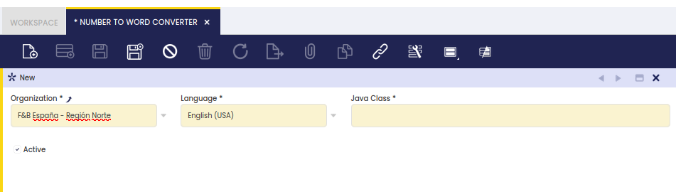

:material-menu: `Application` > `General Setup` > `Application` > `Number to Word Converter`

!!! info
    To be able to include this functionality, the Platform Extensions Bundle must be installed. To do that, follow the instructions from the marketplace: [Platform Extensions Bundle](https://marketplace.etendo.cloud/#/product-details?module=5AE4A287F2584210876230321FBEE614){target="_blank"}. For more information about the available versions, core compatibility and new features, visit [Platform Extensions - Release notes](../../../../../whats-new/release-notes/etendo-classic/bundles/platform-extensions/release-notes.md).

This module provides the infrastructure to convert a number into its equivalent in words. This functionality is especially useful while printing checks.

Once installed, this module creates a new window which can be found in the application path: **General Setup // Application**

Some fields to note are:

**Organization** that is the legal entity which requires printing checks in a given language.  
**Language** that is the language's words into which the amounts to pay needs to be converted.  
**Javaclass** that is the route where the Javaclass that converts amounts into a given language is located.

The "javaclass" field is required but empty by default unless another module such as the Number to Word (Spanish) or the Number to Word (English) is installed and properly applied to the legal entity for which it is required to print checks. Additionally, the Javaclass can be filled in manually.

---

This work is a derivative of [General Setup](https://wiki.openbravo.com/wiki/General_Setup){target="_blank"} by [Openbravo Wiki](http://wiki.openbravo.com/wiki/Welcome_to_Openbravo){target="_blank"}, used under [CC BY-SA 2.5 ES](https://creativecommons.org/licenses/by-sa/2.5/es/){target="_blank"}. This work is licensed under [CC BY-SA 2.5](https://creativecommons.org/licenses/by-sa/2.5/){target="_blank"} by [Etendo](https://etendo.software){target="_blank"}.