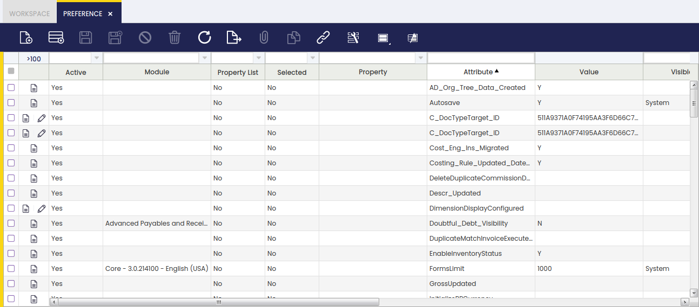

# Preference

:material-menu: `Application` > `General Setup` > `Application` > `Preference`

## Overview

A preference is a type of session value which can either be an attribute or a property.

!!! info
    Every time a user logs in Etendo, a new session is opened.

While logging in, the user enters several variables such as the **Role**, the **Client** and the **Organization** and, once in, the user navigates to a **Window**.

All those variables have a key influence on the session values the user will get.

In other words, **Preferences** allow the user to define session values, session values which can either be a property or an attribute defined for a single client or for all of them, or for a single organization or for all of them.

!!! info
    Preferences can be assigned to the system or to a specific module, therefore, while exporting that module, the preferences it has assigned will also be exported, so those general settings can be reused.

For instance, there is an existing **Property** named *Implements an alternative Invoice Process button*. That existing property is currently assigned to the Module "Advanced Payables and Receivables Management" with a value = "Y" for any client, organization, user, role and window:

- Above preference means that if the Advanced Payables and Receivables Management module is installed, it will use an alternative invoice process button, besides every user logging in Etendo will get that feature working regardless of its role, user and the client or the organization it is working on.

For instance, there is an **Attribute** named *Autosave* which is currently assigned to the system with a value "Y". This attribute is visible and therefore applicable to System client and to (\*) organization for any user, role and window.

- The preference above means that every user logging in Etendo will get that feature working regardless of its role and user and the client or the organization it is working on.

## Preference

Preference window allows the user to define and maintain session values which can be visible and therefore applied to different levels such as **Client**, **Organization**, **User**, **Role** and **Window**.

### Preference Definition

As shown in the image above there is one field named *Property List* which is key in defining a preference as a property or as an attribute:

- If the *Property List* checkbox is checked, the preference is configured as a **property** to be taken from an existing list of properties.  
  There are many types of properties already created, besides **modules can add new properties to that list** with the aim of getting those other modules or even the system can use them by setting the corresponding properties values.  
  Some of the available properties are listed and briefly explained below:

    

    - **Enable UOM Management**  
    If set to Value = "Y" at "System" level, it allows the user to define alternative UOM for a product, besides product's UOM.  
    Same way, a new field named "_Operative Quantity_" will then be shown in purchase, inventory and sales transaction documents, therefore "Ordered Quantity", "Movement Quantity" and "Invoiced Quantity" always shows "Operative Quantity" entered by the end-user, converted to the product's UOM.  
    - **Enable automatic Price Difference Corrections**  
    If set to Value = "Y", it allows the creation of Price Difference correction cost adjustments.
    - **Enable Negative Stock Corrections**  
    If set to Value = "Y", it allows the creation of Negative Stock correction cost adjustments.
    - **Enable Cancel and Replace**  
    If set to Value = "Y", it allows to Cancel and Replace booked sales orders.
    - **Cancel and Replace - Associate shipment lines to new order**  
    This preference requires "Enable Cancel and Replace" preference enabled, and it only works if "Create netting shipment on Cancel and Replace" preference is not enabled  
    If set to Value = "Y", it assigns the shipment(s) related to the cancelled sales order lines to the replaced sales order lines.
    - **Cancel and Replace - Create netting goods shipment**  
    This preference requires "Enable Cancel and Replace" preference enabled, and it only works if "Cancel and Replace - Associate shipment lines to new order" preference is not enabled  
    If set to Value = "Y", it automatically creates and completes a "netting" goods shipment related to the cancelled, voided and replaced sales orders.
    - **CSV Text Encoding**  
    If set to Value = "Y" allows to specify the encoding to be used in the Export to CSV process
    - **Grid configuration**  
    If set to Value = "Y" every time a user changes a grid view, those changes are saved in this window linked to this property.
    - **Implements customer Credit Used calculation**  
    This property is currently assigned to the Advanced Payables and Receivables management module with a property value ="Y". This property avoids the C_BP_SOCREDITUSED_REFRESH function calculation.
    - **Implements an alternative Invoice Process button**  
    This property is also assigned to the Advanced Payables and Receivables management module with a property value ="Y". This property avoids the usage of core invoice process button.
    - **Implements an alternative Financial Management**  
    Same applies to this which allows an alternative financial management for that module.
    - **Implements Payment Monitor management**  
    Same applies to this, which disables core's background process and button on the invoice header that manage the payment monitor.
    - **Recent views shown in the workspace** property set to "Y"  
    This allows that the recent views are shown in the user workspace
    - **Show MRP and Production fields** property set to "Y"  
    This allows that the MRP and production fields are shown
    - **Not allow changing exchange rate and amount**  
    If you set this property with value = "Y", exchange rate and amount are read-only in Add Payment from Sales Invoice, Purchase Invoice, Payment In, Payment Out, Financial Account, in Select Expected Payments from Payment Proposal and in Funds Transfer from Financial Account.
    - **Write-off limit**  
    This property with a property value ="Y" allows configuring write-off limit in Add Payment from Sales Invoice, Purchase Invoice, Payment In, Payment Out, Financial Account and in Select Expected Payments from Payment Proposal. The write-off limit is set for each Financial Account in Financial Account window.
    - **Show Product Characteristics Parents**  
    Values can be 1,2,3,4, etc. The number means how many levels in the hierarchy tree the user wants to show in form view in the Product window. For example, if the tree is: Colour->Green->Green light->0034
    - **Allow Multiple Tabs of Window**  
    If set to Value = _'Y'_ allows opening more than one tab of a single window.
    - **Attach By Default**
    - If set to Value = 'Y' the "Print Document" popup will not be shown, this popup is the one which asks if the user want to attach the document or instead of it just print it without attaching. When the value of the preference is set to 'Y' the document will be automatically attached.
    - If set to Value = 'N' the "Print Document" popup will not be shown, this popup is the one which asks if the user wants to attach the document or instead of it just print it without attaching. When the value of the preference is set to 'N' the document won't be attached.
    - If Value is Undefined the "Print Document" popup will be shown with two options: "Yes" and "No, just print it". If "Yes" is selected, the document will be attached. If "No, just print it" is selected, the document won't be attached.
    - **Direct Print**
    If set to Value = 'Y' the Direct Print mode is enabled.
    If set to Value = 'N' or Undefined, the standard print mode is used.
    - **Allow Where Parameter**
    If set to Value = 'Y', it allows getting the "\_where" parameter from manual datasources. A warning will be shown if the "\_where" parameter is sent.
    If set to Value = 'N' or Undefined, it will not allow getting the "\_where" parameter from manual datasources. An exception will be thrown if the "\_where" parameter is sent.
    - **Allow Unsecured Datasource Request**
    If set to Value = 'Y', it allows doing unsecured datasource request. A warning will be shown if the current role does not have access.
    If set to Value = 'N' or Undefined, it will not allow doing unsecured datasource request. It is required to have a role with enough access permissions. An OBSecurityException is thrown if current role does not have access.
    - **External Rebuild**, when this preference is defined as system level with its value set to _Y_, it will not be possible to rebuild the system from Module Manager Console after installing/updating modules. It forces rebuilding the system from command line.
    - **Bypass Access Level Entity Check**, when this preference is defined with its value set to _Y_, it will allow bypassing the check that compares role's user level with entity's access level to completely prevent accessing latter one.
    - **Translate Yes/No Reference in Export To CSV**, when this preference is defined with its value set to _Y_, the value of the columns whose reference is _Yes/No_ will be translated to the current context language when exporting the grid of a standard window into CSV.
    - **Disable Linked Items Section**, when this preference is defined for a window with its value set to _Y_, the Linked Items section will be disabled for that window. If there is not any window defined in the visibility settings, this section will be disabled for every window in the application.
    - **Enable Screen Reader**, If this preference is set to _Y_ the full screen reader will be enabled. This will improve the accessibility to visual impaired people.
    - **Excel Export Format**, this preference allows setting the export format to be used when generating Excel reports. Two values are supported: _XLS_ or _XLSX_. When this preference is not defined, _XLSX_ is the default Excel export format.
    - **Filter by documents processed since N days ago** is related to Create Lines From in Sales/Purchase Invoice. It limits transactions starting from the current date to the defined days ago. If the preference is not defined then queries retrieve all records created since one year ago (365 days), else it will be filtered by the count of days defined as the preference value.
    
- If the *Property List* checkbox is not checked, the preference is configured as an **attribute**. An attribute is a free text attribute which can get whatever value.

    

    - **"ShowAuditDefault"** attribute allows enabling the Audit Trail feature. Audit Trail feature allows tracking every change done to any Etendo table or entity.
    - **"ShowAcct"** attribute allows showing Post buttons and Accounting tab whenever its value is set to "Y".
    - **"ForcedLinkWindowDBTableName"** where "DBTableName" is the name of the table in database.  
    This attribute allows a direct navigation to the window which UUID is set as attribute value, instead of using the standard navigation logic.
    - **"ModalModuleModuleJavaPackage"** where "ModuleJavaPackage" is the name of the module's Java Package name or _"ModalModuleModuleUUID"_ where Module UUID is the unique identifier of the module in the data base.  
    This attribute defines whether the processes within a module invoked from a menu or a button or a tab are opened in browser popups (attribute value = "N") or in modal popups (attribute value ="Y").
    - _Browser popups_ implies the deployment of the process in a new window in the browser
    - _Modal popups_ implies the deployment of the process in another layer inside the application window.
    - **"ModalProcessProcessUUID"** where Process UUID is the UUID of the process.  
    This attribute defines whether a given process is opened in modal popup (attribute value ="Y") or in browser popup (attribute value ="N").
    - This attribute has a higher preference than ModalModule, therefore it is possible to define all processes in a module to open in modal popups but some of them.
    - **"SaveAttachmentsOldWay"**  
    This attribute defines whether attachments should be saved using the old attachment model.

### Preferences Visibility

Preference visibility section defines the *levels* where a preference is going to be used and therefore applied.

Preference levels can be set to a given value or left empty. If a level is left empty, the preference will be valid for any value of that level.

For instance, if user level is empty, any user will be able to see that preference. In case the same preference has values at different levels, the most specific one will then be used.

Available levels are:

- **Client**: If this level is set to empty or to System, the preference will be visible from any client used to log in.
- **Organization**: If this level is set to empty or to (\*), the preference will be visible from any organization used to log in.
- **User**: If this level is set to a given user, only that user will be able to see that preference once logged in.
- **Role**: If this level is set to a given role, only that role will be able to see that preference.
- **Window**: If this level is set to a given window, only that window will be able to see that preference.

#### Preference Priority

Preference Priority section defines **priority** of multiple preferences defined for same Property

Preference Priority will be applied while loading the default Preferences of the Logged in Role.

- Check Priority by Client **(Visible at client)**:

    - Undefined client visibility is handled as SYSTEM.
    - If pref1 or pref2 either of them which does not set to SYSTEM CLIENT will be considered.
    - If pref1 or pref2 both have value set and both not set to SYSTEM CLIENT, then it will check Next Priority Level.

- Check Priority by Organization **(Visible at Organization)**:

    - If pref1 or pref2 either of them which has value set will be considered.
    - If pref1 or pref2 both have values set then, It will check the depth of the value in Organization Tree and Highest Organization's Preferences will be Considered.
    - If pref1 or pref2 both have the same value set then it will check Next Priority Level.

- Check Priority by user **(Visible at User)**:

    - If pref1 or pref2 either of them which has value set will be considered.
    - If pref1 or pref2 both have value set then it will check Next Priority Level.

- Check Priority by Role **(Visible at Role)**:

    - If pref1 or pref2 either of them which has value set will be considered.
    - If pref1 or pref2 both have a value set then it will check Next Priority Level.

- Check Priority by Window **(Visible at Window)**:

    - If pref1 or pref2 either of them which has value set will be considered.
    - If pref1 or pref2 both have a value set then it will check Next Priority Level.

- **SAME PRIORITY**:

  - If all the above levels are the same then it will and will consider preference with column **selected** checked.

#### Preferences Values

When logging in Etendo or entering the role or the organization, the preferences visible for that user, role, client, organization or window are stored in the Etendo session. Those session values can be obtained by using the method: `org.openbravo.erpCommon.utility.Utility.getContext` method.

Additionally:

- It is possible to look for the value of a given preference by using the method: `org.openbravo.erpCommon.businessUtility.Preferences.getPreferenceValue`. This method shows an exception in case:

    - A preference property does not have a value defined for the required visibility level.
    - or there is a conflict caused by the definition of more than one property values for the same preference property for a given visibility level. Conflicts can be manually resolved by checking and modifying the preference.

---

This work is a derivative of [General Setup](https://wiki.openbravo.com/wiki/General_Setup){target="_blank"} by [Openbravo Wiki](http://wiki.openbravo.com/wiki/Welcome_to_Openbravo){target="_blank"}, used under [CC BY-SA 2.5 ES](https://creativecommons.org/licenses/by-sa/2.5/es/){target="_blank"}. This work is licensed under [CC BY-SA 2.5](https://creativecommons.org/licenses/by-sa/2.5/){target="_blank"} by [Etendo](https://etendo.software){target="_blank"}.