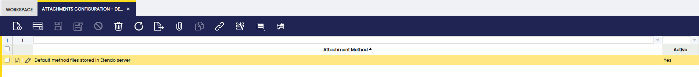

# Attachments Configuration

:material-menu: `Application` > `General Setup` > `Attachments Configuration`

## Overview

Client configuration of the Attachment Method to be used. Each attachment method can include its own extra fields to complete the configuration of the attachment method. It is only possible to have one active configuration on each client.

### Header

It shows all configuration related to the attachment method used to save attachments. Each Attachment Method can include its own specific configuration fields like: server URL, user, password, language, etc.

---

This work is a derivative of [General Setup](https://wiki.openbravo.com/wiki/General_Setup){target="_blank"} by [Openbravo Wiki](http://wiki.openbravo.com/wiki/Welcome_to_Openbravo){target="_blank"}, used under [CC BY-SA 2.5 ES](https://creativecommons.org/licenses/by-sa/2.5/es/){target="_blank"}. This work is licensed under [CC BY-SA 2.5](https://creativecommons.org/licenses/by-sa/2.5/){target="_blank"} by [Etendo](https://etendo.software){target="_blank"}.