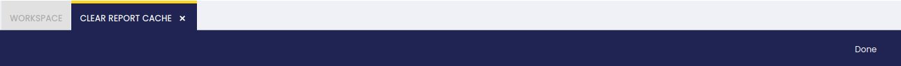

#
!!! info
    To be able to include this functionality, the Platform Extensions Bundle must be installed. To do that, follow the instructions from the marketplace: [Platform Extensions Bundle](https://marketplace.etendo.cloud/#/product-details?module=5AE4A287F2584210876230321FBEE614){target="_blank"}. For more information about the available versions, core compatibility and new features, visit [Platform Extensions - Release notes](../../../../whats-new/release-notes/etendo-classic/bundles/platform-extensions/release-notes.md).

In this window, the user, in general a developer, can delete the report cache data by clicking the “Done” button. This has technical purposes.  
After clicking it, a success message will be shown indicating the completion of the process.

!!! info
    For more information, visit [Platform Extensions Bundle developer guide](../../../../developer-guide/etendo-classic/bundles/platform/overview.md#report-cache-management)